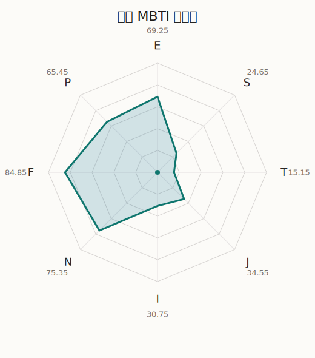

# 亚子 MBTI 类型解释

- 角色名：宇田川亚子
- 最终类型：ENFP
- 备选类型：ENFJ
- 原始聚合类型：ENFJ
- 采样轮次：10
- 主类型稳定度：2/10（20.0%）
- 原始聚合稳定度：8/10（80.0%）
- 置信度：高（47.45）
- 置信度方差：46.0411
- 题库：Open Jungian Type Scales (OJTS v2.1)（48 题）

## 类型概述

ENFP 的整体倾向是：更偏外向连接、抽象探索、价值驱动和开放弹性。

## 人物核心

从外部设定与已整理剧情综合来看，亚子的角色框架可以先理解为：外部资料里的亚子通常带着中二感、憧憬帅气、热衷游戏与“黑暗系”审美，是 Roselia 中最外放、也最有青春躁动感的成员。她不是单纯负责活泼气氛，而是把“我想成为更酷的人”这份愿望直接摆在台面上。

## PDB 校核

- 已应用 PDB 主参考：来源 `personality-database.com`。
- 权重分配：PDB 50% / 人设概要 25% / 卡牌剧情 15% / 剧情切片 10%。
- PDB 类型排序：`ENFP`
- 最终类型先按 PDB 最高票定锚：`ENFP`
- 指定锁定类型：`ENFP`
- 原始问卷聚合结果为 `ENFJ`，按主参考回写后最终结果为 `ENFP`。
## 为什么是这个类型

- `E > I`（69.25 : 30.75，平均轴差 45.17，方差 549.1394）：更常通过主动互动、公开表达或带动现场来处理问题。
- `N > S`（75.35 : 24.65，平均轴差 54.44，方差 195.6341）：更常从意义、可能性、方向感和隐含主题去理解问题。
- `F > T`（84.85 : 15.15，平均轴差 67.07，方差 59.1431）：更常把感受、关系、价值和对人的回应放在判断前列。
- `P > J`（65.45 : 34.55，平均轴差 12.42，方差 135.6136）：更常保留空间，依靠灵活调整和临场变化推进事情。

## 为什么不是备选类型

最接近的备选类型是 `ENFJ`。它与主类型 `ENFP` 的差别主要落在 `JP` 这一轴上。
最终仍保留 `P`，因为该轴平均优势还有 `30.90`，虽然会波动，但整体没有被 `J` 反超。虽然并非完全无计划，但整体仍更偏向保留余地、即兴调整和开放推进。

## 四维结果

- `EI`：E 69.25 / I 30.75，轴差方差 549.1394
- `SN`：S 24.65 / N 75.35，轴差方差 195.6341
- `FT`：F 84.85 / T 15.15，轴差方差 59.1431
- `JP`：J 34.55 / P 65.45，轴差方差 135.6136

## 八维数据

- `E`：均值 69.25，方差 137.2848
- `S`：均值 24.65，方差 48.9085
- `T`：均值 15.15，方差 14.7858
- `J`：均值 34.55，方差 72.4795
- `I`：均值 30.75，方差 137.2848
- `N`：均值 75.35，方差 48.9085
- `F`：均值 84.85，方差 14.7858
- `P`：均值 65.45，方差 72.4795

## 类型稳定性

- `ENFJ`：8 次（80.0%）
- `ENFP`：2 次（20.0%）

## 图表

## 证据依据

- 人物概述：从外部设定与已整理剧情综合来看，亚子的角色框架可以先理解为：外部资料里的亚子通常带着中二感、憧憬帅气、热衷游戏与“黑暗系”审美，是 Roselia 中最外放、也最有青春躁动感的成员。她不是单纯负责活泼气氛，而是把“我想成为更酷的人”这份愿望直接摆在台面上。
- 卡牌剧情：在 109 条卡牌剧情里，亚子 的个人篇章补完相对丰富；这部分更适合用来观察角色的私下状态、非主线场合下的关系重心，以及主线之外的稳定人格表现。
- 剧情切片：在已整理的 406 条主线/乐团剧情切片里，亚子同时覆盖主线推进（42）和乐队内部关系（364）两条线。这说明这个角色在本地语料中的位置，不应该只从单句台词去读，而要放回到持续出现的关系链和章节位置里看。

## 模拟作答概览

| 题号 | 题目/两端描述 | 平均作答 | 作答方差 | 平均倾向值 | 倾向方差 |
| --- | --- | --- | --- | --- | --- |
| 1 | I don&lsquo;t like to draw attention to myself. | 1.80 | 0.3600 | -54.50 | 328.4945 |
| 2 | I hate situations where people expect me to be funny. | 1.50 | 0.2500 | -58.68 | 224.4749 |
| 3 | I hold back my opinions. | 1.30 | 0.2100 | -60.40 | 167.5085 |
| 4 | I want a huge social circle. | 2.80 | 0.1600 | -8.12 | 308.0122 |
| 5 | I am the life of the party. | 3.10 | 0.0900 | 2.24 | 160.5228 |
| 6 | I make lots of noise. | 3.20 | 0.3600 | 9.44 | 308.1919 |
| 7 | I avoid philosophical discussions. | 1.10 | 0.0900 | -74.89 | 75.8516 |
| 8 | I don&apos;t like to analyze literature. | 1.10 | 0.0900 | -71.44 | 114.7238 |
| 9 | I am attached to conventional ways. | 1.10 | 0.0900 | -71.81 | 48.6725 |
| 10 | I love to read challenging material. | 3.10 | 0.0900 | 10.86 | 112.4407 |
| 11 | I look for hidden meanings in things. | 3.30 | 0.2100 | 13.84 | 288.4303 |
| 12 | I am curious about everything. | 3.30 | 0.2100 | 12.38 | 229.2474 |
| 13 | I want to experience passion and romance. | 4.30 | 0.2100 | 51.32 | 114.1980 |
| 14 | I am deeply moved by others&lsquo; misfortunes. | 4.00 | 0.2000 | 43.25 | 188.7576 |
| 15 | I listen to my feelings when making important decisions. | 4.20 | 0.1600 | 51.98 | 149.1090 |
| 16 | I prize logic above all else. | 1.10 | 0.0900 | -74.88 | 162.2942 |
| 17 | I don&lsquo;t understand people who get emotional. | 1.00 | 0.0000 | -80.79 | 44.5828 |
| 18 | I&apos;d rather be feared than loved. | 1.00 | 0.0000 | -79.85 | 45.8642 |
| 19 | I like order. | 2.70 | 0.2100 | -15.34 | 423.0607 |
| 20 | I do things according to a plan. | 2.80 | 0.1600 | -10.38 | 187.8595 |
| 21 | I am always prepared. | 3.00 | 0.2000 | -4.42 | 430.3143 |
| 22 | I often make last-minute plans. | 2.70 | 0.2100 | -16.87 | 364.8839 |
| 23 | I do things for no apparent reason. | 2.70 | 0.2100 | -18.05 | 59.7854 |
| 24 | It takes me days to do things that should take hours because I keep getting distracted. | 2.60 | 0.2400 | -18.12 | 290.1621 |
| 25 | I work on improving myself. | 2.50 | 0.2500 | -21.06 | 179.7666 |
| 26 | I always feel like I need to be doing something important. | 2.70 | 0.2100 | -17.98 | 123.5687 |
| 27 | I have unusual beliefs about the world. | 3.10 | 0.2900 | 2.78 | 291.5951 |
| 28 | I dislike routine. | 2.90 | 0.0900 | -10.96 | 71.8063 |
| 29 | I try my best to follow the rules. | 1.80 | 0.1600 | -53.79 | 94.7986 |
| 30 | I respect authority. | 1.50 | 0.2500 | -54.46 | 224.9862 |
| 31 | I like to take it easy. | 2.40 | 0.2400 | -28.04 | 160.1151 |
| 32 | I choose the easy way. | 1.80 | 0.3600 | -46.94 | 241.1665 |
| 33 | I tell other people my secrets. | 3.20 | 0.1600 | 8.27 | 284.3078 |
| 34 | I make big gestures of friendship to people. | 2.90 | 0.0900 | -0.13 | 228.8395 |
| 35 | I enjoy challenges and competition. | 1.90 | 0.0900 | -41.71 | 81.4367 |
| 36 | I have very high self-esteem. | 1.80 | 0.1600 | -43.57 | 178.4551 |
| 37 | I get embarrassed easily. | 2.30 | 0.2100 | -25.04 | 267.8032 |
| 38 | I become overwhelmed by events. | 2.70 | 0.2100 | -15.77 | 99.3604 |
| 39 | I have difficulty expressing my feelings. | 1.40 | 0.2400 | -65.75 | 98.5227 |
| 40 | I don&apos;t trust others easily. | 1.50 | 0.2500 | -61.80 | 60.5494 |
| 41 | skeptical <-> wants to believe | 4.00 | 0.0000 | 46.79 | 40.3067 |
| 42 | chaotic <-> organized | 3.80 | 0.1600 | 30.12 | 240.7980 |
| 43 | wants the big picture <-> wants the details | 1.20 | 0.1600 | -72.81 | 178.5951 |
| 44 | energetic <-> mellow | 1.40 | 0.2400 | -59.27 | 412.2846 |
| 45 | follows the heart <-> follows the head | 1.80 | 0.1600 | -48.95 | 143.6444 |
| 46 | prepares <-> improvises | 3.10 | 0.2900 | 5.53 | 227.7411 |
| 47 | focused on the present <-> focused on the future | 3.10 | 0.0900 | 4.59 | 175.4999 |
| 48 | works best alone <-> works best in groups | 3.80 | 0.1600 | 26.80 | 253.8648 |

## 题库来源

- [OJTS 官方题目页](https://openpsychometrics.org/tests/OJTS/)
- 许可证：CC BY-NC-SA 4.0
- [本地题库文件](../ojts_question_bank_v2_1.json)
