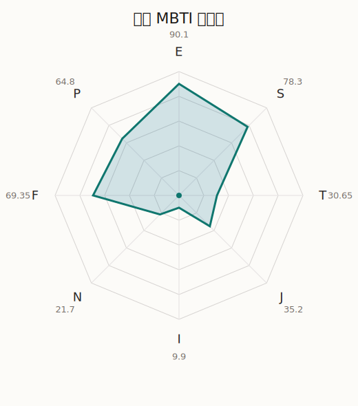

# 爱音 MBTI 类型解释

- 角色名：千早爱音
- 最终类型：ESFP
- 备选类型：ESFJ
- 原始聚合类型：ESFP
- 采样轮次：10
- 主类型稳定度：9/10（90.0%）
- 原始聚合稳定度：9/10（90.0%）
- 置信度：高（51.27）
- 置信度方差：23.7586
- 题库：Open Jungian Type Scales (OJTS v2.1)（48 题）

## 类型概述

ESFP 的整体倾向是：更偏外向体验、现实感受、情感表达和即兴行动。

## 人物核心

从外部设定与已整理剧情综合来看，爱音的角色框架可以先理解为：外部资料里的爱音通常被写成社交力强、行动快、爱时髦、很会包装自己的人。她一开始常让人觉得有点虚荣或轻浮，但真正重要的是，她其实比任何人都更在意自己有没有被接纳、有没有被看见。

## PDB 校核

- 已应用 PDB 主参考：来源 `personality-database.com`。
- 权重分配：PDB 50% / 人设概要 25% / 卡牌剧情 15% / 剧情切片 10%。
- PDB 类型排序：`ESFP`
- 最终类型先按 PDB 最高票定锚：`ESFP`
- 指定锁定类型：`ESFP`
## 为什么是这个类型

- `E > I`（90.10 : 9.90，平均轴差 72.08，方差 37.9232）：更常通过主动互动、公开表达或带动现场来处理问题。
- `S > N`（78.30 : 21.70，平均轴差 49.66，方差 127.9363）：更常依赖现实条件、具体细节和当下经验来判断局面。
- `F > T`（69.35 : 30.65，平均轴差 27.25，方差 170.5486）：更常把感受、关系、价值和对人的回应放在判断前列。
- `P > J`（64.80 : 35.20，平均轴差 16.44，方差 97.1570）：更常保留空间，依靠灵活调整和临场变化推进事情。

## 为什么不是备选类型

最接近的备选类型是 `ESFJ`。它与主类型 `ESFP` 的差别主要落在 `JP` 这一轴上。
最终仍保留 `P`，因为该轴平均优势还有 `29.60`，虽然会波动，但整体没有被 `J` 反超。虽然并非完全无计划，但整体仍更偏向保留余地、即兴调整和开放推进。

## 四维结果

- `EI`：E 90.10 / I 9.90，轴差方差 37.9232
- `SN`：S 78.30 / N 21.70，轴差方差 127.9363
- `FT`：F 69.35 / T 30.65，轴差方差 170.5486
- `JP`：J 35.20 / P 64.80，轴差方差 97.1570

## 八维数据

- `E`：均值 90.10，方差 9.4808
- `S`：均值 78.30，方差 31.9841
- `T`：均值 30.65，方差 42.6371
- `J`：均值 35.20，方差 34.7974
- `I`：均值 9.90，方差 9.4808
- `N`：均值 21.70，方差 31.9841
- `F`：均值 69.35，方差 42.6371
- `P`：均值 64.80，方差 34.7974

## 类型稳定性

- `ESFP`：9 次（90.0%）
- `ESFJ`：1 次（10.0%）

## 图表

## 证据依据

- 人物概述：从外部设定与已整理剧情综合来看，爱音的角色框架可以先理解为：外部资料里的爱音通常被写成社交力强、行动快、爱时髦、很会包装自己的人。她一开始常让人觉得有点虚荣或轻浮，但真正重要的是，她其实比任何人都更在意自己有没有被接纳、有没有被看见。
- 卡牌剧情：在 18 条卡牌剧情里，爱音 的个人篇章补完已经有一定覆盖；这部分更适合用来观察角色的私下状态、非主线场合下的关系重心，以及主线之外的稳定人格表现。
- 剧情切片：在已整理的 179 条主线/乐团剧情切片里，爱音目前更集中在乐队内部与团内关系剧情（179）。这说明这个角色在本地语料中的位置，不应该只从单句台词去读，而要放回到持续出现的关系链和章节位置里看。

## 模拟作答概览

| 题号 | 题目/两端描述 | 平均作答 | 作答方差 | 平均倾向值 | 倾向方差 |
| --- | --- | --- | --- | --- | --- |
| 1 | I don&lsquo;t like to draw attention to myself. | 1.00 | 0.0000 | -82.21 | 59.0691 |
| 2 | I hate situations where people expect me to be funny. | 1.00 | 0.0000 | -87.80 | 40.3883 |
| 3 | I hold back my opinions. | 1.00 | 0.0000 | -85.00 | 63.2124 |
| 4 | I want a huge social circle. | 3.50 | 0.2500 | 24.96 | 174.3337 |
| 5 | I am the life of the party. | 3.70 | 0.2100 | 28.62 | 131.5938 |
| 6 | I make lots of noise. | 3.70 | 0.2100 | 30.15 | 137.8805 |
| 7 | I avoid philosophical discussions. | 3.00 | 0.2000 | -0.63 | 237.7605 |
| 8 | I don&apos;t like to analyze literature. | 3.10 | 0.2900 | 9.71 | 496.1387 |
| 9 | I am attached to conventional ways. | 3.20 | 0.1600 | 3.64 | 297.9537 |
| 10 | I love to read challenging material. | 1.10 | 0.0900 | -68.03 | 130.5844 |
| 11 | I look for hidden meanings in things. | 1.20 | 0.1600 | -70.17 | 88.4765 |
| 12 | I am curious about everything. | 1.10 | 0.0900 | -72.55 | 102.0917 |
| 13 | I want to experience passion and romance. | 2.70 | 0.2100 | -15.11 | 89.2702 |
| 14 | I am deeply moved by others&lsquo; misfortunes. | 2.70 | 0.2100 | -10.86 | 291.0826 |
| 15 | I listen to my feelings when making important decisions. | 2.80 | 0.3600 | -9.09 | 320.1484 |
| 16 | I prize logic above all else. | 1.60 | 0.2400 | -51.53 | 224.2110 |
| 17 | I don&lsquo;t understand people who get emotional. | 1.50 | 0.2500 | -50.14 | 234.3666 |
| 18 | I&apos;d rather be feared than loved. | 1.80 | 0.1600 | -52.06 | 146.1269 |
| 19 | I like order. | 2.40 | 0.2400 | -21.58 | 208.8504 |
| 20 | I do things according to a plan. | 2.50 | 0.2500 | -22.99 | 220.7030 |
| 21 | I am always prepared. | 2.50 | 0.4500 | -20.27 | 537.3047 |
| 22 | I often make last-minute plans. | 3.00 | 0.2000 | -1.07 | 217.8622 |
| 23 | I do things for no apparent reason. | 2.90 | 0.0900 | -2.09 | 158.9662 |
| 24 | It takes me days to do things that should take hours because I keep getting distracted. | 3.10 | 0.0900 | -1.12 | 171.2291 |
| 25 | I work on improving myself. | 1.50 | 0.2500 | -60.00 | 102.5498 |
| 26 | I always feel like I need to be doing something important. | 1.30 | 0.2100 | -64.00 | 96.0862 |
| 27 | I have unusual beliefs about the world. | 2.20 | 0.1600 | -35.15 | 137.9802 |
| 28 | I dislike routine. | 2.10 | 0.0900 | -35.01 | 139.7525 |
| 29 | I try my best to follow the rules. | 2.70 | 0.2100 | -19.54 | 133.1538 |
| 30 | I respect authority. | 2.60 | 0.2400 | -16.73 | 102.8002 |
| 31 | I like to take it easy. | 2.90 | 0.0900 | 0.93 | 152.2915 |
| 32 | I choose the easy way. | 3.00 | 0.2000 | 4.18 | 244.7168 |
| 33 | I tell other people my secrets. | 3.10 | 0.0900 | 5.38 | 194.9730 |
| 34 | I make big gestures of friendship to people. | 3.10 | 0.0900 | 13.38 | 160.4355 |
| 35 | I enjoy challenges and competition. | 3.00 | 0.0000 | -5.08 | 65.9415 |
| 36 | I have very high self-esteem. | 2.80 | 0.1600 | -10.78 | 140.5321 |
| 37 | I get embarrassed easily. | 2.00 | 0.0000 | -42.74 | 97.9649 |
| 38 | I become overwhelmed by events. | 1.80 | 0.1600 | -46.39 | 156.2956 |
| 39 | I have difficulty expressing my feelings. | 1.10 | 0.0900 | -68.41 | 41.0021 |
| 40 | I don&apos;t trust others easily. | 1.00 | 0.0000 | -70.24 | 50.5799 |
| 41 | skeptical <-> wants to believe | 3.20 | 0.1600 | 14.91 | 149.5859 |
| 42 | chaotic <-> organized | 3.40 | 0.2400 | 9.89 | 193.2545 |
| 43 | wants the big picture <-> wants the details | 3.10 | 0.0900 | 10.01 | 110.7017 |
| 44 | energetic <-> mellow | 1.80 | 0.1600 | -49.74 | 99.0227 |
| 45 | follows the heart <-> follows the head | 2.50 | 0.2500 | -18.73 | 254.5879 |
| 46 | prepares <-> improvises | 3.70 | 0.2100 | 23.10 | 137.4782 |
| 47 | focused on the present <-> focused on the future | 1.90 | 0.0900 | -42.88 | 116.8144 |
| 48 | works best alone <-> works best in groups | 4.10 | 0.0900 | 50.24 | 91.4715 |

## 题库来源

- [OJTS 官方题目页](https://openpsychometrics.org/tests/OJTS/)
- 许可证：CC BY-NC-SA 4.0
- [本地题库文件](../ojts_question_bank_v2_1.json)
