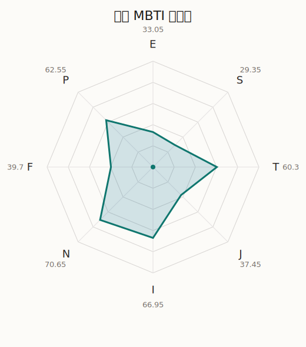

# 有咲 MBTI 类型解释

- 角色名：市谷有咲
- 最终类型：INTP
- 备选类型：INFP
- 原始聚合类型：INTP
- 采样轮次：10
- 主类型稳定度：3/10（30.0%）
- 原始聚合稳定度：3/10（30.0%）
- 置信度：高（30.22）
- 置信度方差：41.2952
- 题库：Open Jungian Type Scales (OJTS v2.1)（48 题）

## 类型概述

INTP 的整体倾向是：更偏内在分析、抽象模型、逻辑拆解和开放推演。

## 人物核心

从外部设定与已整理剧情综合来看，有咲的角色框架可以先理解为：外部角色页里的有咲通常被定义成成绩优秀、嘴硬、认真、带一点别扭感的典型“吐槽役”。但她真正的人设亮点并不只是傲娇，而是明明很在意别人，却常常用反驳和嫌麻烦的口气来保护自己。

## PDB 校核

- 已应用 PDB 主参考：来源 `personality-database.com`。
- 权重分配：PDB 50% / 人设概要 25% / 卡牌剧情 15% / 剧情切片 10%。
- PDB 类型排序：`INTP`
- 最终类型先按 PDB 最高票定锚：`INTP`
- 指定锁定类型：`INTP`
## 为什么是这个类型

- `I > E`（66.95 : 33.05，平均轴差 32.54，方差 242.4681）：更常先在内部消化，再选择性地向外表达立场。
- `N > S`（70.65 : 29.35，平均轴差 31.41，方差 426.5298）：更常从意义、可能性、方向感和隐含主题去理解问题。
- `T > F`（60.30 : 39.70，平均轴差 11.22，方差 63.2672）：更常把逻辑、结构、效率和标准一致性放在判断前列。
- `P > J`（62.55 : 37.45，平均轴差 13.18，方差 99.1627）：更常保留空间，依靠灵活调整和临场变化推进事情。

## 为什么不是备选类型

最接近的备选类型是 `INFP`。它与主类型 `INTP` 的差别主要落在 `FT` 这一轴上。
最终仍保留 `T`，因为该轴平均优势还有 `20.60`，虽然会波动，但整体没有被 `F` 反超。虽然也在意关系影响，但最终更常回到逻辑、标准和方法正确性来判断。

## 四维结果

- `EI`：E 33.05 / I 66.95，轴差方差 242.4681
- `SN`：S 29.35 / N 70.65，轴差方差 426.5298
- `FT`：F 39.70 / T 60.30，轴差方差 63.2672
- `JP`：J 37.45 / P 62.55，轴差方差 99.1627

## 八维数据

- `E`：均值 33.05，方差 60.6170
- `S`：均值 29.35，方差 106.6324
- `T`：均值 60.30，方差 37.6963
- `J`：均值 37.45，方差 41.5697
- `I`：均值 66.95，方差 60.6170
- `N`：均值 70.65，方差 106.6324
- `F`：均值 39.70，方差 37.6963
- `P`：均值 62.55，方差 41.5697

## 类型稳定性

- `INFP`：3 次（30.0%）
- `INTP`：3 次（30.0%）
- `INFJ`：2 次（20.0%）
- `ENTJ`：1 次（10.0%）
- `ISTP`：1 次（10.0%）

## 图表

## 证据依据

- 人物概述：从外部设定与已整理剧情综合来看，有咲的角色框架可以先理解为：外部角色页里的有咲通常被定义成成绩优秀、嘴硬、认真、带一点别扭感的典型“吐槽役”。但她真正的人设亮点并不只是傲娇，而是明明很在意别人，却常常用反驳和嫌麻烦的口气来保护自己。
- 卡牌剧情：在 119 条卡牌剧情里，有咲 的个人篇章补完相对丰富；这部分更适合用来观察角色的私下状态、非主线场合下的关系重心，以及主线之外的稳定人格表现。
- 剧情切片：在已整理的 727 条主线/乐团剧情切片里，有咲同时覆盖主线推进（135）和乐队内部关系（592）两条线。这说明这个角色在本地语料中的位置，不应该只从单句台词去读，而要放回到持续出现的关系链和章节位置里看。

## 模拟作答概览

| 题号 | 题目/两端描述 | 平均作答 | 作答方差 | 平均倾向值 | 倾向方差 |
| --- | --- | --- | --- | --- | --- |
| 1 | I don&lsquo;t like to draw attention to myself. | 2.90 | 0.0900 | -4.21 | 330.0627 |
| 2 | I hate situations where people expect me to be funny. | 2.80 | 0.1600 | -3.68 | 204.9194 |
| 3 | I hold back my opinions. | 2.80 | 0.1600 | -10.67 | 298.7110 |
| 4 | I want a huge social circle. | 1.40 | 0.2400 | -58.81 | 204.9672 |
| 5 | I am the life of the party. | 1.60 | 0.2400 | -56.74 | 224.1412 |
| 6 | I make lots of noise. | 2.50 | 0.4500 | -19.82 | 732.5334 |
| 7 | I avoid philosophical discussions. | 1.50 | 0.2500 | -60.53 | 307.4943 |
| 8 | I don&apos;t like to analyze literature. | 1.50 | 0.2500 | -56.91 | 132.6857 |
| 9 | I am attached to conventional ways. | 1.50 | 0.2500 | -60.60 | 86.3883 |
| 10 | I love to read challenging material. | 3.10 | 0.0900 | -0.89 | 171.1301 |
| 11 | I look for hidden meanings in things. | 3.00 | 0.6000 | -5.53 | 492.1817 |
| 12 | I am curious about everything. | 2.90 | 0.0900 | 1.43 | 190.8429 |
| 13 | I want to experience passion and romance. | 2.70 | 0.2100 | -11.14 | 400.1183 |
| 14 | I am deeply moved by others&lsquo; misfortunes. | 2.70 | 0.2100 | -11.90 | 390.8574 |
| 15 | I listen to my feelings when making important decisions. | 2.70 | 0.2100 | -13.38 | 147.7727 |
| 16 | I prize logic above all else. | 2.40 | 0.2400 | -26.21 | 292.8189 |
| 17 | I don&lsquo;t understand people who get emotional. | 2.50 | 0.4500 | -17.53 | 459.9340 |
| 18 | I&apos;d rather be feared than loved. | 2.50 | 0.2500 | -15.78 | 258.0273 |
| 19 | I like order. | 1.90 | 0.0900 | -42.19 | 153.4216 |
| 20 | I do things according to a plan. | 1.90 | 0.2900 | -40.71 | 314.3492 |
| 21 | I am always prepared. | 1.90 | 0.2900 | -43.66 | 347.3153 |
| 22 | I often make last-minute plans. | 2.70 | 0.4100 | -15.11 | 359.7537 |
| 23 | I do things for no apparent reason. | 2.60 | 0.2400 | -21.45 | 240.7145 |
| 24 | It takes me days to do things that should take hours because I keep getting distracted. | 2.60 | 0.2400 | -16.88 | 250.2968 |
| 25 | I work on improving myself. | 2.50 | 0.2500 | -20.05 | 416.3249 |
| 26 | I always feel like I need to be doing something important. | 2.50 | 0.2500 | -19.63 | 56.6147 |
| 27 | I have unusual beliefs about the world. | 3.10 | 0.0900 | 3.39 | 156.6760 |
| 28 | I dislike routine. | 2.70 | 0.2100 | -10.80 | 387.3232 |
| 29 | I try my best to follow the rules. | 1.90 | 0.0900 | -49.84 | 64.5899 |
| 30 | I respect authority. | 1.70 | 0.2100 | -50.23 | 235.1070 |
| 31 | I like to take it easy. | 2.20 | 0.1600 | -33.29 | 164.7646 |
| 32 | I choose the easy way. | 2.10 | 0.0900 | -39.29 | 124.7820 |
| 33 | I tell other people my secrets. | 1.80 | 0.1600 | -50.59 | 123.6223 |
| 34 | I make big gestures of friendship to people. | 2.00 | 0.0000 | -48.26 | 67.3506 |
| 35 | I enjoy challenges and competition. | 2.10 | 0.0900 | -41.37 | 241.2085 |
| 36 | I have very high self-esteem. | 2.20 | 0.1600 | -35.96 | 231.5223 |
| 37 | I get embarrassed easily. | 2.50 | 0.2500 | -22.47 | 300.7674 |
| 38 | I become overwhelmed by events. | 2.30 | 0.2100 | -26.99 | 181.6046 |
| 39 | I have difficulty expressing my feelings. | 2.70 | 0.2100 | -10.87 | 383.2292 |
| 40 | I don&apos;t trust others easily. | 3.10 | 0.0900 | 8.88 | 110.9385 |
| 41 | skeptical <-> wants to believe | 2.70 | 0.2100 | -14.35 | 109.9691 |
| 42 | chaotic <-> organized | 3.50 | 0.2500 | 17.64 | 155.9343 |
| 43 | wants the big picture <-> wants the details | 2.40 | 0.2400 | -23.14 | 134.3876 |
| 44 | energetic <-> mellow | 3.70 | 0.2100 | 28.28 | 244.1323 |
| 45 | follows the heart <-> follows the head | 3.20 | 0.1600 | 11.67 | 196.1046 |
| 46 | prepares <-> improvises | 3.00 | 0.2000 | 9.84 | 190.8997 |
| 47 | focused on the present <-> focused on the future | 2.80 | 0.3600 | -6.71 | 350.7521 |
| 48 | works best alone <-> works best in groups | 2.20 | 0.1600 | -31.56 | 154.9499 |

## 题库来源

- [OJTS 官方题目页](https://openpsychometrics.org/tests/OJTS/)
- 许可证：CC BY-NC-SA 4.0
- [本地题库文件](../ojts_question_bank_v2_1.json)
