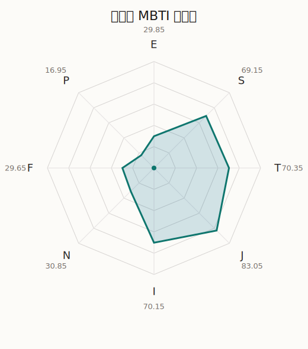

# 明日香 MBTI 类型解释

- 角色名：户山明日香
- 最终类型：ISTJ
- 备选类型：INTJ
- 原始聚合类型：ISTJ
- 采样轮次：10
- 主类型稳定度：10/10（100.0%）
- 原始聚合稳定度：10/10（100.0%）
- 置信度：高（46.35）
- 置信度方差：59.3396
- 题库：Open Jungian Type Scales (OJTS v2.1)（48 题）

## 类型概述

ISTJ 的整体倾向是：更偏内在稳态、现实执行、逻辑标准和规则落实。

## 人物核心

从外部设定与已整理剧情综合来看，明日香的角色框架可以先理解为：当前尚未补入该角色的外部设定补充，因此这里只能更多依赖本地剧情切片与卡牌剧情来做保守整理。

## PDB 校核

- 已应用 PDB 主参考：来源 `personality-database.com`。
- 权重分配：PDB 50% / 人设概要 25% / 卡牌剧情 15% / 剧情切片 10%。
- PDB 类型排序：`ISTJ`
- 最终类型先按 PDB 最高票定锚：`ISTJ`
- 指定锁定类型：`ISTJ`
## 为什么是这个类型

- `I > E`（70.15 : 29.85，平均轴差 46.69，方差 253.3723）：更常先在内部消化，再选择性地向外表达立场。
- `S > N`（69.15 : 30.85，平均轴差 26.95，方差 66.0878）：更常依赖现实条件、具体细节和当下经验来判断局面。
- `T > F`（70.35 : 29.65，平均轴差 37.90，方差 221.1837）：更常把逻辑、结构、效率和标准一致性放在判断前列。
- `J > P`（83.05 : 16.95，平均轴差 68.13，方差 42.1699）：更常用计划、收束、安排和责任结构去降低混乱。

## 为什么不是备选类型

最接近的备选类型是 `INTJ`。它与主类型 `ISTJ` 的差别主要落在 `SN` 这一轴上。
最终仍保留 `S`，因为该轴平均优势还有 `38.30`，虽然会波动，但整体没有被 `N` 反超。虽然也会谈到意义和理想，但资料里更常落到现实条件、细节和可执行层面。

## 四维结果

- `EI`：E 29.85 / I 70.15，轴差方差 253.3723
- `SN`：S 69.15 / N 30.85，轴差方差 66.0878
- `FT`：F 29.65 / T 70.35，轴差方差 221.1837
- `JP`：J 83.05 / P 16.95，轴差方差 42.1699

## 八维数据

- `E`：均值 29.85，方差 63.3431
- `S`：均值 69.15，方差 16.5219
- `T`：均值 70.35，方差 55.2959
- `J`：均值 83.05，方差 10.5425
- `I`：均值 70.15，方差 63.3431
- `N`：均值 30.85，方差 16.5219
- `F`：均值 29.65，方差 55.2959
- `P`：均值 16.95，方差 10.5425

## 类型稳定性

- `ISTJ`：10 次（100.0%）

## 图表

## 证据依据

- 人物概述：从外部设定与已整理剧情综合来看，明日香的角色框架可以先理解为：当前尚未补入该角色的外部设定补充，因此这里只能更多依赖本地剧情切片与卡牌剧情来做保守整理。
- 卡牌剧情：当前没有归到该角色名下的卡牌剧情，因此暂时无法从私人篇章、节庆篇章或回忆篇章里继续补正人物侧面。
- 剧情切片：在已整理的 40 条主线/乐团剧情切片里，明日香同时覆盖主线推进（7）和乐队内部关系（33）两条线。这说明这个角色在本地语料中的位置，不应该只从单句台词去读，而要放回到持续出现的关系链和章节位置里看。

## 模拟作答概览

| 题号 | 题目/两端描述 | 平均作答 | 作答方差 | 平均倾向值 | 倾向方差 |
| --- | --- | --- | --- | --- | --- |
| 1 | I don&lsquo;t like to draw attention to myself. | 2.90 | 0.2900 | -8.39 | 275.4018 |
| 2 | I hate situations where people expect me to be funny. | 3.10 | 0.2900 | -2.29 | 354.7915 |
| 3 | I hold back my opinions. | 3.10 | 0.0900 | 3.79 | 341.9316 |
| 4 | I want a huge social circle. | 1.60 | 0.2400 | -55.29 | 206.6970 |
| 5 | I am the life of the party. | 1.80 | 0.1600 | -56.16 | 135.1520 |
| 6 | I make lots of noise. | 1.50 | 0.2500 | -61.31 | 223.7668 |
| 7 | I avoid philosophical discussions. | 3.90 | 0.0900 | 34.43 | 88.4126 |
| 8 | I don&apos;t like to analyze literature. | 3.50 | 0.2500 | 22.93 | 154.0954 |
| 9 | I am attached to conventional ways. | 3.70 | 0.2100 | 30.14 | 148.4042 |
| 10 | I love to read challenging material. | 2.30 | 0.2100 | -27.47 | 229.2216 |
| 11 | I look for hidden meanings in things. | 2.40 | 0.2400 | -23.38 | 254.6963 |
| 12 | I am curious about everything. | 2.20 | 0.1600 | -25.82 | 194.2503 |
| 13 | I want to experience passion and romance. | 1.80 | 0.1600 | -56.03 | 190.7705 |
| 14 | I am deeply moved by others&lsquo; misfortunes. | 1.80 | 0.1600 | -54.00 | 82.7296 |
| 15 | I listen to my feelings when making important decisions. | 1.60 | 0.2400 | -55.81 | 209.7204 |
| 16 | I prize logic above all else. | 3.30 | 0.2100 | 18.38 | 58.0600 |
| 17 | I don&lsquo;t understand people who get emotional. | 3.70 | 0.2100 | 29.81 | 201.5383 |
| 18 | I&apos;d rather be feared than loved. | 3.50 | 0.2500 | 22.68 | 188.0386 |
| 19 | I like order. | 4.20 | 0.1600 | 48.39 | 195.0613 |
| 20 | I do things according to a plan. | 4.00 | 0.2000 | 42.40 | 206.4074 |
| 21 | I am always prepared. | 4.00 | 0.2000 | 44.84 | 171.4675 |
| 22 | I often make last-minute plans. | 1.00 | 0.0000 | -80.03 | 43.7080 |
| 23 | I do things for no apparent reason. | 1.10 | 0.0900 | -79.50 | 111.8114 |
| 24 | It takes me days to do things that should take hours because I keep getting distracted. | 1.10 | 0.0900 | -75.71 | 116.6650 |
| 25 | I work on improving myself. | 3.00 | 0.2000 | 3.80 | 238.7404 |
| 26 | I always feel like I need to be doing something important. | 3.20 | 0.3600 | 5.25 | 326.3083 |
| 27 | I have unusual beliefs about the world. | 1.60 | 0.2400 | -61.13 | 52.7508 |
| 28 | I dislike routine. | 1.20 | 0.1600 | -64.58 | 41.9894 |
| 29 | I try my best to follow the rules. | 3.80 | 0.1600 | 35.46 | 146.8600 |
| 30 | I respect authority. | 4.00 | 0.0000 | 36.46 | 108.5274 |
| 31 | I like to take it easy. | 2.00 | 0.0000 | -41.33 | 51.7585 |
| 32 | I choose the easy way. | 2.00 | 0.0000 | -39.54 | 90.9904 |
| 33 | I tell other people my secrets. | 1.50 | 0.2500 | -59.17 | 123.6631 |
| 34 | I make big gestures of friendship to people. | 1.40 | 0.2400 | -57.46 | 73.2036 |
| 35 | I enjoy challenges and competition. | 2.10 | 0.2900 | -36.55 | 311.9780 |
| 36 | I have very high self-esteem. | 2.20 | 0.1600 | -32.76 | 87.2369 |
| 37 | I get embarrassed easily. | 2.10 | 0.0900 | -30.50 | 90.5790 |
| 38 | I become overwhelmed by events. | 2.30 | 0.2100 | -30.76 | 183.9516 |
| 39 | I have difficulty expressing my feelings. | 2.90 | 0.0900 | 2.05 | 165.0287 |
| 40 | I don&apos;t trust others easily. | 2.90 | 0.0900 | -2.56 | 165.4065 |
| 41 | skeptical <-> wants to believe | 2.60 | 0.2400 | -19.19 | 102.0698 |
| 42 | chaotic <-> organized | 5.00 | 0.0000 | 80.62 | 63.4968 |
| 43 | wants the big picture <-> wants the details | 2.50 | 0.2500 | -13.74 | 319.9094 |
| 44 | energetic <-> mellow | 4.50 | 0.2500 | 60.34 | 174.8119 |
| 45 | follows the heart <-> follows the head | 3.60 | 0.2400 | 23.67 | 162.0841 |
| 46 | prepares <-> improvises | 2.80 | 0.1600 | -8.66 | 199.6761 |
| 47 | focused on the present <-> focused on the future | 1.60 | 0.2400 | -59.53 | 150.5028 |
| 48 | works best alone <-> works best in groups | 2.20 | 0.1600 | -33.82 | 136.5609 |

## 题库来源

- [OJTS 官方题目页](https://openpsychometrics.org/tests/OJTS/)
- 许可证：CC BY-NC-SA 4.0
- [本地题库文件](../ojts_question_bank_v2_1.json)
