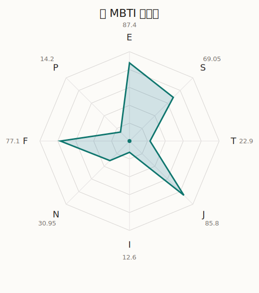

# 彩 MBTI 类型解释

- 角色名：丸山彩
- 最终类型：ESFJ
- 备选类型：ENFJ
- 原始聚合类型：ESFJ
- 采样轮次：10
- 主类型稳定度：10/10（100.0%）
- 原始聚合稳定度：10/10（100.0%）
- 置信度：高（59.68）
- 置信度方差：22.7639
- 题库：Open Jungian Type Scales (OJTS v2.1)（48 题）

## 类型概述

ESFJ 的整体倾向是：更偏外向关系、现实执行、情感照料和稳定组织。

## 人物核心

从外部设定与已整理剧情综合来看，彩的角色框架可以先理解为：官方角色页里的彩被明确写成努力家、憧憬偶像、总是拼尽全力的 Pastel＊Palettes 队长。她不是天赋型偶像，反而正因为常觉得自己普通，才把每一次机会都当成必须抓住的证明。

## PDB 校核

- 已应用 PDB 主参考：来源 `personality-database.com`。
- 权重分配：PDB 50% / 人设概要 25% / 卡牌剧情 15% / 剧情切片 10%。
- PDB 类型排序：`ESFJ`
- 最终类型先按 PDB 最高票定锚：`ESFJ`
- 指定锁定类型：`ESFJ`
## 为什么是这个类型

- `E > I`（87.40 : 12.60，平均轴差 78.02，方差 9.8640）：更常通过主动互动、公开表达或带动现场来处理问题。
- `S > N`（69.05 : 30.95，平均轴差 30.88，方差 197.3917）：更常依赖现实条件、具体细节和当下经验来判断局面。
- `F > T`（77.10 : 22.90，平均轴差 42.98，方差 279.2217）：更常把感受、关系、价值和对人的回应放在判断前列。
- `J > P`（85.80 : 14.20，平均轴差 77.10，方差 75.7194）：更常用计划、收束、安排和责任结构去降低混乱。

## 为什么不是备选类型

最接近的备选类型是 `ENFJ`。它与主类型 `ESFJ` 的差别主要落在 `SN` 这一轴上。
最终仍保留 `S`，因为该轴平均优势还有 `38.10`，虽然会波动，但整体没有被 `N` 反超。虽然也会谈到意义和理想，但资料里更常落到现实条件、细节和可执行层面。

## 四维结果

- `EI`：E 87.40 / I 12.60，轴差方差 9.8640
- `SN`：S 69.05 / N 30.95，轴差方差 197.3917
- `FT`：F 77.10 / T 22.90，轴差方差 279.2217
- `JP`：J 85.80 / P 14.20，轴差方差 75.7194

## 八维数据

- `E`：均值 87.40，方差 2.4660
- `S`：均值 69.05，方差 49.3479
- `T`：均值 22.90，方差 69.8054
- `J`：均值 85.80，方差 18.9299
- `I`：均值 12.60，方差 2.4660
- `N`：均值 30.95，方差 49.3479
- `F`：均值 77.10，方差 69.8054
- `P`：均值 14.20，方差 18.9299

## 类型稳定性

- `ESFJ`：10 次（100.0%）

## 图表

## 证据依据

- 人物概述：从外部设定与已整理剧情综合来看，彩的角色框架可以先理解为：官方角色页里的彩被明确写成努力家、憧憬偶像、总是拼尽全力的 Pastel＊Palettes 队长。她不是天赋型偶像，反而正因为常觉得自己普通，才把每一次机会都当成必须抓住的证明。
- 卡牌剧情：在 119 条卡牌剧情里，彩 的个人篇章补完相对丰富；这部分更适合用来观察角色的私下状态、非主线场合下的关系重心，以及主线之外的稳定人格表现。
- 剧情切片：在已整理的 466 条主线/乐团剧情切片里，彩同时覆盖主线推进（78）和乐队内部关系（388）两条线。这说明这个角色在本地语料中的位置，不应该只从单句台词去读，而要放回到持续出现的关系链和章节位置里看。

## 模拟作答概览

| 题号 | 题目/两端描述 | 平均作答 | 作答方差 | 平均倾向值 | 倾向方差 |
| --- | --- | --- | --- | --- | --- |
| 1 | I don&lsquo;t like to draw attention to myself. | 1.00 | 0.0000 | -85.89 | 43.0429 |
| 2 | I hate situations where people expect me to be funny. | 1.00 | 0.0000 | -88.31 | 39.2756 |
| 3 | I hold back my opinions. | 1.00 | 0.0000 | -84.62 | 28.0656 |
| 4 | I want a huge social circle. | 3.70 | 0.2100 | 27.20 | 188.1475 |
| 5 | I am the life of the party. | 3.70 | 0.2100 | 26.83 | 83.9563 |
| 6 | I make lots of noise. | 3.60 | 0.2400 | 26.12 | 54.5691 |
| 7 | I avoid philosophical discussions. | 2.80 | 0.1600 | -9.18 | 132.8086 |
| 8 | I don&apos;t like to analyze literature. | 2.70 | 0.2100 | -13.77 | 104.1112 |
| 9 | I am attached to conventional ways. | 3.00 | 0.2000 | -2.29 | 263.3466 |
| 10 | I love to read challenging material. | 1.80 | 0.1600 | -45.59 | 164.3995 |
| 11 | I look for hidden meanings in things. | 1.70 | 0.2100 | -53.27 | 88.8740 |
| 12 | I am curious about everything. | 1.70 | 0.2100 | -51.77 | 119.2516 |
| 13 | I want to experience passion and romance. | 3.40 | 0.2400 | 11.47 | 294.4448 |
| 14 | I am deeply moved by others&lsquo; misfortunes. | 3.00 | 0.2000 | 2.90 | 207.2093 |
| 15 | I listen to my feelings when making important decisions. | 3.20 | 0.3600 | 5.95 | 465.4895 |
| 16 | I prize logic above all else. | 1.20 | 0.1600 | -66.81 | 202.3298 |
| 17 | I don&lsquo;t understand people who get emotional. | 1.20 | 0.1600 | -66.82 | 91.9811 |
| 18 | I&apos;d rather be feared than loved. | 1.50 | 0.2500 | -65.85 | 199.2809 |
| 19 | I like order. | 4.50 | 0.2500 | 53.77 | 183.2148 |
| 20 | I do things according to a plan. | 4.40 | 0.2400 | 53.18 | 77.8475 |
| 21 | I am always prepared. | 4.30 | 0.2100 | 50.47 | 84.8134 |
| 22 | I often make last-minute plans. | 1.00 | 0.0000 | -81.48 | 47.6479 |
| 23 | I do things for no apparent reason. | 1.10 | 0.0900 | -80.62 | 110.3304 |
| 24 | It takes me days to do things that should take hours because I keep getting distracted. | 1.00 | 0.0000 | -82.58 | 57.3002 |
| 25 | I work on improving myself. | 2.80 | 0.1600 | -14.13 | 133.0937 |
| 26 | I always feel like I need to be doing something important. | 2.90 | 0.0900 | -11.15 | 153.2138 |
| 27 | I have unusual beliefs about the world. | 1.10 | 0.0900 | -70.34 | 48.7320 |
| 28 | I dislike routine. | 1.30 | 0.2100 | -66.60 | 156.0342 |
| 29 | I try my best to follow the rules. | 3.10 | 0.0900 | 9.10 | 88.3168 |
| 30 | I respect authority. | 3.00 | 0.2000 | 7.02 | 338.4681 |
| 31 | I like to take it easy. | 1.90 | 0.2900 | -45.12 | 141.1839 |
| 32 | I choose the easy way. | 1.90 | 0.0900 | -47.86 | 72.8268 |
| 33 | I tell other people my secrets. | 3.30 | 0.2100 | 8.26 | 341.1094 |
| 34 | I make big gestures of friendship to people. | 3.10 | 0.0900 | 16.81 | 94.5328 |
| 35 | I enjoy challenges and competition. | 2.70 | 0.2100 | -22.03 | 113.3553 |
| 36 | I have very high self-esteem. | 2.40 | 0.2400 | -23.70 | 194.8097 |
| 37 | I get embarrassed easily. | 1.90 | 0.0900 | -35.38 | 125.8910 |
| 38 | I become overwhelmed by events. | 2.10 | 0.0900 | -37.40 | 134.7397 |
| 39 | I have difficulty expressing my feelings. | 1.00 | 0.0000 | -78.63 | 39.0269 |
| 40 | I don&apos;t trust others easily. | 1.00 | 0.0000 | -75.11 | 74.7486 |
| 41 | skeptical <-> wants to believe | 3.00 | 0.2000 | -3.38 | 277.6652 |
| 42 | chaotic <-> organized | 5.00 | 0.0000 | 83.46 | 74.1982 |
| 43 | wants the big picture <-> wants the details | 3.00 | 0.0000 | -7.48 | 95.5326 |
| 44 | energetic <-> mellow | 1.00 | 0.0000 | -87.72 | 43.2078 |
| 45 | follows the heart <-> follows the head | 2.10 | 0.2900 | -33.79 | 198.0933 |
| 46 | prepares <-> improvises | 1.90 | 0.0900 | -45.38 | 147.3245 |
| 47 | focused on the present <-> focused on the future | 1.60 | 0.2400 | -58.15 | 144.8452 |
| 48 | works best alone <-> works best in groups | 4.20 | 0.1600 | 49.30 | 93.8279 |

## 题库来源

- [OJTS 官方题目页](https://openpsychometrics.org/tests/OJTS/)
- 许可证：CC BY-NC-SA 4.0
- [本地题库文件](../ojts_question_bank_v2_1.json)
