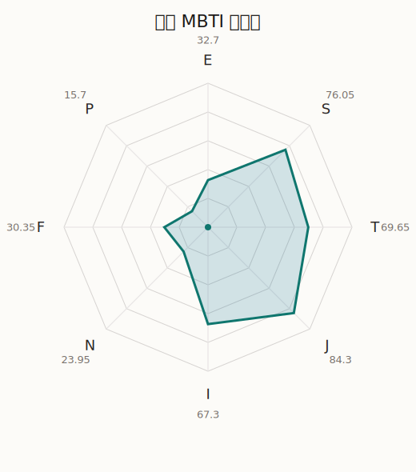

# 千圣 MBTI 类型解释

- 角色名：白鹭千圣
- 最终类型：ISTJ
- 备选类型：ESTJ
- 原始聚合类型：ISTJ
- 采样轮次：10
- 主类型稳定度：10/10（100.0%）
- 原始聚合稳定度：10/10（100.0%）
- 置信度：高（48.65）
- 置信度方差：81.6761
- 题库：Open Jungian Type Scales (OJTS v2.1)（48 题）

## 类型概述

ISTJ 的整体倾向是：更偏内在稳态、现实执行、逻辑标准和规则落实。

## 人物核心

从外部设定与已整理剧情综合来看，千圣的角色框架可以先理解为：官方与外部资料里的千圣通常被写成成熟、专业、外冷内热的演员兼偶像。她习惯把自己维持在得体、从容的一面，但也正因为从小站在被观看的位置上，她格外珍惜那些不用伪装也能相处的人。

## PDB 校核

- 已应用 PDB 主参考：来源 `personality-database.com`。
- 权重分配：PDB 50% / 人设概要 25% / 卡牌剧情 15% / 剧情切片 10%。
- PDB 类型排序：`ISTJ`
- 最终类型先按 PDB 最高票定锚：`ISTJ`
- 指定锁定类型：`ISTJ`
## 为什么是这个类型

- `I > E`（67.30 : 32.70，平均轴差 39.81，方差 216.3417）：更常先在内部消化，再选择性地向外表达立场。
- `S > N`（76.05 : 23.95，平均轴差 50.34，方差 428.1584）：更常依赖现实条件、具体细节和当下经验来判断局面。
- `T > F`（69.65 : 30.35，平均轴差 37.35，方差 208.4333）：更常把逻辑、结构、效率和标准一致性放在判断前列。
- `J > P`（84.30 : 15.70，平均轴差 65.40，方差 99.3064）：更常用计划、收束、安排和责任结构去降低混乱。

## 为什么不是备选类型

最接近的备选类型是 `ESTJ`。它与主类型 `ISTJ` 的差别主要落在 `EI` 这一轴上。
最终仍保留 `I`，因为该轴平均优势还有 `34.60`，虽然会波动，但整体没有被 `E` 反超。虽然也会参与群体互动，但资料里更常表现为先内化、后表达的节奏。

## 四维结果

- `EI`：E 32.70 / I 67.30，轴差方差 216.3417
- `SN`：S 76.05 / N 23.95，轴差方差 428.1584
- `FT`：F 30.35 / T 69.65，轴差方差 208.4333
- `JP`：J 84.30 / P 15.70，轴差方差 99.3064

## 八维数据

- `E`：均值 32.70，方差 54.0854
- `S`：均值 76.05，方差 107.0396
- `T`：均值 69.65，方差 52.1083
- `J`：均值 84.30，方差 24.8266
- `I`：均值 67.30，方差 54.0854
- `N`：均值 23.95，方差 107.0396
- `F`：均值 30.35，方差 52.1083
- `P`：均值 15.70，方差 24.8266

## 类型稳定性

- `ISTJ`：10 次（100.0%）

## 图表

## 证据依据

- 人物概述：从外部设定与已整理剧情综合来看，千圣的角色框架可以先理解为：官方与外部资料里的千圣通常被写成成熟、专业、外冷内热的演员兼偶像。她习惯把自己维持在得体、从容的一面，但也正因为从小站在被观看的位置上，她格外珍惜那些不用伪装也能相处的人。
- 卡牌剧情：在 109 条卡牌剧情里，千圣 的个人篇章补完相对丰富；这部分更适合用来观察角色的私下状态、非主线场合下的关系重心，以及主线之外的稳定人格表现。
- 剧情切片：在已整理的 419 条主线/乐团剧情切片里，千圣同时覆盖主线推进（63）和乐队内部关系（356）两条线。这说明这个角色在本地语料中的位置，不应该只从单句台词去读，而要放回到持续出现的关系链和章节位置里看。

## 模拟作答概览

| 题号 | 题目/两端描述 | 平均作答 | 作答方差 | 平均倾向值 | 倾向方差 |
| --- | --- | --- | --- | --- | --- |
| 1 | I don&lsquo;t like to draw attention to myself. | 3.00 | 0.2000 | -0.24 | 260.2401 |
| 2 | I hate situations where people expect me to be funny. | 3.00 | 0.0000 | 0.86 | 171.4282 |
| 3 | I hold back my opinions. | 3.10 | 0.2900 | -0.40 | 228.5876 |
| 4 | I want a huge social circle. | 1.50 | 0.2500 | -56.42 | 177.6612 |
| 5 | I am the life of the party. | 1.60 | 0.2400 | -54.55 | 83.4361 |
| 6 | I make lots of noise. | 1.40 | 0.2400 | -58.20 | 101.1225 |
| 7 | I avoid philosophical discussions. | 3.10 | 0.0900 | 6.72 | 64.3685 |
| 8 | I don&apos;t like to analyze literature. | 3.20 | 0.1600 | 4.07 | 275.8691 |
| 9 | I am attached to conventional ways. | 3.10 | 0.2900 | 2.59 | 369.5827 |
| 10 | I love to read challenging material. | 1.50 | 0.4500 | -65.20 | 382.4038 |
| 11 | I look for hidden meanings in things. | 1.40 | 0.2400 | -66.55 | 178.7498 |
| 12 | I am curious about everything. | 1.40 | 0.2400 | -65.19 | 255.2853 |
| 13 | I want to experience passion and romance. | 1.70 | 0.2100 | -58.63 | 133.8434 |
| 14 | I am deeply moved by others&lsquo; misfortunes. | 1.50 | 0.2500 | -61.90 | 55.3060 |
| 15 | I listen to my feelings when making important decisions. | 1.50 | 0.2500 | -59.72 | 145.0830 |
| 16 | I prize logic above all else. | 2.80 | 0.1600 | -10.12 | 221.8461 |
| 17 | I don&lsquo;t understand people who get emotional. | 3.20 | 0.1600 | 7.71 | 197.4627 |
| 18 | I&apos;d rather be feared than loved. | 3.00 | 0.0000 | -2.93 | 102.1263 |
| 19 | I like order. | 3.20 | 0.1600 | 11.37 | 240.5497 |
| 20 | I do things according to a plan. | 3.50 | 0.2500 | 14.08 | 290.6058 |
| 21 | I am always prepared. | 3.50 | 0.2500 | 14.58 | 301.9545 |
| 22 | I often make last-minute plans. | 1.00 | 0.0000 | -78.35 | 82.3663 |
| 23 | I do things for no apparent reason. | 1.10 | 0.0900 | -72.89 | 74.0924 |
| 24 | It takes me days to do things that should take hours because I keep getting distracted. | 1.10 | 0.0900 | -75.57 | 102.1654 |
| 25 | I work on improving myself. | 2.60 | 0.2400 | -27.55 | 133.1830 |
| 26 | I always feel like I need to be doing something important. | 2.70 | 0.2100 | -19.91 | 167.8529 |
| 27 | I have unusual beliefs about the world. | 1.10 | 0.0900 | -69.23 | 98.3045 |
| 28 | I dislike routine. | 1.20 | 0.1600 | -69.14 | 111.3188 |
| 29 | I try my best to follow the rules. | 3.20 | 0.1600 | 8.60 | 146.0001 |
| 30 | I respect authority. | 3.00 | 0.2000 | 3.52 | 275.0364 |
| 31 | I like to take it easy. | 2.10 | 0.0900 | -35.91 | 70.8818 |
| 32 | I choose the easy way. | 2.10 | 0.2900 | -37.15 | 257.2313 |
| 33 | I tell other people my secrets. | 1.70 | 0.2100 | -52.83 | 65.4494 |
| 34 | I make big gestures of friendship to people. | 1.70 | 0.2100 | -56.28 | 74.0679 |
| 35 | I enjoy challenges and competition. | 2.40 | 0.2400 | -26.33 | 104.4083 |
| 36 | I have very high self-esteem. | 2.50 | 0.2500 | -26.16 | 153.5521 |
| 37 | I get embarrassed easily. | 2.30 | 0.2100 | -29.64 | 65.6290 |
| 38 | I become overwhelmed by events. | 2.00 | 0.0000 | -41.21 | 72.3596 |
| 39 | I have difficulty expressing my feelings. | 2.70 | 0.4100 | -5.35 | 402.4928 |
| 40 | I don&apos;t trust others easily. | 2.80 | 0.3600 | -2.08 | 439.0214 |
| 41 | skeptical <-> wants to believe | 2.30 | 0.2100 | -29.34 | 142.9847 |
| 42 | chaotic <-> organized | 4.80 | 0.1600 | 65.64 | 72.6857 |
| 43 | wants the big picture <-> wants the details | 3.80 | 0.3600 | 30.11 | 250.9252 |
| 44 | energetic <-> mellow | 4.30 | 0.2100 | 58.40 | 76.8467 |
| 45 | follows the heart <-> follows the head | 3.60 | 0.2400 | 25.37 | 177.6413 |
| 46 | prepares <-> improvises | 2.50 | 0.2500 | -20.56 | 135.0435 |
| 47 | focused on the present <-> focused on the future | 1.40 | 0.2400 | -67.14 | 234.9167 |
| 48 | works best alone <-> works best in groups | 2.20 | 0.1600 | -28.68 | 309.2102 |

## 题库来源

- [OJTS 官方题目页](https://openpsychometrics.org/tests/OJTS/)
- 许可证：CC BY-NC-SA 4.0
- [本地题库文件](../ojts_question_bank_v2_1.json)
