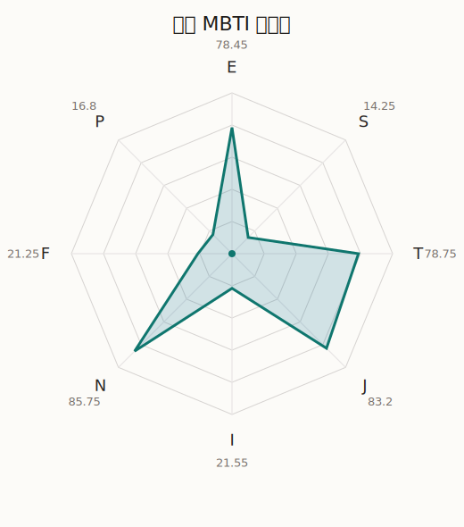

# 知由 MBTI 类型解释

- 角色名：珠手知由
- 最终类型：ENTJ
- 备选类型：INTJ
- 原始聚合类型：ENTJ
- 采样轮次：10
- 主类型稳定度：10/10（100.0%）
- 原始聚合稳定度：10/10（100.0%）
- 置信度：高（63.08）
- 置信度方差：21.2391
- 题库：Open Jungian Type Scales (OJTS v2.1)（48 题）

## 类型概述

ENTJ 的整体倾向是：更偏外向推进、抽象规划、逻辑判断和组织掌控。

## 人物核心

从外部设定与已整理剧情综合来看，知由的角色框架可以先理解为：外部角色页里的 CHU2 被设定成非常年轻的 DJ 与制作人，天赋、自信、控制欲和好胜心都非常强。她最鲜明的特质不是单纯嘴硬，而是坚信自己有能力改写舞台规则，因此天然会把别人也当成必须配合自己愿景的棋子。

## PDB 校核

- 已应用 PDB 主参考：来源 `personality-database.com`。
- 权重分配：PDB 50% / 人设概要 25% / 卡牌剧情 15% / 剧情切片 10%。
- PDB 类型排序：`ENTJ`
- 最终类型先按 PDB 最高票定锚：`ENTJ`
- 指定锁定类型：`ENTJ`
## 为什么是这个类型

- `E > I`（78.45 : 21.55，平均轴差 53.62，方差 127.3885）：更常通过主动互动、公开表达或带动现场来处理问题。
- `N > S`（85.75 : 14.25，平均轴差 77.90，方差 42.1190）：更常从意义、可能性、方向感和隐含主题去理解问题。
- `T > F`（78.75 : 21.25，平均轴差 63.51，方差 152.3679）：更常把逻辑、结构、效率和标准一致性放在判断前列。
- `J > P`（83.20 : 16.80，平均轴差 65.63，方差 85.5577）：更常用计划、收束、安排和责任结构去降低混乱。

## 为什么不是备选类型

最接近的备选类型是 `INTJ`。它与主类型 `ENTJ` 的差别主要落在 `EI` 这一轴上。
最终仍保留 `E`，因为该轴平均优势还有 `56.90`，虽然会波动，但整体没有被 `I` 反超。虽然也存在保留和内化的一面，但资料里更常出现主动带动关系与公开表达的处理方式。

## 四维结果

- `EI`：E 78.45 / I 21.55，轴差方差 127.3885
- `SN`：S 14.25 / N 85.75，轴差方差 42.1190
- `FT`：F 21.25 / T 78.75，轴差方差 152.3679
- `JP`：J 83.20 / P 16.80，轴差方差 85.5577

## 八维数据

- `E`：均值 78.45，方差 31.8471
- `S`：均值 14.25，方差 10.5298
- `T`：均值 78.75，方差 38.0920
- `J`：均值 83.20，方差 21.3894
- `I`：均值 21.55，方差 31.8471
- `N`：均值 85.75，方差 10.5298
- `F`：均值 21.25，方差 38.0920
- `P`：均值 16.80，方差 21.3894

## 类型稳定性

- `ENTJ`：10 次（100.0%）

## 图表

## 证据依据

- 人物概述：从外部设定与已整理剧情综合来看，知由的角色框架可以先理解为：外部角色页里的 CHU2 被设定成非常年轻的 DJ 与制作人，天赋、自信、控制欲和好胜心都非常强。她最鲜明的特质不是单纯嘴硬，而是坚信自己有能力改写舞台规则，因此天然会把别人也当成必须配合自己愿景的棋子。
- 卡牌剧情：在 55 条卡牌剧情里，知由 的个人篇章补完相对丰富；这部分更适合用来观察角色的私下状态、非主线场合下的关系重心，以及主线之外的稳定人格表现。
- 剧情切片：在已整理的 212 条主线/乐团剧情切片里，知由同时覆盖主线推进（10）和乐队内部关系（202）两条线。这说明这个角色在本地语料中的位置，不应该只从单句台词去读，而要放回到持续出现的关系链和章节位置里看。

## 模拟作答概览

| 题号 | 题目/两端描述 | 平均作答 | 作答方差 | 平均倾向值 | 倾向方差 |
| --- | --- | --- | --- | --- | --- |
| 1 | I don&lsquo;t like to draw attention to myself. | 1.30 | 0.2100 | -70.05 | 162.5637 |
| 2 | I hate situations where people expect me to be funny. | 1.20 | 0.1600 | -67.92 | 110.3118 |
| 3 | I hold back my opinions. | 1.40 | 0.2400 | -61.05 | 165.4447 |
| 4 | I want a huge social circle. | 3.20 | 0.1600 | 4.38 | 178.3059 |
| 5 | I am the life of the party. | 3.20 | 0.1600 | 9.97 | 189.6076 |
| 6 | I make lots of noise. | 3.00 | 0.2000 | 2.33 | 256.9197 |
| 7 | I avoid philosophical discussions. | 1.00 | 0.0000 | -87.22 | 58.3681 |
| 8 | I don&apos;t like to analyze literature. | 1.00 | 0.0000 | -84.09 | 79.2313 |
| 9 | I am attached to conventional ways. | 1.00 | 0.0000 | -84.78 | 65.2906 |
| 10 | I love to read challenging material. | 4.50 | 0.2500 | 56.54 | 79.8212 |
| 11 | I look for hidden meanings in things. | 4.20 | 0.1600 | 52.29 | 60.4131 |
| 12 | I am curious about everything. | 4.40 | 0.2400 | 53.80 | 148.4473 |
| 13 | I want to experience passion and romance. | 1.20 | 0.1600 | -70.37 | 141.6970 |
| 14 | I am deeply moved by others&lsquo; misfortunes. | 1.20 | 0.1600 | -69.45 | 101.4338 |
| 15 | I listen to my feelings when making important decisions. | 1.30 | 0.2100 | -70.84 | 145.1768 |
| 16 | I prize logic above all else. | 4.10 | 0.0900 | 44.90 | 182.4496 |
| 17 | I don&lsquo;t understand people who get emotional. | 4.20 | 0.1600 | 45.97 | 122.9229 |
| 18 | I&apos;d rather be feared than loved. | 3.90 | 0.2900 | 36.84 | 205.0851 |
| 19 | I like order. | 3.30 | 0.2100 | 11.28 | 150.8328 |
| 20 | I do things according to a plan. | 3.40 | 0.2400 | 14.69 | 151.8983 |
| 21 | I am always prepared. | 3.30 | 0.2100 | 13.04 | 168.4628 |
| 22 | I often make last-minute plans. | 1.10 | 0.0900 | -74.68 | 104.9814 |
| 23 | I do things for no apparent reason. | 1.10 | 0.0900 | -71.04 | 71.6450 |
| 24 | It takes me days to do things that should take hours because I keep getting distracted. | 1.10 | 0.0900 | -71.52 | 53.1785 |
| 25 | I work on improving myself. | 3.50 | 0.2500 | 15.79 | 269.0169 |
| 26 | I always feel like I need to be doing something important. | 3.50 | 0.2500 | 20.35 | 70.0770 |
| 27 | I have unusual beliefs about the world. | 2.50 | 0.2500 | -20.87 | 139.0765 |
| 28 | I dislike routine. | 2.40 | 0.2400 | -25.23 | 114.8064 |
| 29 | I try my best to follow the rules. | 2.30 | 0.2100 | -31.48 | 211.3586 |
| 30 | I respect authority. | 1.90 | 0.0900 | -42.90 | 156.8880 |
| 31 | I like to take it easy. | 1.10 | 0.0900 | -77.46 | 74.8564 |
| 32 | I choose the easy way. | 1.00 | 0.0000 | -78.37 | 92.9161 |
| 33 | I tell other people my secrets. | 2.40 | 0.2400 | -29.83 | 141.0039 |
| 34 | I make big gestures of friendship to people. | 2.10 | 0.0900 | -40.45 | 102.9287 |
| 35 | I enjoy challenges and competition. | 4.70 | 0.2100 | 61.26 | 120.3117 |
| 36 | I have very high self-esteem. | 3.10 | 0.0900 | 4.02 | 153.2623 |
| 37 | I get embarrassed easily. | 1.10 | 0.0900 | -68.82 | 24.9016 |
| 38 | I become overwhelmed by events. | 1.10 | 0.0900 | -67.49 | 49.1086 |
| 39 | I have difficulty expressing my feelings. | 2.50 | 0.2500 | -20.01 | 251.5391 |
| 40 | I don&apos;t trust others easily. | 2.30 | 0.2100 | -26.31 | 156.5538 |
| 41 | skeptical <-> wants to believe | 2.10 | 0.0900 | -31.33 | 154.3785 |
| 42 | chaotic <-> organized | 5.00 | 0.0000 | 74.62 | 36.4145 |
| 43 | wants the big picture <-> wants the details | 1.00 | 0.0000 | -86.27 | 78.5509 |
| 44 | energetic <-> mellow | 2.20 | 0.1600 | -30.68 | 131.8653 |
| 45 | follows the heart <-> follows the head | 4.10 | 0.0900 | 46.74 | 81.1866 |
| 46 | prepares <-> improvises | 2.10 | 0.0900 | -41.37 | 144.9300 |
| 47 | focused on the present <-> focused on the future | 4.20 | 0.1600 | 51.67 | 105.5655 |
| 48 | works best alone <-> works best in groups | 3.90 | 0.0900 | 35.22 | 44.9300 |

## 题库来源

- [OJTS 官方题目页](https://openpsychometrics.org/tests/OJTS/)
- 许可证：CC BY-NC-SA 4.0
- [本地题库文件](../ojts_question_bank_v2_1.json)
