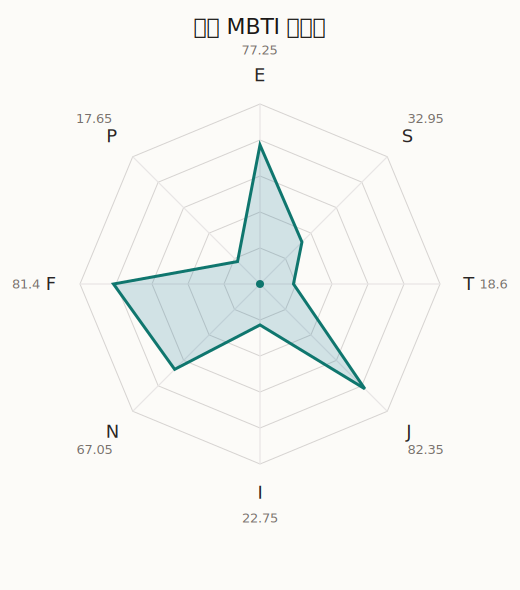

# 伊芙 MBTI 类型解释

- 角色名：若宫伊芙
- 最终类型：ENFJ
- 备选类型：ESFJ
- 原始聚合类型：ENFJ
- 采样轮次：10
- 主类型稳定度：8/10（80.0%）
- 原始聚合稳定度：8/10（80.0%）
- 置信度：高（54.02）
- 置信度方差：106.3723
- 题库：Open Jungian Type Scales (OJTS v2.1)（48 题）

## 类型概述

ENFJ 的整体倾向是：更偏外向连接、抽象理解、价值驱动和结构推进。

## 人物核心

从外部设定与已整理剧情综合来看，伊芙的角色框架可以先理解为：官方角色页里的伊芙被明确写成日芬混血、性格率直温柔，并且对“武士道”抱有非常强烈的向往。她的设定看似有点跳脱，实际上核心是她总想为人、为团队、为信念做出堂堂正正的回应。

## PDB 校核

- 已应用 PDB 主参考：来源 `personality-database.com`。
- 权重分配：PDB 50% / 人设概要 25% / 卡牌剧情 15% / 剧情切片 10%。
- PDB 类型排序：`ENFJ`
- 最终类型先按 PDB 最高票定锚：`ENFJ`
- 指定锁定类型：`ENFJ`
## 为什么是这个类型

- `E > I`（77.25 : 22.75，平均轴差 50.59，方差 238.6694）：更常通过主动互动、公开表达或带动现场来处理问题。
- `N > S`（67.05 : 32.95，平均轴差 30.07，方差 552.6031）：更常从意义、可能性、方向感和隐含主题去理解问题。
- `F > T`（81.40 : 18.60，平均轴差 70.28，方差 77.9151）：更常把感受、关系、价值和对人的回应放在判断前列。
- `J > P`（82.35 : 17.65，平均轴差 73.37，方差 69.7588）：更常用计划、收束、安排和责任结构去降低混乱。

## 为什么不是备选类型

最接近的备选类型是 `ESFJ`。它与主类型 `ENFJ` 的差别主要落在 `SN` 这一轴上。
最终仍保留 `N`，因为该轴平均优势还有 `34.10`，虽然会波动，但整体没有被 `S` 反超。虽然也会处理具体事务，但资料里更常从主题、方向和抽象意义去组织理解。

## 四维结果

- `EI`：E 77.25 / I 22.75，轴差方差 238.6694
- `SN`：S 32.95 / N 67.05，轴差方差 552.6031
- `FT`：F 81.40 / T 18.60，轴差方差 77.9151
- `JP`：J 82.35 / P 17.65，轴差方差 69.7588

## 八维数据

- `E`：均值 77.25，方差 59.6673
- `S`：均值 32.95，方差 138.1508
- `T`：均值 18.60，方差 19.4788
- `J`：均值 82.35，方差 17.4397
- `I`：均值 22.75，方差 59.6673
- `N`：均值 67.05，方差 138.1508
- `F`：均值 81.40，方差 19.4788
- `P`：均值 17.65，方差 17.4397

## 类型稳定性

- `ENFJ`：8 次（80.0%）
- `ESFJ`：2 次（20.0%）

## 图表

## 证据依据

- 人物概述：从外部设定与已整理剧情综合来看，伊芙的角色框架可以先理解为：官方角色页里的伊芙被明确写成日芬混血、性格率直温柔，并且对“武士道”抱有非常强烈的向往。她的设定看似有点跳脱，实际上核心是她总想为人、为团队、为信念做出堂堂正正的回应。
- 卡牌剧情：在 114 条卡牌剧情里，伊芙 的个人篇章补完相对丰富；这部分更适合用来观察角色的私下状态、非主线场合下的关系重心，以及主线之外的稳定人格表现。
- 剧情切片：在已整理的 315 条主线/乐团剧情切片里，伊芙同时覆盖主线推进（35）和乐队内部关系（280）两条线。这说明这个角色在本地语料中的位置，不应该只从单句台词去读，而要放回到持续出现的关系链和章节位置里看。

## 模拟作答概览

| 题号 | 题目/两端描述 | 平均作答 | 作答方差 | 平均倾向值 | 倾向方差 |
| --- | --- | --- | --- | --- | --- |
| 1 | I don&lsquo;t like to draw attention to myself. | 1.30 | 0.2100 | -66.43 | 163.4243 |
| 2 | I hate situations where people expect me to be funny. | 1.20 | 0.1600 | -68.32 | 89.0228 |
| 3 | I hold back my opinions. | 1.30 | 0.2100 | -67.67 | 156.1671 |
| 4 | I want a huge social circle. | 3.10 | 0.2900 | 6.33 | 240.7416 |
| 5 | I am the life of the party. | 3.10 | 0.0900 | 10.37 | 178.1984 |
| 6 | I make lots of noise. | 3.20 | 0.1600 | 4.43 | 314.4051 |
| 7 | I avoid philosophical discussions. | 1.40 | 0.2400 | -58.73 | 400.6123 |
| 8 | I don&apos;t like to analyze literature. | 1.60 | 0.2400 | -54.44 | 114.4936 |
| 9 | I am attached to conventional ways. | 1.50 | 0.2500 | -57.13 | 183.0066 |
| 10 | I love to read challenging material. | 2.80 | 0.1600 | -6.21 | 328.9305 |
| 11 | I look for hidden meanings in things. | 2.60 | 0.2400 | -5.98 | 507.0923 |
| 12 | I am curious about everything. | 2.60 | 0.6400 | -14.22 | 768.7662 |
| 13 | I want to experience passion and romance. | 3.30 | 0.2100 | 12.05 | 172.4379 |
| 14 | I am deeply moved by others&lsquo; misfortunes. | 3.30 | 0.2100 | 12.91 | 74.5840 |
| 15 | I listen to my feelings when making important decisions. | 3.20 | 0.1600 | 11.18 | 145.8043 |
| 16 | I prize logic above all else. | 1.00 | 0.0000 | -74.87 | 67.8232 |
| 17 | I don&lsquo;t understand people who get emotional. | 1.00 | 0.0000 | -72.43 | 20.0270 |
| 18 | I&apos;d rather be feared than loved. | 1.10 | 0.0900 | -70.66 | 71.4200 |
| 19 | I like order. | 3.70 | 0.2100 | 27.49 | 283.9001 |
| 20 | I do things according to a plan. | 3.50 | 0.2500 | 21.52 | 106.1744 |
| 21 | I am always prepared. | 3.60 | 0.2400 | 23.49 | 474.1061 |
| 22 | I often make last-minute plans. | 1.00 | 0.0000 | -80.61 | 93.5359 |
| 23 | I do things for no apparent reason. | 1.00 | 0.0000 | -82.11 | 78.6353 |
| 24 | It takes me days to do things that should take hours because I keep getting distracted. | 1.10 | 0.0900 | -77.97 | 127.7299 |
| 25 | I work on improving myself. | 3.40 | 0.2400 | 11.91 | 379.0341 |
| 26 | I always feel like I need to be doing something important. | 3.10 | 0.0900 | 6.67 | 216.0042 |
| 27 | I have unusual beliefs about the world. | 1.80 | 0.1600 | -44.82 | 262.1147 |
| 28 | I dislike routine. | 2.10 | 0.0900 | -38.51 | 159.4383 |
| 29 | I try my best to follow the rules. | 2.50 | 0.2500 | -18.39 | 175.2344 |
| 30 | I respect authority. | 2.70 | 0.2100 | -16.92 | 112.4249 |
| 31 | I like to take it easy. | 1.50 | 0.2500 | -65.27 | 279.6857 |
| 32 | I choose the easy way. | 1.20 | 0.1600 | -68.11 | 82.0990 |
| 33 | I tell other people my secrets. | 3.10 | 0.0900 | 8.16 | 101.2340 |
| 34 | I make big gestures of friendship to people. | 3.00 | 0.0000 | 7.25 | 65.4437 |
| 35 | I enjoy challenges and competition. | 1.90 | 0.0900 | -37.25 | 101.9671 |
| 36 | I have very high self-esteem. | 2.00 | 0.0000 | -36.45 | 54.7705 |
| 37 | I get embarrassed easily. | 2.20 | 0.1600 | -33.32 | 153.3148 |
| 38 | I become overwhelmed by events. | 2.30 | 0.2100 | -27.22 | 177.3196 |
| 39 | I have difficulty expressing my feelings. | 1.30 | 0.2100 | -68.44 | 132.1653 |
| 40 | I don&apos;t trust others easily. | 1.30 | 0.2100 | -67.35 | 76.4524 |
| 41 | skeptical <-> wants to believe | 5.00 | 0.0000 | 79.66 | 39.1011 |
| 42 | chaotic <-> organized | 5.00 | 0.0000 | 82.90 | 91.3413 |
| 43 | wants the big picture <-> wants the details | 2.30 | 0.2100 | -29.50 | 177.4863 |
| 44 | energetic <-> mellow | 2.10 | 0.2900 | -36.45 | 254.3203 |
| 45 | follows the heart <-> follows the head | 2.00 | 0.0000 | -40.35 | 78.3569 |
| 46 | prepares <-> improvises | 1.80 | 0.1600 | -48.40 | 123.8919 |
| 47 | focused on the present <-> focused on the future | 2.90 | 0.4900 | -8.82 | 747.7830 |
| 48 | works best alone <-> works best in groups | 3.90 | 0.0900 | 32.95 | 152.6512 |

## 题库来源

- [OJTS 官方题目页](https://openpsychometrics.org/tests/OJTS/)
- 许可证：CC BY-NC-SA 4.0
- [本地题库文件](../ojts_question_bank_v2_1.json)
