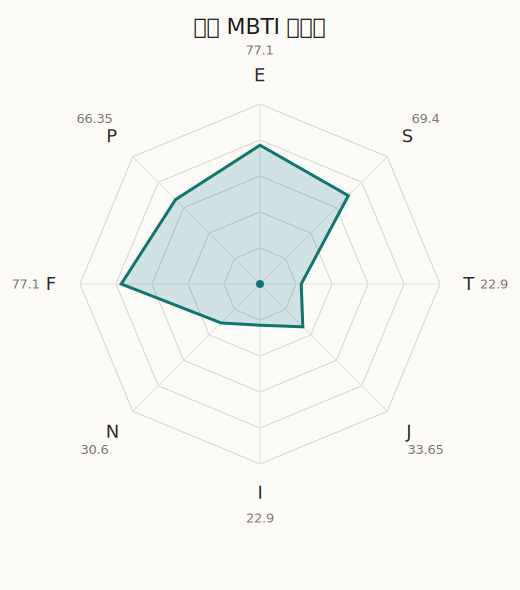

# 育美 MBTI 类型解释

- 角色名：北泽育美
- 最终类型：ESFP
- 备选类型：ESFJ
- 原始聚合类型：ESFP
- 采样轮次：10
- 主类型稳定度：9/10（90.0%）
- 原始聚合稳定度：9/10（90.0%）
- 置信度：高（44.97）
- 置信度方差：55.3311
- 题库：Open Jungian Type Scales (OJTS v2.1)（48 题）

## 类型概述

ESFP 的整体倾向是：更偏外向体验、现实感受、情感表达和即兴行动。

## 人物核心

从外部设定与已整理剧情综合来看，育美的角色框架可以先理解为：外部角色介绍里的育美通常被写成元气、运动万能、待人直接又真诚的孩子。她没有太多弯弯绕绕的思考习惯，因此一旦认定某件事是好的，就会用最直线的方式全力投入。

## PDB 校核

- 已应用 PDB 主参考：来源 `personality-database.com`。
- 权重分配：PDB 50% / 人设概要 25% / 卡牌剧情 15% / 剧情切片 10%。
- PDB 类型排序：`ESFP`
- 最终类型先按 PDB 最高票定锚：`ESFP`
- 指定锁定类型：`ESFP`
## 为什么是这个类型

- `E > I`（77.10 : 22.90，平均轴差 59.59，方差 175.1704）：更常通过主动互动、公开表达或带动现场来处理问题。
- `S > N`（69.40 : 30.60，平均轴差 38.33，方差 179.5151）：更常依赖现实条件、具体细节和当下经验来判断局面。
- `F > T`（77.10 : 22.90，平均轴差 60.73，方差 192.3771）：更常把感受、关系、价值和对人的回应放在判断前列。
- `P > J`（66.35 : 33.65，平均轴差 30.27，方差 355.0753）：更常保留空间，依靠灵活调整和临场变化推进事情。

## 为什么不是备选类型

最接近的备选类型是 `ESFJ`。它与主类型 `ESFP` 的差别主要落在 `JP` 这一轴上。
最终仍保留 `P`，因为该轴平均优势还有 `32.70`，虽然会波动，但整体没有被 `J` 反超。虽然并非完全无计划，但整体仍更偏向保留余地、即兴调整和开放推进。

## 四维结果

- `EI`：E 77.10 / I 22.90，轴差方差 175.1704
- `SN`：S 69.40 / N 30.60，轴差方差 179.5151
- `FT`：F 77.10 / T 22.90，轴差方差 192.3771
- `JP`：J 33.65 / P 66.35，轴差方差 355.0753

## 八维数据

- `E`：均值 77.10，方差 43.7926
- `S`：均值 69.40，方差 44.8788
- `T`：均值 22.90，方差 48.0943
- `J`：均值 33.65，方差 88.7688
- `I`：均值 22.90，方差 43.7926
- `N`：均值 30.60，方差 44.8788
- `F`：均值 77.10，方差 48.0943
- `P`：均值 66.35，方差 88.7688

## 类型稳定性

- `ESFP`：9 次（90.0%）
- `ESFJ`：1 次（10.0%）

## 图表

## 证据依据

- 人物概述：从外部设定与已整理剧情综合来看，育美的角色框架可以先理解为：外部角色介绍里的育美通常被写成元气、运动万能、待人直接又真诚的孩子。她没有太多弯弯绕绕的思考习惯，因此一旦认定某件事是好的，就会用最直线的方式全力投入。
- 卡牌剧情：在 107 条卡牌剧情里，育美 的个人篇章补完相对丰富；这部分更适合用来观察角色的私下状态、非主线场合下的关系重心，以及主线之外的稳定人格表现。
- 剧情切片：在已整理的 411 条主线/乐团剧情切片里，育美同时覆盖主线推进（45）和乐队内部关系（366）两条线。这说明这个角色在本地语料中的位置，不应该只从单句台词去读，而要放回到持续出现的关系链和章节位置里看。

## 模拟作答概览

| 题号 | 题目/两端描述 | 平均作答 | 作答方差 | 平均倾向值 | 倾向方差 |
| --- | --- | --- | --- | --- | --- |
| 1 | I don&lsquo;t like to draw attention to myself. | 1.30 | 0.2100 | -69.57 | 157.5644 |
| 2 | I hate situations where people expect me to be funny. | 1.30 | 0.2100 | -68.31 | 213.0344 |
| 3 | I hold back my opinions. | 1.40 | 0.2400 | -67.33 | 124.3337 |
| 4 | I want a huge social circle. | 3.10 | 0.0900 | 1.68 | 306.4538 |
| 5 | I am the life of the party. | 3.30 | 0.2100 | 8.85 | 300.4459 |
| 6 | I make lots of noise. | 3.30 | 0.2100 | 12.04 | 179.7209 |
| 7 | I avoid philosophical discussions. | 2.90 | 0.0900 | -8.83 | 201.2372 |
| 8 | I don&apos;t like to analyze literature. | 3.00 | 0.2000 | 4.47 | 203.7925 |
| 9 | I am attached to conventional ways. | 3.00 | 0.0000 | -1.10 | 156.6916 |
| 10 | I love to read challenging material. | 1.80 | 0.1600 | -53.27 | 111.2219 |
| 11 | I look for hidden meanings in things. | 1.50 | 0.2500 | -58.95 | 148.0551 |
| 12 | I am curious about everything. | 1.30 | 0.2100 | -60.00 | 102.4423 |
| 13 | I want to experience passion and romance. | 3.20 | 0.1600 | 3.00 | 302.5121 |
| 14 | I am deeply moved by others&lsquo; misfortunes. | 3.20 | 0.1600 | 10.17 | 234.1536 |
| 15 | I listen to my feelings when making important decisions. | 3.20 | 0.1600 | 5.55 | 137.2079 |
| 16 | I prize logic above all else. | 1.20 | 0.1600 | -69.09 | 133.6744 |
| 17 | I don&lsquo;t understand people who get emotional. | 1.30 | 0.2100 | -67.05 | 190.4633 |
| 18 | I&apos;d rather be feared than loved. | 1.30 | 0.2100 | -70.06 | 133.2294 |
| 19 | I like order. | 1.50 | 0.2500 | -56.94 | 430.4480 |
| 20 | I do things according to a plan. | 1.60 | 0.2400 | -57.81 | 193.4623 |
| 21 | I am always prepared. | 1.80 | 0.1600 | -53.44 | 166.1534 |
| 22 | I often make last-minute plans. | 2.80 | 0.1600 | -5.77 | 222.9776 |
| 23 | I do things for no apparent reason. | 2.90 | 0.2900 | -9.75 | 372.8405 |
| 24 | It takes me days to do things that should take hours because I keep getting distracted. | 2.90 | 0.2900 | -8.18 | 441.5534 |
| 25 | I work on improving myself. | 1.40 | 0.2400 | -59.06 | 134.1825 |
| 26 | I always feel like I need to be doing something important. | 1.40 | 0.2400 | -58.38 | 54.5714 |
| 27 | I have unusual beliefs about the world. | 2.10 | 0.2900 | -36.13 | 241.6924 |
| 28 | I dislike routine. | 2.40 | 0.2400 | -28.69 | 361.2574 |
| 29 | I try my best to follow the rules. | 2.20 | 0.1600 | -27.67 | 60.4879 |
| 30 | I respect authority. | 2.10 | 0.2900 | -32.28 | 187.2638 |
| 31 | I like to take it easy. | 2.90 | 0.0900 | -4.29 | 167.7055 |
| 32 | I choose the easy way. | 3.00 | 0.4000 | -2.81 | 387.7234 |
| 33 | I tell other people my secrets. | 3.20 | 0.1600 | 11.54 | 201.5582 |
| 34 | I make big gestures of friendship to people. | 3.20 | 0.3600 | 8.28 | 502.2963 |
| 35 | I enjoy challenges and competition. | 2.10 | 0.0900 | -37.62 | 103.0675 |
| 36 | I have very high self-esteem. | 2.40 | 0.2400 | -24.07 | 75.7634 |
| 37 | I get embarrassed easily. | 2.20 | 0.1600 | -33.88 | 127.6210 |
| 38 | I become overwhelmed by events. | 2.30 | 0.2100 | -28.74 | 184.9454 |
| 39 | I have difficulty expressing my feelings. | 1.30 | 0.2100 | -67.38 | 160.4957 |
| 40 | I don&apos;t trust others easily. | 1.20 | 0.1600 | -67.58 | 123.5263 |
| 41 | skeptical <-> wants to believe | 5.00 | 0.0000 | 73.04 | 54.3871 |
| 42 | chaotic <-> organized | 3.30 | 0.4100 | 16.87 | 318.5348 |
| 43 | wants the big picture <-> wants the details | 3.00 | 0.0000 | -1.02 | 129.7571 |
| 44 | energetic <-> mellow | 1.10 | 0.0900 | -72.46 | 53.3582 |
| 45 | follows the heart <-> follows the head | 2.20 | 0.1600 | -37.60 | 332.1525 |
| 46 | prepares <-> improvises | 3.60 | 0.2400 | 24.19 | 254.6790 |
| 47 | focused on the present <-> focused on the future | 1.90 | 0.0900 | -49.69 | 105.0918 |
| 48 | works best alone <-> works best in groups | 3.90 | 0.0900 | 35.85 | 205.3407 |

## 题库来源

- [OJTS 官方题目页](https://openpsychometrics.org/tests/OJTS/)
- 许可证：CC BY-NC-SA 4.0
- [本地题库文件](../ojts_question_bank_v2_1.json)
