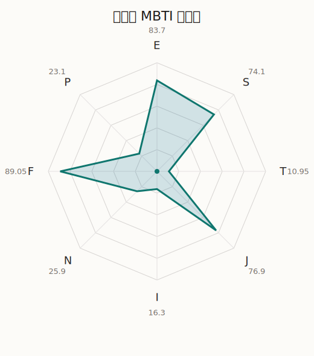

# 绯玛丽 MBTI 类型解释

- 角色名：上原绯玛丽
- 最终类型：ESFJ
- 备选类型：ENFJ
- 原始聚合类型：ESFJ
- 采样轮次：10
- 主类型稳定度：10/10（100.0%）
- 原始聚合稳定度：10/10（100.0%）
- 置信度：高（61.88）
- 置信度方差：34.1847
- 题库：Open Jungian Type Scales (OJTS v2.1)（48 题）

## 类型概述

ESFJ 的整体倾向是：更偏外向关系、现实执行、情感照料和稳定组织。

## 人物核心

从外部设定与已整理剧情综合来看，绯玛丽的角色框架可以先理解为：外部资料通常把绯玛丽写成开朗、爱热闹、沟通力强，也很珍惜“大家一起”的氛围。她会努力让团队看起来轻松顺畅，但也正因为太在意关系，偶尔会先替别人着急或替气氛负责。

## PDB 校核

- 已应用 PDB 主参考：来源 `personality-database.com`。
- 权重分配：PDB 50% / 人设概要 25% / 卡牌剧情 15% / 剧情切片 10%。
- PDB 类型排序：`ESFJ`
- 最终类型先按 PDB 最高票定锚：`ESFJ`
- 指定锁定类型：`ESFJ`
## 为什么是这个类型

- `E > I`（83.70 : 16.30，平均轴差 54.65，方差 96.2663）：更常通过主动互动、公开表达或带动现场来处理问题。
- `S > N`（74.10 : 25.90，平均轴差 56.08，方差 276.9499）：更常依赖现实条件、具体细节和当下经验来判断局面。
- `F > T`（89.05 : 10.95，平均轴差 68.20，方差 33.4528）：更常把感受、关系、价值和对人的回应放在判断前列。
- `J > P`（76.90 : 23.10，平均轴差 49.16，方差 263.9250）：更常用计划、收束、安排和责任结构去降低混乱。

## 为什么不是备选类型

最接近的备选类型是 `ENFJ`。它与主类型 `ESFJ` 的差别主要落在 `SN` 这一轴上。
最终仍保留 `S`，因为该轴平均优势还有 `48.20`，虽然会波动，但整体没有被 `N` 反超。虽然也会谈到意义和理想，但资料里更常落到现实条件、细节和可执行层面。

## 四维结果

- `EI`：E 83.70 / I 16.30，轴差方差 96.2663
- `SN`：S 74.10 / N 25.90，轴差方差 276.9499
- `FT`：F 89.05 / T 10.95，轴差方差 33.4528
- `JP`：J 76.90 / P 23.10，轴差方差 263.9250

## 八维数据

- `E`：均值 83.70，方差 24.0666
- `S`：均值 74.10，方差 69.2375
- `T`：均值 10.95，方差 8.3632
- `J`：均值 76.90，方差 65.9813
- `I`：均值 16.30，方差 24.0666
- `N`：均值 25.90，方差 69.2375
- `F`：均值 89.05，方差 8.3632
- `P`：均值 23.10，方差 65.9813

## 类型稳定性

- `ESFJ`：10 次（100.0%）

## 图表

## 证据依据

- 人物概述：从外部设定与已整理剧情综合来看，绯玛丽的角色框架可以先理解为：外部资料通常把绯玛丽写成开朗、爱热闹、沟通力强，也很珍惜“大家一起”的氛围。她会努力让团队看起来轻松顺畅，但也正因为太在意关系，偶尔会先替别人着急或替气氛负责。
- 卡牌剧情：在 114 条卡牌剧情里，绯玛丽 的个人篇章补完相对丰富；这部分更适合用来观察角色的私下状态、非主线场合下的关系重心，以及主线之外的稳定人格表现。
- 剧情切片：在已整理的 377 条主线/乐团剧情切片里，绯玛丽同时覆盖主线推进（53）和乐队内部关系（324）两条线。这说明这个角色在本地语料中的位置，不应该只从单句台词去读，而要放回到持续出现的关系链和章节位置里看。

## 模拟作答概览

| 题号 | 题目/两端描述 | 平均作答 | 作答方差 | 平均倾向值 | 倾向方差 |
| --- | --- | --- | --- | --- | --- |
| 1 | I don&lsquo;t like to draw attention to myself. | 1.00 | 0.0000 | -78.66 | 108.8586 |
| 2 | I hate situations where people expect me to be funny. | 1.00 | 0.0000 | -79.43 | 48.5926 |
| 3 | I hold back my opinions. | 1.00 | 0.0000 | -80.57 | 114.3111 |
| 4 | I want a huge social circle. | 3.50 | 0.2500 | 19.66 | 117.9857 |
| 5 | I am the life of the party. | 3.40 | 0.2400 | 15.62 | 169.3544 |
| 6 | I make lots of noise. | 3.40 | 0.2400 | 13.10 | 328.7600 |
| 7 | I avoid philosophical discussions. | 3.20 | 0.3600 | 6.31 | 392.3963 |
| 8 | I don&apos;t like to analyze literature. | 3.10 | 0.2900 | 10.41 | 304.6474 |
| 9 | I am attached to conventional ways. | 3.10 | 0.2900 | 9.38 | 382.6238 |
| 10 | I love to read challenging material. | 1.30 | 0.2100 | -66.26 | 139.1414 |
| 11 | I look for hidden meanings in things. | 1.40 | 0.2400 | -64.01 | 169.0950 |
| 12 | I am curious about everything. | 1.50 | 0.2500 | -62.81 | 152.0208 |
| 13 | I want to experience passion and romance. | 3.80 | 0.1600 | 31.59 | 150.5385 |
| 14 | I am deeply moved by others&lsquo; misfortunes. | 3.60 | 0.2400 | 18.09 | 159.3122 |
| 15 | I listen to my feelings when making important decisions. | 3.70 | 0.2100 | 25.23 | 120.1197 |
| 16 | I prize logic above all else. | 1.00 | 0.0000 | -81.55 | 81.1842 |
| 17 | I don&lsquo;t understand people who get emotional. | 1.00 | 0.0000 | -82.33 | 58.8547 |
| 18 | I&apos;d rather be feared than loved. | 1.00 | 0.0000 | -85.54 | 93.2790 |
| 19 | I like order. | 3.10 | 0.4900 | 7.89 | 427.9379 |
| 20 | I do things according to a plan. | 3.30 | 0.2100 | 11.35 | 340.3027 |
| 21 | I am always prepared. | 3.20 | 0.1600 | 10.84 | 186.1055 |
| 22 | I often make last-minute plans. | 1.30 | 0.2100 | -68.14 | 162.0208 |
| 23 | I do things for no apparent reason. | 1.10 | 0.0900 | -66.94 | 104.8211 |
| 24 | It takes me days to do things that should take hours because I keep getting distracted. | 1.20 | 0.1600 | -64.61 | 97.5256 |
| 25 | I work on improving myself. | 2.30 | 0.2100 | -28.48 | 139.7473 |
| 26 | I always feel like I need to be doing something important. | 2.50 | 0.2500 | -23.88 | 133.6036 |
| 27 | I have unusual beliefs about the world. | 1.20 | 0.1600 | -69.04 | 69.5167 |
| 28 | I dislike routine. | 1.30 | 0.2100 | -66.38 | 96.2846 |
| 29 | I try my best to follow the rules. | 3.00 | 0.0000 | 9.17 | 93.3745 |
| 30 | I respect authority. | 3.00 | 0.2000 | 6.65 | 301.9110 |
| 31 | I like to take it easy. | 2.30 | 0.2100 | -30.64 | 273.0268 |
| 32 | I choose the easy way. | 2.10 | 0.0900 | -36.25 | 98.3182 |
| 33 | I tell other people my secrets. | 3.40 | 0.2400 | 20.27 | 298.5455 |
| 34 | I make big gestures of friendship to people. | 3.50 | 0.2500 | 27.38 | 216.5806 |
| 35 | I enjoy challenges and competition. | 2.20 | 0.1600 | -28.34 | 61.0750 |
| 36 | I have very high self-esteem. | 2.20 | 0.1600 | -29.71 | 68.8307 |
| 37 | I get embarrassed easily. | 2.60 | 0.2400 | -21.87 | 121.6912 |
| 38 | I become overwhelmed by events. | 2.50 | 0.2500 | -23.83 | 183.3593 |
| 39 | I have difficulty expressing my feelings. | 1.00 | 0.0000 | -81.44 | 59.7224 |
| 40 | I don&apos;t trust others easily. | 1.00 | 0.0000 | -82.23 | 64.0653 |
| 41 | skeptical <-> wants to believe | 4.10 | 0.0900 | 49.00 | 92.9178 |
| 42 | chaotic <-> organized | 3.50 | 0.2500 | 27.01 | 198.3276 |
| 43 | wants the big picture <-> wants the details | 4.10 | 0.2900 | 45.62 | 285.2047 |
| 44 | energetic <-> mellow | 3.00 | 0.2000 | -1.20 | 182.1017 |
| 45 | follows the heart <-> follows the head | 1.90 | 0.0900 | -47.25 | 116.9376 |
| 46 | prepares <-> improvises | 2.30 | 0.4100 | -34.20 | 368.6749 |
| 47 | focused on the present <-> focused on the future | 1.20 | 0.1600 | -69.56 | 170.9232 |
| 48 | works best alone <-> works best in groups | 4.30 | 0.4100 | 49.18 | 334.1141 |

## 题库来源

- [OJTS 官方题目页](https://openpsychometrics.org/tests/OJTS/)
- 许可证：CC BY-NC-SA 4.0
- [本地题库文件](../ojts_question_bank_v2_1.json)
