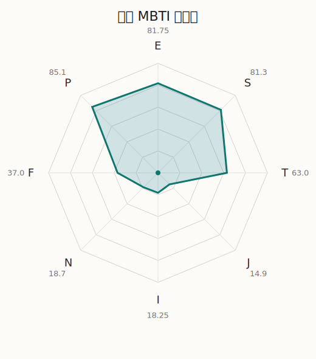

# 日菜 MBTI 类型解释

- 角色名：冰川日菜
- 最终类型：ESTP
- 备选类型：ESFP
- 原始聚合类型：ESTP
- 采样轮次：10
- 主类型稳定度：9/10（90.0%）
- 原始聚合稳定度：9/10（90.0%）
- 置信度：高（55.58）
- 置信度方差：15.8742
- 题库：Open Jungian Type Scales (OJTS v2.1)（48 题）

## 类型概述

ESTP 的整体倾向是：更偏外向行动、现实反应、逻辑处理和即兴应对。

## 人物核心

从外部设定与已整理剧情综合来看，日菜的角色框架可以先理解为：外部角色资料里的日菜是非常典型的天才型角色，聪明、反应快、随性，而且会用“るんっ”来表达自己被点亮的瞬间。她不是不在乎别人，而是常常先从“我觉得有趣吗”出发，再去理解人与事。

## PDB 校核

- 已应用 PDB 主参考：来源 `personality-database.com`。
- 权重分配：PDB 50% / 人设概要 25% / 卡牌剧情 15% / 剧情切片 10%。
- PDB 类型排序：`ESTP`
- 最终类型先按 PDB 最高票定锚：`ESTP`
- 指定锁定类型：`ESTP`
## 为什么是这个类型

- `E > I`（81.75 : 18.25，平均轴差 62.53，方差 89.4749）：更常通过主动互动、公开表达或带动现场来处理问题。
- `S > N`（81.30 : 18.70，平均轴差 55.48，方差 67.6296）：更常依赖现实条件、具体细节和当下经验来判断局面。
- `T > F`（63.00 : 37.00，平均轴差 25.71，方差 272.5602）：更常把逻辑、结构、效率和标准一致性放在判断前列。
- `P > J`（85.10 : 14.90，平均轴差 79.54，方差 100.7394）：更常保留空间，依靠灵活调整和临场变化推进事情。

## 为什么不是备选类型

最接近的备选类型是 `ESFP`。它与主类型 `ESTP` 的差别主要落在 `FT` 这一轴上。
最终仍保留 `T`，因为该轴平均优势还有 `26.00`，虽然会波动，但整体没有被 `F` 反超。虽然也在意关系影响，但最终更常回到逻辑、标准和方法正确性来判断。

## 四维结果

- `EI`：E 81.75 / I 18.25，轴差方差 89.4749
- `SN`：S 81.30 / N 18.70，轴差方差 67.6296
- `FT`：F 37.00 / T 63.00，轴差方差 272.5602
- `JP`：J 14.90 / P 85.10，轴差方差 100.7394

## 八维数据

- `E`：均值 81.75，方差 22.3687
- `S`：均值 81.30，方差 16.9074
- `T`：均值 63.00，方差 77.5166
- `J`：均值 14.90，方差 25.1849
- `I`：均值 18.25，方差 22.3687
- `N`：均值 18.70，方差 16.9074
- `F`：均值 37.00，方差 77.5166
- `P`：均值 85.10，方差 25.1849

## 类型稳定性

- `ESTP`：9 次（90.0%）
- `ESFP`：1 次（10.0%）

## 图表

## 证据依据

- 人物概述：从外部设定与已整理剧情综合来看，日菜的角色框架可以先理解为：外部角色资料里的日菜是非常典型的天才型角色，聪明、反应快、随性，而且会用“るんっ”来表达自己被点亮的瞬间。她不是不在乎别人，而是常常先从“我觉得有趣吗”出发，再去理解人与事。
- 卡牌剧情：在 115 条卡牌剧情里，日菜 的个人篇章补完相对丰富；这部分更适合用来观察角色的私下状态、非主线场合下的关系重心，以及主线之外的稳定人格表现。
- 剧情切片：在已整理的 392 条主线/乐团剧情切片里，日菜同时覆盖主线推进（53）和乐队内部关系（339）两条线。这说明这个角色在本地语料中的位置，不应该只从单句台词去读，而要放回到持续出现的关系链和章节位置里看。

## 模拟作答概览

| 题号 | 题目/两端描述 | 平均作答 | 作答方差 | 平均倾向值 | 倾向方差 |
| --- | --- | --- | --- | --- | --- |
| 1 | I don&lsquo;t like to draw attention to myself. | 1.30 | 0.2100 | -68.47 | 99.2508 |
| 2 | I hate situations where people expect me to be funny. | 1.20 | 0.1600 | -69.46 | 82.7482 |
| 3 | I hold back my opinions. | 1.10 | 0.0900 | -70.73 | 139.1694 |
| 4 | I want a huge social circle. | 3.20 | 0.1600 | 11.76 | 129.3817 |
| 5 | I am the life of the party. | 3.10 | 0.0900 | 7.76 | 120.6343 |
| 6 | I make lots of noise. | 3.10 | 0.0900 | 7.78 | 158.5382 |
| 7 | I avoid philosophical discussions. | 3.20 | 0.1600 | 11.59 | 140.2880 |
| 8 | I don&apos;t like to analyze literature. | 3.20 | 0.1600 | 14.54 | 94.6274 |
| 9 | I am attached to conventional ways. | 3.10 | 0.2900 | 11.70 | 305.6511 |
| 10 | I love to read challenging material. | 1.20 | 0.1600 | -71.47 | 208.1440 |
| 11 | I look for hidden meanings in things. | 1.20 | 0.1600 | -70.89 | 140.5723 |
| 12 | I am curious about everything. | 1.00 | 0.0000 | -76.70 | 18.9276 |
| 13 | I want to experience passion and romance. | 2.20 | 0.1600 | -38.65 | 238.0895 |
| 14 | I am deeply moved by others&lsquo; misfortunes. | 1.70 | 0.2100 | -51.10 | 159.8518 |
| 15 | I listen to my feelings when making important decisions. | 1.80 | 0.1600 | -53.99 | 74.1844 |
| 16 | I prize logic above all else. | 2.70 | 0.2100 | -12.17 | 199.3523 |
| 17 | I don&lsquo;t understand people who get emotional. | 2.80 | 0.1600 | -3.87 | 295.3427 |
| 18 | I&apos;d rather be feared than loved. | 2.70 | 0.2100 | -11.49 | 208.8637 |
| 19 | I like order. | 1.10 | 0.0900 | -81.65 | 130.3306 |
| 20 | I do things according to a plan. | 1.00 | 0.0000 | -81.98 | 86.1939 |
| 21 | I am always prepared. | 1.00 | 0.0000 | -80.80 | 72.1766 |
| 22 | I often make last-minute plans. | 3.30 | 0.2100 | 14.86 | 209.6205 |
| 23 | I do things for no apparent reason. | 3.40 | 0.2400 | 16.42 | 279.6336 |
| 24 | It takes me days to do things that should take hours because I keep getting distracted. | 3.50 | 0.2500 | 21.95 | 286.2518 |
| 25 | I work on improving myself. | 1.00 | 0.0000 | -77.93 | 78.7627 |
| 26 | I always feel like I need to be doing something important. | 1.00 | 0.0000 | -74.88 | 66.9383 |
| 27 | I have unusual beliefs about the world. | 2.30 | 0.2100 | -25.38 | 97.4305 |
| 28 | I dislike routine. | 2.60 | 0.2400 | -25.83 | 176.0540 |
| 29 | I try my best to follow the rules. | 2.00 | 0.2000 | -37.75 | 149.4621 |
| 30 | I respect authority. | 2.00 | 0.2000 | -40.00 | 177.5544 |
| 31 | I like to take it easy. | 3.10 | 0.0900 | 13.02 | 65.4611 |
| 32 | I choose the easy way. | 3.30 | 0.2100 | 16.72 | 201.5423 |
| 33 | I tell other people my secrets. | 2.50 | 0.2500 | -22.36 | 183.3418 |
| 34 | I make big gestures of friendship to people. | 2.50 | 0.2500 | -21.51 | 290.5787 |
| 35 | I enjoy challenges and competition. | 2.90 | 0.0900 | -7.66 | 197.8185 |
| 36 | I have very high self-esteem. | 2.70 | 0.2100 | -11.10 | 103.9641 |
| 37 | I get embarrassed easily. | 1.40 | 0.2400 | -61.70 | 104.3586 |
| 38 | I become overwhelmed by events. | 1.60 | 0.2400 | -58.57 | 74.9307 |
| 39 | I have difficulty expressing my feelings. | 2.00 | 0.2000 | -37.46 | 141.9161 |
| 40 | I don&apos;t trust others easily. | 2.10 | 0.0900 | -35.44 | 153.8770 |
| 41 | skeptical <-> wants to believe | 2.60 | 0.2400 | -16.83 | 223.5587 |
| 42 | chaotic <-> organized | 1.40 | 0.2400 | -61.82 | 133.7843 |
| 43 | wants the big picture <-> wants the details | 3.30 | 0.2100 | 8.66 | 370.3653 |
| 44 | energetic <-> mellow | 1.00 | 0.0000 | -72.83 | 86.5329 |
| 45 | follows the heart <-> follows the head | 3.60 | 0.2400 | 26.77 | 169.7464 |
| 46 | prepares <-> improvises | 5.00 | 0.0000 | 83.38 | 60.5687 |
| 47 | focused on the present <-> focused on the future | 1.40 | 0.2400 | -66.34 | 172.6708 |
| 48 | works best alone <-> works best in groups | 4.00 | 0.0000 | 37.19 | 72.3821 |

## 题库来源

- [OJTS 官方题目页](https://openpsychometrics.org/tests/OJTS/)
- 许可证：CC BY-NC-SA 4.0
- [本地题库文件](../ojts_question_bank_v2_1.json)
