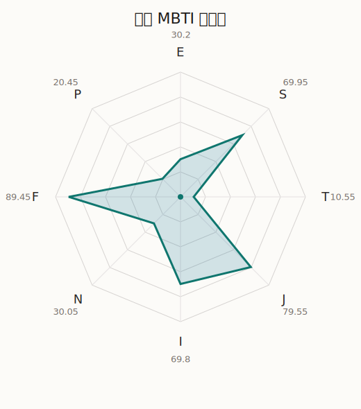

# 花音 MBTI 类型解释

- 角色名：松原花音
- 最终类型：ISFJ
- 备选类型：ESFJ
- 原始聚合类型：ISFJ
- 采样轮次：10
- 主类型稳定度：9/10（90.0%）
- 原始聚合稳定度：9/10（90.0%）
- 置信度：高（54.38）
- 置信度方差：52.6215
- 题库：Open Jungian Type Scales (OJTS v2.1)（48 题）

## 类型概述

ISFJ 的整体倾向是：更偏内在克制、现实关注、情感责任和秩序维持。

## 人物核心

从外部设定与已整理剧情综合来看，花音的角色框架可以先理解为：外部资料里的花音常被写成温柔、容易紧张、看起来最像普通人的成员。她会害怕、会犹豫、会先想象失败，但也正因为如此，她在一群过于强烈的人当中显得尤其有人味和亲近感。

## PDB 校核

- 已应用 PDB 主参考：来源 `personality-database.com`。
- 权重分配：PDB 50% / 人设概要 25% / 卡牌剧情 15% / 剧情切片 10%。
- PDB 类型排序：`ISFJ`
- 最终类型先按 PDB 最高票定锚：`ISFJ`
- 指定锁定类型：`ISFJ`
## 为什么是这个类型

- `I > E`（69.80 : 30.20，平均轴差 30.58，方差 180.7246）：更常先在内部消化，再选择性地向外表达立场。
- `S > N`（69.95 : 30.05，平均轴差 35.78，方差 223.2382）：更常依赖现实条件、具体细节和当下经验来判断局面。
- `F > T`（89.45 : 10.55，平均轴差 74.12，方差 64.2938）：更常把感受、关系、价值和对人的回应放在判断前列。
- `J > P`（79.55 : 20.45，平均轴差 69.54，方差 122.0143）：更常用计划、收束、安排和责任结构去降低混乱。

## 为什么不是备选类型

最接近的备选类型是 `ESFJ`。它与主类型 `ISFJ` 的差别主要落在 `EI` 这一轴上。
最终仍保留 `I`，因为该轴平均优势还有 `39.60`，虽然会波动，但整体没有被 `E` 反超。虽然也会参与群体互动，但资料里更常表现为先内化、后表达的节奏。

## 四维结果

- `EI`：E 30.20 / I 69.80，轴差方差 180.7246
- `SN`：S 69.95 / N 30.05，轴差方差 223.2382
- `FT`：F 89.45 / T 10.55，轴差方差 64.2938
- `JP`：J 79.55 / P 20.45，轴差方差 122.0143

## 八维数据

- `E`：均值 30.20，方差 45.1812
- `S`：均值 69.95，方差 68.9120
- `T`：均值 10.55，方差 16.0734
- `J`：均值 79.55，方差 30.5036
- `I`：均值 69.80，方差 45.1812
- `N`：均值 30.05，方差 68.9120
- `F`：均值 89.45，方差 16.0734
- `P`：均值 20.45，方差 30.5036

## 类型稳定性

- `ISFJ`：9 次（90.0%）
- `INFJ`：1 次（10.0%）

## 图表

## 证据依据

- 人物概述：从外部设定与已整理剧情综合来看，花音的角色框架可以先理解为：外部资料里的花音常被写成温柔、容易紧张、看起来最像普通人的成员。她会害怕、会犹豫、会先想象失败，但也正因为如此，她在一群过于强烈的人当中显得尤其有人味和亲近感。
- 卡牌剧情：在 107 条卡牌剧情里，花音 的个人篇章补完相对丰富；这部分更适合用来观察角色的私下状态、非主线场合下的关系重心，以及主线之外的稳定人格表现。
- 剧情切片：在已整理的 434 条主线/乐团剧情切片里，花音同时覆盖主线推进（50）和乐队内部关系（384）两条线。这说明这个角色在本地语料中的位置，不应该只从单句台词去读，而要放回到持续出现的关系链和章节位置里看。

## 模拟作答概览

| 题号 | 题目/两端描述 | 平均作答 | 作答方差 | 平均倾向值 | 倾向方差 |
| --- | --- | --- | --- | --- | --- |
| 1 | I don&lsquo;t like to draw attention to myself. | 2.70 | 0.2100 | -9.25 | 375.5632 |
| 2 | I hate situations where people expect me to be funny. | 2.70 | 0.2100 | -11.15 | 287.2144 |
| 3 | I hold back my opinions. | 3.00 | 0.0000 | -0.08 | 156.6638 |
| 4 | I want a huge social circle. | 1.80 | 0.1600 | -52.08 | 100.9189 |
| 5 | I am the life of the party. | 1.60 | 0.2400 | -58.05 | 81.7628 |
| 6 | I make lots of noise. | 1.70 | 0.2100 | -56.67 | 89.0194 |
| 7 | I avoid philosophical discussions. | 2.90 | 0.0900 | -4.75 | 205.5391 |
| 8 | I don&apos;t like to analyze literature. | 3.10 | 0.2900 | 2.35 | 242.1347 |
| 9 | I am attached to conventional ways. | 3.00 | 0.2000 | -3.56 | 389.5520 |
| 10 | I love to read challenging material. | 1.60 | 0.4400 | -55.15 | 279.7820 |
| 11 | I look for hidden meanings in things. | 1.70 | 0.4100 | -52.26 | 241.1612 |
| 12 | I am curious about everything. | 1.80 | 0.1600 | -49.76 | 122.9544 |
| 13 | I want to experience passion and romance. | 4.30 | 0.2100 | 56.38 | 111.3128 |
| 14 | I am deeply moved by others&lsquo; misfortunes. | 3.70 | 0.2100 | 29.68 | 176.8355 |
| 15 | I listen to my feelings when making important decisions. | 3.60 | 0.2400 | 30.01 | 256.2740 |
| 16 | I prize logic above all else. | 1.00 | 0.0000 | -85.16 | 84.0742 |
| 17 | I don&lsquo;t understand people who get emotional. | 1.00 | 0.0000 | -88.97 | 28.7591 |
| 18 | I&apos;d rather be feared than loved. | 1.00 | 0.0000 | -88.63 | 58.8927 |
| 19 | I like order. | 4.20 | 0.1600 | 46.68 | 173.5403 |
| 20 | I do things according to a plan. | 4.10 | 0.0900 | 43.57 | 111.4235 |
| 21 | I am always prepared. | 4.10 | 0.2900 | 46.88 | 170.0750 |
| 22 | I often make last-minute plans. | 1.10 | 0.0900 | -74.98 | 171.3133 |
| 23 | I do things for no apparent reason. | 1.00 | 0.0000 | -76.68 | 93.6339 |
| 24 | It takes me days to do things that should take hours because I keep getting distracted. | 1.00 | 0.0000 | -74.89 | 94.8511 |
| 25 | I work on improving myself. | 2.50 | 0.2500 | -21.82 | 328.0517 |
| 26 | I always feel like I need to be doing something important. | 2.60 | 0.2400 | -20.78 | 104.3296 |
| 27 | I have unusual beliefs about the world. | 1.30 | 0.2100 | -66.91 | 153.5078 |
| 28 | I dislike routine. | 1.60 | 0.2400 | -61.60 | 115.7859 |
| 29 | I try my best to follow the rules. | 3.10 | 0.0900 | 8.91 | 142.3737 |
| 30 | I respect authority. | 3.00 | 0.2000 | -2.74 | 221.1428 |
| 31 | I like to take it easy. | 2.00 | 0.0000 | -42.51 | 63.9615 |
| 32 | I choose the easy way. | 2.10 | 0.0900 | -38.32 | 132.7124 |
| 33 | I tell other people my secrets. | 2.90 | 0.0900 | -4.17 | 167.2164 |
| 34 | I make big gestures of friendship to people. | 2.90 | 0.0900 | -12.60 | 71.6821 |
| 35 | I enjoy challenges and competition. | 1.10 | 0.0900 | -70.90 | 135.6303 |
| 36 | I have very high self-esteem. | 1.20 | 0.1600 | -69.02 | 74.1092 |
| 37 | I get embarrassed easily. | 3.20 | 0.1600 | 9.90 | 89.2219 |
| 38 | I become overwhelmed by events. | 3.20 | 0.1600 | 14.94 | 111.1080 |
| 39 | I have difficulty expressing my feelings. | 1.90 | 0.0900 | -48.24 | 67.5737 |
| 40 | I don&apos;t trust others easily. | 2.00 | 0.0000 | -41.80 | 63.4926 |
| 41 | skeptical <-> wants to believe | 4.30 | 0.2100 | 52.96 | 179.6620 |
| 42 | chaotic <-> organized | 4.90 | 0.0900 | 77.16 | 166.3873 |
| 43 | wants the big picture <-> wants the details | 3.10 | 0.2900 | 7.74 | 233.1209 |
| 44 | energetic <-> mellow | 3.60 | 0.2400 | 23.05 | 179.8968 |
| 45 | follows the heart <-> follows the head | 1.60 | 0.2400 | -52.99 | 166.5518 |
| 46 | prepares <-> improvises | 2.00 | 0.4000 | -40.08 | 363.1365 |
| 47 | focused on the present <-> focused on the future | 1.60 | 0.2400 | -54.37 | 100.3421 |
| 48 | works best alone <-> works best in groups | 2.40 | 0.2400 | -24.40 | 100.2564 |

## 题库来源

- [OJTS 官方题目页](https://openpsychometrics.org/tests/OJTS/)
- 许可证：CC BY-NC-SA 4.0
- [本地题库文件](../ojts_question_bank_v2_1.json)
