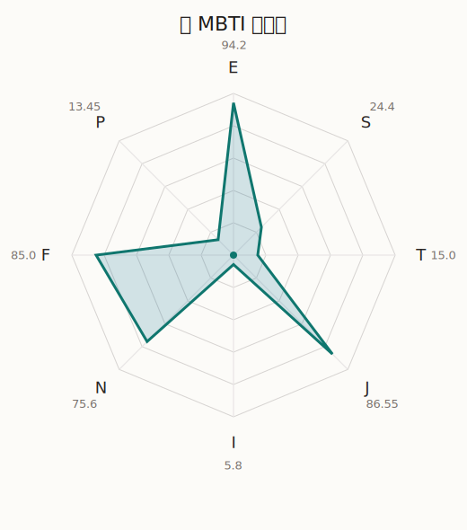

# 薰 MBTI 类型解释

- 角色名：濑田薰
- 最终类型：ENFJ
- 备选类型：ESFJ
- 原始聚合类型：ENFJ
- 采样轮次：10
- 主类型稳定度：10/10（100.0%）
- 原始聚合稳定度：10/10（100.0%）
- 置信度：高（70.68）
- 置信度方差：10.7709
- 题库：Open Jungian Type Scales (OJTS v2.1)（48 题）

## 类型概述

ENFJ 的整体倾向是：更偏外向连接、抽象理解、价值驱动和结构推进。

## 人物核心

从外部设定与已整理剧情综合来看，薰的角色框架可以先理解为：外部资料中的薰通常被写成戏剧化、王子系、擅长说漂亮台词的人，但她并不是空有表演感。她很清楚自己在舞台上应该呈现什么，也愿意用这份表演性去保护别人、哄别人开心。

## PDB 校核

- 已应用 PDB 主参考：来源 `personality-database.com`。
- 权重分配：PDB 50% / 人设概要 25% / 卡牌剧情 15% / 剧情切片 10%。
- PDB 类型排序：`ENFJ`
- 最终类型先按 PDB 最高票定锚：`ENFJ`
- 指定锁定类型：`ENFJ`
## 为什么是这个类型

- `E > I`（94.20 : 5.80，平均轴差 72.15，方差 45.7971）：更常通过主动互动、公开表达或带动现场来处理问题。
- `N > S`（75.60 : 24.40，平均轴差 28.19，方差 69.7077）：更常从意义、可能性、方向感和隐含主题去理解问题。
- `F > T`（85.00 : 15.00，平均轴差 64.92，方差 44.0465）：更常把感受、关系、价值和对人的回应放在判断前列。
- `J > P`（86.55 : 13.45，平均轴差 79.19，方差 9.8997）：更常用计划、收束、安排和责任结构去降低混乱。

## 为什么不是备选类型

最接近的备选类型是 `ESFJ`。它与主类型 `ENFJ` 的差别主要落在 `SN` 这一轴上。
最终仍保留 `N`，因为该轴平均优势还有 `51.20`，虽然会波动，但整体没有被 `S` 反超。虽然也会处理具体事务，但资料里更常从主题、方向和抽象意义去组织理解。

## 四维结果

- `EI`：E 94.20 / I 5.80，轴差方差 45.7971
- `SN`：S 24.40 / N 75.60，轴差方差 69.7077
- `FT`：F 85.00 / T 15.00，轴差方差 44.0465
- `JP`：J 86.55 / P 13.45，轴差方差 9.8997

## 八维数据

- `E`：均值 94.20，方差 11.4493
- `S`：均值 24.40，方差 17.4269
- `T`：均值 15.00，方差 11.0116
- `J`：均值 86.55，方差 2.4749
- `I`：均值 5.80，方差 11.4493
- `N`：均值 75.60，方差 17.4269
- `F`：均值 85.00，方差 11.0116
- `P`：均值 13.45，方差 2.4749

## 类型稳定性

- `ENFJ`：10 次（100.0%）

## 图表

## 证据依据

- 人物概述：从外部设定与已整理剧情综合来看，薰的角色框架可以先理解为：外部资料中的薰通常被写成戏剧化、王子系、擅长说漂亮台词的人，但她并不是空有表演感。她很清楚自己在舞台上应该呈现什么，也愿意用这份表演性去保护别人、哄别人开心。
- 卡牌剧情：在 103 条卡牌剧情里，薰 的个人篇章补完相对丰富；这部分更适合用来观察角色的私下状态、非主线场合下的关系重心，以及主线之外的稳定人格表现。
- 剧情切片：在已整理的 149 条主线/乐团剧情切片里，薰同时覆盖主线推进（27）和乐队内部关系（122）两条线。这说明这个角色在本地语料中的位置，不应该只从单句台词去读，而要放回到持续出现的关系链和章节位置里看。

## 模拟作答概览

| 题号 | 题目/两端描述 | 平均作答 | 作答方差 | 平均倾向值 | 倾向方差 |
| --- | --- | --- | --- | --- | --- |
| 1 | I don&lsquo;t like to draw attention to myself. | 1.00 | 0.0000 | -89.99 | 48.8519 |
| 2 | I hate situations where people expect me to be funny. | 1.00 | 0.0000 | -88.66 | 46.1675 |
| 3 | I hold back my opinions. | 1.00 | 0.0000 | -89.55 | 26.7594 |
| 4 | I want a huge social circle. | 3.70 | 0.2100 | 27.50 | 98.2486 |
| 5 | I am the life of the party. | 3.60 | 0.2400 | 29.19 | 267.8077 |
| 6 | I make lots of noise. | 3.90 | 0.0900 | 35.08 | 108.7708 |
| 7 | I avoid philosophical discussions. | 2.20 | 0.1600 | -34.16 | 185.1577 |
| 8 | I don&apos;t like to analyze literature. | 2.00 | 0.2000 | -35.85 | 345.7288 |
| 9 | I am attached to conventional ways. | 2.10 | 0.0900 | -33.22 | 154.9470 |
| 10 | I love to read challenging material. | 3.20 | 0.1600 | 7.06 | 255.9288 |
| 11 | I look for hidden meanings in things. | 3.10 | 0.0900 | 7.08 | 160.4986 |
| 12 | I am curious about everything. | 3.20 | 0.1600 | 7.47 | 135.4450 |
| 13 | I want to experience passion and romance. | 4.80 | 0.1600 | 70.89 | 218.7603 |
| 14 | I am deeply moved by others&lsquo; misfortunes. | 3.40 | 0.2400 | 21.99 | 169.3566 |
| 15 | I listen to my feelings when making important decisions. | 3.60 | 0.2400 | 20.80 | 142.7908 |
| 16 | I prize logic above all else. | 1.00 | 0.0000 | -81.30 | 105.3605 |
| 17 | I don&lsquo;t understand people who get emotional. | 1.00 | 0.0000 | -79.53 | 103.9513 |
| 18 | I&apos;d rather be feared than loved. | 1.20 | 0.1600 | -81.53 | 210.8992 |
| 19 | I like order. | 4.50 | 0.2500 | 57.04 | 50.9398 |
| 20 | I do things according to a plan. | 4.30 | 0.2100 | 55.93 | 44.5611 |
| 21 | I am always prepared. | 4.20 | 0.1600 | 47.74 | 76.1037 |
| 22 | I often make last-minute plans. | 1.00 | 0.0000 | -84.67 | 70.7455 |
| 23 | I do things for no apparent reason. | 1.00 | 0.0000 | -85.21 | 69.3175 |
| 24 | It takes me days to do things that should take hours because I keep getting distracted. | 1.00 | 0.0000 | -79.39 | 34.9499 |
| 25 | I work on improving myself. | 3.30 | 0.2100 | 16.99 | 138.1144 |
| 26 | I always feel like I need to be doing something important. | 3.30 | 0.2100 | 18.01 | 111.7850 |
| 27 | I have unusual beliefs about the world. | 2.10 | 0.2900 | -39.05 | 217.5323 |
| 28 | I dislike routine. | 2.00 | 0.0000 | -39.84 | 97.2197 |
| 29 | I try my best to follow the rules. | 3.00 | 0.0000 | 7.99 | 66.8718 |
| 30 | I respect authority. | 3.10 | 0.0900 | 9.04 | 235.7295 |
| 31 | I like to take it easy. | 1.10 | 0.0900 | -70.88 | 60.2662 |
| 32 | I choose the easy way. | 1.00 | 0.0000 | -74.95 | 31.3908 |
| 33 | I tell other people my secrets. | 3.60 | 0.2400 | 25.39 | 212.7477 |
| 34 | I make big gestures of friendship to people. | 3.80 | 0.1600 | 28.25 | 208.9980 |
| 35 | I enjoy challenges and competition. | 2.50 | 0.2500 | -22.38 | 108.4757 |
| 36 | I have very high self-esteem. | 2.00 | 0.0000 | -33.73 | 100.2744 |
| 37 | I get embarrassed easily. | 1.90 | 0.0900 | -39.13 | 107.3679 |
| 38 | I become overwhelmed by events. | 2.00 | 0.0000 | -31.69 | 31.9326 |
| 39 | I have difficulty expressing my feelings. | 1.00 | 0.0000 | -83.82 | 37.0629 |
| 40 | I don&apos;t trust others easily. | 1.00 | 0.0000 | -85.23 | 49.6413 |
| 41 | skeptical <-> wants to believe | 4.10 | 0.2900 | 43.01 | 300.4300 |
| 42 | chaotic <-> organized | 5.00 | 0.0000 | 82.59 | 37.2814 |
| 43 | wants the big picture <-> wants the details | 2.00 | 0.0000 | -46.47 | 115.1417 |
| 44 | energetic <-> mellow | 2.00 | 0.2000 | -36.36 | 261.8800 |
| 45 | follows the heart <-> follows the head | 2.10 | 0.0900 | -39.92 | 139.6017 |
| 46 | prepares <-> improvises | 1.80 | 0.1600 | -46.54 | 142.6083 |
| 47 | focused on the present <-> focused on the future | 3.20 | 0.1600 | 7.55 | 260.4965 |
| 48 | works best alone <-> works best in groups | 4.30 | 0.2100 | 52.50 | 91.5188 |

## 题库来源

- [OJTS 官方题目页](https://openpsychometrics.org/tests/OJTS/)
- 许可证：CC BY-NC-SA 4.0
- [本地题库文件](../ojts_question_bank_v2_1.json)
