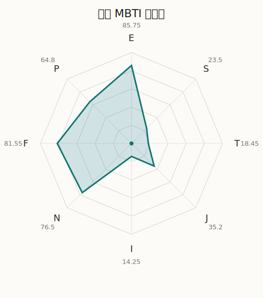

# 香澄 MBTI 类型解释

- 角色名：户山香澄
- 最终类型：ENFP
- 备选类型：ENFJ
- 原始聚合类型：ENFP
- 采样轮次：10
- 主类型稳定度：8/10（80.0%）
- 原始聚合稳定度：8/10（80.0%）
- 置信度：高（54.3）
- 置信度方差：14.9188
- 题库：Open Jungian Type Scales (OJTS v2.1)（48 题）

## 类型概述

ENFP 的整体倾向是：更偏外向连接、抽象探索、价值驱动和开放弹性。

## 人物核心

从外部设定与已整理剧情综合来看，香澄的角色框架可以先理解为：外部角色资料里，香澄一直被写成会被“心动感”和闪闪发亮事物吸引的人。她不是靠精密规划来带队，而是靠直觉、热情和感染力把人拉到同一条轨道上，所以她在 Poppin'Party 里更像持续制造起点的人。

## PDB 校核

- 已应用 PDB 主参考：来源 `personality-database.com`。
- 权重分配：PDB 50% / 人设概要 25% / 卡牌剧情 15% / 剧情切片 10%。
- PDB 类型排序：`ENFP`
- 最终类型先按 PDB 最高票定锚：`ENFP`
- 指定锁定类型：`ENFP`
## 为什么是这个类型

- `E > I`（85.75 : 14.25，平均轴差 69.89，方差 76.4291）：更常通过主动互动、公开表达或带动现场来处理问题。
- `N > S`（76.50 : 23.50，平均轴差 50.14，方差 98.1625）：更常从意义、可能性、方向感和隐含主题去理解问题。
- `F > T`（81.55 : 18.45，平均轴差 54.34，方差 60.9898）：更常把感受、关系、价值和对人的回应放在判断前列。
- `P > J`（64.80 : 35.20，平均轴差 20.94，方差 252.2778）：更常保留空间，依靠灵活调整和临场变化推进事情。

## 为什么不是备选类型

最接近的备选类型是 `ENFJ`。它与主类型 `ENFP` 的差别主要落在 `JP` 这一轴上。
最终仍保留 `P`，因为该轴平均优势还有 `29.60`，虽然会波动，但整体没有被 `J` 反超。虽然并非完全无计划，但整体仍更偏向保留余地、即兴调整和开放推进。

## 四维结果

- `EI`：E 85.75 / I 14.25，轴差方差 76.4291
- `SN`：S 23.50 / N 76.50，轴差方差 98.1625
- `FT`：F 81.55 / T 18.45，轴差方差 60.9898
- `JP`：J 35.20 / P 64.80，轴差方差 252.2778

## 八维数据

- `E`：均值 85.75，方差 19.1073
- `S`：均值 23.50，方差 24.5406
- `T`：均值 18.45，方差 15.2475
- `J`：均值 35.20，方差 63.0695
- `I`：均值 14.25，方差 19.1073
- `N`：均值 76.50，方差 24.5406
- `F`：均值 81.55，方差 15.2475
- `P`：均值 64.80，方差 63.0695

## 类型稳定性

- `ENFP`：8 次（80.0%）
- `ENFJ`：2 次（20.0%）

## 图表

## 证据依据

- 人物概述：从外部设定与已整理剧情综合来看，香澄的角色框架可以先理解为：外部角色资料里，香澄一直被写成会被“心动感”和闪闪发亮事物吸引的人。她不是靠精密规划来带队，而是靠直觉、热情和感染力把人拉到同一条轨道上，所以她在 Poppin'Party 里更像持续制造起点的人。
- 卡牌剧情：在 109 条卡牌剧情里，香澄 的个人篇章补完相对丰富；这部分更适合用来观察角色的私下状态、非主线场合下的关系重心，以及主线之外的稳定人格表现。
- 剧情切片：在已整理的 1011 条主线/乐团剧情切片里，香澄同时覆盖主线推进（241）和乐队内部关系（770）两条线。这说明这个角色在本地语料中的位置，不应该只从单句台词去读，而要放回到持续出现的关系链和章节位置里看。

## 模拟作答概览

| 题号 | 题目/两端描述 | 平均作答 | 作答方差 | 平均倾向值 | 倾向方差 |
| --- | --- | --- | --- | --- | --- |
| 1 | I don&lsquo;t like to draw attention to myself. | 1.00 | 0.0000 | -85.31 | 81.7057 |
| 2 | I hate situations where people expect me to be funny. | 1.00 | 0.0000 | -84.78 | 70.1117 |
| 3 | I hold back my opinions. | 1.00 | 0.0000 | -86.74 | 47.7218 |
| 4 | I want a huge social circle. | 3.80 | 0.1600 | 30.49 | 165.3263 |
| 5 | I am the life of the party. | 3.40 | 0.2400 | 19.27 | 74.2244 |
| 6 | I make lots of noise. | 3.40 | 0.2400 | 16.82 | 191.9476 |
| 7 | I avoid philosophical discussions. | 1.20 | 0.1600 | -68.76 | 64.5155 |
| 8 | I don&apos;t like to analyze literature. | 1.40 | 0.2400 | -63.55 | 83.7653 |
| 9 | I am attached to conventional ways. | 1.40 | 0.2400 | -61.57 | 92.9580 |
| 10 | I love to read challenging material. | 2.90 | 0.0900 | -0.90 | 223.2300 |
| 11 | I look for hidden meanings in things. | 3.20 | 0.1600 | 5.38 | 135.7949 |
| 12 | I am curious about everything. | 3.10 | 0.0900 | 7.56 | 344.5849 |
| 13 | I want to experience passion and romance. | 3.30 | 0.2100 | 13.82 | 208.9296 |
| 14 | I am deeply moved by others&lsquo; misfortunes. | 3.20 | 0.1600 | 9.90 | 292.0473 |
| 15 | I listen to my feelings when making important decisions. | 3.20 | 0.1600 | 11.20 | 199.4993 |
| 16 | I prize logic above all else. | 1.20 | 0.1600 | -67.91 | 105.5042 |
| 17 | I don&lsquo;t understand people who get emotional. | 1.10 | 0.0900 | -72.51 | 45.6159 |
| 18 | I&apos;d rather be feared than loved. | 1.10 | 0.0900 | -72.56 | 119.9698 |
| 19 | I like order. | 2.50 | 0.2500 | -21.17 | 194.2837 |
| 20 | I do things according to a plan. | 2.30 | 0.2100 | -26.48 | 108.6861 |
| 21 | I am always prepared. | 2.30 | 0.2100 | -28.49 | 161.4936 |
| 22 | I often make last-minute plans. | 3.20 | 0.3600 | 3.75 | 373.8853 |
| 23 | I do things for no apparent reason. | 3.10 | 0.4900 | 3.98 | 496.6769 |
| 24 | It takes me days to do things that should take hours because I keep getting distracted. | 3.00 | 0.2000 | 3.07 | 371.2379 |
| 25 | I work on improving myself. | 2.30 | 0.2100 | -27.41 | 191.7851 |
| 26 | I always feel like I need to be doing something important. | 2.50 | 0.2500 | -19.62 | 381.3597 |
| 27 | I have unusual beliefs about the world. | 2.90 | 0.0900 | 0.37 | 207.4270 |
| 28 | I dislike routine. | 3.20 | 0.1600 | 4.18 | 287.0926 |
| 29 | I try my best to follow the rules. | 1.20 | 0.1600 | -63.65 | 100.2981 |
| 30 | I respect authority. | 1.50 | 0.2500 | -60.76 | 113.2712 |
| 31 | I like to take it easy. | 2.20 | 0.1600 | -32.06 | 194.4874 |
| 32 | I choose the easy way. | 2.20 | 0.1600 | -31.48 | 165.8343 |
| 33 | I tell other people my secrets. | 3.40 | 0.2400 | 15.29 | 255.0327 |
| 34 | I make big gestures of friendship to people. | 3.20 | 0.3600 | 8.75 | 222.5083 |
| 35 | I enjoy challenges and competition. | 2.60 | 0.2400 | -22.62 | 117.5105 |
| 36 | I have very high self-esteem. | 2.50 | 0.2500 | -24.19 | 118.1961 |
| 37 | I get embarrassed easily. | 1.90 | 0.2900 | -40.89 | 278.2612 |
| 38 | I become overwhelmed by events. | 2.10 | 0.0900 | -31.46 | 140.3771 |
| 39 | I have difficulty expressing my feelings. | 1.10 | 0.0900 | -78.31 | 107.4256 |
| 40 | I don&apos;t trust others easily. | 1.00 | 0.0000 | -81.80 | 45.0375 |
| 41 | skeptical <-> wants to believe | 4.00 | 0.0000 | 42.13 | 96.9202 |
| 42 | chaotic <-> organized | 3.30 | 0.4100 | 14.00 | 317.4693 |
| 43 | wants the big picture <-> wants the details | 1.20 | 0.1600 | -68.60 | 130.7691 |
| 44 | energetic <-> mellow | 1.90 | 0.0900 | -46.51 | 99.8111 |
| 45 | follows the heart <-> follows the head | 2.10 | 0.0900 | -41.38 | 162.8381 |
| 46 | prepares <-> improvises | 3.70 | 0.2100 | 29.39 | 128.7426 |
| 47 | focused on the present <-> focused on the future | 3.00 | 0.0000 | 2.63 | 19.3778 |
| 48 | works best alone <-> works best in groups | 4.20 | 0.1600 | 47.80 | 111.9165 |

## 题库来源

- [OJTS 官方题目页](https://openpsychometrics.org/tests/OJTS/)
- 许可证：CC BY-NC-SA 4.0
- [本地题库文件](../ojts_question_bank_v2_1.json)
