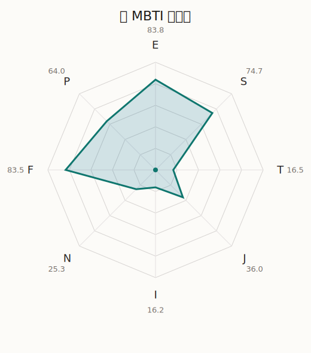

# 心 MBTI 类型解释

- 角色名：弦卷心
- 最终类型：ESFP
- 备选类型：ESFJ
- 原始聚合类型：ESFP
- 采样轮次：10
- 主类型稳定度：7/10（70.0%）
- 原始聚合稳定度：7/10（70.0%）
- 置信度：高（53.0）
- 置信度方差：25.9099
- 题库：Open Jungian Type Scales (OJTS v2.1)（48 题）

## 类型概述

ESFP 的整体倾向是：更偏外向体验、现实感受、情感表达和即兴行动。

## 人物核心

从外部设定与已整理剧情综合来看，心的角色框架可以先理解为：外部角色资料里的心是 Hello, Happy World! 最彻底的中心人物，她把“让全世界都露出笑容”当成几乎不可动摇的行动原则。她的设定看起来像夸张喜剧角色，但真正支撑她的其实是非常强的善意与执行力。

## PDB 校核

- 已应用 PDB 主参考：来源 `personality-database.com`。
- 权重分配：PDB 50% / 人设概要 25% / 卡牌剧情 15% / 剧情切片 10%。
- PDB 类型排序：`ESFP`
- 最终类型先按 PDB 最高票定锚：`ESFP`
- 指定锁定类型：`ESFP`
## 为什么是这个类型

- `E > I`（83.80 : 16.20，平均轴差 71.94，方差 70.5416）：更常通过主动互动、公开表达或带动现场来处理问题。
- `S > N`（74.70 : 25.30，平均轴差 56.76，方差 206.3972）：更常依赖现实条件、具体细节和当下经验来判断局面。
- `F > T`（83.50 : 16.50，平均轴差 57.83，方差 113.5731）：更常把感受、关系、价值和对人的回应放在判断前列。
- `P > J`（64.00 : 36.00，平均轴差 18.20，方差 75.4099）：更常保留空间，依靠灵活调整和临场变化推进事情。

## 为什么不是备选类型

最接近的备选类型是 `ESFJ`。它与主类型 `ESFP` 的差别主要落在 `JP` 这一轴上。
最终仍保留 `P`，因为该轴平均优势还有 `28.00`，虽然会波动，但整体没有被 `J` 反超。虽然并非完全无计划，但整体仍更偏向保留余地、即兴调整和开放推进。

## 四维结果

- `EI`：E 83.80 / I 16.20，轴差方差 70.5416
- `SN`：S 74.70 / N 25.30，轴差方差 206.3972
- `FT`：F 83.50 / T 16.50，轴差方差 113.5731
- `JP`：J 36.00 / P 64.00，轴差方差 75.4099

## 八维数据

- `E`：均值 83.80，方差 17.6354
- `S`：均值 74.70，方差 51.5993
- `T`：均值 16.50，方差 28.3933
- `J`：均值 36.00，方差 65.0781
- `I`：均值 16.20，方差 17.6354
- `N`：均值 25.30，方差 51.5993
- `F`：均值 83.50，方差 28.3933
- `P`：均值 64.00，方差 65.0781

## 类型稳定性

- `ESFP`：7 次（70.0%）
- `ESFJ`：3 次（30.0%）

## 图表

## 证据依据

- 人物概述：从外部设定与已整理剧情综合来看，心的角色框架可以先理解为：外部角色资料里的心是 Hello, Happy World! 最彻底的中心人物，她把“让全世界都露出笑容”当成几乎不可动摇的行动原则。她的设定看起来像夸张喜剧角色，但真正支撑她的其实是非常强的善意与执行力。
- 卡牌剧情：在 102 条卡牌剧情里，心 的个人篇章补完相对丰富；这部分更适合用来观察角色的私下状态、非主线场合下的关系重心，以及主线之外的稳定人格表现。
- 剧情切片：在已整理的 511 条主线/乐团剧情切片里，心同时覆盖主线推进（76）和乐队内部关系（435）两条线。这说明这个角色在本地语料中的位置，不应该只从单句台词去读，而要放回到持续出现的关系链和章节位置里看。

## 模拟作答概览

| 题号 | 题目/两端描述 | 平均作答 | 作答方差 | 平均倾向值 | 倾向方差 |
| --- | --- | --- | --- | --- | --- |
| 1 | I don&lsquo;t like to draw attention to myself. | 1.00 | 0.0000 | -85.32 | 81.9175 |
| 2 | I hate situations where people expect me to be funny. | 1.00 | 0.0000 | -86.01 | 57.5140 |
| 3 | I hold back my opinions. | 1.00 | 0.0000 | -87.11 | 47.8081 |
| 4 | I want a huge social circle. | 3.40 | 0.2400 | 21.34 | 244.2403 |
| 5 | I am the life of the party. | 3.50 | 0.2500 | 24.06 | 230.9679 |
| 6 | I make lots of noise. | 3.50 | 0.2500 | 24.56 | 181.7337 |
| 7 | I avoid philosophical discussions. | 3.00 | 0.0000 | 5.02 | 137.6175 |
| 8 | I don&apos;t like to analyze literature. | 3.10 | 0.0900 | 3.15 | 91.5855 |
| 9 | I am attached to conventional ways. | 2.80 | 0.3600 | -0.45 | 396.4870 |
| 10 | I love to read challenging material. | 1.20 | 0.1600 | -67.75 | 200.3780 |
| 11 | I look for hidden meanings in things. | 1.40 | 0.2400 | -64.43 | 61.8575 |
| 12 | I am curious about everything. | 1.20 | 0.1600 | -67.73 | 167.2110 |
| 13 | I want to experience passion and romance. | 3.30 | 0.2100 | 15.89 | 131.4185 |
| 14 | I am deeply moved by others&lsquo; misfortunes. | 3.20 | 0.1600 | 7.50 | 129.9540 |
| 15 | I listen to my feelings when making important decisions. | 3.60 | 0.2400 | 22.48 | 196.6178 |
| 16 | I prize logic above all else. | 1.10 | 0.0900 | -75.08 | 123.2069 |
| 17 | I don&lsquo;t understand people who get emotional. | 1.00 | 0.0000 | -78.67 | 104.0517 |
| 18 | I&apos;d rather be feared than loved. | 1.10 | 0.0900 | -75.58 | 102.6359 |
| 19 | I like order. | 1.80 | 0.3600 | -49.13 | 319.5963 |
| 20 | I do things according to a plan. | 1.90 | 0.2900 | -45.02 | 310.9570 |
| 21 | I am always prepared. | 2.00 | 0.0000 | -44.23 | 115.8103 |
| 22 | I often make last-minute plans. | 2.50 | 0.2500 | -20.86 | 245.9279 |
| 23 | I do things for no apparent reason. | 2.60 | 0.2400 | -16.70 | 342.2034 |
| 24 | It takes me days to do things that should take hours because I keep getting distracted. | 2.80 | 0.1600 | -13.16 | 291.4777 |
| 25 | I work on improving myself. | 1.70 | 0.2100 | -56.34 | 109.3927 |
| 26 | I always feel like I need to be doing something important. | 1.50 | 0.2500 | -59.77 | 94.4282 |
| 27 | I have unusual beliefs about the world. | 2.00 | 0.0000 | -39.60 | 37.7413 |
| 28 | I dislike routine. | 1.90 | 0.0900 | -45.51 | 134.0126 |
| 29 | I try my best to follow the rules. | 2.40 | 0.2400 | -30.35 | 152.3698 |
| 30 | I respect authority. | 2.70 | 0.2100 | -19.03 | 217.3524 |
| 31 | I like to take it easy. | 2.80 | 0.3600 | -5.83 | 303.4019 |
| 32 | I choose the easy way. | 2.90 | 0.0900 | -1.63 | 138.8790 |
| 33 | I tell other people my secrets. | 3.20 | 0.1600 | 12.65 | 269.1192 |
| 34 | I make big gestures of friendship to people. | 3.50 | 0.2500 | 17.46 | 206.2525 |
| 35 | I enjoy challenges and competition. | 2.50 | 0.2500 | -23.76 | 168.3362 |
| 36 | I have very high self-esteem. | 2.50 | 0.2500 | -22.79 | 222.8392 |
| 37 | I get embarrassed easily. | 1.90 | 0.0900 | -40.86 | 123.6008 |
| 38 | I become overwhelmed by events. | 2.10 | 0.0900 | -37.45 | 113.7489 |
| 39 | I have difficulty expressing my feelings. | 1.10 | 0.0900 | -78.97 | 118.2803 |
| 40 | I don&apos;t trust others easily. | 1.00 | 0.0000 | -83.98 | 41.3446 |
| 41 | skeptical <-> wants to believe | 4.00 | 0.2000 | 41.20 | 204.2549 |
| 42 | chaotic <-> organized | 3.60 | 0.2400 | 25.32 | 272.8718 |
| 43 | wants the big picture <-> wants the details | 3.70 | 0.2100 | 27.21 | 64.0142 |
| 44 | energetic <-> mellow | 1.50 | 0.2500 | -55.91 | 142.8951 |
| 45 | follows the heart <-> follows the head | 2.00 | 0.0000 | -43.24 | 80.7842 |
| 46 | prepares <-> improvises | 3.40 | 0.2400 | 17.21 | 215.2246 |
| 47 | focused on the present <-> focused on the future | 1.20 | 0.1600 | -66.85 | 43.2120 |
| 48 | works best alone <-> works best in groups | 4.10 | 0.0900 | 49.51 | 63.0466 |

## 题库来源

- [OJTS 官方题目页](https://openpsychometrics.org/tests/OJTS/)
- 许可证：CC BY-NC-SA 4.0
- [本地题库文件](../ojts_question_bank_v2_1.json)
