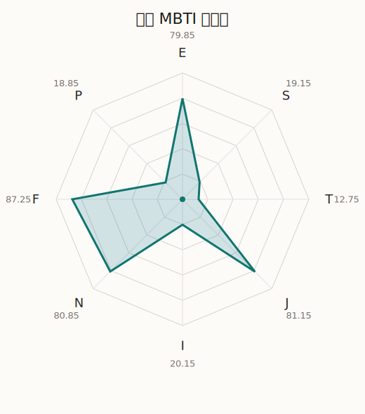

# 莉莎 MBTI 类型解释

- 角色名：今井莉莎
- 最终类型：ENFJ
- 备选类型：INFJ
- 原始聚合类型：ENFJ
- 采样轮次：10
- 主类型稳定度：10/10（100.0%）
- 原始聚合稳定度：10/10（100.0%）
- 置信度：高（64.55）
- 置信度方差：25.8029
- 题库：Open Jungian Type Scales (OJTS v2.1)（48 题）

## 类型概述

ENFJ 的整体倾向是：更偏外向连接、抽象理解、价值驱动和结构推进。

## 人物核心

从外部设定与已整理剧情综合来看，莉莎的角色框架可以先理解为：外部角色页里的莉莎常被写成时尚、开朗、亲和力很强，同时也是 Roselia 里最会顾及他人心情的人。她的存在让这个高压、高标准的乐队不至于只剩锋利，而多了一层能让人靠近的温度。

## PDB 校核

- 已应用 PDB 主参考：来源 `personality-database.com`。
- 权重分配：PDB 50% / 人设概要 25% / 卡牌剧情 15% / 剧情切片 10%。
- PDB 类型排序：`ENFJ`
- 最终类型先按 PDB 最高票定锚：`ENFJ`
- 指定锁定类型：`ENFJ`
## 为什么是这个类型

- `E > I`（79.85 : 20.15，平均轴差 46.08，方差 114.7311）：更常通过主动互动、公开表达或带动现场来处理问题。
- `N > S`（80.85 : 19.15，平均轴差 63.24，方差 80.9728）：更常从意义、可能性、方向感和隐含主题去理解问题。
- `F > T`（87.25 : 12.75，平均轴差 62.74，方差 52.5962）：更常把感受、关系、价值和对人的回应放在判断前列。
- `J > P`（81.15 : 18.85，平均轴差 67.87，方差 105.1594）：更常用计划、收束、安排和责任结构去降低混乱。

## 为什么不是备选类型

最接近的备选类型是 `INFJ`。它与主类型 `ENFJ` 的差别主要落在 `EI` 这一轴上。
最终仍保留 `E`，因为该轴平均优势还有 `59.70`，虽然会波动，但整体没有被 `I` 反超。虽然也存在保留和内化的一面，但资料里更常出现主动带动关系与公开表达的处理方式。

## 四维结果

- `EI`：E 79.85 / I 20.15，轴差方差 114.7311
- `SN`：S 19.15 / N 80.85，轴差方差 80.9728
- `FT`：F 87.25 / T 12.75，轴差方差 52.5962
- `JP`：J 81.15 / P 18.85，轴差方差 105.1594

## 八维数据

- `E`：均值 79.85，方差 28.6828
- `S`：均值 19.15，方差 20.2432
- `T`：均值 12.75，方差 13.1490
- `J`：均值 81.15，方差 26.2899
- `I`：均值 20.15，方差 28.6828
- `N`：均值 80.85，方差 20.2432
- `F`：均值 87.25，方差 13.1490
- `P`：均值 18.85，方差 26.2899

## 类型稳定性

- `ENFJ`：10 次（100.0%）

## 图表

## 证据依据

- 人物概述：从外部设定与已整理剧情综合来看，莉莎的角色框架可以先理解为：外部角色页里的莉莎常被写成时尚、开朗、亲和力很强，同时也是 Roselia 里最会顾及他人心情的人。她的存在让这个高压、高标准的乐队不至于只剩锋利，而多了一层能让人靠近的温度。
- 卡牌剧情：在 112 条卡牌剧情里，莉莎 的个人篇章补完相对丰富；这部分更适合用来观察角色的私下状态、非主线场合下的关系重心，以及主线之外的稳定人格表现。
- 剧情切片：在已整理的 449 条主线/乐团剧情切片里，莉莎同时覆盖主线推进（62）和乐队内部关系（387）两条线。这说明这个角色在本地语料中的位置，不应该只从单句台词去读，而要放回到持续出现的关系链和章节位置里看。

## 模拟作答概览

| 题号 | 题目/两端描述 | 平均作答 | 作答方差 | 平均倾向值 | 倾向方差 |
| --- | --- | --- | --- | --- | --- |
| 1 | I don&lsquo;t like to draw attention to myself. | 1.50 | 0.2500 | -63.01 | 76.7149 |
| 2 | I hate situations where people expect me to be funny. | 1.40 | 0.2400 | -61.07 | 57.0577 |
| 3 | I hold back my opinions. | 1.20 | 0.1600 | -66.34 | 182.7186 |
| 4 | I want a huge social circle. | 3.10 | 0.0900 | 5.75 | 109.7938 |
| 5 | I am the life of the party. | 3.10 | 0.2900 | 2.80 | 419.7190 |
| 6 | I make lots of noise. | 3.10 | 0.0900 | 9.75 | 93.6051 |
| 7 | I avoid philosophical discussions. | 1.10 | 0.0900 | -75.89 | 157.1530 |
| 8 | I don&apos;t like to analyze literature. | 1.00 | 0.0000 | -74.80 | 44.6946 |
| 9 | I am attached to conventional ways. | 1.00 | 0.0000 | -76.83 | 73.7484 |
| 10 | I love to read challenging material. | 3.30 | 0.4100 | 10.38 | 322.3060 |
| 11 | I look for hidden meanings in things. | 3.50 | 0.2500 | 22.36 | 181.9502 |
| 12 | I am curious about everything. | 3.00 | 0.0000 | 6.67 | 81.5305 |
| 13 | I want to experience passion and romance. | 3.30 | 0.2100 | 15.82 | 272.5740 |
| 14 | I am deeply moved by others&lsquo; misfortunes. | 3.20 | 0.1600 | 19.15 | 57.8730 |
| 15 | I listen to my feelings when making important decisions. | 3.60 | 0.4400 | 24.66 | 233.2742 |
| 16 | I prize logic above all else. | 1.00 | 0.0000 | -81.24 | 74.0265 |
| 17 | I don&lsquo;t understand people who get emotional. | 1.20 | 0.1600 | -76.20 | 111.0646 |
| 18 | I&apos;d rather be feared than loved. | 1.00 | 0.0000 | -75.56 | 68.0691 |
| 19 | I like order. | 3.50 | 0.2500 | 23.75 | 283.1627 |
| 20 | I do things according to a plan. | 3.40 | 0.2400 | 15.23 | 477.5342 |
| 21 | I am always prepared. | 3.30 | 0.2100 | 14.48 | 186.1970 |
| 22 | I often make last-minute plans. | 1.00 | 0.0000 | -78.02 | 69.6007 |
| 23 | I do things for no apparent reason. | 1.20 | 0.1600 | -72.98 | 151.1906 |
| 24 | It takes me days to do things that should take hours because I keep getting distracted. | 1.20 | 0.1600 | -73.01 | 181.5852 |
| 25 | I work on improving myself. | 3.30 | 0.2100 | 15.04 | 223.6534 |
| 26 | I always feel like I need to be doing something important. | 3.30 | 0.2100 | 11.19 | 133.1321 |
| 27 | I have unusual beliefs about the world. | 2.40 | 0.2400 | -25.73 | 125.6916 |
| 28 | I dislike routine. | 2.30 | 0.2100 | -30.61 | 151.0237 |
| 29 | I try my best to follow the rules. | 2.30 | 0.2100 | -28.84 | 96.8568 |
| 30 | I respect authority. | 2.40 | 0.2400 | -29.09 | 252.9058 |
| 31 | I like to take it easy. | 1.00 | 0.0000 | -80.91 | 22.4817 |
| 32 | I choose the easy way. | 1.10 | 0.0900 | -74.43 | 148.9873 |
| 33 | I tell other people my secrets. | 3.20 | 0.1600 | 8.83 | 125.8007 |
| 34 | I make big gestures of friendship to people. | 3.20 | 0.1600 | 15.64 | 134.7392 |
| 35 | I enjoy challenges and competition. | 2.10 | 0.0900 | -35.93 | 134.7151 |
| 36 | I have very high self-esteem. | 2.20 | 0.1600 | -30.83 | 120.7086 |
| 37 | I get embarrassed easily. | 2.10 | 0.0900 | -31.51 | 122.3965 |
| 38 | I become overwhelmed by events. | 2.50 | 0.2500 | -24.81 | 283.8144 |
| 39 | I have difficulty expressing my feelings. | 1.00 | 0.0000 | -71.24 | 43.9975 |
| 40 | I don&apos;t trust others easily. | 1.10 | 0.0900 | -75.34 | 83.3230 |
| 41 | skeptical <-> wants to believe | 4.10 | 0.0900 | 45.41 | 143.1668 |
| 42 | chaotic <-> organized | 4.90 | 0.0900 | 74.46 | 72.8662 |
| 43 | wants the big picture <-> wants the details | 1.00 | 0.0000 | -77.93 | 57.8765 |
| 44 | energetic <-> mellow | 2.50 | 0.2500 | -23.05 | 151.7806 |
| 45 | follows the heart <-> follows the head | 2.10 | 0.0900 | -43.90 | 177.6593 |
| 46 | prepares <-> improvises | 1.80 | 0.1600 | -50.11 | 139.5392 |
| 47 | focused on the present <-> focused on the future | 3.30 | 0.2100 | 16.24 | 93.8459 |
| 48 | works best alone <-> works best in groups | 3.60 | 0.2400 | 28.58 | 126.8777 |

## 题库来源

- [OJTS 官方题目页](https://openpsychometrics.org/tests/OJTS/)
- 许可证：CC BY-NC-SA 4.0
- [本地题库文件](../ojts_question_bank_v2_1.json)
