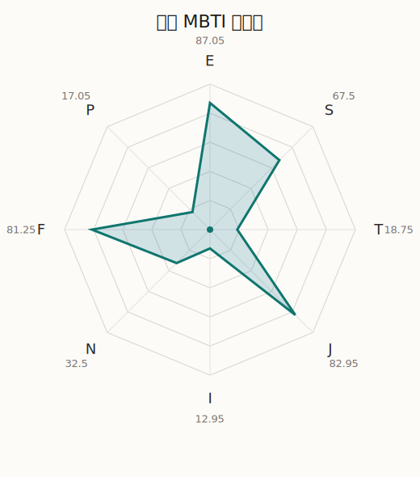

# 真奈 MBTI 类型解释

- 角色名：鹈泽真奈
- 最终类型：ESFJ
- 备选类型：ENFJ
- 原始聚合类型：ESFJ
- 采样轮次：10
- 主类型稳定度：10/10（100.0%）
- 原始聚合稳定度：10/10（100.0%）
- 置信度：高（59.38）
- 置信度方差：19.8796
- 题库：Open Jungian Type Scales (OJTS v2.1)（48 题）

## 类型概述

ESFJ 的整体倾向是：更偏外向关系、现实执行、情感照料和稳定组织。

## 人物核心

从外部设定与已整理剧情综合来看，真奈的角色框架可以先理解为：真奈在现有本地语料里出场较少，但官方角色介绍其实给了一个很清晰的定位：她是和初华一起活动的偶像组合 `sumimi` 成员，性格天真烂漫，靠元气笑容收获人气，而且喜欢甜甜圈。这个设定决定了她在整体叙事里的作用并不是阴郁型核心人物，而是初华“明亮舞台身份”的重要组成部分。

## PDB 校核

- 已应用 PDB 主参考：来源 `personality-database.com`。
- 权重分配：PDB 50% / 人设概要 25% / 卡牌剧情 15% / 剧情切片 10%。
- PDB 类型排序：`ESFJ`
- 最终类型先按 PDB 最高票定锚：`ESFJ`
- 指定锁定类型：`ESFJ`
## 为什么是这个类型

- `E > I`（87.05 : 12.95，平均轴差 80.53，方差 28.2207）：更常通过主动互动、公开表达或带动现场来处理问题。
- `S > N`（67.50 : 32.50，平均轴差 23.80，方差 169.0540）：更常依赖现实条件、具体细节和当下经验来判断局面。
- `F > T`（81.25 : 18.75，平均轴差 44.84，方差 128.7510）：更常把感受、关系、价值和对人的回应放在判断前列。
- `J > P`（82.95 : 17.05，平均轴差 75.40，方差 65.2105）：更常用计划、收束、安排和责任结构去降低混乱。

## 为什么不是备选类型

最接近的备选类型是 `ENFJ`。它与主类型 `ESFJ` 的差别主要落在 `SN` 这一轴上。
最终仍保留 `S`，因为该轴平均优势还有 `35.00`，虽然会波动，但整体没有被 `N` 反超。虽然也会谈到意义和理想，但资料里更常落到现实条件、细节和可执行层面。

## 四维结果

- `EI`：E 87.05 / I 12.95，轴差方差 28.2207
- `SN`：S 67.50 / N 32.50，轴差方差 169.0540
- `FT`：F 81.25 / T 18.75，轴差方差 128.7510
- `JP`：J 82.95 / P 17.05，轴差方差 65.2105

## 八维数据

- `E`：均值 87.05，方差 7.0552
- `S`：均值 67.50，方差 42.2635
- `T`：均值 18.75，方差 32.1878
- `J`：均值 82.95，方差 16.3026
- `I`：均值 12.95，方差 7.0552
- `N`：均值 32.50，方差 42.2635
- `F`：均值 81.25，方差 32.1878
- `P`：均值 17.05，方差 16.3026

## 类型稳定性

- `ESFJ`：10 次（100.0%）

## 图表

## 证据依据

- 人物概述：从外部设定与已整理剧情综合来看，真奈的角色框架可以先理解为：真奈在现有本地语料里出场较少，但官方角色介绍其实给了一个很清晰的定位：她是和初华一起活动的偶像组合 `sumimi` 成员，性格天真烂漫，靠元气笑容收获人气，而且喜欢甜甜圈。这个设定决定了她在整体叙事里的作用并不是阴郁型核心人物，而是初华“明亮舞台身份”的重要组成部分。
- 卡牌剧情：当前没有归到该角色名下的卡牌剧情，因此暂时无法从私人篇章、节庆篇章或回忆篇章里继续补正人物侧面。
- 剧情切片：在已整理的 1 条主线/乐团剧情切片里，真奈目前更集中在乐队内部与团内关系剧情（1）。这说明这个角色在本地语料中的位置，不应该只从单句台词去读，而要放回到持续出现的关系链和章节位置里看。

## 模拟作答概览

| 题号 | 题目/两端描述 | 平均作答 | 作答方差 | 平均倾向值 | 倾向方差 |
| --- | --- | --- | --- | --- | --- |
| 1 | I don&lsquo;t like to draw attention to myself. | 1.00 | 0.0000 | -86.57 | 93.4860 |
| 2 | I hate situations where people expect me to be funny. | 1.00 | 0.0000 | -85.20 | 59.6919 |
| 3 | I hold back my opinions. | 1.00 | 0.0000 | -86.25 | 54.6490 |
| 4 | I want a huge social circle. | 4.30 | 0.2100 | 52.20 | 161.7359 |
| 5 | I am the life of the party. | 4.30 | 0.2100 | 53.04 | 80.2669 |
| 6 | I make lots of noise. | 4.40 | 0.2400 | 56.00 | 93.3915 |
| 7 | I avoid philosophical discussions. | 3.60 | 0.2400 | 22.65 | 420.1455 |
| 8 | I don&apos;t like to analyze literature. | 3.40 | 0.2400 | 20.98 | 196.7634 |
| 9 | I am attached to conventional ways. | 3.70 | 0.2100 | 26.03 | 242.3711 |
| 10 | I love to read challenging material. | 2.50 | 0.2500 | -17.64 | 228.0183 |
| 11 | I look for hidden meanings in things. | 2.40 | 0.2400 | -21.91 | 245.7927 |
| 12 | I am curious about everything. | 2.30 | 0.2100 | -25.58 | 409.6898 |
| 13 | I want to experience passion and romance. | 4.00 | 0.2000 | 45.17 | 252.9156 |
| 14 | I am deeply moved by others&lsquo; misfortunes. | 4.00 | 0.2000 | 40.48 | 207.8222 |
| 15 | I listen to my feelings when making important decisions. | 3.90 | 0.0900 | 42.59 | 123.3843 |
| 16 | I prize logic above all else. | 1.90 | 0.2900 | -45.19 | 290.6844 |
| 17 | I don&lsquo;t understand people who get emotional. | 1.80 | 0.1600 | -47.58 | 158.1497 |
| 18 | I&apos;d rather be feared than loved. | 1.90 | 0.4900 | -43.09 | 320.8078 |
| 19 | I like order. | 4.20 | 0.3600 | 46.93 | 345.8719 |
| 20 | I do things according to a plan. | 4.30 | 0.2100 | 50.19 | 192.3212 |
| 21 | I am always prepared. | 4.30 | 0.2100 | 51.49 | 109.0560 |
| 22 | I often make last-minute plans. | 1.00 | 0.0000 | -80.27 | 114.1735 |
| 23 | I do things for no apparent reason. | 1.10 | 0.0900 | -77.59 | 165.1044 |
| 24 | It takes me days to do things that should take hours because I keep getting distracted. | 1.30 | 0.2100 | -77.86 | 200.0544 |
| 25 | I work on improving myself. | 3.30 | 0.2100 | 14.00 | 107.3103 |
| 26 | I always feel like I need to be doing something important. | 3.50 | 0.2500 | 19.76 | 239.7742 |
| 27 | I have unusual beliefs about the world. | 1.10 | 0.0900 | -68.68 | 55.5082 |
| 28 | I dislike routine. | 1.30 | 0.2100 | -63.15 | 95.2728 |
| 29 | I try my best to follow the rules. | 4.00 | 0.0000 | 39.79 | 84.4498 |
| 30 | I respect authority. | 4.00 | 0.0000 | 39.75 | 102.2116 |
| 31 | I like to take it easy. | 2.20 | 0.1600 | -38.74 | 268.6677 |
| 32 | I choose the easy way. | 2.10 | 0.0900 | -43.95 | 161.1157 |
| 33 | I tell other people my secrets. | 4.40 | 0.2400 | 54.42 | 92.7002 |
| 34 | I make big gestures of friendship to people. | 4.20 | 0.1600 | 55.02 | 91.7402 |
| 35 | I enjoy challenges and competition. | 3.00 | 0.0000 | 0.65 | 123.1096 |
| 36 | I have very high self-esteem. | 3.10 | 0.0900 | 3.38 | 151.5950 |
| 37 | I get embarrassed easily. | 2.20 | 0.1600 | -30.32 | 80.7032 |
| 38 | I become overwhelmed by events. | 2.10 | 0.0900 | -34.30 | 100.2031 |
| 39 | I have difficulty expressing my feelings. | 1.00 | 0.0000 | -77.13 | 38.9128 |
| 40 | I don&apos;t trust others easily. | 1.00 | 0.0000 | -78.09 | 88.9482 |
| 41 | skeptical <-> wants to believe | 3.80 | 0.1600 | 38.04 | 174.7679 |
| 42 | chaotic <-> organized | 5.00 | 0.0000 | 83.62 | 123.1423 |
| 43 | wants the big picture <-> wants the details | 2.80 | 0.3600 | -11.92 | 226.0184 |
| 44 | energetic <-> mellow | 1.00 | 0.0000 | -91.23 | 78.9134 |
| 45 | follows the heart <-> follows the head | 2.10 | 0.2900 | -36.80 | 222.8118 |
| 46 | prepares <-> improvises | 1.80 | 0.1600 | -52.20 | 124.8077 |
| 47 | focused on the present <-> focused on the future | 2.20 | 0.1600 | -33.03 | 86.2218 |
| 48 | works best alone <-> works best in groups | 4.30 | 0.2100 | 49.43 | 143.2719 |

## 题库来源

- [OJTS 官方题目页](https://openpsychometrics.org/tests/OJTS/)
- 许可证：CC BY-NC-SA 4.0
- [本地题库文件](../ojts_question_bank_v2_1.json)
