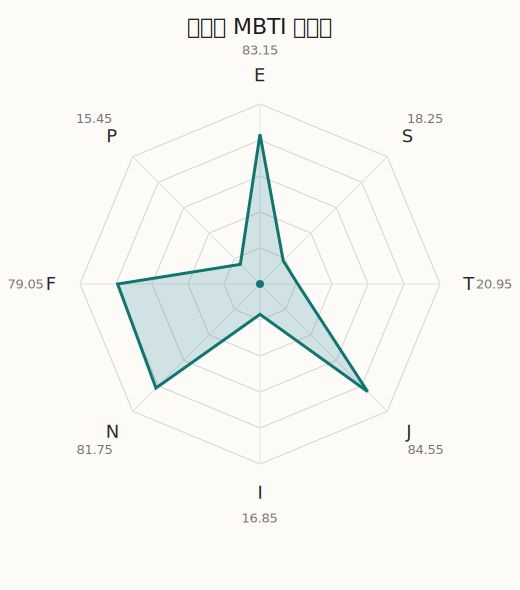

# 麻里奈 MBTI 类型解释

- 角色名：月岛麻里奈
- 最终类型：ENFJ
- 备选类型：ENTJ
- 原始聚合类型：ENFJ
- 采样轮次：10
- 主类型稳定度：10/10（100.0%）
- 原始聚合稳定度：10/10（100.0%）
- 置信度：高（64.25）
- 置信度方差：24.7671
- 题库：Open Jungian Type Scales (OJTS v2.1)（48 题）

## 类型概述

ENFJ 的整体倾向是：更偏外向连接、抽象理解、价值驱动和结构推进。

## 人物核心

从外部设定与已整理剧情综合来看，麻里奈的角色框架可以先理解为：当前尚未补入该角色的外部设定补充，因此这里只能更多依赖本地剧情切片与卡牌剧情来做保守整理。

## PDB 校核

- 已应用 PDB 主参考：来源 `personality-database.com`。
- 权重分配：PDB 50% / 人设概要 25% / 卡牌剧情 15% / 剧情切片 10%。
- PDB 类型排序：`ENFJ`
- 最终类型先按 PDB 最高票定锚：`ENFJ`
- 指定锁定类型：`ENFJ`
## 为什么是这个类型

- `E > I`（83.15 : 16.85，平均轴差 73.31，方差 73.3484）：更常通过主动互动、公开表达或带动现场来处理问题。
- `N > S`（81.75 : 18.25，平均轴差 59.09，方差 79.7296）：更常从意义、可能性、方向感和隐含主题去理解问题。
- `F > T`（79.05 : 20.95，平均轴差 50.99，方差 148.1115）：更常把感受、关系、价值和对人的回应放在判断前列。
- `J > P`（84.55 : 15.45，平均轴差 72.53，方差 41.9431）：更常用计划、收束、安排和责任结构去降低混乱。

## 为什么不是备选类型

最接近的备选类型是 `ENTJ`。它与主类型 `ENFJ` 的差别主要落在 `FT` 这一轴上。
最终仍保留 `F`，因为该轴平均优势还有 `58.10`，虽然会波动，但整体没有被 `T` 反超。虽然也会讲原则与方法，但最终更常回到价值、关系和感受后果来判断。

## 四维结果

- `EI`：E 83.15 / I 16.85，轴差方差 73.3484
- `SN`：S 18.25 / N 81.75，轴差方差 79.7296
- `FT`：F 79.05 / T 20.95，轴差方差 148.1115
- `JP`：J 84.55 / P 15.45，轴差方差 41.9431

## 八维数据

- `E`：均值 83.15，方差 18.3371
- `S`：均值 18.25，方差 19.9324
- `T`：均值 20.95，方差 37.0279
- `J`：均值 84.55，方差 10.4858
- `I`：均值 16.85，方差 18.3371
- `N`：均值 81.75，方差 19.9324
- `F`：均值 79.05，方差 37.0279
- `P`：均值 15.45，方差 10.4858

## 类型稳定性

- `ENFJ`：10 次（100.0%）

## 图表

## 证据依据

- 人物概述：从外部设定与已整理剧情综合来看，麻里奈的角色框架可以先理解为：当前尚未补入该角色的外部设定补充，因此这里只能更多依赖本地剧情切片与卡牌剧情来做保守整理。
- 卡牌剧情：当前没有归到该角色名下的卡牌剧情，因此暂时无法从私人篇章、节庆篇章或回忆篇章里继续补正人物侧面。
- 剧情切片：在已整理的 149 条主线/乐团剧情切片里，麻里奈同时覆盖主线推进（98）和乐队内部关系（51）两条线。这说明这个角色在本地语料中的位置，不应该只从单句台词去读，而要放回到持续出现的关系链和章节位置里看。

## 模拟作答概览

| 题号 | 题目/两端描述 | 平均作答 | 作答方差 | 平均倾向值 | 倾向方差 |
| --- | --- | --- | --- | --- | --- |
| 1 | I don&lsquo;t like to draw attention to myself. | 1.10 | 0.0900 | -70.95 | 115.2905 |
| 2 | I hate situations where people expect me to be funny. | 1.30 | 0.2100 | -71.52 | 96.5098 |
| 3 | I hold back my opinions. | 1.00 | 0.0000 | -72.81 | 51.1911 |
| 4 | I want a huge social circle. | 3.90 | 0.0900 | 43.95 | 176.1027 |
| 5 | I am the life of the party. | 4.00 | 0.0000 | 41.87 | 88.7361 |
| 6 | I make lots of noise. | 4.10 | 0.0900 | 45.83 | 124.4000 |
| 7 | I avoid philosophical discussions. | 1.10 | 0.0900 | -77.00 | 144.2409 |
| 8 | I don&apos;t like to analyze literature. | 1.10 | 0.0900 | -76.40 | 153.2225 |
| 9 | I am attached to conventional ways. | 1.00 | 0.0000 | -76.63 | 99.9497 |
| 10 | I love to read challenging material. | 3.30 | 0.2100 | 13.97 | 200.8252 |
| 11 | I look for hidden meanings in things. | 3.50 | 0.2500 | 20.84 | 149.3580 |
| 12 | I am curious about everything. | 3.40 | 0.2400 | 18.60 | 247.0924 |
| 13 | I want to experience passion and romance. | 3.30 | 0.2100 | 8.98 | 214.0903 |
| 14 | I am deeply moved by others&lsquo; misfortunes. | 3.30 | 0.2100 | 7.72 | 341.8332 |
| 15 | I listen to my feelings when making important decisions. | 3.30 | 0.4100 | 7.95 | 393.8660 |
| 16 | I prize logic above all else. | 1.20 | 0.1600 | -67.82 | 98.4200 |
| 17 | I don&lsquo;t understand people who get emotional. | 1.60 | 0.2400 | -58.41 | 165.7004 |
| 18 | I&apos;d rather be feared than loved. | 1.20 | 0.1600 | -65.87 | 62.5511 |
| 19 | I like order. | 4.30 | 0.2100 | 47.84 | 179.9956 |
| 20 | I do things according to a plan. | 4.00 | 0.2000 | 44.37 | 176.3802 |
| 21 | I am always prepared. | 4.20 | 0.1600 | 50.93 | 77.4903 |
| 22 | I often make last-minute plans. | 1.00 | 0.0000 | -77.87 | 82.8910 |
| 23 | I do things for no apparent reason. | 1.10 | 0.0900 | -75.59 | 93.2216 |
| 24 | It takes me days to do things that should take hours because I keep getting distracted. | 1.00 | 0.0000 | -80.52 | 79.6282 |
| 25 | I work on improving myself. | 3.40 | 0.2400 | 18.80 | 170.0052 |
| 26 | I always feel like I need to be doing something important. | 3.40 | 0.2400 | 20.59 | 287.9414 |
| 27 | I have unusual beliefs about the world. | 2.30 | 0.2100 | -30.57 | 100.9240 |
| 28 | I dislike routine. | 2.30 | 0.2100 | -25.81 | 82.4228 |
| 29 | I try my best to follow the rules. | 2.40 | 0.2400 | -25.21 | 60.2623 |
| 30 | I respect authority. | 2.10 | 0.0900 | -35.32 | 90.2976 |
| 31 | I like to take it easy. | 1.10 | 0.0900 | -78.78 | 67.2720 |
| 32 | I choose the easy way. | 1.00 | 0.0000 | -78.02 | 38.7991 |
| 33 | I tell other people my secrets. | 3.20 | 0.1600 | 15.34 | 53.1593 |
| 34 | I make big gestures of friendship to people. | 3.20 | 0.1600 | 11.45 | 106.0757 |
| 35 | I enjoy challenges and competition. | 2.40 | 0.2400 | -23.42 | 191.9493 |
| 36 | I have very high self-esteem. | 2.50 | 0.2500 | -25.43 | 89.9427 |
| 37 | I get embarrassed easily. | 2.10 | 0.0900 | -34.02 | 77.0155 |
| 38 | I become overwhelmed by events. | 2.00 | 0.2000 | -34.73 | 214.2756 |
| 39 | I have difficulty expressing my feelings. | 1.00 | 0.0000 | -69.85 | 29.3281 |
| 40 | I don&apos;t trust others easily. | 1.10 | 0.0900 | -70.39 | 52.9003 |
| 41 | skeptical <-> wants to believe | 3.90 | 0.0900 | 33.61 | 152.6426 |
| 42 | chaotic <-> organized | 5.00 | 0.0000 | 80.44 | 90.3749 |
| 43 | wants the big picture <-> wants the details | 1.60 | 0.2400 | -58.81 | 49.2766 |
| 44 | energetic <-> mellow | 1.00 | 0.0000 | -76.91 | 79.3071 |
| 45 | follows the heart <-> follows the head | 2.10 | 0.0900 | -33.59 | 156.4778 |
| 46 | prepares <-> improvises | 2.00 | 0.0000 | -42.84 | 78.6934 |
| 47 | focused on the present <-> focused on the future | 3.20 | 0.1600 | 8.84 | 114.3680 |
| 48 | works best alone <-> works best in groups | 4.00 | 0.2000 | 38.73 | 134.2510 |

## 题库来源

- [OJTS 官方题目页](https://openpsychometrics.org/tests/OJTS/)
- 许可证：CC BY-NC-SA 4.0
- [本地题库文件](../ojts_question_bank_v2_1.json)
