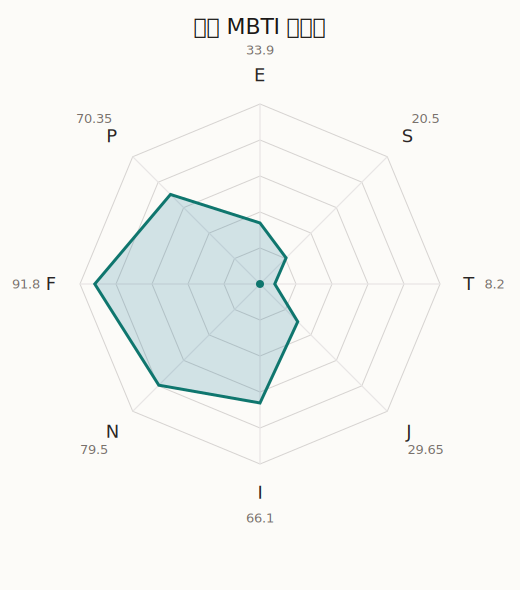

# 真白 MBTI 类型解释

- 角色名：仓田真白
- 最终类型：INFP
- 备选类型：ENFP
- 原始聚合类型：INFP
- 采样轮次：10
- 主类型稳定度：8/10（80.0%）
- 原始聚合稳定度：8/10（80.0%）
- 置信度：高（53.88）
- 置信度方差：39.5406
- 题库：Open Jungian Type Scales (OJTS v2.1)（48 题）

## 类型概述

INFP 的整体倾向是：更偏内在感受、抽象意义、价值驱动和开放探索。

## 人物核心

从外部设定与已整理剧情综合来看，真白的角色框架可以先理解为：外部资料里的真白通常被写成内向、想象力丰富、容易沉进自己世界的女孩。她的歌词和表达常带有空想感，这并不是脱离现实，而是她理解现实、消化情绪的重要方式。

## PDB 校核

- 已应用 PDB 主参考：来源 `personality-database.com`。
- 权重分配：PDB 50% / 人设概要 25% / 卡牌剧情 15% / 剧情切片 10%。
- PDB 类型排序：`INFP`
- 最终类型先按 PDB 最高票定锚：`INFP`
- 指定锁定类型：`INFP`
## 为什么是这个类型

- `I > E`（66.10 : 33.90，平均轴差 26.14，方差 211.1088）：更常先在内部消化，再选择性地向外表达立场。
- `N > S`（79.50 : 20.50，平均轴差 37.07，方差 140.5836）：更常从意义、可能性、方向感和隐含主题去理解问题。
- `F > T`（91.80 : 8.20，平均轴差 71.02，方差 56.3345）：更常把感受、关系、价值和对人的回应放在判断前列。
- `P > J`（70.35 : 29.65，平均轴差 15.59，方差 105.7276）：更常保留空间，依靠灵活调整和临场变化推进事情。

## 为什么不是备选类型

最接近的备选类型是 `ENFP`。它与主类型 `INFP` 的差别主要落在 `EI` 这一轴上。
最终仍保留 `I`，因为该轴平均优势还有 `32.20`，虽然会波动，但整体没有被 `E` 反超。虽然也会参与群体互动，但资料里更常表现为先内化、后表达的节奏。

## 四维结果

- `EI`：E 33.90 / I 66.10，轴差方差 211.1088
- `SN`：S 20.50 / N 79.50，轴差方差 140.5836
- `FT`：F 91.80 / T 8.20，轴差方差 56.3345
- `JP`：J 29.65 / P 70.35，轴差方差 105.7276

## 八维数据

- `E`：均值 33.90，方差 52.7772
- `S`：均值 20.50，方差 35.1459
- `T`：均值 8.20，方差 14.0836
- `J`：均值 29.65，方差 45.4984
- `I`：均值 66.10，方差 52.7772
- `N`：均值 79.50，方差 35.1459
- `F`：均值 91.80，方差 14.0836
- `P`：均值 70.35，方差 45.4984

## 类型稳定性

- `INFP`：8 次（80.0%）
- `ENFJ`：1 次（10.0%）
- `INFJ`：1 次（10.0%）

## 图表

## 证据依据

- 人物概述：从外部设定与已整理剧情综合来看，真白的角色框架可以先理解为：外部资料里的真白通常被写成内向、想象力丰富、容易沉进自己世界的女孩。她的歌词和表达常带有空想感，这并不是脱离现实，而是她理解现实、消化情绪的重要方式。
- 卡牌剧情：在 65 条卡牌剧情里，真白 的个人篇章补完相对丰富；这部分更适合用来观察角色的私下状态、非主线场合下的关系重心，以及主线之外的稳定人格表现。
- 剧情切片：在已整理的 223 条主线/乐团剧情切片里，真白同时覆盖主线推进（37）和乐队内部关系（186）两条线。这说明这个角色在本地语料中的位置，不应该只从单句台词去读，而要放回到持续出现的关系链和章节位置里看。

## 模拟作答概览

| 题号 | 题目/两端描述 | 平均作答 | 作答方差 | 平均倾向值 | 倾向方差 |
| --- | --- | --- | --- | --- | --- |
| 1 | I don&lsquo;t like to draw attention to myself. | 2.90 | 0.0900 | -0.01 | 224.1353 |
| 2 | I hate situations where people expect me to be funny. | 2.90 | 0.2900 | -8.89 | 432.7635 |
| 3 | I hold back my opinions. | 2.70 | 0.2100 | -8.09 | 307.5935 |
| 4 | I want a huge social circle. | 1.50 | 0.2500 | -57.85 | 71.4570 |
| 5 | I am the life of the party. | 1.70 | 0.2100 | -51.98 | 185.6809 |
| 6 | I make lots of noise. | 1.70 | 0.2100 | -48.79 | 105.4411 |
| 7 | I avoid philosophical discussions. | 2.00 | 0.4000 | -43.27 | 267.5416 |
| 8 | I don&apos;t like to analyze literature. | 2.00 | 0.4000 | -42.66 | 289.1179 |
| 9 | I am attached to conventional ways. | 1.90 | 0.0900 | -39.72 | 133.0265 |
| 10 | I love to read challenging material. | 3.30 | 0.2100 | 11.19 | 258.8796 |
| 11 | I look for hidden meanings in things. | 3.50 | 0.2500 | 16.05 | 273.1250 |
| 12 | I am curious about everything. | 3.30 | 0.2100 | 17.12 | 231.9930 |
| 13 | I want to experience passion and romance. | 3.70 | 0.2100 | 30.50 | 149.6187 |
| 14 | I am deeply moved by others&lsquo; misfortunes. | 3.80 | 0.1600 | 25.55 | 132.0546 |
| 15 | I listen to my feelings when making important decisions. | 3.60 | 0.2400 | 28.21 | 148.2503 |
| 16 | I prize logic above all else. | 1.00 | 0.0000 | -93.79 | 15.9260 |
| 17 | I don&lsquo;t understand people who get emotional. | 1.00 | 0.0000 | -92.64 | 31.8928 |
| 18 | I&apos;d rather be feared than loved. | 1.00 | 0.0000 | -89.40 | 51.1355 |
| 19 | I like order. | 2.60 | 0.2400 | -23.68 | 264.2541 |
| 20 | I do things according to a plan. | 2.40 | 0.2400 | -26.02 | 141.1948 |
| 21 | I am always prepared. | 2.30 | 0.2100 | -35.02 | 243.6673 |
| 22 | I often make last-minute plans. | 2.90 | 0.0900 | 5.86 | 160.5256 |
| 23 | I do things for no apparent reason. | 2.90 | 0.0900 | -0.48 | 192.9024 |
| 24 | It takes me days to do things that should take hours because I keep getting distracted. | 3.00 | 0.0000 | -1.54 | 132.0920 |
| 25 | I work on improving myself. | 2.70 | 0.2100 | -19.75 | 178.1897 |
| 26 | I always feel like I need to be doing something important. | 2.30 | 0.2100 | -23.74 | 165.7086 |
| 27 | I have unusual beliefs about the world. | 3.20 | 0.1600 | 6.46 | 254.0882 |
| 28 | I dislike routine. | 3.10 | 0.0900 | 4.74 | 273.9152 |
| 29 | I try my best to follow the rules. | 2.20 | 0.1600 | -35.00 | 157.9642 |
| 30 | I respect authority. | 2.40 | 0.2400 | -28.85 | 167.6135 |
| 31 | I like to take it easy. | 2.00 | 0.0000 | -40.16 | 45.4701 |
| 32 | I choose the easy way. | 2.20 | 0.1600 | -32.17 | 151.2446 |
| 33 | I tell other people my secrets. | 2.80 | 0.1600 | -10.15 | 144.0903 |
| 34 | I make big gestures of friendship to people. | 2.70 | 0.2100 | -12.26 | 305.2567 |
| 35 | I enjoy challenges and competition. | 1.10 | 0.0900 | -74.66 | 65.3559 |
| 36 | I have very high self-esteem. | 1.00 | 0.0000 | -78.69 | 74.4620 |
| 37 | I get embarrassed easily. | 3.20 | 0.3600 | 11.54 | 225.8893 |
| 38 | I become overwhelmed by events. | 3.20 | 0.1600 | 10.54 | 149.4161 |
| 39 | I have difficulty expressing my feelings. | 1.70 | 0.2100 | -49.12 | 180.2299 |
| 40 | I don&apos;t trust others easily. | 2.00 | 0.0000 | -44.90 | 46.4867 |
| 41 | skeptical <-> wants to believe | 3.40 | 0.2400 | 20.65 | 186.8395 |
| 42 | chaotic <-> organized | 2.90 | 0.2900 | 2.74 | 487.4648 |
| 43 | wants the big picture <-> wants the details | 1.20 | 0.1600 | -75.46 | 125.1968 |
| 44 | energetic <-> mellow | 2.60 | 0.2400 | -13.94 | 211.2956 |
| 45 | follows the heart <-> follows the head | 1.30 | 0.2100 | -59.62 | 157.1155 |
| 46 | prepares <-> improvises | 3.60 | 0.2400 | 23.76 | 154.8853 |
| 47 | focused on the present <-> focused on the future | 3.40 | 0.2400 | 16.87 | 361.3650 |
| 48 | works best alone <-> works best in groups | 2.40 | 0.2400 | -20.13 | 324.6265 |

## 题库来源

- [OJTS 官方题目页](https://openpsychometrics.org/tests/OJTS/)
- 许可证：CC BY-NC-SA 4.0
- [本地题库文件](../ojts_question_bank_v2_1.json)
