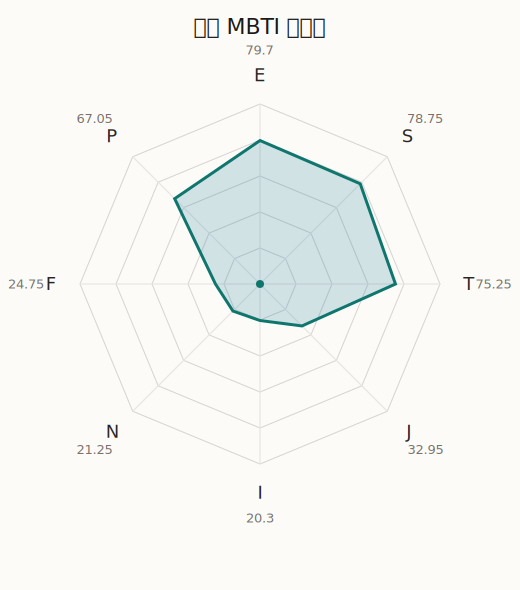

# 益木 MBTI 类型解释

- 角色名：佐藤益木
- 最终类型：ESTP
- 备选类型：ESTJ
- 原始聚合类型：ESTP
- 采样轮次：10
- 主类型稳定度：8/10（80.0%）
- 原始聚合稳定度：8/10（80.0%）
- 置信度：高（50.38）
- 置信度方差：35.6862
- 题库：Open Jungian Type Scales (OJTS v2.1)（48 题）

## 类型概述

ESTP 的整体倾向是：更偏外向行动、现实反应、逻辑处理和即兴应对。

## 人物核心

从外部设定与已整理剧情综合来看，益木的角色框架可以先理解为：外部角色介绍里的真纪通常给人强势、豪爽、压迫感十足的第一印象，但她实际上非常重感情，也很讲义气。她的粗暴感更像一种直接而不会掩饰的表达方式，而不是对人真正冷酷。

## PDB 校核

- 已应用 PDB 主参考：来源 `personality-database.com`。
- 权重分配：PDB 50% / 人设概要 25% / 卡牌剧情 15% / 剧情切片 10%。
- PDB 类型排序：`ESTP`
- 最终类型先按 PDB 最高票定锚：`ESTP`
- 指定锁定类型：`ESTP`
## 为什么是这个类型

- `E > I`（79.70 : 20.30，平均轴差 58.35，方差 100.1387）：更常通过主动互动、公开表达或带动现场来处理问题。
- `S > N`（78.75 : 21.25，平均轴差 48.31，方差 196.8537）：更常依赖现实条件、具体细节和当下经验来判断局面。
- `T > F`（75.25 : 24.75，平均轴差 40.62，方差 177.3068）：更常把逻辑、结构、效率和标准一致性放在判断前列。
- `P > J`（67.05 : 32.95，平均轴差 17.27，方差 80.0780）：更常保留空间，依靠灵活调整和临场变化推进事情。

## 为什么不是备选类型

最接近的备选类型是 `ESTJ`。它与主类型 `ESTP` 的差别主要落在 `JP` 这一轴上。
最终仍保留 `P`，因为该轴平均优势还有 `34.10`，虽然会波动，但整体没有被 `J` 反超。虽然并非完全无计划，但整体仍更偏向保留余地、即兴调整和开放推进。

## 四维结果

- `EI`：E 79.70 / I 20.30，轴差方差 100.1387
- `SN`：S 78.75 / N 21.25，轴差方差 196.8537
- `FT`：F 24.75 / T 75.25，轴差方差 177.3068
- `JP`：J 32.95 / P 67.05，轴差方差 80.0780

## 八维数据

- `E`：均值 79.70，方差 25.0347
- `S`：均值 78.75，方差 49.2134
- `T`：均值 75.25，方差 44.3267
- `J`：均值 32.95，方差 60.0436
- `I`：均值 20.30，方差 25.0347
- `N`：均值 21.25，方差 49.2134
- `F`：均值 24.75，方差 44.3267
- `P`：均值 67.05，方差 60.0436

## 类型稳定性

- `ESTP`：8 次（80.0%）
- `ESTJ`：2 次（20.0%）

## 图表

## 证据依据

- 人物概述：从外部设定与已整理剧情综合来看，益木的角色框架可以先理解为：外部角色介绍里的真纪通常给人强势、豪爽、压迫感十足的第一印象，但她实际上非常重感情，也很讲义气。她的粗暴感更像一种直接而不会掩饰的表达方式，而不是对人真正冷酷。
- 卡牌剧情：在 56 条卡牌剧情里，益木 的个人篇章补完相对丰富；这部分更适合用来观察角色的私下状态、非主线场合下的关系重心，以及主线之外的稳定人格表现。
- 剧情切片：在已整理的 164 条主线/乐团剧情切片里，益木同时覆盖主线推进（16）和乐队内部关系（148）两条线。这说明这个角色在本地语料中的位置，不应该只从单句台词去读，而要放回到持续出现的关系链和章节位置里看。

## 模拟作答概览

| 题号 | 题目/两端描述 | 平均作答 | 作答方差 | 平均倾向值 | 倾向方差 |
| --- | --- | --- | --- | --- | --- |
| 1 | I don&lsquo;t like to draw attention to myself. | 1.20 | 0.1600 | -74.61 | 97.8974 |
| 2 | I hate situations where people expect me to be funny. | 1.10 | 0.0900 | -76.25 | 87.5981 |
| 3 | I hold back my opinions. | 1.30 | 0.2100 | -72.43 | 141.5529 |
| 4 | I want a huge social circle. | 3.20 | 0.1600 | 12.01 | 104.1575 |
| 5 | I am the life of the party. | 3.30 | 0.2100 | 10.29 | 272.7928 |
| 6 | I make lots of noise. | 3.30 | 0.2100 | 10.92 | 126.6101 |
| 7 | I avoid philosophical discussions. | 3.90 | 0.2900 | 38.66 | 332.0076 |
| 8 | I don&apos;t like to analyze literature. | 4.00 | 0.2000 | 37.00 | 153.2476 |
| 9 | I am attached to conventional ways. | 4.10 | 0.2900 | 42.42 | 288.7678 |
| 10 | I love to read challenging material. | 1.20 | 0.1600 | -69.11 | 131.7101 |
| 11 | I look for hidden meanings in things. | 1.30 | 0.2100 | -64.01 | 155.0056 |
| 12 | I am curious about everything. | 1.20 | 0.1600 | -68.29 | 52.8686 |
| 13 | I want to experience passion and romance. | 1.40 | 0.2400 | -65.44 | 147.0433 |
| 14 | I am deeply moved by others&lsquo; misfortunes. | 1.40 | 0.2400 | -62.20 | 132.9149 |
| 15 | I listen to my feelings when making important decisions. | 1.50 | 0.2500 | -60.98 | 110.9358 |
| 16 | I prize logic above all else. | 3.00 | 0.0000 | -3.10 | 80.3611 |
| 17 | I don&lsquo;t understand people who get emotional. | 3.00 | 0.2000 | -1.83 | 211.2838 |
| 18 | I&apos;d rather be feared than loved. | 3.20 | 0.1600 | 3.56 | 218.4755 |
| 19 | I like order. | 2.40 | 0.2400 | -26.62 | 445.3203 |
| 20 | I do things according to a plan. | 2.20 | 0.3600 | -31.00 | 516.8493 |
| 21 | I am always prepared. | 2.40 | 0.2400 | -25.13 | 343.1657 |
| 22 | I often make last-minute plans. | 2.70 | 0.2100 | -10.96 | 365.6441 |
| 23 | I do things for no apparent reason. | 2.90 | 0.2900 | -8.77 | 281.0896 |
| 24 | It takes me days to do things that should take hours because I keep getting distracted. | 3.00 | 0.2000 | -2.19 | 357.7841 |
| 25 | I work on improving myself. | 1.50 | 0.2500 | -61.69 | 170.3581 |
| 26 | I always feel like I need to be doing something important. | 1.60 | 0.2400 | -60.04 | 130.1181 |
| 27 | I have unusual beliefs about the world. | 2.20 | 0.1600 | -33.24 | 97.2891 |
| 28 | I dislike routine. | 2.40 | 0.2400 | -33.27 | 204.6571 |
| 29 | I try my best to follow the rules. | 3.20 | 0.1600 | 12.46 | 193.1316 |
| 30 | I respect authority. | 3.00 | 0.0000 | -2.00 | 202.5917 |
| 31 | I like to take it easy. | 3.00 | 0.2000 | 3.54 | 250.4789 |
| 32 | I choose the easy way. | 3.20 | 0.1600 | 1.81 | 423.5604 |
| 33 | I tell other people my secrets. | 2.60 | 0.2400 | -20.41 | 122.0973 |
| 34 | I make big gestures of friendship to people. | 2.40 | 0.2400 | -22.77 | 156.3361 |
| 35 | I enjoy challenges and competition. | 3.00 | 0.0000 | 2.76 | 146.4896 |
| 36 | I have very high self-esteem. | 2.90 | 0.0900 | 2.97 | 149.8820 |
| 37 | I get embarrassed easily. | 1.30 | 0.2100 | -63.61 | 71.3884 |
| 38 | I become overwhelmed by events. | 1.20 | 0.1600 | -66.27 | 44.1284 |
| 39 | I have difficulty expressing my feelings. | 2.20 | 0.1600 | -32.06 | 93.9862 |
| 40 | I don&apos;t trust others easily. | 2.00 | 0.0000 | -43.22 | 72.7368 |
| 41 | skeptical <-> wants to believe | 2.20 | 0.1600 | -23.89 | 131.4709 |
| 42 | chaotic <-> organized | 3.30 | 0.2100 | 13.54 | 389.0118 |
| 43 | wants the big picture <-> wants the details | 2.70 | 0.2100 | -4.71 | 256.3314 |
| 44 | energetic <-> mellow | 2.00 | 0.0000 | -40.55 | 71.5308 |
| 45 | follows the heart <-> follows the head | 3.50 | 0.2500 | 24.14 | 110.4717 |
| 46 | prepares <-> improvises | 3.50 | 0.2500 | 26.36 | 240.1768 |
| 47 | focused on the present <-> focused on the future | 2.10 | 0.0900 | -32.15 | 129.6341 |
| 48 | works best alone <-> works best in groups | 4.10 | 0.0900 | 46.85 | 130.9875 |

## 题库来源

- [OJTS 官方题目页](https://openpsychometrics.org/tests/OJTS/)
- 许可证：CC BY-NC-SA 4.0
- [本地题库文件](../ojts_question_bank_v2_1.json)
