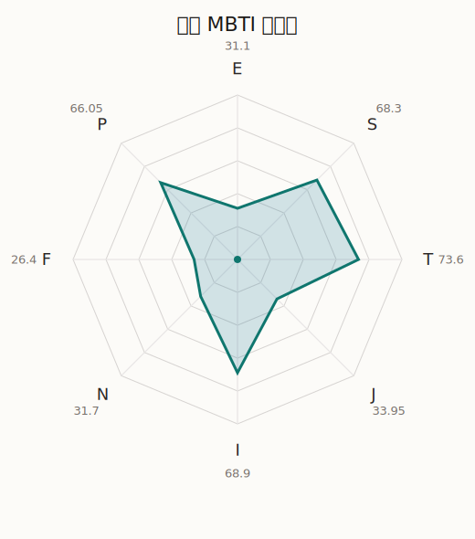

# 麻弥 MBTI 类型解释

- 角色名：大和麻弥
- 最终类型：ISTP
- 备选类型：ISTJ
- 原始聚合类型：ISTP
- 采样轮次：10
- 主类型稳定度：7/10（70.0%）
- 原始聚合稳定度：7/10（70.0%）
- 置信度：高（38.43）
- 置信度方差：68.3656
- 题库：Open Jungian Type Scales (OJTS v2.1)（48 题）

## 类型概述

ISTP 的整体倾向是：更偏内在观察、现实处理、逻辑反应和灵活应变。

## 人物核心

从外部设定与已整理剧情综合来看，麻弥的角色框架可以先理解为：外部资料里的麻弥最鲜明的标签是器材宅、原本是录音室乐手、谈到设备就会兴奋起来。她平时有点低调甚至不起眼，但一旦进入熟悉领域，整个人会立刻变得非常有存在感。

## PDB 校核

- 已应用 PDB 主参考：来源 `personality-database.com`。
- 权重分配：PDB 50% / 人设概要 25% / 卡牌剧情 15% / 剧情切片 10%。
- PDB 类型排序：`ISTP`
- 最终类型先按 PDB 最高票定锚：`ISTP`
- 指定锁定类型：`ISTP`
## 为什么是这个类型

- `I > E`（68.90 : 31.10，平均轴差 45.80，方差 193.8941）：更常先在内部消化，再选择性地向外表达立场。
- `S > N`（68.30 : 31.70，平均轴差 33.74，方差 287.5386）：更常依赖现实条件、具体细节和当下经验来判断局面。
- `T > F`（73.60 : 26.40，平均轴差 50.39，方差 254.6873）：更常把逻辑、结构、效率和标准一致性放在判断前列。
- `P > J`（66.05 : 33.95，平均轴差 11.15，方差 85.8595）：更常保留空间，依靠灵活调整和临场变化推进事情。

## 为什么不是备选类型

最接近的备选类型是 `ISTJ`。它与主类型 `ISTP` 的差别主要落在 `JP` 这一轴上。
最终仍保留 `P`，因为该轴平均优势还有 `32.10`，虽然会波动，但整体没有被 `J` 反超。虽然并非完全无计划，但整体仍更偏向保留余地、即兴调整和开放推进。

## 四维结果

- `EI`：E 31.10 / I 68.90，轴差方差 193.8941
- `SN`：S 68.30 / N 31.70，轴差方差 287.5386
- `FT`：F 26.40 / T 73.60，轴差方差 254.6873
- `JP`：J 33.95 / P 66.05，轴差方差 85.8595

## 八维数据

- `E`：均值 31.10，方差 48.4735
- `S`：均值 68.30，方差 71.8846
- `T`：均值 73.60，方差 63.6718
- `J`：均值 33.95，方差 35.3450
- `I`：均值 68.90，方差 48.4735
- `N`：均值 31.70，方差 71.8846
- `F`：均值 26.40，方差 63.6718
- `P`：均值 66.05，方差 35.3450

## 类型稳定性

- `ISTP`：7 次（70.0%）
- `ISTJ`：3 次（30.0%）

## 图表

## 证据依据

- 人物概述：从外部设定与已整理剧情综合来看，麻弥的角色框架可以先理解为：外部资料里的麻弥最鲜明的标签是器材宅、原本是录音室乐手、谈到设备就会兴奋起来。她平时有点低调甚至不起眼，但一旦进入熟悉领域，整个人会立刻变得非常有存在感。
- 卡牌剧情：在 108 条卡牌剧情里，麻弥 的个人篇章补完相对丰富；这部分更适合用来观察角色的私下状态、非主线场合下的关系重心，以及主线之外的稳定人格表现。
- 剧情切片：在已整理的 311 条主线/乐团剧情切片里，麻弥同时覆盖主线推进（44）和乐队内部关系（267）两条线。这说明这个角色在本地语料中的位置，不应该只从单句台词去读，而要放回到持续出现的关系链和章节位置里看。

## 模拟作答概览

| 题号 | 题目/两端描述 | 平均作答 | 作答方差 | 平均倾向值 | 倾向方差 |
| --- | --- | --- | --- | --- | --- |
| 1 | I don&lsquo;t like to draw attention to myself. | 4.40 | 0.2400 | 55.41 | 142.2382 |
| 2 | I hate situations where people expect me to be funny. | 3.00 | 0.0000 | 5.36 | 193.6250 |
| 3 | I hold back my opinions. | 2.90 | 0.0900 | -2.13 | 160.2769 |
| 4 | I want a huge social circle. | 1.60 | 0.2400 | -59.56 | 115.3885 |
| 5 | I am the life of the party. | 1.40 | 0.2400 | -60.34 | 150.7058 |
| 6 | I make lots of noise. | 1.60 | 0.2400 | -58.00 | 147.4875 |
| 7 | I avoid philosophical discussions. | 3.00 | 0.6000 | -1.11 | 512.6600 |
| 8 | I don&apos;t like to analyze literature. | 2.90 | 0.2900 | -10.41 | 366.8408 |
| 9 | I am attached to conventional ways. | 3.00 | 0.4000 | -1.75 | 527.8784 |
| 10 | I love to read challenging material. | 1.60 | 0.2400 | -56.81 | 270.4267 |
| 11 | I look for hidden meanings in things. | 1.50 | 0.2500 | -60.28 | 217.6438 |
| 12 | I am curious about everything. | 1.60 | 0.2400 | -53.88 | 373.4542 |
| 13 | I want to experience passion and romance. | 1.60 | 0.2400 | -60.63 | 99.1291 |
| 14 | I am deeply moved by others&lsquo; misfortunes. | 1.30 | 0.2100 | -66.31 | 104.6190 |
| 15 | I listen to my feelings when making important decisions. | 1.20 | 0.1600 | -67.61 | 51.6653 |
| 16 | I prize logic above all else. | 3.10 | 0.0900 | 5.89 | 164.5498 |
| 17 | I don&lsquo;t understand people who get emotional. | 2.80 | 0.1600 | -2.96 | 205.0693 |
| 18 | I&apos;d rather be feared than loved. | 3.00 | 0.2000 | -3.23 | 322.7711 |
| 19 | I like order. | 2.30 | 0.2100 | -26.81 | 182.7574 |
| 20 | I do things according to a plan. | 2.50 | 0.2500 | -21.10 | 158.8384 |
| 21 | I am always prepared. | 2.30 | 0.2100 | -31.53 | 272.7909 |
| 22 | I often make last-minute plans. | 2.80 | 0.3600 | -13.07 | 224.7522 |
| 23 | I do things for no apparent reason. | 2.50 | 0.2500 | -15.99 | 191.6445 |
| 24 | It takes me days to do things that should take hours because I keep getting distracted. | 2.80 | 0.1600 | -13.88 | 109.5494 |
| 25 | I work on improving myself. | 1.80 | 0.1600 | -52.73 | 75.2572 |
| 26 | I always feel like I need to be doing something important. | 1.90 | 0.0900 | -49.84 | 43.6065 |
| 27 | I have unusual beliefs about the world. | 2.20 | 0.1600 | -32.20 | 118.2814 |
| 28 | I dislike routine. | 2.00 | 0.2000 | -37.07 | 199.4905 |
| 29 | I try my best to follow the rules. | 2.40 | 0.2400 | -26.23 | 170.2768 |
| 30 | I respect authority. | 2.40 | 0.2400 | -33.47 | 143.2293 |
| 31 | I like to take it easy. | 2.90 | 0.0900 | -11.47 | 225.3921 |
| 32 | I choose the easy way. | 2.80 | 0.1600 | -10.95 | 222.4205 |
| 33 | I tell other people my secrets. | 1.40 | 0.2400 | -62.76 | 72.6250 |
| 34 | I make big gestures of friendship to people. | 1.40 | 0.2400 | -62.75 | 157.9730 |
| 35 | I enjoy challenges and competition. | 2.20 | 0.1600 | -33.30 | 85.5833 |
| 36 | I have very high self-esteem. | 2.10 | 0.0900 | -30.55 | 168.3408 |
| 37 | I get embarrassed easily. | 2.20 | 0.1600 | -29.19 | 89.5902 |
| 38 | I become overwhelmed by events. | 2.40 | 0.2400 | -27.41 | 148.6787 |
| 39 | I have difficulty expressing my feelings. | 3.10 | 0.2900 | -3.56 | 454.7793 |
| 40 | I don&apos;t trust others easily. | 3.00 | 0.2000 | 2.33 | 211.7440 |
| 41 | skeptical <-> wants to believe | 1.50 | 0.2500 | -62.48 | 224.2790 |
| 42 | chaotic <-> organized | 3.50 | 0.2500 | 17.83 | 150.8439 |
| 43 | wants the big picture <-> wants the details | 2.80 | 0.1600 | -9.62 | 240.3070 |
| 44 | energetic <-> mellow | 3.70 | 0.2100 | 34.13 | 148.0257 |
| 45 | follows the heart <-> follows the head | 3.80 | 0.1600 | 26.12 | 120.8830 |
| 46 | prepares <-> improvises | 3.40 | 0.2400 | 15.51 | 227.8640 |
| 47 | focused on the present <-> focused on the future | 1.80 | 0.1600 | -47.95 | 167.7534 |
| 48 | works best alone <-> works best in groups | 2.30 | 0.2100 | -33.48 | 228.3974 |

## 题库来源

- [OJTS 官方题目页](https://openpsychometrics.org/tests/OJTS/)
- 许可证：CC BY-NC-SA 4.0
- [本地题库文件](../ojts_question_bank_v2_1.json)
