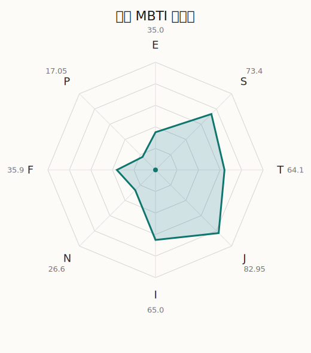

# 美咲 MBTI 类型解释

- 角色名：奥泽美咲
- 最终类型：ISTJ
- 备选类型：ISFJ
- 原始聚合类型：ISTJ
- 采样轮次：10
- 主类型稳定度：10/10（100.0%）
- 原始聚合稳定度：10/10（100.0%）
- 置信度：高（42.73）
- 置信度方差：33.1513
- 题库：Open Jungian Type Scales (OJTS v2.1)（48 题）

## 类型概述

ISTJ 的整体倾向是：更偏内在稳态、现实执行、逻辑标准和规则落实。

## 人物核心

从外部设定与已整理剧情综合来看，美咲的角色框架可以先理解为：外部角色资料里的美咲通常是 Hello, Happy World! 的常识人、吐槽役，也是“米歇尔”形象背后真正承担执行的人。她嘴上常说麻烦，实际上却总是最清楚团队缺了什么、事情该怎样才做得成。

## PDB 校核

- 已应用 PDB 主参考：来源 `personality-database.com`。
- 权重分配：PDB 50% / 人设概要 25% / 卡牌剧情 15% / 剧情切片 10%。
- PDB 类型排序：`ISTJ`
- 最终类型先按 PDB 最高票定锚：`ISTJ`
- 指定锁定类型：`ISTJ`
## 为什么是这个类型

- `I > E`（65.00 : 35.00，平均轴差 27.16，方差 176.0176）：更常先在内部消化，再选择性地向外表达立场。
- `S > N`（73.40 : 26.60，平均轴差 45.51，方差 168.0282）：更常依赖现实条件、具体细节和当下经验来判断局面。
- `T > F`（64.10 : 35.90，平均轴差 33.43，方差 557.1659）：更常把逻辑、结构、效率和标准一致性放在判断前列。
- `J > P`（82.95 : 17.05，平均轴差 74.24，方差 73.9310）：更常用计划、收束、安排和责任结构去降低混乱。

## 为什么不是备选类型

最接近的备选类型是 `ISFJ`。它与主类型 `ISTJ` 的差别主要落在 `FT` 这一轴上。
最终仍保留 `T`，因为该轴平均优势还有 `28.20`，虽然会波动，但整体没有被 `F` 反超。虽然也在意关系影响，但最终更常回到逻辑、标准和方法正确性来判断。

## 四维结果

- `EI`：E 35.00 / I 65.00，轴差方差 176.0176
- `SN`：S 73.40 / N 26.60，轴差方差 168.0282
- `FT`：F 35.90 / T 64.10，轴差方差 557.1659
- `JP`：J 82.95 / P 17.05，轴差方差 73.9310

## 八维数据

- `E`：均值 35.00，方差 44.0044
- `S`：均值 73.40，方差 42.0071
- `T`：均值 64.10，方差 139.2915
- `J`：均值 82.95，方差 18.4827
- `I`：均值 65.00，方差 44.0044
- `N`：均值 26.60，方差 42.0071
- `F`：均值 35.90，方差 139.2915
- `P`：均值 17.05，方差 18.4827

## 类型稳定性

- `ISTJ`：10 次（100.0%）

## 图表

## 证据依据

- 人物概述：从外部设定与已整理剧情综合来看，美咲的角色框架可以先理解为：外部角色资料里的美咲通常是 Hello, Happy World! 的常识人、吐槽役，也是“米歇尔”形象背后真正承担执行的人。她嘴上常说麻烦，实际上却总是最清楚团队缺了什么、事情该怎样才做得成。
- 卡牌剧情：在 112 条卡牌剧情里，美咲 的个人篇章补完相对丰富；这部分更适合用来观察角色的私下状态、非主线场合下的关系重心，以及主线之外的稳定人格表现。
- 剧情切片：在已整理的 571 条主线/乐团剧情切片里，美咲同时覆盖主线推进（60）和乐队内部关系（511）两条线。这说明这个角色在本地语料中的位置，不应该只从单句台词去读，而要放回到持续出现的关系链和章节位置里看。

## 模拟作答概览

| 题号 | 题目/两端描述 | 平均作答 | 作答方差 | 平均倾向值 | 倾向方差 |
| --- | --- | --- | --- | --- | --- |
| 1 | I don&lsquo;t like to draw attention to myself. | 2.70 | 0.2100 | -15.28 | 201.6954 |
| 2 | I hate situations where people expect me to be funny. | 2.80 | 0.3600 | -8.71 | 456.7548 |
| 3 | I hold back my opinions. | 3.00 | 0.0000 | -5.25 | 69.5062 |
| 4 | I want a huge social circle. | 1.90 | 0.0900 | -52.14 | 84.6347 |
| 5 | I am the life of the party. | 1.70 | 0.2100 | -48.38 | 136.3020 |
| 6 | I make lots of noise. | 1.80 | 0.1600 | -47.80 | 206.5926 |
| 7 | I avoid philosophical discussions. | 3.20 | 0.3600 | 4.77 | 373.4518 |
| 8 | I don&apos;t like to analyze literature. | 3.20 | 0.1600 | 4.97 | 225.7648 |
| 9 | I am attached to conventional ways. | 3.00 | 0.0000 | 5.36 | 69.3253 |
| 10 | I love to read challenging material. | 1.60 | 0.2400 | -57.39 | 71.3881 |
| 11 | I look for hidden meanings in things. | 1.40 | 0.2400 | -59.80 | 93.9389 |
| 12 | I am curious about everything. | 1.50 | 0.2500 | -60.08 | 65.1127 |
| 13 | I want to experience passion and romance. | 1.80 | 0.1600 | -46.64 | 270.1220 |
| 14 | I am deeply moved by others&lsquo; misfortunes. | 1.80 | 0.3600 | -50.57 | 216.8219 |
| 15 | I listen to my feelings when making important decisions. | 1.80 | 0.1600 | -47.50 | 123.1821 |
| 16 | I prize logic above all else. | 2.80 | 0.3600 | -11.15 | 436.7551 |
| 17 | I don&lsquo;t understand people who get emotional. | 2.80 | 0.3600 | -12.12 | 411.2562 |
| 18 | I&apos;d rather be feared than loved. | 2.70 | 0.2100 | -17.59 | 267.2986 |
| 19 | I like order. | 3.50 | 0.2500 | 20.46 | 359.8844 |
| 20 | I do things according to a plan. | 3.60 | 0.2400 | 20.70 | 266.5324 |
| 21 | I am always prepared. | 3.50 | 0.2500 | 21.17 | 375.3255 |
| 22 | I often make last-minute plans. | 1.10 | 0.0900 | -79.65 | 139.2467 |
| 23 | I do things for no apparent reason. | 1.00 | 0.0000 | -82.66 | 97.2705 |
| 24 | It takes me days to do things that should take hours because I keep getting distracted. | 1.00 | 0.0000 | -82.03 | 63.9458 |
| 25 | I work on improving myself. | 2.70 | 0.2100 | -18.02 | 113.8224 |
| 26 | I always feel like I need to be doing something important. | 2.50 | 0.2500 | -20.25 | 129.0260 |
| 27 | I have unusual beliefs about the world. | 1.00 | 0.0000 | -73.99 | 42.9349 |
| 28 | I dislike routine. | 1.10 | 0.0900 | -70.78 | 75.1422 |
| 29 | I try my best to follow the rules. | 3.20 | 0.1600 | 12.45 | 92.0039 |
| 30 | I respect authority. | 3.10 | 0.0900 | 9.37 | 144.6928 |
| 31 | I like to take it easy. | 2.20 | 0.1600 | -34.37 | 113.7124 |
| 32 | I choose the easy way. | 2.10 | 0.0900 | -40.45 | 177.1193 |
| 33 | I tell other people my secrets. | 1.60 | 0.2400 | -51.23 | 130.9904 |
| 34 | I make big gestures of friendship to people. | 1.70 | 0.2100 | -48.13 | 222.3330 |
| 35 | I enjoy challenges and competition. | 2.10 | 0.0900 | -34.19 | 71.5273 |
| 36 | I have very high self-esteem. | 2.50 | 0.2500 | -24.99 | 135.1024 |
| 37 | I get embarrassed easily. | 2.30 | 0.2100 | -32.73 | 131.4778 |
| 38 | I become overwhelmed by events. | 2.30 | 0.4100 | -29.04 | 176.6810 |
| 39 | I have difficulty expressing my feelings. | 2.80 | 0.1600 | -10.14 | 248.4130 |
| 40 | I don&apos;t trust others easily. | 2.90 | 0.0900 | -7.01 | 174.0671 |
| 41 | skeptical <-> wants to believe | 1.80 | 0.3600 | -49.67 | 266.3699 |
| 42 | chaotic <-> organized | 5.00 | 0.0000 | 84.54 | 96.6828 |
| 43 | wants the big picture <-> wants the details | 3.00 | 0.0000 | 5.00 | 82.2028 |
| 44 | energetic <-> mellow | 3.50 | 0.2500 | 23.73 | 113.3507 |
| 45 | follows the heart <-> follows the head | 3.40 | 0.2400 | 20.09 | 271.8609 |
| 46 | prepares <-> improvises | 1.80 | 0.1600 | -50.14 | 143.5220 |
| 47 | focused on the present <-> focused on the future | 1.30 | 0.2100 | -62.47 | 44.9999 |
| 48 | works best alone <-> works best in groups | 2.70 | 0.2100 | -12.56 | 364.4676 |

## 题库来源

- [OJTS 官方题目页](https://openpsychometrics.org/tests/OJTS/)
- 许可证：CC BY-NC-SA 4.0
- [本地题库文件](../ojts_question_bank_v2_1.json)
