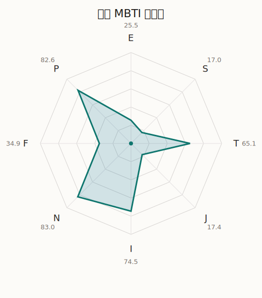

# 摩卡 MBTI 类型解释

- 角色名：青叶摩卡
- 最终类型：INTP
- 备选类型：INFP
- 原始聚合类型：INTP
- 采样轮次：10
- 主类型稳定度：10/10（100.0%）
- 原始聚合稳定度：10/10（100.0%）
- 置信度：高（52.6）
- 置信度方差：48.7377
- 题库：Open Jungian Type Scales (OJTS v2.1)（48 题）

## 类型概述

INTP 的整体倾向是：更偏内在分析、抽象模型、逻辑拆解和开放推演。

## 人物核心

从外部设定与已整理剧情综合来看，摩卡的角色框架可以先理解为：官方和外部角色介绍里的摩卡，总是带着慢悠悠、聪明、看似随性实则观察很准的气质。她不是传统意义上的高调角色，却经常在最关键的时候看穿气氛、看穿别人没说出口的真实情绪。

## PDB 校核

- 已应用 PDB 主参考：来源 `personality-database.com`。
- 权重分配：PDB 50% / 人设概要 25% / 卡牌剧情 15% / 剧情切片 10%。
- PDB 类型排序：`INTP`
- 最终类型先按 PDB 最高票定锚：`INTP`
- 指定锁定类型：`INTP`
## 为什么是这个类型

- `I > E`（74.50 : 25.50，平均轴差 51.59，方差 375.5022）：更常先在内部消化，再选择性地向外表达立场。
- `N > S`（83.00 : 17.00，平均轴差 71.18，方差 36.8596）：更常从意义、可能性、方向感和隐含主题去理解问题。
- `T > F`（65.10 : 34.90，平均轴差 27.61，方差 255.3240）：更常把逻辑、结构、效率和标准一致性放在判断前列。
- `P > J`（82.60 : 17.40，平均轴差 63.63，方差 43.2546）：更常保留空间，依靠灵活调整和临场变化推进事情。

## 为什么不是备选类型

最接近的备选类型是 `INFP`。它与主类型 `INTP` 的差别主要落在 `FT` 这一轴上。
最终仍保留 `T`，因为该轴平均优势还有 `30.20`，虽然会波动，但整体没有被 `F` 反超。虽然也在意关系影响，但最终更常回到逻辑、标准和方法正确性来判断。

## 四维结果

- `EI`：E 25.50 / I 74.50，轴差方差 375.5022
- `SN`：S 17.00 / N 83.00，轴差方差 36.8596
- `FT`：F 34.90 / T 65.10，轴差方差 255.3240
- `JP`：J 17.40 / P 82.60，轴差方差 43.2546

## 八维数据

- `E`：均值 25.50，方差 93.8755
- `S`：均值 17.00，方差 9.2149
- `T`：均值 65.10，方差 63.8310
- `J`：均值 17.40，方差 10.8136
- `I`：均值 74.50，方差 93.8755
- `N`：均值 83.00，方差 9.2149
- `F`：均值 34.90，方差 63.8310
- `P`：均值 82.60，方差 10.8136

## 类型稳定性

- `INTP`：10 次（100.0%）

## 图表

## 证据依据

- 人物概述：从外部设定与已整理剧情综合来看，摩卡的角色框架可以先理解为：官方和外部角色介绍里的摩卡，总是带着慢悠悠、聪明、看似随性实则观察很准的气质。她不是传统意义上的高调角色，却经常在最关键的时候看穿气氛、看穿别人没说出口的真实情绪。
- 卡牌剧情：在 104 条卡牌剧情里，摩卡 的个人篇章补完相对丰富；这部分更适合用来观察角色的私下状态、非主线场合下的关系重心，以及主线之外的稳定人格表现。
- 剧情切片：在已整理的 380 条主线/乐团剧情切片里，摩卡同时覆盖主线推进（48）和乐队内部关系（332）两条线。这说明这个角色在本地语料中的位置，不应该只从单句台词去读，而要放回到持续出现的关系链和章节位置里看。

## 模拟作答概览

| 题号 | 题目/两端描述 | 平均作答 | 作答方差 | 平均倾向值 | 倾向方差 |
| --- | --- | --- | --- | --- | --- |
| 1 | I don&lsquo;t like to draw attention to myself. | 3.40 | 0.4400 | 16.37 | 390.7609 |
| 2 | I hate situations where people expect me to be funny. | 3.20 | 0.3600 | 6.29 | 353.5446 |
| 3 | I hold back my opinions. | 3.50 | 0.2500 | 16.89 | 238.2752 |
| 4 | I want a huge social circle. | 1.20 | 0.1600 | -69.56 | 227.1152 |
| 5 | I am the life of the party. | 1.10 | 0.0900 | -69.70 | 115.0053 |
| 6 | I make lots of noise. | 1.30 | 0.2100 | -68.09 | 252.4825 |
| 7 | I avoid philosophical discussions. | 1.10 | 0.0900 | -79.80 | 164.1788 |
| 8 | I don&apos;t like to analyze literature. | 1.00 | 0.0000 | -79.10 | 76.7704 |
| 9 | I am attached to conventional ways. | 1.00 | 0.0000 | -83.23 | 87.2728 |
| 10 | I love to read challenging material. | 4.10 | 0.0900 | 47.34 | 95.3191 |
| 11 | I look for hidden meanings in things. | 4.10 | 0.0900 | 47.84 | 98.1311 |
| 12 | I am curious about everything. | 4.20 | 0.1600 | 47.23 | 169.1391 |
| 13 | I want to experience passion and romance. | 1.90 | 0.0900 | -43.06 | 138.2695 |
| 14 | I am deeply moved by others&lsquo; misfortunes. | 1.90 | 0.0900 | -49.13 | 164.4903 |
| 15 | I listen to my feelings when making important decisions. | 1.80 | 0.1600 | -51.39 | 138.2637 |
| 16 | I prize logic above all else. | 2.60 | 0.2400 | -9.52 | 357.2970 |
| 17 | I don&lsquo;t understand people who get emotional. | 2.70 | 0.2100 | -11.35 | 178.8483 |
| 18 | I&apos;d rather be feared than loved. | 2.80 | 0.1600 | -11.22 | 149.6881 |
| 19 | I like order. | 1.00 | 0.0000 | -77.28 | 54.2150 |
| 20 | I do things according to a plan. | 1.00 | 0.0000 | -77.29 | 20.8579 |
| 21 | I am always prepared. | 1.00 | 0.0000 | -74.24 | 68.4525 |
| 22 | I often make last-minute plans. | 3.30 | 0.2100 | 14.46 | 105.2218 |
| 23 | I do things for no apparent reason. | 3.10 | 0.0900 | 10.81 | 142.2256 |
| 24 | It takes me days to do things that should take hours because I keep getting distracted. | 3.10 | 0.0900 | 4.76 | 209.5334 |
| 25 | I work on improving myself. | 2.50 | 0.2500 | -24.32 | 154.0037 |
| 26 | I always feel like I need to be doing something important. | 2.40 | 0.2400 | -24.16 | 223.6450 |
| 27 | I have unusual beliefs about the world. | 3.10 | 0.0900 | 3.22 | 134.2422 |
| 28 | I dislike routine. | 3.50 | 0.2500 | 19.56 | 131.1254 |
| 29 | I try my best to follow the rules. | 1.00 | 0.0000 | -79.28 | 31.1227 |
| 30 | I respect authority. | 1.00 | 0.0000 | -76.26 | 70.5388 |
| 31 | I like to take it easy. | 2.10 | 0.0900 | -34.28 | 98.1474 |
| 32 | I choose the easy way. | 2.00 | 0.0000 | -34.48 | 53.3995 |
| 33 | I tell other people my secrets. | 1.40 | 0.2400 | -62.36 | 85.3568 |
| 34 | I make big gestures of friendship to people. | 1.40 | 0.2400 | -60.86 | 75.7123 |
| 35 | I enjoy challenges and competition. | 2.70 | 0.2100 | -18.33 | 106.5536 |
| 36 | I have very high self-esteem. | 1.90 | 0.2900 | -39.98 | 288.7392 |
| 37 | I get embarrassed easily. | 2.40 | 0.2400 | -26.20 | 246.7574 |
| 38 | I become overwhelmed by events. | 2.40 | 0.2400 | -24.91 | 166.6188 |
| 39 | I have difficulty expressing my feelings. | 2.90 | 0.0900 | -8.74 | 179.8120 |
| 40 | I don&apos;t trust others easily. | 3.10 | 0.0900 | 3.48 | 160.9388 |
| 41 | skeptical <-> wants to believe | 2.80 | 0.1600 | -9.43 | 326.1715 |
| 42 | chaotic <-> organized | 1.50 | 0.2500 | -56.54 | 138.7712 |
| 43 | wants the big picture <-> wants the details | 1.00 | 0.0000 | -81.83 | 63.3027 |
| 44 | energetic <-> mellow | 3.70 | 0.4100 | 30.95 | 340.9404 |
| 45 | follows the heart <-> follows the head | 3.60 | 0.2400 | 26.82 | 99.4098 |
| 46 | prepares <-> improvises | 4.00 | 0.0000 | 47.11 | 73.4733 |
| 47 | focused on the present <-> focused on the future | 3.30 | 0.2100 | 18.27 | 205.1911 |
| 48 | works best alone <-> works best in groups | 2.00 | 0.2000 | -38.22 | 327.7406 |

## 题库来源

- [OJTS 官方题目页](https://openpsychometrics.org/tests/OJTS/)
- 许可证：CC BY-NC-SA 4.0
- [本地题库文件](../ojts_question_bank_v2_1.json)
