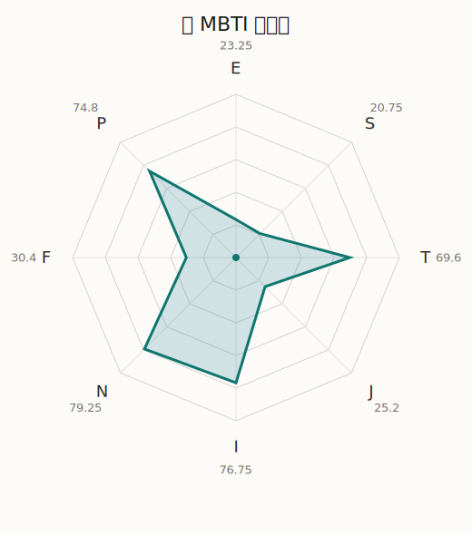

# 睦 MBTI 类型解释

- 角色名：若叶睦
- 最终类型：INTP
- 备选类型：INFP
- 原始聚合类型：INTP
- 采样轮次：10
- 主类型稳定度：10/10（100.0%）
- 原始聚合稳定度：10/10（100.0%）
- 置信度：高（50.2）
- 置信度方差：19.7509
- 题库：Open Jungian Type Scales (OJTS v2.1)（48 题）

## 类型概述

INTP 的整体倾向是：更偏内在分析、抽象模型、逻辑拆解和开放推演。

## 人物核心

从外部设定与已整理剧情综合来看，睦的角色框架可以先理解为：官方角色页对睦的描述很短，但很关键：她是 Ave Mujica 的吉他手，与祥子是青梅竹马。迷你动画的官方角色文案则直接点出“无表情的外侧之下藏着体贴”和“变化自如的演技怪物”这两个关键词，这说明睦并不是“没有情绪”，而是极度不擅长把真实情绪以常规方式表达出来。

## PDB 校核

- 已应用 PDB 主参考：来源 `personality-database.com`。
- 权重分配：PDB 50% / 人设概要 25% / 卡牌剧情 15% / 剧情切片 10%。
- PDB 类型排序：`INTP`
- 最终类型先按 PDB 最高票定锚：`INTP`
- 指定锁定类型：`INTP`
## 为什么是这个类型

- `I > E`（76.75 : 23.25，平均轴差 59.52，方差 69.5853）：更常先在内部消化，再选择性地向外表达立场。
- `N > S`（79.25 : 20.75，平均轴差 47.93，方差 157.8456）：更常从意义、可能性、方向感和隐含主题去理解问题。
- `T > F`（69.60 : 30.40，平均轴差 39.11，方差 300.0588）：更常把逻辑、结构、效率和标准一致性放在判断前列。
- `P > J`（74.80 : 25.20，平均轴差 36.76，方差 105.1565）：更常保留空间，依靠灵活调整和临场变化推进事情。

## 为什么不是备选类型

最接近的备选类型是 `INFP`。它与主类型 `INTP` 的差别主要落在 `FT` 这一轴上。
最终仍保留 `T`，因为该轴平均优势还有 `39.20`，虽然会波动，但整体没有被 `F` 反超。虽然也在意关系影响，但最终更常回到逻辑、标准和方法正确性来判断。

## 四维结果

- `EI`：E 23.25 / I 76.75，轴差方差 69.5853
- `SN`：S 20.75 / N 79.25，轴差方差 157.8456
- `FT`：F 30.40 / T 69.60，轴差方差 300.0588
- `JP`：J 25.20 / P 74.80，轴差方差 105.1565

## 八维数据

- `E`：均值 23.25，方差 17.3963
- `S`：均值 20.75，方差 39.4614
- `T`：均值 69.60，方差 75.0147
- `J`：均值 25.20，方差 26.2891
- `I`：均值 76.75，方差 17.3963
- `N`：均值 79.25，方差 39.4614
- `F`：均值 30.40，方差 75.0147
- `P`：均值 74.80，方差 26.2891

## 类型稳定性

- `INTP`：10 次（100.0%）

## 图表

## 证据依据

- 人物概述：从外部设定与已整理剧情综合来看，睦的角色框架可以先理解为：官方角色页对睦的描述很短，但很关键：她是 Ave Mujica 的吉他手，与祥子是青梅竹马。迷你动画的官方角色文案则直接点出“无表情的外侧之下藏着体贴”和“变化自如的演技怪物”这两个关键词，这说明睦并不是“没有情绪”，而是极度不擅长把真实情绪以常规方式表达出来。
- 卡牌剧情：当前没有归到该角色名下的卡牌剧情，因此暂时无法从私人篇章、节庆篇章或回忆篇章里继续补正人物侧面。
- 剧情切片：在已整理的 28 条主线/乐团剧情切片里，睦目前更集中在乐队内部与团内关系剧情（28）。这说明这个角色在本地语料中的位置，不应该只从单句台词去读，而要放回到持续出现的关系链和章节位置里看。

## 模拟作答概览

| 题号 | 题目/两端描述 | 平均作答 | 作答方差 | 平均倾向值 | 倾向方差 |
| --- | --- | --- | --- | --- | --- |
| 1 | I don&lsquo;t like to draw attention to myself. | 3.00 | 0.2000 | 5.75 | 256.0515 |
| 2 | I hate situations where people expect me to be funny. | 3.00 | 0.0000 | 5.36 | 103.7986 |
| 3 | I hold back my opinions. | 3.20 | 0.3600 | 5.35 | 302.7640 |
| 4 | I want a huge social circle. | 1.20 | 0.1600 | -69.29 | 58.9930 |
| 5 | I am the life of the party. | 1.00 | 0.0000 | -72.30 | 71.3911 |
| 6 | I make lots of noise. | 1.20 | 0.1600 | -71.19 | 144.0252 |
| 7 | I avoid philosophical discussions. | 2.00 | 0.2000 | -39.12 | 306.6687 |
| 8 | I don&apos;t like to analyze literature. | 1.80 | 0.1600 | -46.38 | 102.4396 |
| 9 | I am attached to conventional ways. | 2.30 | 0.2100 | -31.60 | 280.3719 |
| 10 | I love to read challenging material. | 4.00 | 0.2000 | 34.29 | 298.1032 |
| 11 | I look for hidden meanings in things. | 3.70 | 0.2100 | 35.95 | 148.5187 |
| 12 | I am curious about everything. | 4.10 | 0.0900 | 42.31 | 168.7982 |
| 13 | I want to experience passion and romance. | 1.70 | 0.2100 | -59.14 | 197.6348 |
| 14 | I am deeply moved by others&lsquo; misfortunes. | 1.60 | 0.2400 | -55.48 | 258.0987 |
| 15 | I listen to my feelings when making important decisions. | 1.60 | 0.2400 | -58.20 | 126.6918 |
| 16 | I prize logic above all else. | 2.90 | 0.0900 | -4.00 | 113.1665 |
| 17 | I don&lsquo;t understand people who get emotional. | 3.00 | 0.2000 | 2.76 | 261.3290 |
| 18 | I&apos;d rather be feared than loved. | 3.00 | 0.2000 | 2.46 | 230.0373 |
| 19 | I like order. | 1.50 | 0.2500 | -60.67 | 128.1274 |
| 20 | I do things according to a plan. | 1.30 | 0.2100 | -65.08 | 77.9301 |
| 21 | I am always prepared. | 1.30 | 0.2100 | -63.36 | 42.5437 |
| 22 | I often make last-minute plans. | 3.40 | 0.2400 | 13.16 | 229.6036 |
| 23 | I do things for no apparent reason. | 3.00 | 0.2000 | 0.86 | 159.0930 |
| 24 | It takes me days to do things that should take hours because I keep getting distracted. | 3.00 | 0.2000 | 1.76 | 330.1491 |
| 25 | I work on improving myself. | 2.60 | 0.2400 | -24.54 | 110.0332 |
| 26 | I always feel like I need to be doing something important. | 2.50 | 0.2500 | -23.13 | 90.1543 |
| 27 | I have unusual beliefs about the world. | 3.00 | 0.0000 | 7.65 | 109.8145 |
| 28 | I dislike routine. | 3.40 | 0.2400 | 12.64 | 145.4926 |
| 29 | I try my best to follow the rules. | 1.30 | 0.2100 | -66.01 | 86.6647 |
| 30 | I respect authority. | 1.30 | 0.2100 | -65.00 | 87.8711 |
| 31 | I like to take it easy. | 2.20 | 0.1600 | -40.03 | 182.5468 |
| 32 | I choose the easy way. | 2.10 | 0.0900 | -35.70 | 70.0131 |
| 33 | I tell other people my secrets. | 1.10 | 0.0900 | -70.08 | 98.2503 |
| 34 | I make big gestures of friendship to people. | 1.20 | 0.1600 | -65.58 | 107.2455 |
| 35 | I enjoy challenges and competition. | 2.10 | 0.0900 | -36.96 | 132.4503 |
| 36 | I have very high self-esteem. | 2.10 | 0.0900 | -39.59 | 205.4742 |
| 37 | I get embarrassed easily. | 2.60 | 0.2400 | -20.90 | 101.9227 |
| 38 | I become overwhelmed by events. | 2.50 | 0.2500 | -21.67 | 430.8685 |
| 39 | I have difficulty expressing my feelings. | 3.00 | 0.0000 | 2.55 | 102.7513 |
| 40 | I don&apos;t trust others easily. | 3.00 | 0.2000 | 2.85 | 240.7837 |
| 41 | skeptical <-> wants to believe | 2.30 | 0.2100 | -28.88 | 250.7882 |
| 42 | chaotic <-> organized | 3.20 | 0.1600 | 4.05 | 258.4197 |
| 43 | wants the big picture <-> wants the details | 1.10 | 0.0900 | -73.77 | 149.1562 |
| 44 | energetic <-> mellow | 4.00 | 0.0000 | 38.22 | 111.0311 |
| 45 | follows the heart <-> follows the head | 3.80 | 0.1600 | 25.48 | 213.9432 |
| 46 | prepares <-> improvises | 3.80 | 0.1600 | 31.84 | 141.8893 |
| 47 | focused on the present <-> focused on the future | 3.20 | 0.1600 | 7.87 | 162.5449 |
| 48 | works best alone <-> works best in groups | 2.00 | 0.0000 | -37.57 | 152.8362 |

## 题库来源

- [OJTS 官方题目页](https://openpsychometrics.org/tests/OJTS/)
- 许可证：CC BY-NC-SA 4.0
- [本地题库文件](../ojts_question_bank_v2_1.json)
