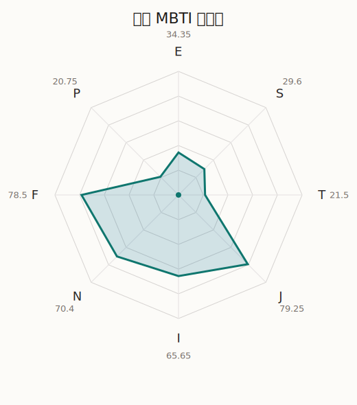

# 七深 MBTI 类型解释

- 角色名：广町七深
- 最终类型：INFJ
- 备选类型：ENFJ
- 原始聚合类型：INFJ
- 采样轮次：10
- 主类型稳定度：10/10（100.0%）
- 原始聚合稳定度：10/10（100.0%）
- 置信度：高（46.9）
- 置信度方差：36.7804
- 题库：Open Jungian Type Scales (OJTS v2.1)（48 题）

## 类型概述

INFJ 的整体倾向是：更偏内在思考、抽象理解、价值判断和稳定收束。

## 人物核心

从外部设定与已整理剧情综合来看，七深的角色框架可以先理解为：外部资料里的七深常被写成有点天然、有点脱线，却又因为太有天分而和“普通”始终隔着距离的人。她非常在意自己看起来是不是和别人不一样，因此那种轻飘感里其实常带着自我位置的不安。

## PDB 校核

- 已应用 PDB 主参考：来源 `personality-database.com`。
- 权重分配：PDB 50% / 人设概要 25% / 卡牌剧情 15% / 剧情切片 10%。
- PDB 类型排序：`INFJ`
- 最终类型先按 PDB 最高票定锚：`INFJ`
- 指定锁定类型：`INFJ`
## 为什么是这个类型

- `I > E`（65.65 : 34.35，平均轴差 25.35，方差 184.2219）：更常先在内部消化，再选择性地向外表达立场。
- `N > S`（70.40 : 29.60，平均轴差 45.44，方差 354.5413）：更常从意义、可能性、方向感和隐含主题去理解问题。
- `F > T`（78.50 : 21.50，平均轴差 56.88，方差 119.9247）：更常把感受、关系、价值和对人的回应放在判断前列。
- `J > P`（79.25 : 20.75，平均轴差 70.80，方差 92.1211）：更常用计划、收束、安排和责任结构去降低混乱。

## 为什么不是备选类型

最接近的备选类型是 `ENFJ`。它与主类型 `INFJ` 的差别主要落在 `EI` 这一轴上。
最终仍保留 `I`，因为该轴平均优势还有 `31.30`，虽然会波动，但整体没有被 `E` 反超。虽然也会参与群体互动，但资料里更常表现为先内化、后表达的节奏。

## 四维结果

- `EI`：E 34.35 / I 65.65，轴差方差 184.2219
- `SN`：S 29.60 / N 70.40，轴差方差 354.5413
- `FT`：F 78.50 / T 21.50，轴差方差 119.9247
- `JP`：J 79.25 / P 20.75，轴差方差 92.1211

## 八维数据

- `E`：均值 34.35，方差 46.0555
- `S`：均值 29.60，方差 88.6353
- `T`：均值 21.50，方差 29.9812
- `J`：均值 79.25，方差 23.0303
- `I`：均值 65.65，方差 46.0555
- `N`：均值 70.40，方差 88.6353
- `F`：均值 78.50，方差 29.9812
- `P`：均值 20.75，方差 23.0303

## 类型稳定性

- `INFJ`：10 次（100.0%）

## 图表

## 证据依据

- 人物概述：从外部设定与已整理剧情综合来看，七深的角色框架可以先理解为：外部资料里的七深常被写成有点天然、有点脱线，却又因为太有天分而和“普通”始终隔着距离的人。她非常在意自己看起来是不是和别人不一样，因此那种轻飘感里其实常带着自我位置的不安。
- 卡牌剧情：在 59 条卡牌剧情里，七深 的个人篇章补完相对丰富；这部分更适合用来观察角色的私下状态、非主线场合下的关系重心，以及主线之外的稳定人格表现。
- 剧情切片：在已整理的 164 条主线/乐团剧情切片里，七深同时覆盖主线推进（21）和乐队内部关系（143）两条线。这说明这个角色在本地语料中的位置，不应该只从单句台词去读，而要放回到持续出现的关系链和章节位置里看。

## 模拟作答概览

| 题号 | 题目/两端描述 | 平均作答 | 作答方差 | 平均倾向值 | 倾向方差 |
| --- | --- | --- | --- | --- | --- |
| 1 | I don&lsquo;t like to draw attention to myself. | 2.60 | 0.2400 | -18.66 | 162.0584 |
| 2 | I hate situations where people expect me to be funny. | 2.70 | 0.2100 | -11.42 | 250.3643 |
| 3 | I hold back my opinions. | 2.80 | 0.1600 | -7.53 | 234.5079 |
| 4 | I want a huge social circle. | 1.80 | 0.1600 | -47.73 | 137.0002 |
| 5 | I am the life of the party. | 1.80 | 0.1600 | -48.06 | 214.0000 |
| 6 | I make lots of noise. | 1.50 | 0.2500 | -51.23 | 154.0846 |
| 7 | I avoid philosophical discussions. | 1.60 | 0.4400 | -53.63 | 298.9824 |
| 8 | I don&apos;t like to analyze literature. | 1.60 | 0.2400 | -56.14 | 173.7077 |
| 9 | I am attached to conventional ways. | 1.50 | 0.4500 | -58.77 | 273.2314 |
| 10 | I love to read challenging material. | 3.10 | 0.2900 | 0.91 | 264.3723 |
| 11 | I look for hidden meanings in things. | 2.90 | 0.2900 | -4.39 | 456.5669 |
| 12 | I am curious about everything. | 3.00 | 0.2000 | 0.75 | 318.4389 |
| 13 | I want to experience passion and romance. | 3.30 | 0.4100 | 7.32 | 352.8874 |
| 14 | I am deeply moved by others&lsquo; misfortunes. | 3.10 | 0.2900 | 6.64 | 215.4967 |
| 15 | I listen to my feelings when making important decisions. | 3.10 | 0.0900 | 13.82 | 161.7817 |
| 16 | I prize logic above all else. | 1.20 | 0.1600 | -68.10 | 125.9685 |
| 17 | I don&lsquo;t understand people who get emotional. | 1.10 | 0.0900 | -68.10 | 65.8979 |
| 18 | I&apos;d rather be feared than loved. | 1.10 | 0.0900 | -71.39 | 91.2407 |
| 19 | I like order. | 3.20 | 0.1600 | 13.11 | 110.0612 |
| 20 | I do things according to a plan. | 3.20 | 0.3600 | 13.96 | 487.2979 |
| 21 | I am always prepared. | 3.10 | 0.0900 | 9.00 | 162.7584 |
| 22 | I often make last-minute plans. | 1.10 | 0.0900 | -72.89 | 104.3675 |
| 23 | I do things for no apparent reason. | 1.00 | 0.0000 | -81.48 | 59.3895 |
| 24 | It takes me days to do things that should take hours because I keep getting distracted. | 1.20 | 0.1600 | -75.86 | 197.9655 |
| 25 | I work on improving myself. | 3.00 | 0.0000 | 7.77 | 146.1954 |
| 26 | I always feel like I need to be doing something important. | 3.30 | 0.2100 | 9.57 | 137.7090 |
| 27 | I have unusual beliefs about the world. | 1.90 | 0.0900 | -38.41 | 127.2908 |
| 28 | I dislike routine. | 2.10 | 0.0900 | -36.76 | 129.4373 |
| 29 | I try my best to follow the rules. | 2.40 | 0.2400 | -22.40 | 228.4567 |
| 30 | I respect authority. | 2.40 | 0.2400 | -24.98 | 130.8443 |
| 31 | I like to take it easy. | 1.00 | 0.0000 | -68.70 | 31.8178 |
| 32 | I choose the easy way. | 1.20 | 0.1600 | -64.25 | 106.8331 |
| 33 | I tell other people my secrets. | 2.60 | 0.2400 | -18.44 | 219.6980 |
| 34 | I make big gestures of friendship to people. | 2.60 | 0.2400 | -14.59 | 319.2882 |
| 35 | I enjoy challenges and competition. | 1.50 | 0.2500 | -60.59 | 123.0700 |
| 36 | I have very high self-esteem. | 1.40 | 0.2400 | -59.34 | 81.2034 |
| 37 | I get embarrassed easily. | 3.00 | 0.2000 | -0.03 | 211.8764 |
| 38 | I become overwhelmed by events. | 3.00 | 0.0000 | 4.33 | 112.1524 |
| 39 | I have difficulty expressing my feelings. | 2.10 | 0.0900 | -36.93 | 120.0075 |
| 40 | I don&apos;t trust others easily. | 1.90 | 0.0900 | -43.91 | 96.5656 |
| 41 | skeptical <-> wants to believe | 4.10 | 0.0900 | 42.17 | 153.9032 |
| 42 | chaotic <-> organized | 4.90 | 0.0900 | 75.98 | 114.5600 |
| 43 | wants the big picture <-> wants the details | 1.40 | 0.2400 | -57.28 | 293.2035 |
| 44 | energetic <-> mellow | 3.20 | 0.1600 | 12.83 | 175.2988 |
| 45 | follows the heart <-> follows the head | 2.20 | 0.1600 | -34.79 | 141.5694 |
| 46 | prepares <-> improvises | 1.90 | 0.0900 | -44.19 | 106.6152 |
| 47 | focused on the present <-> focused on the future | 3.20 | 0.1600 | 9.19 | 166.2143 |
| 48 | works best alone <-> works best in groups | 2.50 | 0.2500 | -16.31 | 154.5005 |

## 题库来源

- [OJTS 官方题目页](https://openpsychometrics.org/tests/OJTS/)
- 许可证：CC BY-NC-SA 4.0
- [本地题库文件](../ojts_question_bank_v2_1.json)
