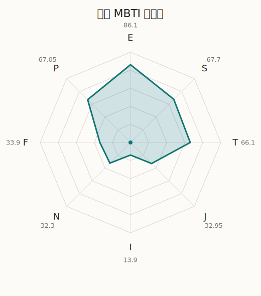

# 若麦 MBTI 类型解释

- 角色名：祐天寺若麦
- 最终类型：ESTP
- 备选类型：ESFP
- 原始聚合类型：ESTP
- 采样轮次：10
- 主类型稳定度：9/10（90.0%）
- 原始聚合稳定度：9/10（90.0%）
- 置信度：高（43.48）
- 置信度方差：40.1762
- 题库：Open Jungian Type Scales (OJTS v2.1)（48 题）

## 类型概述

ESTP 的整体倾向是：更偏外向行动、现实反应、逻辑处理和即兴应对。

## 人物核心

从外部设定与已整理剧情综合来看，若麦的角色框架可以先理解为：官方角色介绍把若麦写成以“にゃむち”之名活动的视频投稿者，主做美妆类内容，同时也在积极尝试扩展工作门类；她是双利手，打鼓动作很华丽，还在艺术学院高中学习演技。这个设定非常重要，因为它直接说明若麦不是先有乐队、后有曝光，而是一开始就把“被看见”“变得更红”作为人生战略的一部分。

## PDB 校核

- 已应用 PDB 主参考：来源 `personality-database.com`。
- 权重分配：PDB 50% / 人设概要 25% / 卡牌剧情 15% / 剧情切片 10%。
- PDB 类型排序：`ESTP`
- 最终类型先按 PDB 最高票定锚：`ESTP`
- 指定锁定类型：`ESTP`
## 为什么是这个类型

- `E > I`（86.10 : 13.90，平均轴差 68.40，方差 27.3228）：更常通过主动互动、公开表达或带动现场来处理问题。
- `S > N`（67.70 : 32.30，平均轴差 25.25，方差 263.9599）：更常依赖现实条件、具体细节和当下经验来判断局面。
- `T > F`（66.10 : 33.90，平均轴差 15.13，方差 112.4278）：更常把逻辑、结构、效率和标准一致性放在判断前列。
- `P > J`（67.05 : 32.95，平均轴差 23.88，方差 212.7104）：更常保留空间，依靠灵活调整和临场变化推进事情。

## 为什么不是备选类型

最接近的备选类型是 `ESFP`。它与主类型 `ESTP` 的差别主要落在 `FT` 这一轴上。
最终仍保留 `T`，因为该轴平均优势还有 `32.20`，虽然会波动，但整体没有被 `F` 反超。虽然也在意关系影响，但最终更常回到逻辑、标准和方法正确性来判断。

## 四维结果

- `EI`：E 86.10 / I 13.90，轴差方差 27.3228
- `SN`：S 67.70 / N 32.30，轴差方差 263.9599
- `FT`：F 33.90 / T 66.10，轴差方差 112.4278
- `JP`：J 32.95 / P 67.05，轴差方差 212.7104

## 八维数据

- `E`：均值 86.10，方差 6.8307
- `S`：均值 67.70，方差 65.9900
- `T`：均值 66.10，方差 32.6140
- `J`：均值 32.95，方差 61.2747
- `I`：均值 13.90，方差 6.8307
- `N`：均值 32.30，方差 65.9900
- `F`：均值 33.90，方差 32.6140
- `P`：均值 67.05，方差 61.2747

## 类型稳定性

- `ESTP`：9 次（90.0%）
- `ESFJ`：1 次（10.0%）

## 图表

## 证据依据

- 人物概述：从外部设定与已整理剧情综合来看，若麦的角色框架可以先理解为：官方角色介绍把若麦写成以“にゃむち”之名活动的视频投稿者，主做美妆类内容，同时也在积极尝试扩展工作门类；她是双利手，打鼓动作很华丽，还在艺术学院高中学习演技。这个设定非常重要，因为它直接说明若麦不是先有乐队、后有曝光，而是一开始就把“被看见”“变得更红”作为人生战略的一部分。
- 卡牌剧情：当前没有归到该角色名下的卡牌剧情，因此暂时无法从私人篇章、节庆篇章或回忆篇章里继续补正人物侧面。
- 剧情切片：在已整理的 2 条主线/乐团剧情切片里，若麦目前更集中在乐队内部与团内关系剧情（2）。这说明这个角色在本地语料中的位置，不应该只从单句台词去读，而要放回到持续出现的关系链和章节位置里看。

## 模拟作答概览

| 题号 | 题目/两端描述 | 平均作答 | 作答方差 | 平均倾向值 | 倾向方差 |
| --- | --- | --- | --- | --- | --- |
| 1 | I don&lsquo;t like to draw attention to myself. | 1.00 | 0.0000 | -78.72 | 30.2497 |
| 2 | I hate situations where people expect me to be funny. | 1.00 | 0.0000 | -80.57 | 56.4009 |
| 3 | I hold back my opinions. | 1.00 | 0.0000 | -77.38 | 91.9701 |
| 4 | I want a huge social circle. | 3.90 | 0.0900 | 49.30 | 121.3777 |
| 5 | I am the life of the party. | 4.10 | 0.0900 | 48.44 | 45.9016 |
| 6 | I make lots of noise. | 4.00 | 0.0000 | 43.64 | 72.6706 |
| 7 | I avoid philosophical discussions. | 3.00 | 0.2000 | -5.44 | 300.4922 |
| 8 | I don&apos;t like to analyze literature. | 3.00 | 0.2000 | -7.00 | 280.0711 |
| 9 | I am attached to conventional ways. | 3.10 | 0.4900 | -1.69 | 416.7546 |
| 10 | I love to read challenging material. | 1.60 | 0.2400 | -57.00 | 144.4790 |
| 11 | I look for hidden meanings in things. | 1.70 | 0.2100 | -53.34 | 207.5972 |
| 12 | I am curious about everything. | 1.70 | 0.2100 | -56.41 | 230.7674 |
| 13 | I want to experience passion and romance. | 2.60 | 0.2400 | -14.60 | 304.4019 |
| 14 | I am deeply moved by others&lsquo; misfortunes. | 2.60 | 0.2400 | -18.92 | 357.5959 |
| 15 | I listen to my feelings when making important decisions. | 2.50 | 0.2500 | -19.09 | 231.4527 |
| 16 | I prize logic above all else. | 3.50 | 0.2500 | 16.96 | 468.3204 |
| 17 | I don&lsquo;t understand people who get emotional. | 3.50 | 0.2500 | 18.90 | 363.5572 |
| 18 | I&apos;d rather be feared than loved. | 3.20 | 0.3600 | 12.82 | 466.0339 |
| 19 | I like order. | 2.30 | 0.2100 | -25.77 | 243.4129 |
| 20 | I do things according to a plan. | 2.40 | 0.2400 | -29.20 | 204.1596 |
| 21 | I am always prepared. | 2.30 | 0.2100 | -27.69 | 356.8755 |
| 22 | I often make last-minute plans. | 2.90 | 0.2900 | -2.63 | 248.6025 |
| 23 | I do things for no apparent reason. | 3.00 | 0.2000 | -1.49 | 215.8931 |
| 24 | It takes me days to do things that should take hours because I keep getting distracted. | 3.00 | 0.4000 | 2.81 | 379.7586 |
| 25 | I work on improving myself. | 1.60 | 0.2400 | -55.77 | 124.8628 |
| 26 | I always feel like I need to be doing something important. | 1.50 | 0.2500 | -58.67 | 71.6113 |
| 27 | I have unusual beliefs about the world. | 2.30 | 0.2100 | -27.20 | 138.4411 |
| 28 | I dislike routine. | 2.40 | 0.2400 | -26.47 | 165.0702 |
| 29 | I try my best to follow the rules. | 2.20 | 0.1600 | -32.29 | 183.6872 |
| 30 | I respect authority. | 2.20 | 0.1600 | -34.74 | 300.6810 |
| 31 | I like to take it easy. | 2.80 | 0.1600 | -10.01 | 139.5739 |
| 32 | I choose the easy way. | 3.00 | 0.0000 | 0.33 | 33.9923 |
| 33 | I tell other people my secrets. | 3.40 | 0.2400 | 17.13 | 173.5750 |
| 34 | I make big gestures of friendship to people. | 3.70 | 0.2100 | 23.14 | 194.0611 |
| 35 | I enjoy challenges and competition. | 4.10 | 0.0900 | 41.26 | 69.0754 |
| 36 | I have very high self-esteem. | 3.80 | 0.1600 | 27.20 | 230.2029 |
| 37 | I get embarrassed easily. | 1.50 | 0.2500 | -61.45 | 68.3955 |
| 38 | I become overwhelmed by events. | 1.40 | 0.2400 | -62.53 | 41.3440 |
| 39 | I have difficulty expressing my feelings. | 2.00 | 0.0000 | -47.38 | 67.7064 |
| 40 | I don&apos;t trust others easily. | 2.10 | 0.0900 | -43.87 | 124.2730 |
| 41 | skeptical <-> wants to believe | 2.90 | 0.0900 | -9.30 | 370.7639 |
| 42 | chaotic <-> organized | 3.00 | 0.2000 | 1.14 | 317.1380 |
| 43 | wants the big picture <-> wants the details | 2.50 | 0.2500 | -16.05 | 200.3664 |
| 44 | energetic <-> mellow | 2.00 | 0.0000 | -44.43 | 75.3147 |
| 45 | follows the heart <-> follows the head | 3.10 | 0.0900 | 10.85 | 135.3338 |
| 46 | prepares <-> improvises | 3.80 | 0.1600 | 28.70 | 228.1821 |
| 47 | focused on the present <-> focused on the future | 2.50 | 0.2500 | -22.65 | 488.8168 |
| 48 | works best alone <-> works best in groups | 4.10 | 0.0900 | 45.78 | 72.8140 |

## 题库来源

- [OJTS 官方题目页](https://openpsychometrics.org/tests/OJTS/)
- 许可证：CC BY-NC-SA 4.0
- [本地题库文件](../ojts_question_bank_v2_1.json)
