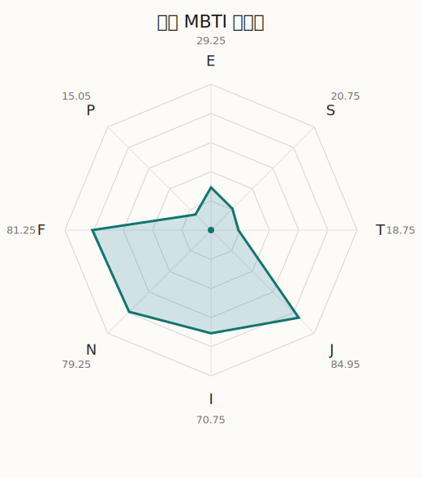

# 店长 MBTI 类型解释

- 角色名：LiveHouse 店长
- 最终类型：INFJ
- 备选类型：ENFJ
- 原始聚合类型：INFJ
- 采样轮次：10
- 主类型稳定度：9/10（90.0%）
- 原始聚合稳定度：9/10（90.0%）
- 置信度：高（58.1）
- 置信度方差：28.4745
- 题库：Open Jungian Type Scales (OJTS v2.1)（48 题）

## 类型概述

INFJ 的整体倾向是：更偏内在思考、抽象理解、价值判断和稳定收束。

## 人物核心

从外部设定与已整理剧情综合来看，店长的角色框架可以先理解为：当前尚未补入该角色的外部设定补充，因此这里只能更多依赖本地剧情切片与卡牌剧情来做保守整理。

## PDB 校核

- 已应用 PDB 主参考：来源 `personality-database.com`。
- 权重分配：PDB 50% / 人设概要 25% / 卡牌剧情 15% / 剧情切片 10%。
- PDB 类型排序：`INFJ`
- 最终类型先按 PDB 最高票定锚：`INFJ`
- 指定锁定类型：`INFJ`
## 为什么是这个类型

- `I > E`（70.75 : 29.25，平均轴差 22.45，方差 100.6586）：更常先在内部消化，再选择性地向外表达立场。
- `N > S`（79.25 : 20.75，平均轴差 48.12，方差 110.7032）：更常从意义、可能性、方向感和隐含主题去理解问题。
- `F > T`（81.25 : 18.75，平均轴差 42.24，方差 65.0592）：更常把感受、关系、价值和对人的回应放在判断前列。
- `J > P`（84.95 : 15.05，平均轴差 77.77，方差 32.6630）：更常用计划、收束、安排和责任结构去降低混乱。

## 为什么不是备选类型

最接近的备选类型是 `ENFJ`。它与主类型 `INFJ` 的差别主要落在 `EI` 这一轴上。
最终仍保留 `I`，因为该轴平均优势还有 `41.50`，虽然会波动，但整体没有被 `E` 反超。虽然也会参与群体互动，但资料里更常表现为先内化、后表达的节奏。

## 四维结果

- `EI`：E 29.25 / I 70.75，轴差方差 100.6586
- `SN`：S 20.75 / N 79.25，轴差方差 110.7032
- `FT`：F 81.25 / T 18.75，轴差方差 65.0592
- `JP`：J 84.95 / P 15.05，轴差方差 32.6630

## 八维数据

- `E`：均值 29.25，方差 32.2899
- `S`：均值 20.75，方差 27.6758
- `T`：均值 18.75，方差 16.2648
- `J`：均值 84.95，方差 8.1657
- `I`：均值 70.75，方差 32.2899
- `N`：均值 79.25，方差 27.6758
- `F`：均值 81.25，方差 16.2648
- `P`：均值 15.05，方差 8.1657

## 类型稳定性

- `INFJ`：9 次（90.0%）
- `ENFJ`：1 次（10.0%）

## 图表

## 证据依据

- 人物概述：从外部设定与已整理剧情综合来看，店长的角色框架可以先理解为：当前尚未补入该角色的外部设定补充，因此这里只能更多依赖本地剧情切片与卡牌剧情来做保守整理。
- 卡牌剧情：当前没有归到该角色名下的卡牌剧情，因此暂时无法从私人篇章、节庆篇章或回忆篇章里继续补正人物侧面。
- 剧情切片：在已整理的 100 条主线/乐团剧情切片里，店长同时覆盖主线推进（8）和乐队内部关系（92）两条线。这说明这个角色在本地语料中的位置，不应该只从单句台词去读，而要放回到持续出现的关系链和章节位置里看。

## 模拟作答概览

| 题号 | 题目/两端描述 | 平均作答 | 作答方差 | 平均倾向值 | 倾向方差 |
| --- | --- | --- | --- | --- | --- |
| 1 | I don&lsquo;t like to draw attention to myself. | 3.10 | 0.2900 | 7.76 | 374.9737 |
| 2 | I hate situations where people expect me to be funny. | 3.10 | 0.0900 | 7.17 | 246.8241 |
| 3 | I hold back my opinions. | 3.20 | 0.1600 | 7.40 | 404.0594 |
| 4 | I want a huge social circle. | 2.10 | 0.0900 | -39.04 | 120.1720 |
| 5 | I am the life of the party. | 2.20 | 0.1600 | -29.90 | 179.9459 |
| 6 | I make lots of noise. | 2.30 | 0.2100 | -32.51 | 206.2342 |
| 7 | I avoid philosophical discussions. | 2.00 | 0.4000 | -39.49 | 279.8082 |
| 8 | I don&apos;t like to analyze literature. | 2.10 | 0.0900 | -40.61 | 135.2771 |
| 9 | I am attached to conventional ways. | 1.80 | 0.3600 | -40.00 | 280.4512 |
| 10 | I love to read challenging material. | 4.00 | 0.0000 | 49.55 | 14.7663 |
| 11 | I look for hidden meanings in things. | 3.90 | 0.0900 | 38.53 | 162.1952 |
| 12 | I am curious about everything. | 4.10 | 0.0900 | 39.86 | 107.4095 |
| 13 | I want to experience passion and romance. | 4.00 | 0.0000 | 41.87 | 48.3914 |
| 14 | I am deeply moved by others&lsquo; misfortunes. | 4.10 | 0.0900 | 41.45 | 156.6858 |
| 15 | I listen to my feelings when making important decisions. | 3.90 | 0.0900 | 43.38 | 112.3310 |
| 16 | I prize logic above all else. | 1.90 | 0.2900 | -46.75 | 179.8193 |
| 17 | I don&lsquo;t understand people who get emotional. | 2.00 | 0.0000 | -38.74 | 54.3566 |
| 18 | I&apos;d rather be feared than loved. | 2.00 | 0.0000 | -41.37 | 140.2741 |
| 19 | I like order. | 4.30 | 0.2100 | 51.83 | 103.5059 |
| 20 | I do things according to a plan. | 4.10 | 0.2900 | 48.35 | 227.8965 |
| 21 | I am always prepared. | 4.10 | 0.0900 | 46.44 | 98.7097 |
| 22 | I often make last-minute plans. | 1.00 | 0.0000 | -80.38 | 82.9731 |
| 23 | I do things for no apparent reason. | 1.00 | 0.0000 | -81.26 | 57.6481 |
| 24 | It takes me days to do things that should take hours because I keep getting distracted. | 1.00 | 0.0000 | -77.50 | 52.2351 |
| 25 | I work on improving myself. | 4.00 | 0.0000 | 44.76 | 88.5279 |
| 26 | I always feel like I need to be doing something important. | 4.00 | 0.2000 | 42.56 | 187.9950 |
| 27 | I have unusual beliefs about the world. | 2.10 | 0.0900 | -31.55 | 51.6602 |
| 28 | I dislike routine. | 2.10 | 0.0900 | -35.45 | 108.7000 |
| 29 | I try my best to follow the rules. | 3.00 | 0.0000 | 8.33 | 125.2713 |
| 30 | I respect authority. | 3.00 | 0.2000 | 3.54 | 225.2332 |
| 31 | I like to take it easy. | 1.00 | 0.0000 | -76.39 | 91.8421 |
| 32 | I choose the easy way. | 1.10 | 0.0900 | -73.12 | 59.0665 |
| 33 | I tell other people my secrets. | 3.20 | 0.1600 | 5.77 | 247.5485 |
| 34 | I make big gestures of friendship to people. | 3.10 | 0.0900 | 0.58 | 202.2523 |
| 35 | I enjoy challenges and competition. | 1.90 | 0.0900 | -43.55 | 192.0198 |
| 36 | I have very high self-esteem. | 2.10 | 0.0900 | -43.30 | 159.0870 |
| 37 | I get embarrassed easily. | 3.10 | 0.0900 | 7.97 | 163.5192 |
| 38 | I become overwhelmed by events. | 3.00 | 0.0000 | -0.17 | 80.9763 |
| 39 | I have difficulty expressing my feelings. | 2.20 | 0.3600 | -32.74 | 391.7028 |
| 40 | I don&apos;t trust others easily. | 2.30 | 0.2100 | -31.35 | 146.5359 |
| 41 | skeptical <-> wants to believe | 4.00 | 0.2000 | 39.85 | 164.3689 |
| 42 | chaotic <-> organized | 4.90 | 0.0900 | 75.25 | 134.1206 |
| 43 | wants the big picture <-> wants the details | 1.20 | 0.1600 | -69.56 | 105.4441 |
| 44 | energetic <-> mellow | 3.90 | 0.0900 | 35.70 | 202.3513 |
| 45 | follows the heart <-> follows the head | 2.10 | 0.0900 | -38.93 | 128.5821 |
| 46 | prepares <-> improvises | 1.90 | 0.0900 | -42.24 | 165.0993 |
| 47 | focused on the present <-> focused on the future | 3.80 | 0.1600 | 36.06 | 120.5889 |
| 48 | works best alone <-> works best in groups | 2.10 | 0.0900 | -38.77 | 163.5134 |

## 题库来源

- [OJTS 官方题目页](https://openpsychometrics.org/tests/OJTS/)
- 许可证：CC BY-NC-SA 4.0
- [本地题库文件](../ojts_question_bank_v2_1.json)
