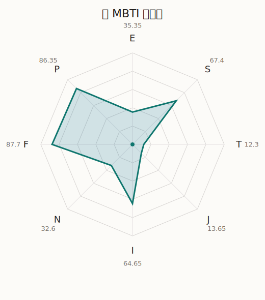

# 兰 MBTI 类型解释

- 角色名：美竹兰
- 最终类型：ISFP
- 备选类型：ESFP
- 原始聚合类型：ISFP
- 采样轮次：10
- 主类型稳定度：9/10（90.0%）
- 原始聚合稳定度：9/10（90.0%）
- 置信度：高（53.05）
- 置信度方差：28.4424
- 题库：Open Jungian Type Scales (OJTS v2.1)（48 题）

## 类型概述

ISFP 的整体倾向是：更偏内在体验、现实感受、情感判断和自由保留。

## 人物核心

从外部设定与已整理剧情综合来看，兰的角色框架可以先理解为：外部资料中的兰通常是冷静、倔强、带一点不坦率感的主唱。她很重视幼驯染关系，也很抗拒那些会让“现在的同伴关系”变质的变化，因此她的强硬很多时候都和珍惜有关。

## PDB 校核

- 已应用 PDB 主参考：来源 `personality-database.com`。
- 权重分配：PDB 50% / 人设概要 25% / 卡牌剧情 15% / 剧情切片 10%。
- PDB 类型排序：`ISFP`
- 最终类型先按 PDB 最高票定锚：`ISFP`
- 指定锁定类型：`ISFP`
## 为什么是这个类型

- `I > E`（64.65 : 35.35，平均轴差 25.33，方差 146.5699）：更常先在内部消化，再选择性地向外表达立场。
- `S > N`（67.40 : 32.60，平均轴差 30.66，方差 484.5606）：更常依赖现实条件、具体细节和当下经验来判断局面。
- `F > T`（87.70 : 12.30，平均轴差 66.84，方差 83.3353）：更常把感受、关系、价值和对人的回应放在判断前列。
- `P > J`（86.35 : 13.65，平均轴差 59.64，方差 37.6346）：更常保留空间，依靠灵活调整和临场变化推进事情。

## 为什么不是备选类型

最接近的备选类型是 `ESFP`。它与主类型 `ISFP` 的差别主要落在 `EI` 这一轴上。
最终仍保留 `I`，因为该轴平均优势还有 `29.30`，虽然会波动，但整体没有被 `E` 反超。虽然也会参与群体互动，但资料里更常表现为先内化、后表达的节奏。

## 四维结果

- `EI`：E 35.35 / I 64.65，轴差方差 146.5699
- `SN`：S 67.40 / N 32.60，轴差方差 484.5606
- `FT`：F 87.70 / T 12.30，轴差方差 83.3353
- `JP`：J 13.65 / P 86.35，轴差方差 37.6346

## 八维数据

- `E`：均值 35.35，方差 95.5845
- `S`：均值 67.40，方差 121.1402
- `T`：均值 12.30，方差 20.8338
- `J`：均值 13.65，方差 9.4086
- `I`：均值 64.65，方差 95.5845
- `N`：均值 32.60，方差 121.1402
- `F`：均值 87.70，方差 20.8338
- `P`：均值 86.35，方差 9.4086

## 类型稳定性

- `ISFP`：9 次（90.0%）
- `ESFP`：1 次（10.0%）

## 图表

## 证据依据

- 人物概述：从外部设定与已整理剧情综合来看，兰的角色框架可以先理解为：外部资料中的兰通常是冷静、倔强、带一点不坦率感的主唱。她很重视幼驯染关系，也很抗拒那些会让“现在的同伴关系”变质的变化，因此她的强硬很多时候都和珍惜有关。
- 卡牌剧情：在 114 条卡牌剧情里，兰 的个人篇章补完相对丰富；这部分更适合用来观察角色的私下状态、非主线场合下的关系重心，以及主线之外的稳定人格表现。
- 剧情切片：在已整理的 412 条主线/乐团剧情切片里，兰同时覆盖主线推进（96）和乐队内部关系（316）两条线。这说明这个角色在本地语料中的位置，不应该只从单句台词去读，而要放回到持续出现的关系链和章节位置里看。

## 模拟作答概览

| 题号 | 题目/两端描述 | 平均作答 | 作答方差 | 平均倾向值 | 倾向方差 |
| --- | --- | --- | --- | --- | --- |
| 1 | I don&lsquo;t like to draw attention to myself. | 2.90 | 0.2900 | -10.72 | 379.7702 |
| 2 | I hate situations where people expect me to be funny. | 2.80 | 0.1600 | -13.35 | 342.6580 |
| 3 | I hold back my opinions. | 2.80 | 0.1600 | -13.10 | 144.2266 |
| 4 | I want a huge social circle. | 1.70 | 0.2100 | -49.55 | 122.9918 |
| 5 | I am the life of the party. | 1.90 | 0.2900 | -48.14 | 281.5685 |
| 6 | I make lots of noise. | 1.90 | 0.2900 | -45.71 | 287.6561 |
| 7 | I avoid philosophical discussions. | 2.90 | 0.2900 | -5.12 | 318.4140 |
| 8 | I don&apos;t like to analyze literature. | 3.00 | 0.2000 | -4.72 | 431.8063 |
| 9 | I am attached to conventional ways. | 2.60 | 0.2400 | -10.47 | 169.3415 |
| 10 | I love to read challenging material. | 1.60 | 0.2400 | -59.60 | 325.4257 |
| 11 | I look for hidden meanings in things. | 1.70 | 0.2100 | -55.43 | 238.9093 |
| 12 | I am curious about everything. | 1.70 | 0.4100 | -51.02 | 372.2095 |
| 13 | I want to experience passion and romance. | 3.50 | 0.2500 | 19.58 | 147.9922 |
| 14 | I am deeply moved by others&lsquo; misfortunes. | 3.50 | 0.2500 | 20.23 | 215.7610 |
| 15 | I listen to my feelings when making important decisions. | 3.80 | 0.1600 | 27.80 | 46.6757 |
| 16 | I prize logic above all else. | 1.10 | 0.0900 | -81.94 | 185.3419 |
| 17 | I don&lsquo;t understand people who get emotional. | 1.00 | 0.0000 | -79.09 | 103.0486 |
| 18 | I&apos;d rather be feared than loved. | 1.10 | 0.0900 | -78.66 | 215.5882 |
| 19 | I like order. | 1.10 | 0.0900 | -83.67 | 138.0656 |
| 20 | I do things according to a plan. | 1.00 | 0.0000 | -81.31 | 73.5895 |
| 21 | I am always prepared. | 1.00 | 0.0000 | -83.46 | 37.7252 |
| 22 | I often make last-minute plans. | 3.50 | 0.2500 | 24.03 | 111.6152 |
| 23 | I do things for no apparent reason. | 3.50 | 0.4500 | 22.61 | 327.3630 |
| 24 | It takes me days to do things that should take hours because I keep getting distracted. | 3.40 | 0.2400 | 16.78 | 134.2785 |
| 25 | I work on improving myself. | 1.10 | 0.0900 | -70.34 | 90.0439 |
| 26 | I always feel like I need to be doing something important. | 1.20 | 0.1600 | -68.18 | 85.0789 |
| 27 | I have unusual beliefs about the world. | 2.80 | 0.1600 | -10.90 | 185.7046 |
| 28 | I dislike routine. | 2.60 | 0.2400 | -19.39 | 155.1729 |
| 29 | I try my best to follow the rules. | 1.90 | 0.0900 | -42.56 | 74.7403 |
| 30 | I respect authority. | 1.90 | 0.0900 | -45.27 | 156.7927 |
| 31 | I like to take it easy. | 3.20 | 0.1600 | 7.10 | 229.9447 |
| 32 | I choose the easy way. | 3.20 | 0.3600 | 6.46 | 354.7374 |
| 33 | I tell other people my secrets. | 2.60 | 0.2400 | -9.05 | 250.3019 |
| 34 | I make big gestures of friendship to people. | 2.60 | 0.2400 | -16.88 | 106.6045 |
| 35 | I enjoy challenges and competition. | 1.30 | 0.2100 | -68.67 | 99.9073 |
| 36 | I have very high self-esteem. | 1.30 | 0.2100 | -69.25 | 143.8369 |
| 37 | I get embarrassed easily. | 3.10 | 0.0900 | 3.63 | 221.7975 |
| 38 | I become overwhelmed by events. | 3.00 | 0.0000 | 1.95 | 159.6247 |
| 39 | I have difficulty expressing my feelings. | 2.00 | 0.0000 | -44.50 | 125.7252 |
| 40 | I don&apos;t trust others easily. | 1.90 | 0.0900 | -47.37 | 115.9237 |
| 41 | skeptical <-> wants to believe | 4.40 | 0.2400 | 53.68 | 125.8510 |
| 42 | chaotic <-> organized | 3.00 | 0.0000 | -10.71 | 41.5700 |
| 43 | wants the big picture <-> wants the details | 2.60 | 0.2400 | -19.83 | 98.0555 |
| 44 | energetic <-> mellow | 2.50 | 0.4500 | -20.50 | 301.7236 |
| 45 | follows the heart <-> follows the head | 2.00 | 0.0000 | -44.91 | 89.8703 |
| 46 | prepares <-> improvises | 4.10 | 0.0900 | 50.14 | 56.5225 |
| 47 | focused on the present <-> focused on the future | 1.80 | 0.3600 | -44.27 | 371.9687 |
| 48 | works best alone <-> works best in groups | 2.60 | 0.2400 | -18.45 | 105.3734 |

## 题库来源

- [OJTS 官方题目页](https://openpsychometrics.org/tests/OJTS/)
- 许可证：CC BY-NC-SA 4.0
- [本地题库文件](../ojts_question_bank_v2_1.json)
