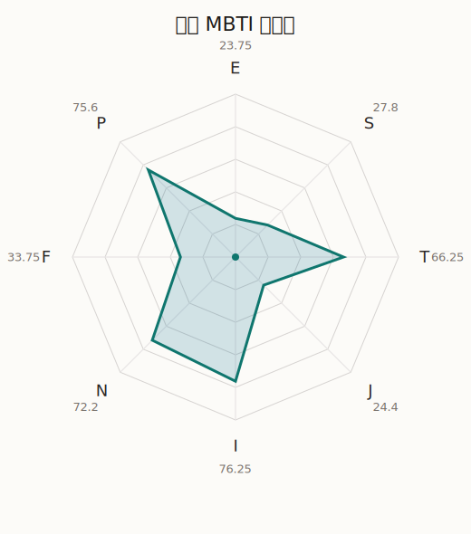

# 乐奈 MBTI 类型解释

- 角色名：要乐奈
- 最终类型：INTP
- 备选类型：INFP
- 原始聚合类型：INTP
- 采样轮次：10
- 主类型稳定度：9/10（90.0%）
- 原始聚合稳定度：9/10（90.0%）
- 置信度：高（45.15）
- 置信度方差：70.828
- 题库：Open Jungian Type Scales (OJTS v2.1)（48 题）

## 类型概述

INTP 的整体倾向是：更偏内在分析、抽象模型、逻辑拆解和开放推演。

## 人物核心

从外部设定与已整理剧情综合来看，乐奈的角色框架可以先理解为：外部角色介绍里的乐奈有非常强烈的野生感，像猫一样凭直觉行动，喜欢有趣和好吃的东西，也只会对真正打动自己的声音停下脚步。她并不是离群索居的冷角色，而是按自己的感受法则与世界发生连接。

## PDB 校核

- 已应用 PDB 主参考：来源 `personality-database.com`。
- 权重分配：PDB 50% / 人设概要 25% / 卡牌剧情 15% / 剧情切片 10%。
- PDB 类型排序：`INTP`
- 最终类型先按 PDB 最高票定锚：`INTP`
- 指定锁定类型：`INTP`
## 为什么是这个类型

- `I > E`（76.25 : 23.75，平均轴差 60.32，方差 193.4480）：更常先在内部消化，再选择性地向外表达立场。
- `N > S`（72.20 : 27.80，平均轴差 18.77，方差 143.1387）：更常从意义、可能性、方向感和隐含主题去理解问题。
- `T > F`（66.25 : 33.75，平均轴差 27.84，方差 256.4561）：更常把逻辑、结构、效率和标准一致性放在判断前列。
- `P > J`（75.60 : 24.40，平均轴差 39.77，方差 259.7484）：更常保留空间，依靠灵活调整和临场变化推进事情。

## 为什么不是备选类型

最接近的备选类型是 `INFP`。它与主类型 `INTP` 的差别主要落在 `FT` 这一轴上。
最终仍保留 `T`，因为该轴平均优势还有 `32.50`，虽然会波动，但整体没有被 `F` 反超。虽然也在意关系影响，但最终更常回到逻辑、标准和方法正确性来判断。

## 四维结果

- `EI`：E 23.75 / I 76.25，轴差方差 193.4480
- `SN`：S 27.80 / N 72.20，轴差方差 143.1387
- `FT`：F 33.75 / T 66.25，轴差方差 256.4561
- `JP`：J 24.40 / P 75.60，轴差方差 259.7484

## 八维数据

- `E`：均值 23.75，方差 48.3620
- `S`：均值 27.80，方差 35.7847
- `T`：均值 66.25，方差 64.1140
- `J`：均值 24.40，方差 64.9371
- `I`：均值 76.25，方差 48.3620
- `N`：均值 72.20，方差 35.7847
- `F`：均值 33.75，方差 64.1140
- `P`：均值 75.60，方差 64.9371

## 类型稳定性

- `INTP`：9 次（90.0%）
- `ISTP`：1 次（10.0%）

## 图表

## 证据依据

- 人物概述：从外部设定与已整理剧情综合来看，乐奈的角色框架可以先理解为：外部角色介绍里的乐奈有非常强烈的野生感，像猫一样凭直觉行动，喜欢有趣和好吃的东西，也只会对真正打动自己的声音停下脚步。她并不是离群索居的冷角色，而是按自己的感受法则与世界发生连接。
- 卡牌剧情：在 15 条卡牌剧情里，乐奈 的个人篇章补完已经有一定覆盖；这部分更适合用来观察角色的私下状态、非主线场合下的关系重心，以及主线之外的稳定人格表现。
- 剧情切片：在已整理的 54 条主线/乐团剧情切片里，乐奈目前更集中在乐队内部与团内关系剧情（54）。这说明这个角色在本地语料中的位置，不应该只从单句台词去读，而要放回到持续出现的关系链和章节位置里看。

## 模拟作答概览

| 题号 | 题目/两端描述 | 平均作答 | 作答方差 | 平均倾向值 | 倾向方差 |
| --- | --- | --- | --- | --- | --- |
| 1 | I don&lsquo;t like to draw attention to myself. | 3.40 | 0.2400 | 13.43 | 362.5303 |
| 2 | I hate situations where people expect me to be funny. | 3.40 | 0.2400 | 13.94 | 312.8731 |
| 3 | I hold back my opinions. | 3.80 | 0.1600 | 26.28 | 177.7737 |
| 4 | I want a huge social circle. | 1.30 | 0.2100 | -69.87 | 263.1150 |
| 5 | I am the life of the party. | 1.20 | 0.1600 | -74.02 | 124.5984 |
| 6 | I make lots of noise. | 1.10 | 0.0900 | -76.75 | 145.5763 |
| 7 | I avoid philosophical discussions. | 2.60 | 0.2400 | -20.36 | 215.0641 |
| 8 | I don&apos;t like to analyze literature. | 2.30 | 0.2100 | -24.84 | 131.3112 |
| 9 | I am attached to conventional ways. | 2.50 | 0.2500 | -27.19 | 141.2496 |
| 10 | I love to read challenging material. | 2.70 | 0.2100 | -12.67 | 282.9602 |
| 11 | I look for hidden meanings in things. | 2.60 | 0.2400 | -16.15 | 294.6077 |
| 12 | I am curious about everything. | 2.90 | 0.2900 | -7.27 | 237.8448 |
| 13 | I want to experience passion and romance. | 2.50 | 0.2500 | -28.62 | 234.8971 |
| 14 | I am deeply moved by others&lsquo; misfortunes. | 2.50 | 0.4500 | -21.71 | 529.5633 |
| 15 | I listen to my feelings when making important decisions. | 2.40 | 0.2400 | -26.80 | 82.0582 |
| 16 | I prize logic above all else. | 3.60 | 0.2400 | 27.98 | 151.1546 |
| 17 | I don&lsquo;t understand people who get emotional. | 3.70 | 0.2100 | 25.87 | 312.1317 |
| 18 | I&apos;d rather be feared than loved. | 3.60 | 0.2400 | 25.81 | 204.7289 |
| 19 | I like order. | 1.40 | 0.2400 | -62.84 | 156.3885 |
| 20 | I do things according to a plan. | 1.40 | 0.2400 | -60.23 | 166.3314 |
| 21 | I am always prepared. | 1.30 | 0.2100 | -65.07 | 95.7091 |
| 22 | I often make last-minute plans. | 3.00 | 0.2000 | 0.81 | 252.9804 |
| 23 | I do things for no apparent reason. | 3.10 | 0.0900 | 6.26 | 366.8693 |
| 24 | It takes me days to do things that should take hours because I keep getting distracted. | 3.20 | 0.1600 | 6.99 | 226.4951 |
| 25 | I work on improving myself. | 2.10 | 0.0900 | -31.61 | 162.7916 |
| 26 | I always feel like I need to be doing something important. | 2.10 | 0.2900 | -36.72 | 216.4982 |
| 27 | I have unusual beliefs about the world. | 3.00 | 0.4000 | -1.98 | 377.5907 |
| 28 | I dislike routine. | 2.80 | 0.1600 | -3.67 | 250.2502 |
| 29 | I try my best to follow the rules. | 1.60 | 0.2400 | -56.27 | 74.8728 |
| 30 | I respect authority. | 1.50 | 0.2500 | -61.80 | 103.0937 |
| 31 | I like to take it easy. | 2.40 | 0.2400 | -23.53 | 161.8859 |
| 32 | I choose the easy way. | 2.40 | 0.2400 | -28.74 | 198.7692 |
| 33 | I tell other people my secrets. | 1.50 | 0.2500 | -62.17 | 149.6168 |
| 34 | I make big gestures of friendship to people. | 1.10 | 0.0900 | -69.18 | 69.6287 |
| 35 | I enjoy challenges and competition. | 1.90 | 0.0900 | -39.02 | 199.5108 |
| 36 | I have very high self-esteem. | 2.10 | 0.0900 | -39.89 | 180.3102 |
| 37 | I get embarrassed easily. | 2.50 | 0.2500 | -19.57 | 153.9875 |
| 38 | I become overwhelmed by events. | 2.50 | 0.2500 | -23.48 | 190.7527 |
| 39 | I have difficulty expressing my feelings. | 3.00 | 0.0000 | 6.71 | 89.5271 |
| 40 | I don&apos;t trust others easily. | 2.90 | 0.0900 | 1.96 | 288.2517 |
| 41 | skeptical <-> wants to believe | 2.50 | 0.2500 | -21.19 | 244.7444 |
| 42 | chaotic <-> organized | 3.20 | 0.1600 | 3.68 | 315.8328 |
| 43 | wants the big picture <-> wants the details | 1.70 | 0.2100 | -58.41 | 162.6666 |
| 44 | energetic <-> mellow | 4.10 | 0.2900 | 44.73 | 224.4052 |
| 45 | follows the heart <-> follows the head | 3.70 | 0.2100 | 30.35 | 156.9761 |
| 46 | prepares <-> improvises | 3.90 | 0.0900 | 32.96 | 67.1709 |
| 47 | focused on the present <-> focused on the future | 2.80 | 0.1600 | -14.35 | 89.4184 |
| 48 | works best alone <-> works best in groups | 2.00 | 0.2000 | -37.57 | 289.0909 |

## 题库来源

- [OJTS 官方题目页](https://openpsychometrics.org/tests/OJTS/)
- 许可证：CC BY-NC-SA 4.0
- [本地题库文件](../ojts_question_bank_v2_1.json)
