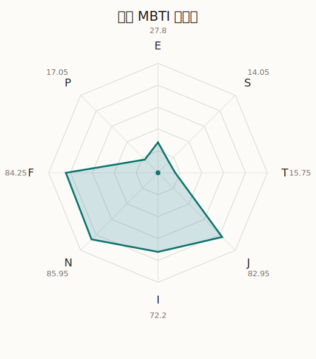

# 瑞依 MBTI 类型解释

- 角色名：和奏瑞依
- 最终类型：INFJ
- 备选类型：ENFJ
- 原始聚合类型：INFJ
- 采样轮次：10
- 主类型稳定度：9/10（90.0%）
- 原始聚合稳定度：9/10（90.0%）
- 置信度：高（62.68）
- 置信度方差：50.5718
- 题库：Open Jungian Type Scales (OJTS v2.1)（48 题）

## 类型概述

INFJ 的整体倾向是：更偏内在思考、抽象理解、价值判断和稳定收束。

## 人物核心

从外部设定与已整理剧情综合来看，瑞依的角色框架可以先理解为：外部角色介绍里的蕾依常被写成沉稳、成熟、唱功与存在感都很强的主唱。她带着职业感和距离感进入关系，但又不是冷漠型人物，而是会先确认自己是否真的认同一件事，才决定投入多深。

## PDB 校核

- 已应用 PDB 主参考：来源 `personality-database.com`。
- 权重分配：PDB 50% / 人设概要 25% / 卡牌剧情 15% / 剧情切片 10%。
- PDB 类型排序：`INFJ`
- 最终类型先按 PDB 最高票定锚：`INFJ`
- 指定锁定类型：`INFJ`
## 为什么是这个类型

- `I > E`（72.20 : 27.80，平均轴差 37.70，方差 470.1600）：更常先在内部消化，再选择性地向外表达立场。
- `N > S`（85.95 : 14.05，平均轴差 53.26，方差 72.4784）：更常从意义、可能性、方向感和隐含主题去理解问题。
- `F > T`（84.25 : 15.75，平均轴差 68.77，方差 61.8674）：更常把感受、关系、价值和对人的回应放在判断前列。
- `J > P`（82.95 : 17.05，平均轴差 75.62，方差 65.1343）：更常用计划、收束、安排和责任结构去降低混乱。

## 为什么不是备选类型

最接近的备选类型是 `ENFJ`。它与主类型 `INFJ` 的差别主要落在 `EI` 这一轴上。
最终仍保留 `I`，因为该轴平均优势还有 `44.40`，虽然会波动，但整体没有被 `E` 反超。虽然也会参与群体互动，但资料里更常表现为先内化、后表达的节奏。

## 四维结果

- `EI`：E 27.80 / I 72.20，轴差方差 470.1600
- `SN`：S 14.05 / N 85.95，轴差方差 72.4784
- `FT`：F 84.25 / T 15.75，轴差方差 61.8674
- `JP`：J 82.95 / P 17.05，轴差方差 65.1343

## 八维数据

- `E`：均值 27.80，方差 117.5400
- `S`：均值 14.05，方差 18.1196
- `T`：均值 15.75，方差 15.4669
- `J`：均值 82.95，方差 16.2836
- `I`：均值 72.20，方差 117.5400
- `N`：均值 85.95，方差 18.1196
- `F`：均值 84.25，方差 15.4669
- `P`：均值 17.05，方差 16.2836

## 类型稳定性

- `INFJ`：9 次（90.0%）
- `ENFJ`：1 次（10.0%）

## 图表

## 证据依据

- 人物概述：从外部设定与已整理剧情综合来看，瑞依的角色框架可以先理解为：外部角色介绍里的蕾依常被写成沉稳、成熟、唱功与存在感都很强的主唱。她带着职业感和距离感进入关系，但又不是冷漠型人物，而是会先确认自己是否真的认同一件事，才决定投入多深。
- 卡牌剧情：在 52 条卡牌剧情里，瑞依 的个人篇章补完相对丰富；这部分更适合用来观察角色的私下状态、非主线场合下的关系重心，以及主线之外的稳定人格表现。
- 剧情切片：在已整理的 152 条主线/乐团剧情切片里，瑞依同时覆盖主线推进（11）和乐队内部关系（141）两条线。这说明这个角色在本地语料中的位置，不应该只从单句台词去读，而要放回到持续出现的关系链和章节位置里看。

## 模拟作答概览

| 题号 | 题目/两端描述 | 平均作答 | 作答方差 | 平均倾向值 | 倾向方差 |
| --- | --- | --- | --- | --- | --- |
| 1 | I don&lsquo;t like to draw attention to myself. | 3.10 | 0.0900 | -0.23 | 118.8453 |
| 2 | I hate situations where people expect me to be funny. | 2.80 | 0.3600 | -5.84 | 296.0898 |
| 3 | I hold back my opinions. | 3.10 | 0.2900 | 0.18 | 424.0009 |
| 4 | I want a huge social circle. | 1.60 | 0.2400 | -58.54 | 147.2330 |
| 5 | I am the life of the party. | 1.40 | 0.2400 | -59.57 | 186.3399 |
| 6 | I make lots of noise. | 1.60 | 0.2400 | -57.94 | 198.0465 |
| 7 | I avoid philosophical discussions. | 1.80 | 0.1600 | -46.94 | 117.1050 |
| 8 | I don&apos;t like to analyze literature. | 1.50 | 0.2500 | -58.15 | 280.9337 |
| 9 | I am attached to conventional ways. | 1.80 | 0.1600 | -48.21 | 211.9217 |
| 10 | I love to read challenging material. | 4.30 | 0.2100 | 53.06 | 115.4347 |
| 11 | I look for hidden meanings in things. | 4.30 | 0.2100 | 52.10 | 295.7841 |
| 12 | I am curious about everything. | 4.20 | 0.1600 | 52.89 | 49.2468 |
| 13 | I want to experience passion and romance. | 4.10 | 0.0900 | 51.39 | 151.2390 |
| 14 | I am deeply moved by others&lsquo; misfortunes. | 4.30 | 0.2100 | 54.54 | 139.8080 |
| 15 | I listen to my feelings when making important decisions. | 4.10 | 0.0900 | 51.35 | 86.2623 |
| 16 | I prize logic above all else. | 1.10 | 0.0900 | -79.17 | 104.1152 |
| 17 | I don&lsquo;t understand people who get emotional. | 1.00 | 0.0000 | -82.03 | 87.8762 |
| 18 | I&apos;d rather be feared than loved. | 1.10 | 0.0900 | -79.14 | 99.1893 |
| 19 | I like order. | 4.00 | 0.0000 | 43.06 | 76.6659 |
| 20 | I do things according to a plan. | 4.10 | 0.0900 | 49.98 | 75.6139 |
| 21 | I am always prepared. | 4.10 | 0.0900 | 44.18 | 65.7053 |
| 22 | I often make last-minute plans. | 1.00 | 0.0000 | -80.18 | 81.4280 |
| 23 | I do things for no apparent reason. | 1.00 | 0.0000 | -78.10 | 75.3976 |
| 24 | It takes me days to do things that should take hours because I keep getting distracted. | 1.10 | 0.0900 | -75.12 | 50.7759 |
| 25 | I work on improving myself. | 4.20 | 0.1600 | 49.03 | 90.3950 |
| 26 | I always feel like I need to be doing something important. | 4.20 | 0.1600 | 50.43 | 122.6985 |
| 27 | I have unusual beliefs about the world. | 2.30 | 0.2100 | -27.13 | 143.9147 |
| 28 | I dislike routine. | 2.30 | 0.2100 | -30.62 | 201.6201 |
| 29 | I try my best to follow the rules. | 3.00 | 0.2000 | -2.64 | 180.4740 |
| 30 | I respect authority. | 3.00 | 0.2000 | -2.95 | 248.4177 |
| 31 | I like to take it easy. | 1.00 | 0.0000 | -79.13 | 32.9254 |
| 32 | I choose the easy way. | 1.00 | 0.0000 | -80.73 | 14.9053 |
| 33 | I tell other people my secrets. | 2.60 | 0.2400 | -20.12 | 166.1215 |
| 34 | I make big gestures of friendship to people. | 2.70 | 0.2100 | -15.70 | 48.1254 |
| 35 | I enjoy challenges and competition. | 1.10 | 0.0900 | -68.48 | 123.3440 |
| 36 | I have very high self-esteem. | 1.30 | 0.2100 | -66.17 | 84.0638 |
| 37 | I get embarrassed easily. | 3.10 | 0.2900 | 4.83 | 483.3556 |
| 38 | I become overwhelmed by events. | 3.00 | 0.0000 | 3.52 | 222.0790 |
| 39 | I have difficulty expressing my feelings. | 2.00 | 0.0000 | -43.18 | 58.0087 |
| 40 | I don&apos;t trust others easily. | 1.90 | 0.0900 | -43.33 | 136.2274 |
| 41 | skeptical <-> wants to believe | 4.00 | 0.0000 | 45.66 | 49.7737 |
| 42 | chaotic <-> organized | 4.90 | 0.0900 | 77.45 | 69.6343 |
| 43 | wants the big picture <-> wants the details | 1.00 | 0.0000 | -83.57 | 41.8853 |
| 44 | energetic <-> mellow | 3.70 | 0.2100 | 29.06 | 116.7437 |
| 45 | follows the heart <-> follows the head | 1.80 | 0.1600 | -49.48 | 101.0386 |
| 46 | prepares <-> improvises | 1.90 | 0.0900 | -41.91 | 103.4842 |
| 47 | focused on the present <-> focused on the future | 3.40 | 0.4400 | 9.89 | 317.6323 |
| 48 | works best alone <-> works best in groups | 2.40 | 0.2400 | -27.78 | 101.5349 |

## 题库来源

- [OJTS 官方题目页](https://openpsychometrics.org/tests/OJTS/)
- 许可证：CC BY-NC-SA 4.0
- [本地题库文件](../ojts_question_bank_v2_1.json)
