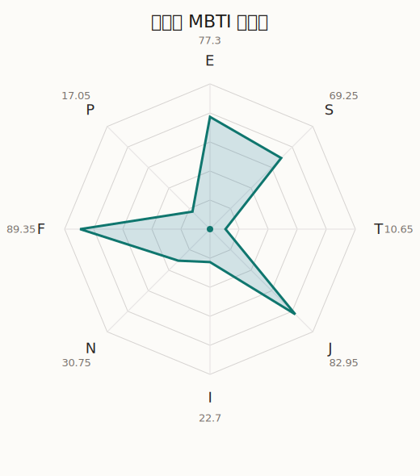

# 令王那 MBTI 类型解释

- 角色名：鳰原令王那
- 最终类型：ESFJ
- 备选类型：ENFJ
- 原始聚合类型：ESFJ
- 采样轮次：10
- 主类型稳定度：9/10（90.0%）
- 原始聚合稳定度：9/10（90.0%）
- 置信度：高（59.43）
- 置信度方差：18.1227
- 题库：Open Jungian Type Scales (OJTS v2.1)（48 题）

## 类型概述

ESFJ 的整体倾向是：更偏外向关系、现实执行、情感照料和稳定组织。

## 人物核心

从外部设定与已整理剧情综合来看，令王那的角色框架可以先理解为：外部资料里的玲奈以 PAREO 形象活动，喜欢可爱事物、追星热情很强，也对 CHU2 带有近乎绝对的忠诚。她的设定看起来很偶像宅，但真正有趣的地方在于她会把热爱、崇拜和执行力全部压进自己的表演里。

## PDB 校核

- 已应用 PDB 主参考：来源 `personality-database.com`。
- 权重分配：PDB 50% / 人设概要 25% / 卡牌剧情 15% / 剧情切片 10%。
- PDB 类型排序：`ESFJ`
- 最终类型先按 PDB 最高票定锚：`ESFJ`
- 指定锁定类型：`ESFJ`
## 为什么是这个类型

- `E > I`（77.30 : 22.70，平均轴差 50.42，方差 176.2036）：更常通过主动互动、公开表达或带动现场来处理问题。
- `S > N`（69.25 : 30.75，平均轴差 20.69，方差 182.3574）：更常依赖现实条件、具体细节和当下经验来判断局面。
- `F > T`（89.35 : 10.65，平均轴差 70.13，方差 20.3763）：更常把感受、关系、价值和对人的回应放在判断前列。
- `J > P`（82.95 : 17.05，平均轴差 72.46，方差 62.0512）：更常用计划、收束、安排和责任结构去降低混乱。

## 为什么不是备选类型

最接近的备选类型是 `ENFJ`。它与主类型 `ESFJ` 的差别主要落在 `SN` 这一轴上。
最终仍保留 `S`，因为该轴平均优势还有 `38.50`，虽然会波动，但整体没有被 `N` 反超。虽然也会谈到意义和理想，但资料里更常落到现实条件、细节和可执行层面。

## 四维结果

- `EI`：E 77.30 / I 22.70，轴差方差 176.2036
- `SN`：S 69.25 / N 30.75，轴差方差 182.3574
- `FT`：F 89.35 / T 10.65，轴差方差 20.3763
- `JP`：J 82.95 / P 17.05，轴差方差 62.0512

## 八维数据

- `E`：均值 77.30，方差 44.0509
- `S`：均值 69.25，方差 52.5897
- `T`：均值 10.65，方差 5.0941
- `J`：均值 82.95，方差 15.5128
- `I`：均值 22.70，方差 44.0509
- `N`：均值 30.75，方差 52.5897
- `F`：均值 89.35，方差 5.0941
- `P`：均值 17.05，方差 15.5128

## 类型稳定性

- `ESFJ`：9 次（90.0%）
- `ENFJ`：1 次（10.0%）

## 图表

## 证据依据

- 人物概述：从外部设定与已整理剧情综合来看，令王那的角色框架可以先理解为：外部资料里的玲奈以 PAREO 形象活动，喜欢可爱事物、追星热情很强，也对 CHU2 带有近乎绝对的忠诚。她的设定看起来很偶像宅，但真正有趣的地方在于她会把热爱、崇拜和执行力全部压进自己的表演里。
- 卡牌剧情：在 47 条卡牌剧情里，令王那 的个人篇章补完相对丰富；这部分更适合用来观察角色的私下状态、非主线场合下的关系重心，以及主线之外的稳定人格表现。
- 剧情切片：在已整理的 149 条主线/乐团剧情切片里，令王那同时覆盖主线推进（11）和乐队内部关系（138）两条线。这说明这个角色在本地语料中的位置，不应该只从单句台词去读，而要放回到持续出现的关系链和章节位置里看。

## 模拟作答概览

| 题号 | 题目/两端描述 | 平均作答 | 作答方差 | 平均倾向值 | 倾向方差 |
| --- | --- | --- | --- | --- | --- |
| 1 | I don&lsquo;t like to draw attention to myself. | 1.40 | 0.2400 | -68.75 | 188.2156 |
| 2 | I hate situations where people expect me to be funny. | 1.30 | 0.2100 | -69.38 | 155.4242 |
| 3 | I hold back my opinions. | 1.40 | 0.2400 | -69.43 | 168.5101 |
| 4 | I want a huge social circle. | 3.10 | 0.0900 | -0.33 | 191.0336 |
| 5 | I am the life of the party. | 3.20 | 0.1600 | 16.22 | 328.7244 |
| 6 | I make lots of noise. | 3.10 | 0.0900 | 7.43 | 217.4330 |
| 7 | I avoid philosophical discussions. | 3.00 | 0.0000 | 0.25 | 163.4113 |
| 8 | I don&apos;t like to analyze literature. | 3.00 | 0.2000 | -3.47 | 226.8882 |
| 9 | I am attached to conventional ways. | 3.10 | 0.2900 | 0.65 | 467.2017 |
| 10 | I love to read challenging material. | 2.20 | 0.1600 | -32.41 | 228.3414 |
| 11 | I look for hidden meanings in things. | 2.40 | 0.2400 | -25.21 | 354.3518 |
| 12 | I am curious about everything. | 2.50 | 0.2500 | -25.55 | 218.4191 |
| 13 | I want to experience passion and romance. | 4.30 | 0.2100 | 53.08 | 51.9468 |
| 14 | I am deeply moved by others&lsquo; misfortunes. | 4.20 | 0.1600 | 53.34 | 84.1474 |
| 15 | I listen to my feelings when making important decisions. | 4.40 | 0.2400 | 56.73 | 38.7827 |
| 16 | I prize logic above all else. | 1.00 | 0.0000 | -83.27 | 51.3447 |
| 17 | I don&lsquo;t understand people who get emotional. | 1.00 | 0.0000 | -84.10 | 47.3224 |
| 18 | I&apos;d rather be feared than loved. | 1.00 | 0.0000 | -84.99 | 61.7643 |
| 19 | I like order. | 4.00 | 0.0000 | 46.12 | 49.5570 |
| 20 | I do things according to a plan. | 3.90 | 0.0900 | 40.38 | 157.9157 |
| 21 | I am always prepared. | 4.00 | 0.0000 | 45.32 | 55.4204 |
| 22 | I often make last-minute plans. | 1.00 | 0.0000 | -75.30 | 73.7471 |
| 23 | I do things for no apparent reason. | 1.10 | 0.0900 | -76.13 | 167.6739 |
| 24 | It takes me days to do things that should take hours because I keep getting distracted. | 1.10 | 0.0900 | -74.19 | 148.1286 |
| 25 | I work on improving myself. | 3.20 | 0.1600 | 7.51 | 134.4533 |
| 26 | I always feel like I need to be doing something important. | 3.10 | 0.2900 | 6.74 | 212.7070 |
| 27 | I have unusual beliefs about the world. | 1.10 | 0.0900 | -66.13 | 156.8192 |
| 28 | I dislike routine. | 1.30 | 0.2100 | -64.94 | 118.6404 |
| 29 | I try my best to follow the rules. | 3.00 | 0.0000 | 1.69 | 72.7831 |
| 30 | I respect authority. | 3.20 | 0.3600 | 10.71 | 335.4106 |
| 31 | I like to take it easy. | 2.10 | 0.0900 | -42.56 | 144.0304 |
| 32 | I choose the easy way. | 2.20 | 0.1600 | -33.49 | 121.7256 |
| 33 | I tell other people my secrets. | 3.60 | 0.2400 | 29.67 | 306.0056 |
| 34 | I make big gestures of friendship to people. | 3.50 | 0.2500 | 24.33 | 107.1942 |
| 35 | I enjoy challenges and competition. | 2.20 | 0.1600 | -34.67 | 182.7456 |
| 36 | I have very high self-esteem. | 2.10 | 0.0900 | -38.36 | 141.5701 |
| 37 | I get embarrassed easily. | 2.50 | 0.2500 | -27.84 | 159.4533 |
| 38 | I become overwhelmed by events. | 2.40 | 0.2400 | -24.31 | 161.5829 |
| 39 | I have difficulty expressing my feelings. | 1.00 | 0.0000 | -75.46 | 37.7137 |
| 40 | I don&apos;t trust others easily. | 1.00 | 0.0000 | -79.01 | 38.9662 |
| 41 | skeptical <-> wants to believe | 4.00 | 0.0000 | 48.18 | 41.1031 |
| 42 | chaotic <-> organized | 5.00 | 0.0000 | 75.30 | 68.9647 |
| 43 | wants the big picture <-> wants the details | 2.60 | 0.2400 | -18.58 | 319.1711 |
| 44 | energetic <-> mellow | 2.30 | 0.2100 | -32.64 | 169.8533 |
| 45 | follows the heart <-> follows the head | 1.90 | 0.0900 | -47.17 | 109.6991 |
| 46 | prepares <-> improvises | 2.00 | 0.2000 | -41.46 | 224.0455 |
| 47 | focused on the present <-> focused on the future | 1.60 | 0.2400 | -56.80 | 175.9604 |
| 48 | works best alone <-> works best in groups | 3.90 | 0.2900 | 35.02 | 241.3267 |

## 题库来源

- [OJTS 官方题目页](https://openpsychometrics.org/tests/OJTS/)
- 许可证：CC BY-NC-SA 4.0
- [本地题库文件](../ojts_question_bank_v2_1.json)
