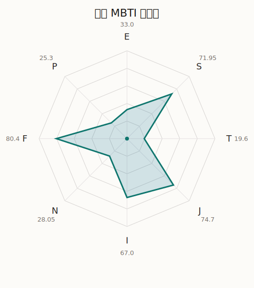

# 里美 MBTI 类型解释

- 角色名：牛込里美
- 最终类型：ISFJ
- 备选类型：ESFJ
- 原始聚合类型：ISFJ
- 采样轮次：10
- 主类型稳定度：10/10（100.0%）
- 原始聚合稳定度：10/10（100.0%）
- 置信度：高（47.02）
- 置信度方差：39.1785
- 题库：Open Jungian Type Scales (OJTS v2.1)（48 题）

## 类型概述

ISFJ 的整体倾向是：更偏内在克制、现实关注、情感责任和秩序维持。

## 人物核心

从外部设定与已整理剧情综合来看，里美的角色框架可以先理解为：外部角色介绍通常把里美定位成温柔害羞、容易紧张，却非常愿意为了重要的人鼓起勇气的成员。她的形象并不靠强烈存在感取胜，而是靠稳定、细腻和会为他人着想的姿态积累信任。

## PDB 校核

- 已应用 PDB 主参考：来源 `personality-database.com`。
- 权重分配：PDB 50% / 人设概要 25% / 卡牌剧情 15% / 剧情切片 10%。
- PDB 类型排序：`ISFJ`
- 最终类型先按 PDB 最高票定锚：`ISFJ`
- 指定锁定类型：`ISFJ`
## 为什么是这个类型

- `I > E`（67.00 : 33.00，平均轴差 41.34，方差 411.4176）：更常先在内部消化，再选择性地向外表达立场。
- `S > N`（71.95 : 28.05，平均轴差 48.31，方差 161.0575）：更常依赖现实条件、具体细节和当下经验来判断局面。
- `F > T`（80.40 : 19.60，平均轴差 64.49，方差 91.5005）：更常把感受、关系、价值和对人的回应放在判断前列。
- `J > P`（74.70 : 25.30，平均轴差 55.86，方差 85.0118）：更常用计划、收束、安排和责任结构去降低混乱。

## 为什么不是备选类型

最接近的备选类型是 `ESFJ`。它与主类型 `ISFJ` 的差别主要落在 `EI` 这一轴上。
最终仍保留 `I`，因为该轴平均优势还有 `34.00`，虽然会波动，但整体没有被 `E` 反超。虽然也会参与群体互动，但资料里更常表现为先内化、后表达的节奏。

## 四维结果

- `EI`：E 33.00 / I 67.00，轴差方差 411.4176
- `SN`：S 71.95 / N 28.05，轴差方差 161.0575
- `FT`：F 80.40 / T 19.60，轴差方差 91.5005
- `JP`：J 74.70 / P 25.30，轴差方差 85.0118

## 八维数据

- `E`：均值 33.00，方差 102.8544
- `S`：均值 71.95，方差 40.2644
- `T`：均值 19.60，方差 22.8751
- `J`：均值 74.70，方差 21.2529
- `I`：均值 67.00，方差 102.8544
- `N`：均值 28.05，方差 40.2644
- `F`：均值 80.40，方差 22.8751
- `P`：均值 25.30，方差 21.2529

## 类型稳定性

- `ISFJ`：10 次（100.0%）

## 图表

## 证据依据

- 人物概述：从外部设定与已整理剧情综合来看，里美的角色框架可以先理解为：外部角色介绍通常把里美定位成温柔害羞、容易紧张，却非常愿意为了重要的人鼓起勇气的成员。她的形象并不靠强烈存在感取胜，而是靠稳定、细腻和会为他人着想的姿态积累信任。
- 卡牌剧情：在 98 条卡牌剧情里，里美 的个人篇章补完相对丰富；这部分更适合用来观察角色的私下状态、非主线场合下的关系重心，以及主线之外的稳定人格表现。
- 剧情切片：在已整理的 591 条主线/乐团剧情切片里，里美同时覆盖主线推进（96）和乐队内部关系（495）两条线。这说明这个角色在本地语料中的位置，不应该只从单句台词去读，而要放回到持续出现的关系链和章节位置里看。

## 模拟作答概览

| 题号 | 题目/两端描述 | 平均作答 | 作答方差 | 平均倾向值 | 倾向方差 |
| --- | --- | --- | --- | --- | --- |
| 1 | I don&lsquo;t like to draw attention to myself. | 3.00 | 0.2000 | -5.56 | 375.7225 |
| 2 | I hate situations where people expect me to be funny. | 2.90 | 0.0900 | -2.06 | 103.3407 |
| 3 | I hold back my opinions. | 2.80 | 0.1600 | -5.23 | 229.5359 |
| 4 | I want a huge social circle. | 1.50 | 0.2500 | -58.86 | 340.1244 |
| 5 | I am the life of the party. | 1.60 | 0.2400 | -56.28 | 230.6689 |
| 6 | I make lots of noise. | 1.60 | 0.2400 | -51.33 | 285.7298 |
| 7 | I avoid philosophical discussions. | 3.20 | 0.5600 | 4.24 | 900.5150 |
| 8 | I don&apos;t like to analyze literature. | 3.00 | 0.2000 | 5.01 | 206.5304 |
| 9 | I am attached to conventional ways. | 3.10 | 0.0900 | 2.60 | 99.2194 |
| 10 | I love to read challenging material. | 1.20 | 0.1600 | -64.94 | 71.5353 |
| 11 | I look for hidden meanings in things. | 1.60 | 0.2400 | -60.46 | 132.3322 |
| 12 | I am curious about everything. | 1.20 | 0.1600 | -63.69 | 106.5111 |
| 13 | I want to experience passion and romance. | 3.30 | 0.2100 | 14.32 | 174.3793 |
| 14 | I am deeply moved by others&lsquo; misfortunes. | 3.10 | 0.0900 | 7.40 | 97.7452 |
| 15 | I listen to my feelings when making important decisions. | 3.40 | 0.2400 | 17.04 | 117.3080 |
| 16 | I prize logic above all else. | 1.00 | 0.0000 | -73.98 | 69.7993 |
| 17 | I don&lsquo;t understand people who get emotional. | 1.20 | 0.1600 | -72.00 | 109.9259 |
| 18 | I&apos;d rather be feared than loved. | 1.00 | 0.0000 | -74.57 | 94.8418 |
| 19 | I like order. | 3.20 | 0.1600 | 8.54 | 148.6660 |
| 20 | I do things according to a plan. | 2.90 | 0.0900 | -1.42 | 92.2284 |
| 21 | I am always prepared. | 2.90 | 0.0900 | -0.38 | 130.6181 |
| 22 | I often make last-minute plans. | 1.20 | 0.1600 | -62.32 | 25.3811 |
| 23 | I do things for no apparent reason. | 1.40 | 0.2400 | -59.80 | 89.4221 |
| 24 | It takes me days to do things that should take hours because I keep getting distracted. | 1.50 | 0.2500 | -59.76 | 61.2648 |
| 25 | I work on improving myself. | 2.30 | 0.4100 | -29.59 | 239.7197 |
| 26 | I always feel like I need to be doing something important. | 2.10 | 0.0900 | -30.09 | 69.6297 |
| 27 | I have unusual beliefs about the world. | 1.20 | 0.1600 | -63.30 | 101.0232 |
| 28 | I dislike routine. | 1.30 | 0.2100 | -67.00 | 116.0116 |
| 29 | I try my best to follow the rules. | 2.90 | 0.2900 | -9.26 | 436.9774 |
| 30 | I respect authority. | 2.70 | 0.2100 | -4.49 | 294.9761 |
| 31 | I like to take it easy. | 2.40 | 0.2400 | -27.44 | 98.9238 |
| 32 | I choose the easy way. | 2.20 | 0.3600 | -33.62 | 223.6971 |
| 33 | I tell other people my secrets. | 2.60 | 0.2400 | -20.88 | 126.0473 |
| 34 | I make big gestures of friendship to people. | 2.70 | 0.2100 | -18.11 | 220.7647 |
| 35 | I enjoy challenges and competition. | 1.40 | 0.2400 | -62.92 | 75.0901 |
| 36 | I have very high self-esteem. | 1.10 | 0.0900 | -65.55 | 31.0546 |
| 37 | I get embarrassed easily. | 3.10 | 0.0900 | 8.04 | 135.2646 |
| 38 | I become overwhelmed by events. | 3.10 | 0.0900 | 6.54 | 65.3137 |
| 39 | I have difficulty expressing my feelings. | 2.30 | 0.2100 | -35.45 | 205.5112 |
| 40 | I don&apos;t trust others easily. | 2.00 | 0.4000 | -32.69 | 379.0868 |
| 41 | skeptical <-> wants to believe | 4.50 | 0.2500 | 58.36 | 136.0759 |
| 42 | chaotic <-> organized | 4.90 | 0.0900 | 65.09 | 30.4630 |
| 43 | wants the big picture <-> wants the details | 3.00 | 0.0000 | 0.94 | 97.0791 |
| 44 | energetic <-> mellow | 4.40 | 0.2400 | 58.32 | 177.8569 |
| 45 | follows the heart <-> follows the head | 2.00 | 0.0000 | -42.00 | 78.7227 |
| 46 | prepares <-> improvises | 2.10 | 0.0900 | -32.93 | 105.1068 |
| 47 | focused on the present <-> focused on the future | 1.40 | 0.2400 | -61.76 | 144.1533 |
| 48 | works best alone <-> works best in groups | 2.50 | 0.2500 | -24.64 | 327.5096 |

## 题库来源

- [OJTS 官方题目页](https://openpsychometrics.org/tests/OJTS/)
- 许可证：CC BY-NC-SA 4.0
- [本地题库文件](../ojts_question_bank_v2_1.json)
