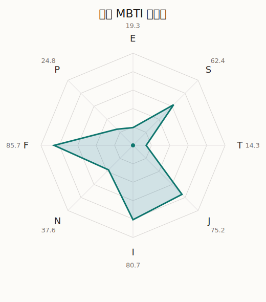

# 燐子 MBTI 类型解释

- 角色名：白金燐子
- 最终类型：ISFJ
- 备选类型：INFJ
- 原始聚合类型：ISFJ
- 采样轮次：10
- 主类型稳定度：10/10（100.0%）
- 原始聚合稳定度：10/10（100.0%）
- 置信度：高（52.0）
- 置信度方差：27.2972
- 题库：Open Jungian Type Scales (OJTS v2.1)（48 题）

## 类型概述

ISFJ 的整体倾向是：更偏内在克制、现实关注、情感责任和秩序维持。

## 人物核心

从外部设定与已整理剧情综合来看，燐子的角色框架可以先理解为：官方与外部角色介绍里的燐子常被写成寡言、怕生、钢琴实力出众，同时在熟悉的领域里又有很专注的一面。她的魅力并不靠强烈表达，而是靠一点点鼓起勇气后显出的真诚和分量。

## PDB 校核

- 已应用 PDB 主参考：来源 `personality-database.com`。
- 权重分配：PDB 50% / 人设概要 25% / 卡牌剧情 15% / 剧情切片 10%。
- PDB 类型排序：`ISFJ`
- 最终类型先按 PDB 最高票定锚：`ISFJ`
- 指定锁定类型：`ISFJ`
## 为什么是这个类型

- `I > E`（80.70 : 19.30，平均轴差 66.55，方差 80.7410）：更常先在内部消化，再选择性地向外表达立场。
- `S > N`（62.40 : 37.60，平均轴差 24.19，方差 142.6918）：更常依赖现实条件、具体细节和当下经验来判断局面。
- `F > T`（85.70 : 14.30，平均轴差 63.89，方差 122.6333）：更常把感受、关系、价值和对人的回应放在判断前列。
- `J > P`（75.20 : 24.80，平均轴差 54.31，方差 180.9021）：更常用计划、收束、安排和责任结构去降低混乱。

## 为什么不是备选类型

最接近的备选类型是 `INFJ`。它与主类型 `ISFJ` 的差别主要落在 `SN` 这一轴上。
最终仍保留 `S`，因为该轴平均优势还有 `24.80`，虽然会波动，但整体没有被 `N` 反超。虽然也会谈到意义和理想，但资料里更常落到现实条件、细节和可执行层面。

## 四维结果

- `EI`：E 19.30 / I 80.70，轴差方差 80.7410
- `SN`：S 62.40 / N 37.60，轴差方差 142.6918
- `FT`：F 85.70 / T 14.30，轴差方差 122.6333
- `JP`：J 75.20 / P 24.80，轴差方差 180.9021

## 八维数据

- `E`：均值 19.30，方差 20.1853
- `S`：均值 62.40，方差 35.6729
- `T`：均值 14.30，方差 30.6583
- `J`：均值 75.20，方差 45.2255
- `I`：均值 80.70，方差 20.1853
- `N`：均值 37.60，方差 35.6729
- `F`：均值 85.70，方差 30.6583
- `P`：均值 24.80，方差 45.2255

## 类型稳定性

- `ISFJ`：10 次（100.0%）

## 图表

## 证据依据

- 人物概述：从外部设定与已整理剧情综合来看，燐子的角色框架可以先理解为：官方与外部角色介绍里的燐子常被写成寡言、怕生、钢琴实力出众，同时在熟悉的领域里又有很专注的一面。她的魅力并不靠强烈表达，而是靠一点点鼓起勇气后显出的真诚和分量。
- 卡牌剧情：在 108 条卡牌剧情里，燐子 的个人篇章补完相对丰富；这部分更适合用来观察角色的私下状态、非主线场合下的关系重心，以及主线之外的稳定人格表现。
- 剧情切片：在已整理的 307 条主线/乐团剧情切片里，燐子同时覆盖主线推进（42）和乐队内部关系（265）两条线。这说明这个角色在本地语料中的位置，不应该只从单句台词去读，而要放回到持续出现的关系链和章节位置里看。

## 模拟作答概览

| 题号 | 题目/两端描述 | 平均作答 | 作答方差 | 平均倾向值 | 倾向方差 |
| --- | --- | --- | --- | --- | --- |
| 1 | I don&lsquo;t like to draw attention to myself. | 3.20 | 0.3600 | 10.77 | 338.0406 |
| 2 | I hate situations where people expect me to be funny. | 3.30 | 0.2100 | 14.34 | 145.1966 |
| 3 | I hold back my opinions. | 3.00 | 0.2000 | 8.60 | 375.2540 |
| 4 | I want a huge social circle. | 1.00 | 0.0000 | -71.96 | 46.4630 |
| 5 | I am the life of the party. | 1.20 | 0.1600 | -73.08 | 113.6425 |
| 6 | I make lots of noise. | 1.20 | 0.1600 | -72.72 | 150.1058 |
| 7 | I avoid philosophical discussions. | 3.60 | 0.4400 | 19.67 | 461.8817 |
| 8 | I don&apos;t like to analyze literature. | 3.50 | 0.2500 | 19.27 | 251.7009 |
| 9 | I am attached to conventional ways. | 3.30 | 0.2100 | 15.47 | 296.3475 |
| 10 | I love to read challenging material. | 2.70 | 0.2100 | -18.92 | 320.4801 |
| 11 | I look for hidden meanings in things. | 2.60 | 0.2400 | -13.50 | 235.5436 |
| 12 | I am curious about everything. | 2.50 | 0.4500 | -17.94 | 339.9028 |
| 13 | I want to experience passion and romance. | 3.30 | 0.2100 | 15.26 | 101.5159 |
| 14 | I am deeply moved by others&lsquo; misfortunes. | 3.40 | 0.2400 | 18.46 | 100.9203 |
| 15 | I listen to my feelings when making important decisions. | 3.60 | 0.2400 | 19.15 | 224.0343 |
| 16 | I prize logic above all else. | 1.00 | 0.0000 | -78.12 | 85.0869 |
| 17 | I don&lsquo;t understand people who get emotional. | 1.00 | 0.0000 | -79.80 | 60.6884 |
| 18 | I&apos;d rather be feared than loved. | 1.10 | 0.0900 | -79.39 | 125.3389 |
| 19 | I like order. | 2.90 | 0.2900 | -1.64 | 288.0183 |
| 20 | I do things according to a plan. | 3.00 | 0.0000 | 4.18 | 112.4929 |
| 21 | I am always prepared. | 2.90 | 0.0900 | -3.06 | 175.3058 |
| 22 | I often make last-minute plans. | 1.20 | 0.1600 | -66.07 | 160.9866 |
| 23 | I do things for no apparent reason. | 1.20 | 0.1600 | -69.42 | 114.5902 |
| 24 | It takes me days to do things that should take hours because I keep getting distracted. | 1.30 | 0.2100 | -65.08 | 139.8511 |
| 25 | I work on improving myself. | 2.30 | 0.2100 | -25.31 | 44.4235 |
| 26 | I always feel like I need to be doing something important. | 2.40 | 0.2400 | -27.36 | 289.0108 |
| 27 | I have unusual beliefs about the world. | 1.50 | 0.2500 | -56.09 | 132.8496 |
| 28 | I dislike routine. | 1.50 | 0.2500 | -58.62 | 97.2368 |
| 29 | I try my best to follow the rules. | 3.10 | 0.0900 | 4.35 | 207.6024 |
| 30 | I respect authority. | 2.90 | 0.0900 | -3.20 | 183.7466 |
| 31 | I like to take it easy. | 2.60 | 0.2400 | -16.04 | 325.0564 |
| 32 | I choose the easy way. | 2.10 | 0.0900 | -39.74 | 189.9701 |
| 33 | I tell other people my secrets. | 2.20 | 0.1600 | -31.87 | 109.2237 |
| 34 | I make big gestures of friendship to people. | 2.20 | 0.1600 | -32.61 | 271.4565 |
| 35 | I enjoy challenges and competition. | 1.10 | 0.0900 | -73.70 | 51.1287 |
| 36 | I have very high self-esteem. | 1.20 | 0.1600 | -71.69 | 71.0757 |
| 37 | I get embarrassed easily. | 3.30 | 0.2100 | 21.64 | 173.1331 |
| 38 | I become overwhelmed by events. | 3.20 | 0.1600 | 9.55 | 189.5076 |
| 39 | I have difficulty expressing my feelings. | 2.20 | 0.1600 | -31.26 | 123.3980 |
| 40 | I don&apos;t trust others easily. | 2.20 | 0.1600 | -29.98 | 70.5817 |
| 41 | skeptical <-> wants to believe | 4.20 | 0.1600 | 44.14 | 106.9740 |
| 42 | chaotic <-> organized | 4.80 | 0.1600 | 68.72 | 96.3373 |
| 43 | wants the big picture <-> wants the details | 2.90 | 0.0900 | -9.71 | 167.4096 |
| 44 | energetic <-> mellow | 5.00 | 0.0000 | 76.08 | 41.2217 |
| 45 | follows the heart <-> follows the head | 1.90 | 0.0900 | -46.01 | 72.3459 |
| 46 | prepares <-> improvises | 2.10 | 0.0900 | -31.86 | 70.9097 |
| 47 | focused on the present <-> focused on the future | 2.00 | 0.0000 | -38.29 | 84.5329 |
| 48 | works best alone <-> works best in groups | 2.00 | 0.0000 | -46.64 | 79.3930 |

## 题库来源

- [OJTS 官方题目页](https://openpsychometrics.org/tests/OJTS/)
- 许可证：CC BY-NC-SA 4.0
- [本地题库文件](../ojts_question_bank_v2_1.json)
