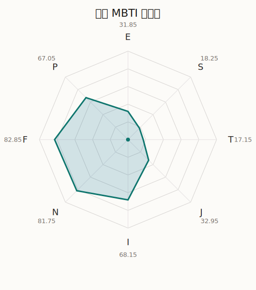

# 六花 MBTI 类型解释

- 角色名：朝日六花
- 最终类型：INFP
- 备选类型：INFJ
- 原始聚合类型：INFP
- 采样轮次：10
- 主类型稳定度：8/10（80.0%）
- 原始聚合稳定度：8/10（80.0%）
- 置信度：高（49.9）
- 置信度方差：39.9082
- 题库：Open Jungian Type Scales (OJTS v2.1)（48 题）

## 类型概述

INFP 的整体倾向是：更偏内在感受、抽象意义、价值驱动和开放探索。

## 人物核心

从外部设定与已整理剧情综合来看，六花的角色框架可以先理解为：外部资料里的六花通常是努力、质朴、容易紧张，但在音乐上非常投入的角色。她从仰望舞台的一侧走到真正站上舞台的一侧，这种带着粉丝心态的成长路线让她特别有代入感。

## PDB 校核

- 已应用 PDB 主参考：来源 `personality-database.com`。
- 权重分配：PDB 50% / 人设概要 25% / 卡牌剧情 15% / 剧情切片 10%。
- PDB 类型排序：`INFP`
- 最终类型先按 PDB 最高票定锚：`INFP`
- 指定锁定类型：`INFP`
## 为什么是这个类型

- `I > E`（68.15 : 31.85，平均轴差 33.58，方差 222.7053）：更常先在内部消化，再选择性地向外表达立场。
- `N > S`（81.75 : 18.25，平均轴差 63.94，方差 83.4018）：更常从意义、可能性、方向感和隐含主题去理解问题。
- `F > T`（82.85 : 17.15，平均轴差 50.60，方差 115.3942）：更常把感受、关系、价值和对人的回应放在判断前列。
- `P > J`（67.05 : 32.95，平均轴差 18.56，方差 159.3233）：更常保留空间，依靠灵活调整和临场变化推进事情。

## 为什么不是备选类型

最接近的备选类型是 `INFJ`。它与主类型 `INFP` 的差别主要落在 `JP` 这一轴上。
最终仍保留 `P`，因为该轴平均优势还有 `34.10`，虽然会波动，但整体没有被 `J` 反超。虽然并非完全无计划，但整体仍更偏向保留余地、即兴调整和开放推进。

## 四维结果

- `EI`：E 31.85 / I 68.15，轴差方差 222.7053
- `SN`：S 18.25 / N 81.75，轴差方差 83.4018
- `FT`：F 82.85 / T 17.15，轴差方差 115.3942
- `JP`：J 32.95 / P 67.05，轴差方差 159.3233

## 八维数据

- `E`：均值 31.85，方差 55.6763
- `S`：均值 18.25，方差 20.8504
- `T`：均值 17.15，方差 28.8486
- `J`：均值 32.95，方差 51.7469
- `I`：均值 68.15，方差 55.6763
- `N`：均值 81.75，方差 20.8504
- `F`：均值 82.85，方差 28.8486
- `P`：均值 67.05，方差 51.7469

## 类型稳定性

- `INFP`：8 次（80.0%）
- `INFJ`：2 次（20.0%）

## 图表

## 证据依据

- 人物概述：从外部设定与已整理剧情综合来看，六花的角色框架可以先理解为：外部资料里的六花通常是努力、质朴、容易紧张，但在音乐上非常投入的角色。她从仰望舞台的一侧走到真正站上舞台的一侧，这种带着粉丝心态的成长路线让她特别有代入感。
- 卡牌剧情：在 58 条卡牌剧情里，六花 的个人篇章补完相对丰富；这部分更适合用来观察角色的私下状态、非主线场合下的关系重心，以及主线之外的稳定人格表现。
- 剧情切片：在已整理的 195 条主线/乐团剧情切片里，六花同时覆盖主线推进（19）和乐队内部关系（176）两条线。这说明这个角色在本地语料中的位置，不应该只从单句台词去读，而要放回到持续出现的关系链和章节位置里看。

## 模拟作答概览

| 题号 | 题目/两端描述 | 平均作答 | 作答方差 | 平均倾向值 | 倾向方差 |
| --- | --- | --- | --- | --- | --- |
| 1 | I don&lsquo;t like to draw attention to myself. | 2.70 | 0.2100 | -12.21 | 188.8720 |
| 2 | I hate situations where people expect me to be funny. | 3.00 | 0.2000 | -3.63 | 285.0896 |
| 3 | I hold back my opinions. | 2.60 | 0.2400 | -12.66 | 184.2375 |
| 4 | I want a huge social circle. | 1.60 | 0.2400 | -57.77 | 127.0146 |
| 5 | I am the life of the party. | 1.40 | 0.2400 | -57.63 | 147.5669 |
| 6 | I make lots of noise. | 1.50 | 0.2500 | -61.14 | 194.0374 |
| 7 | I avoid philosophical discussions. | 1.10 | 0.0900 | -74.76 | 43.4188 |
| 8 | I don&apos;t like to analyze literature. | 1.00 | 0.0000 | -73.99 | 90.7980 |
| 9 | I am attached to conventional ways. | 1.10 | 0.0900 | -73.22 | 62.9849 |
| 10 | I love to read challenging material. | 4.00 | 0.0000 | 39.74 | 49.7717 |
| 11 | I look for hidden meanings in things. | 4.00 | 0.0000 | 46.46 | 7.3427 |
| 12 | I am curious about everything. | 4.00 | 0.0000 | 40.41 | 97.5868 |
| 13 | I want to experience passion and romance. | 4.00 | 0.0000 | 43.50 | 102.1148 |
| 14 | I am deeply moved by others&lsquo; misfortunes. | 4.00 | 0.2000 | 47.32 | 175.5164 |
| 15 | I listen to my feelings when making important decisions. | 4.20 | 0.3600 | 50.61 | 207.6034 |
| 16 | I prize logic above all else. | 1.60 | 0.2400 | -51.65 | 112.3456 |
| 17 | I don&lsquo;t understand people who get emotional. | 1.50 | 0.2500 | -56.92 | 134.1774 |
| 18 | I&apos;d rather be feared than loved. | 2.00 | 0.0000 | -42.15 | 87.7745 |
| 19 | I like order. | 2.30 | 0.2100 | -28.16 | 227.4392 |
| 20 | I do things according to a plan. | 2.20 | 0.1600 | -32.38 | 101.2105 |
| 21 | I am always prepared. | 2.10 | 0.2900 | -35.43 | 229.3029 |
| 22 | I often make last-minute plans. | 2.90 | 0.0900 | -1.43 | 198.9670 |
| 23 | I do things for no apparent reason. | 3.00 | 0.4000 | -1.02 | 458.0500 |
| 24 | It takes me days to do things that should take hours because I keep getting distracted. | 3.00 | 0.0000 | -0.73 | 120.9061 |
| 25 | I work on improving myself. | 3.20 | 0.1600 | 6.69 | 294.9202 |
| 26 | I always feel like I need to be doing something important. | 3.10 | 0.2900 | 4.92 | 351.7103 |
| 27 | I have unusual beliefs about the world. | 3.20 | 0.1600 | 8.97 | 229.9384 |
| 28 | I dislike routine. | 3.10 | 0.0900 | 6.63 | 81.5684 |
| 29 | I try my best to follow the rules. | 1.30 | 0.2100 | -64.44 | 91.7784 |
| 30 | I respect authority. | 1.20 | 0.1600 | -70.09 | 87.4813 |
| 31 | I like to take it easy. | 2.20 | 0.3600 | -37.46 | 419.8310 |
| 32 | I choose the easy way. | 2.20 | 0.1600 | -36.77 | 162.4974 |
| 33 | I tell other people my secrets. | 2.50 | 0.2500 | -22.09 | 253.7957 |
| 34 | I make big gestures of friendship to people. | 2.60 | 0.2400 | -22.47 | 110.9625 |
| 35 | I enjoy challenges and competition. | 1.10 | 0.0900 | -68.89 | 64.5775 |
| 36 | I have very high self-esteem. | 1.30 | 0.2100 | -66.25 | 200.1937 |
| 37 | I get embarrassed easily. | 3.30 | 0.4100 | 7.88 | 445.4276 |
| 38 | I become overwhelmed by events. | 3.10 | 0.0900 | 8.41 | 219.2327 |
| 39 | I have difficulty expressing my feelings. | 2.00 | 0.0000 | -40.20 | 97.5086 |
| 40 | I don&apos;t trust others easily. | 2.00 | 0.0000 | -43.22 | 95.7184 |
| 41 | skeptical <-> wants to believe | 3.20 | 0.1600 | 9.95 | 181.6077 |
| 42 | chaotic <-> organized | 3.30 | 0.2100 | 14.23 | 166.6947 |
| 43 | wants the big picture <-> wants the details | 1.20 | 0.1600 | -71.31 | 106.6958 |
| 44 | energetic <-> mellow | 3.40 | 0.2400 | 19.53 | 98.9050 |
| 45 | follows the heart <-> follows the head | 1.90 | 0.0900 | -42.75 | 112.2043 |
| 46 | prepares <-> improvises | 3.70 | 0.2100 | 30.93 | 378.3788 |
| 47 | focused on the present <-> focused on the future | 3.10 | 0.0900 | -0.27 | 269.8057 |
| 48 | works best alone <-> works best in groups | 2.60 | 0.2400 | -15.41 | 266.4402 |

## 题库来源

- [OJTS 官方题目页](https://openpsychometrics.org/tests/OJTS/)
- 许可证：CC BY-NC-SA 4.0
- [本地题库文件](../ojts_question_bank_v2_1.json)
