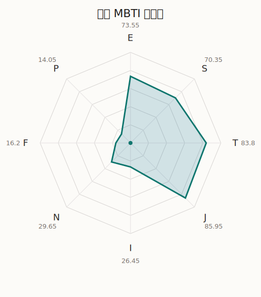

# 瑠唯 MBTI 类型解释

- 角色名：八潮瑠唯
- 最终类型：ESTJ
- 备选类型：ENTJ
- 原始聚合类型：ESTJ
- 采样轮次：10
- 主类型稳定度：10/10（100.0%）
- 原始聚合稳定度：10/10（100.0%）
- 置信度：高（56.83）
- 置信度方差：15.1706
- 题库：Open Jungian Type Scales (OJTS v2.1)（48 题）

## 类型概述

ESTJ 的整体倾向是：更偏外向管理、现实导向、逻辑标准和秩序推进。

## 人物核心

从外部设定与已整理剧情综合来看，瑠唯的角色框架可以先理解为：外部资料里的瑠唯通常被塑造成冷静、聪明、拉小提琴实力极强，同时又对结果和效率有明确追求的人。她看起来最理性，也最像会把一切情感都先交给分析的人，但这正让她后来的柔软显得很动人。

## PDB 校核

- 已应用 PDB 主参考：来源 `personality-database.com`。
- 权重分配：PDB 50% / 人设概要 25% / 卡牌剧情 15% / 剧情切片 10%。
- PDB 类型排序：`ESTJ`
- 最终类型先按 PDB 最高票定锚：`ESTJ`
- 指定锁定类型：`ESTJ`
## 为什么是这个类型

- `E > I`（73.55 : 26.45，平均轴差 41.27，方差 116.6971）：更常通过主动互动、公开表达或带动现场来处理问题。
- `S > N`（70.35 : 29.65，平均轴差 37.04，方差 342.3181）：更常依赖现实条件、具体细节和当下经验来判断局面。
- `T > F`（83.80 : 16.20，平均轴差 52.06，方差 121.4356）：更常把逻辑、结构、效率和标准一致性放在判断前列。
- `J > P`（85.95 : 14.05，平均轴差 74.49，方差 22.9805）：更常用计划、收束、安排和责任结构去降低混乱。

## 为什么不是备选类型

最接近的备选类型是 `ENTJ`。它与主类型 `ESTJ` 的差别主要落在 `SN` 这一轴上。
最终仍保留 `S`，因为该轴平均优势还有 `40.70`，虽然会波动，但整体没有被 `N` 反超。虽然也会谈到意义和理想，但资料里更常落到现实条件、细节和可执行层面。

## 四维结果

- `EI`：E 73.55 / I 26.45，轴差方差 116.6971
- `SN`：S 70.35 / N 29.65，轴差方差 342.3181
- `FT`：F 16.20 / T 83.80，轴差方差 121.4356
- `JP`：J 85.95 / P 14.05，轴差方差 22.9805

## 八维数据

- `E`：均值 73.55，方差 29.1743
- `S`：均值 70.35，方差 85.5795
- `T`：均值 83.80，方差 30.3589
- `J`：均值 85.95，方差 5.7451
- `I`：均值 26.45，方差 29.1743
- `N`：均值 29.65，方差 85.5795
- `F`：均值 16.20，方差 30.3589
- `P`：均值 14.05，方差 5.7451

## 类型稳定性

- `ESTJ`：10 次（100.0%）

## 图表

## 证据依据

- 人物概述：从外部设定与已整理剧情综合来看，瑠唯的角色框架可以先理解为：外部资料里的瑠唯通常被塑造成冷静、聪明、拉小提琴实力极强，同时又对结果和效率有明确追求的人。她看起来最理性，也最像会把一切情感都先交给分析的人，但这正让她后来的柔软显得很动人。
- 卡牌剧情：在 53 条卡牌剧情里，瑠唯 的个人篇章补完相对丰富；这部分更适合用来观察角色的私下状态、非主线场合下的关系重心，以及主线之外的稳定人格表现。
- 剧情切片：在已整理的 117 条主线/乐团剧情切片里，瑠唯同时覆盖主线推进（12）和乐队内部关系（105）两条线。这说明这个角色在本地语料中的位置，不应该只从单句台词去读，而要放回到持续出现的关系链和章节位置里看。

## 模拟作答概览

| 题号 | 题目/两端描述 | 平均作答 | 作答方差 | 平均倾向值 | 倾向方差 |
| --- | --- | --- | --- | --- | --- |
| 1 | I don&lsquo;t like to draw attention to myself. | 1.20 | 0.1600 | -63.88 | 126.7444 |
| 2 | I hate situations where people expect me to be funny. | 1.30 | 0.2100 | -61.71 | 232.2585 |
| 3 | I hold back my opinions. | 1.30 | 0.2100 | -65.95 | 91.8804 |
| 4 | I want a huge social circle. | 2.90 | 0.0900 | 3.61 | 203.5526 |
| 5 | I am the life of the party. | 3.20 | 0.1600 | 8.01 | 199.1051 |
| 6 | I make lots of noise. | 3.10 | 0.0900 | 10.61 | 207.0553 |
| 7 | I avoid philosophical discussions. | 2.80 | 0.3600 | -3.32 | 355.2164 |
| 8 | I don&apos;t like to analyze literature. | 3.00 | 0.2000 | -1.30 | 336.6733 |
| 9 | I am attached to conventional ways. | 2.90 | 0.0900 | 4.47 | 212.2676 |
| 10 | I love to read challenging material. | 1.60 | 0.2400 | -54.94 | 188.3334 |
| 11 | I look for hidden meanings in things. | 1.30 | 0.2100 | -61.78 | 202.7705 |
| 12 | I am curious about everything. | 1.30 | 0.2100 | -59.48 | 110.5394 |
| 13 | I want to experience passion and romance. | 1.10 | 0.0900 | -71.16 | 58.5748 |
| 14 | I am deeply moved by others&lsquo; misfortunes. | 1.20 | 0.1600 | -69.84 | 72.2959 |
| 15 | I listen to my feelings when making important decisions. | 1.20 | 0.1600 | -69.41 | 82.9754 |
| 16 | I prize logic above all else. | 3.30 | 0.2100 | 12.74 | 191.9893 |
| 17 | I don&lsquo;t understand people who get emotional. | 3.30 | 0.2100 | 12.57 | 138.6916 |
| 18 | I&apos;d rather be feared than loved. | 3.30 | 0.2100 | 12.88 | 241.1834 |
| 19 | I like order. | 3.50 | 0.2500 | 22.35 | 282.1505 |
| 20 | I do things according to a plan. | 3.50 | 0.2500 | 20.32 | 168.4216 |
| 21 | I am always prepared. | 3.60 | 0.2400 | 26.98 | 218.5470 |
| 22 | I often make last-minute plans. | 1.00 | 0.0000 | -81.78 | 91.8308 |
| 23 | I do things for no apparent reason. | 1.00 | 0.0000 | -82.57 | 52.4130 |
| 24 | It takes me days to do things that should take hours because I keep getting distracted. | 1.00 | 0.0000 | -80.28 | 90.3881 |
| 25 | I work on improving myself. | 2.90 | 0.0900 | -10.40 | 127.9984 |
| 26 | I always feel like I need to be doing something important. | 2.70 | 0.2100 | -18.06 | 146.9070 |
| 27 | I have unusual beliefs about the world. | 1.10 | 0.0900 | -70.76 | 47.0539 |
| 28 | I dislike routine. | 1.30 | 0.2100 | -65.51 | 115.5652 |
| 29 | I try my best to follow the rules. | 3.10 | 0.2900 | 9.85 | 288.4540 |
| 30 | I respect authority. | 3.20 | 0.1600 | 13.70 | 97.3193 |
| 31 | I like to take it easy. | 2.10 | 0.0900 | -37.57 | 151.7907 |
| 32 | I choose the easy way. | 1.90 | 0.0900 | -43.35 | 108.5422 |
| 33 | I tell other people my secrets. | 2.20 | 0.1600 | -31.32 | 118.7585 |
| 34 | I make big gestures of friendship to people. | 2.30 | 0.2100 | -32.93 | 229.3569 |
| 35 | I enjoy challenges and competition. | 3.30 | 0.2100 | 11.60 | 213.7157 |
| 36 | I have very high self-esteem. | 3.30 | 0.2100 | 11.35 | 164.4859 |
| 37 | I get embarrassed easily. | 1.10 | 0.0900 | -67.59 | 55.1106 |
| 38 | I become overwhelmed by events. | 1.10 | 0.0900 | -69.58 | 66.1755 |
| 39 | I have difficulty expressing my feelings. | 2.40 | 0.2400 | -27.70 | 173.0589 |
| 40 | I don&apos;t trust others easily. | 2.40 | 0.2400 | -25.05 | 106.8984 |
| 41 | skeptical <-> wants to believe | 3.00 | 0.0000 | -2.26 | 87.3433 |
| 42 | chaotic <-> organized | 5.00 | 0.0000 | 86.57 | 35.2253 |
| 43 | wants the big picture <-> wants the details | 2.80 | 0.1600 | -2.79 | 159.2326 |
| 44 | energetic <-> mellow | 3.10 | 0.0900 | 3.34 | 177.5129 |
| 45 | follows the heart <-> follows the head | 4.10 | 0.0900 | 40.02 | 147.8602 |
| 46 | prepares <-> improvises | 1.90 | 0.0900 | -47.25 | 93.3137 |
| 47 | focused on the present <-> focused on the future | 1.60 | 0.2400 | -58.19 | 170.2331 |
| 48 | works best alone <-> works best in groups | 3.50 | 0.2500 | 27.22 | 224.0337 |

## 题库来源

- [OJTS 官方题目页](https://openpsychometrics.org/tests/OJTS/)
- 许可证：CC BY-NC-SA 4.0
- [本地题库文件](../ojts_question_bank_v2_1.json)
