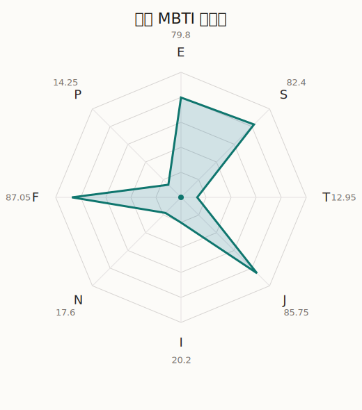

# 沙绫 MBTI 类型解释

- 角色名：山吹沙绫
- 最终类型：ESFJ
- 备选类型：ISFJ
- 原始聚合类型：ESFJ
- 采样轮次：10
- 主类型稳定度：10/10（100.0%）
- 原始聚合稳定度：10/10（100.0%）
- 置信度：高（67.5）
- 置信度方差：14.9857
- 题库：Open Jungian Type Scales (OJTS v2.1)（48 题）

## 类型概述

ESFJ 的整体倾向是：更偏外向关系、现实执行、情感照料和稳定组织。

## 人物核心

从外部设定与已整理剧情综合来看，沙绫的角色框架可以先理解为：官方与外部角色资料里，沙绫总被写成可靠、会照顾人、把现实责任看得很重的鼓手。她的家庭背景和照料家人的经验，使她比同龄人更早习惯在热情与责任之间做平衡。

## PDB 校核

- 已应用 PDB 主参考：来源 `personality-database.com`。
- 权重分配：PDB 50% / 人设概要 25% / 卡牌剧情 15% / 剧情切片 10%。
- PDB 类型排序：`ESFJ`
- 最终类型先按 PDB 最高票定锚：`ESFJ`
- 指定锁定类型：`ESFJ`
## 为什么是这个类型

- `E > I`（79.80 : 20.20，平均轴差 56.35，方差 76.6391）：更常通过主动互动、公开表达或带动现场来处理问题。
- `S > N`（82.40 : 17.60，平均轴差 60.00，方差 69.7189）：更常依赖现实条件、具体细节和当下经验来判断局面。
- `F > T`（87.05 : 12.95，平均轴差 50.55，方差 68.8205）：更常把感受、关系、价值和对人的回应放在判断前列。
- `J > P`（85.75 : 14.25，平均轴差 72.32，方差 32.5354）：更常用计划、收束、安排和责任结构去降低混乱。

## 为什么不是备选类型

最接近的备选类型是 `ISFJ`。它与主类型 `ESFJ` 的差别主要落在 `EI` 这一轴上。
最终仍保留 `E`，因为该轴平均优势还有 `59.60`，虽然会波动，但整体没有被 `I` 反超。虽然也存在保留和内化的一面，但资料里更常出现主动带动关系与公开表达的处理方式。

## 四维结果

- `EI`：E 79.80 / I 20.20，轴差方差 76.6391
- `SN`：S 82.40 / N 17.60，轴差方差 69.7189
- `FT`：F 87.05 / T 12.95，轴差方差 68.8205
- `JP`：J 85.75 / P 14.25，轴差方差 32.5354

## 八维数据

- `E`：均值 79.80，方差 19.1598
- `S`：均值 82.40，方差 17.4297
- `T`：均值 12.95，方差 17.2051
- `J`：均值 85.75，方差 8.1338
- `I`：均值 20.20，方差 19.1598
- `N`：均值 17.60，方差 17.4297
- `F`：均值 87.05，方差 17.2051
- `P`：均值 14.25，方差 8.1338

## 类型稳定性

- `ESFJ`：10 次（100.0%）

## 图表

## 证据依据

- 人物概述：从外部设定与已整理剧情综合来看，沙绫的角色框架可以先理解为：官方与外部角色资料里，沙绫总被写成可靠、会照顾人、把现实责任看得很重的鼓手。她的家庭背景和照料家人的经验，使她比同龄人更早习惯在热情与责任之间做平衡。
- 卡牌剧情：在 94 条卡牌剧情里，沙绫 的个人篇章补完相对丰富；这部分更适合用来观察角色的私下状态、非主线场合下的关系重心，以及主线之外的稳定人格表现。
- 剧情切片：在已整理的 630 条主线/乐团剧情切片里，沙绫同时覆盖主线推进（117）和乐队内部关系（513）两条线。这说明这个角色在本地语料中的位置，不应该只从单句台词去读，而要放回到持续出现的关系链和章节位置里看。

## 模拟作答概览

| 题号 | 题目/两端描述 | 平均作答 | 作答方差 | 平均倾向值 | 倾向方差 |
| --- | --- | --- | --- | --- | --- |
| 1 | I don&lsquo;t like to draw attention to myself. | 1.00 | 0.0000 | -71.50 | 53.6898 |
| 2 | I hate situations where people expect me to be funny. | 1.30 | 0.2100 | -68.31 | 144.2660 |
| 3 | I hold back my opinions. | 1.20 | 0.1600 | -68.60 | 111.9110 |
| 4 | I want a huge social circle. | 3.40 | 0.2400 | 10.04 | 236.0066 |
| 5 | I am the life of the party. | 3.00 | 0.0000 | 0.16 | 175.0444 |
| 6 | I make lots of noise. | 3.50 | 0.2500 | 21.34 | 205.9963 |
| 7 | I avoid philosophical discussions. | 3.20 | 0.1600 | 3.93 | 188.4185 |
| 8 | I don&apos;t like to analyze literature. | 3.20 | 0.1600 | 9.90 | 214.1607 |
| 9 | I am attached to conventional ways. | 3.30 | 0.2100 | 12.96 | 195.5360 |
| 10 | I love to read challenging material. | 1.10 | 0.0900 | -71.06 | 59.1883 |
| 11 | I look for hidden meanings in things. | 1.10 | 0.0900 | -72.41 | 102.2185 |
| 12 | I am curious about everything. | 1.10 | 0.0900 | -76.42 | 175.7489 |
| 13 | I want to experience passion and romance. | 3.50 | 0.2500 | 19.56 | 180.6419 |
| 14 | I am deeply moved by others&lsquo; misfortunes. | 3.40 | 0.2400 | 18.43 | 306.5084 |
| 15 | I listen to my feelings when making important decisions. | 3.10 | 0.0900 | 12.01 | 138.8753 |
| 16 | I prize logic above all else. | 1.70 | 0.2100 | -50.68 | 101.9290 |
| 17 | I don&lsquo;t understand people who get emotional. | 2.00 | 0.0000 | -48.89 | 46.1930 |
| 18 | I&apos;d rather be feared than loved. | 1.80 | 0.1600 | -49.13 | 142.8461 |
| 19 | I like order. | 3.40 | 0.2400 | 17.30 | 410.0117 |
| 20 | I do things according to a plan. | 3.20 | 0.1600 | 14.02 | 177.4620 |
| 21 | I am always prepared. | 3.60 | 0.2400 | 22.75 | 335.1328 |
| 22 | I often make last-minute plans. | 1.00 | 0.0000 | -79.61 | 37.8801 |
| 23 | I do things for no apparent reason. | 1.10 | 0.0900 | -77.24 | 76.3503 |
| 24 | It takes me days to do things that should take hours because I keep getting distracted. | 1.00 | 0.0000 | -79.65 | 71.0148 |
| 25 | I work on improving myself. | 2.40 | 0.2400 | -26.83 | 89.1111 |
| 26 | I always feel like I need to be doing something important. | 2.10 | 0.2900 | -31.89 | 141.6940 |
| 27 | I have unusual beliefs about the world. | 1.00 | 0.0000 | -74.03 | 66.7091 |
| 28 | I dislike routine. | 1.00 | 0.0000 | -75.81 | 54.5651 |
| 29 | I try my best to follow the rules. | 3.30 | 0.2100 | 15.41 | 296.9268 |
| 30 | I respect authority. | 3.30 | 0.2100 | 13.65 | 311.4206 |
| 31 | I like to take it easy. | 2.30 | 0.2100 | -29.93 | 143.3004 |
| 32 | I choose the easy way. | 2.00 | 0.0000 | -35.08 | 50.2191 |
| 33 | I tell other people my secrets. | 3.20 | 0.1600 | 12.63 | 200.6641 |
| 34 | I make big gestures of friendship to people. | 3.60 | 0.2400 | 20.12 | 180.5436 |
| 35 | I enjoy challenges and competition. | 2.00 | 0.0000 | -33.12 | 87.2135 |
| 36 | I have very high self-esteem. | 2.20 | 0.1600 | -31.24 | 72.9623 |
| 37 | I get embarrassed easily. | 2.10 | 0.0900 | -31.72 | 152.7583 |
| 38 | I become overwhelmed by events. | 2.40 | 0.2400 | -22.86 | 161.7311 |
| 39 | I have difficulty expressing my feelings. | 1.10 | 0.0900 | -72.15 | 96.2724 |
| 40 | I don&apos;t trust others easily. | 1.00 | 0.0000 | -78.06 | 56.7346 |
| 41 | skeptical <-> wants to believe | 4.10 | 0.0900 | 43.78 | 108.0349 |
| 42 | chaotic <-> organized | 5.00 | 0.0000 | 79.31 | 86.9725 |
| 43 | wants the big picture <-> wants the details | 3.00 | 0.2000 | 2.62 | 306.6845 |
| 44 | energetic <-> mellow | 2.10 | 0.0900 | -38.99 | 132.9128 |
| 45 | follows the heart <-> follows the head | 2.00 | 0.0000 | -44.55 | 67.2658 |
| 46 | prepares <-> improvises | 2.00 | 0.0000 | -50.20 | 33.4424 |
| 47 | focused on the present <-> focused on the future | 1.10 | 0.0900 | -78.92 | 139.6809 |
| 48 | works best alone <-> works best in groups | 3.70 | 0.2100 | 36.34 | 209.3379 |

## 题库来源

- [OJTS 官方题目页](https://openpsychometrics.org/tests/OJTS/)
- 许可证：CC BY-NC-SA 4.0
- [本地题库文件](../ojts_question_bank_v2_1.json)
