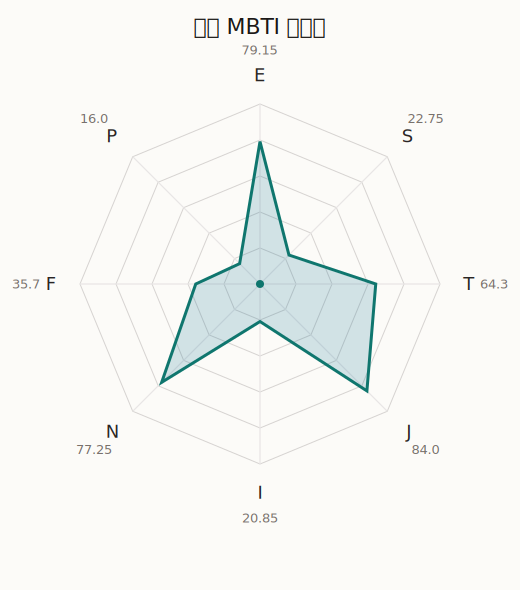

# 祥子 MBTI 类型解释

- 角色名：丰川祥子
- 最终类型：ENTJ
- 备选类型：ENFJ
- 原始聚合类型：ENTJ
- 采样轮次：10
- 主类型稳定度：7/10（70.0%）
- 原始聚合稳定度：7/10（70.0%）
- 置信度：高（52.35）
- 置信度方差：58.518
- 题库：Open Jungian Type Scales (OJTS v2.1)（48 题）

## 类型概述

ENTJ 的整体倾向是：更偏外向推进、抽象规划、逻辑判断和组织掌控。

## 人物核心

从外部设定与已整理剧情综合来看，祥子的角色框架可以先理解为：官方角色介绍里，祥子被明确写成羽丘女子学园高一生、Ave Mujica 的键盘手，也是以“背负所有成员人生的觉悟”来组建乐队的核心人物。官方同时强调，她会为了维护 Ave Mujica 的世界观而投入极深的心力，这一点和现有语料里她强势、控制欲高、要求他人一起承担舞台重量的形象是吻合的。

## PDB 校核

- 已应用 PDB 主参考：来源 `personality-database.com`。
- 权重分配：PDB 50% / 人设概要 25% / 卡牌剧情 15% / 剧情切片 10%。
- PDB 类型排序：`ENTJ`
- 最终类型先按 PDB 最高票定锚：`ENTJ`
- 指定锁定类型：`ENTJ`
## 为什么是这个类型

- `E > I`（79.15 : 20.85，平均轴差 57.71，方差 173.2386）：更常通过主动互动、公开表达或带动现场来处理问题。
- `N > S`（77.25 : 22.75，平均轴差 47.83，方差 197.5910）：更常从意义、可能性、方向感和隐含主题去理解问题。
- `T > F`（64.30 : 35.70，平均轴差 17.90，方差 148.7785）：更常把逻辑、结构、效率和标准一致性放在判断前列。
- `J > P`（84.00 : 16.00，平均轴差 72.06，方差 97.8608）：更常用计划、收束、安排和责任结构去降低混乱。

## 为什么不是备选类型

最接近的备选类型是 `ENFJ`。它与主类型 `ENTJ` 的差别主要落在 `FT` 这一轴上。
最终仍保留 `T`，因为该轴平均优势还有 `28.60`，虽然会波动，但整体没有被 `F` 反超。虽然也在意关系影响，但最终更常回到逻辑、标准和方法正确性来判断。

## 四维结果

- `EI`：E 79.15 / I 20.85，轴差方差 173.2386
- `SN`：S 22.75 / N 77.25，轴差方差 197.5910
- `FT`：F 35.70 / T 64.30，轴差方差 148.7785
- `JP`：J 84.00 / P 16.00，轴差方差 97.8608

## 八维数据

- `E`：均值 79.15，方差 43.3097
- `S`：均值 22.75，方差 49.3977
- `T`：均值 64.30，方差 77.2788
- `J`：均值 84.00，方差 24.4652
- `I`：均值 20.85，方差 43.3097
- `N`：均值 77.25，方差 49.3977
- `F`：均值 35.70，方差 77.2788
- `P`：均值 16.00，方差 24.4652

## 类型稳定性

- `ENTJ`：7 次（70.0%）
- `ENFJ`：3 次（30.0%）

## 图表

## 证据依据

- 人物概述：从外部设定与已整理剧情综合来看，祥子的角色框架可以先理解为：官方角色介绍里，祥子被明确写成羽丘女子学园高一生、Ave Mujica 的键盘手，也是以“背负所有成员人生的觉悟”来组建乐队的核心人物。官方同时强调，她会为了维护 Ave Mujica 的世界观而投入极深的心力，这一点和现有语料里她强势、控制欲高、要求他人一起承担舞台重量的形象是吻合的。
- 卡牌剧情：当前没有归到该角色名下的卡牌剧情，因此暂时无法从私人篇章、节庆篇章或回忆篇章里继续补正人物侧面。
- 剧情切片：在已整理的 57 条主线/乐团剧情切片里，祥子目前更集中在乐队内部与团内关系剧情（57）。这说明这个角色在本地语料中的位置，不应该只从单句台词去读，而要放回到持续出现的关系链和章节位置里看。

## 模拟作答概览

| 题号 | 题目/两端描述 | 平均作答 | 作答方差 | 平均倾向值 | 倾向方差 |
| --- | --- | --- | --- | --- | --- |
| 1 | I don&lsquo;t like to draw attention to myself. | 1.30 | 0.2100 | -69.35 | 138.6186 |
| 2 | I hate situations where people expect me to be funny. | 1.40 | 0.2400 | -68.13 | 179.4549 |
| 3 | I hold back my opinions. | 1.30 | 0.2100 | -67.76 | 139.6844 |
| 4 | I want a huge social circle. | 3.80 | 0.1600 | 38.80 | 174.8338 |
| 5 | I am the life of the party. | 4.10 | 0.2900 | 41.24 | 278.9790 |
| 6 | I make lots of noise. | 3.80 | 0.1600 | 34.00 | 178.3620 |
| 7 | I avoid philosophical discussions. | 2.00 | 0.2000 | -38.55 | 128.6652 |
| 8 | I don&apos;t like to analyze literature. | 2.10 | 0.0900 | -36.44 | 264.8400 |
| 9 | I am attached to conventional ways. | 2.00 | 0.2000 | -33.28 | 134.2898 |
| 10 | I love to read challenging material. | 3.30 | 0.2100 | 10.58 | 169.0161 |
| 11 | I look for hidden meanings in things. | 3.10 | 0.2900 | 3.20 | 317.7530 |
| 12 | I am curious about everything. | 3.10 | 0.0900 | 8.43 | 136.4724 |
| 13 | I want to experience passion and romance. | 2.50 | 0.2500 | -19.77 | 273.6979 |
| 14 | I am deeply moved by others&lsquo; misfortunes. | 2.50 | 0.4500 | -20.75 | 531.5604 |
| 15 | I listen to my feelings when making important decisions. | 2.60 | 0.2400 | -20.54 | 615.5028 |
| 16 | I prize logic above all else. | 2.90 | 0.0900 | -4.88 | 252.2433 |
| 17 | I don&lsquo;t understand people who get emotional. | 3.10 | 0.0900 | -8.08 | 235.3570 |
| 18 | I&apos;d rather be feared than loved. | 2.90 | 0.2900 | -11.26 | 314.6143 |
| 19 | I like order. | 3.20 | 0.1600 | 16.18 | 81.7380 |
| 20 | I do things according to a plan. | 3.40 | 0.2400 | 18.99 | 166.2936 |
| 21 | I am always prepared. | 3.40 | 0.2400 | 18.27 | 161.0366 |
| 22 | I often make last-minute plans. | 1.00 | 0.0000 | -82.03 | 64.9891 |
| 23 | I do things for no apparent reason. | 1.00 | 0.0000 | -77.84 | 45.6921 |
| 24 | It takes me days to do things that should take hours because I keep getting distracted. | 1.20 | 0.1600 | -77.97 | 149.3446 |
| 25 | I work on improving myself. | 3.30 | 0.2100 | 17.59 | 104.5118 |
| 26 | I always feel like I need to be doing something important. | 3.20 | 0.1600 | 11.11 | 246.1977 |
| 27 | I have unusual beliefs about the world. | 2.00 | 0.2000 | -39.79 | 181.9665 |
| 28 | I dislike routine. | 2.10 | 0.0900 | -33.95 | 304.9692 |
| 29 | I try my best to follow the rules. | 2.30 | 0.2100 | -28.68 | 113.5867 |
| 30 | I respect authority. | 2.50 | 0.2500 | -24.43 | 131.5823 |
| 31 | I like to take it easy. | 1.10 | 0.0900 | -70.97 | 108.4813 |
| 32 | I choose the easy way. | 1.10 | 0.0900 | -69.80 | 48.9065 |
| 33 | I tell other people my secrets. | 3.30 | 0.2100 | 12.19 | 296.2537 |
| 34 | I make big gestures of friendship to people. | 3.20 | 0.3600 | 3.51 | 307.7223 |
| 35 | I enjoy challenges and competition. | 3.00 | 0.4000 | -1.89 | 280.1568 |
| 36 | I have very high self-esteem. | 3.20 | 0.1600 | 6.72 | 257.0937 |
| 37 | I get embarrassed easily. | 1.30 | 0.2100 | -61.62 | 160.5117 |
| 38 | I become overwhelmed by events. | 1.50 | 0.2500 | -61.21 | 106.4451 |
| 39 | I have difficulty expressing my feelings. | 2.00 | 0.2000 | -40.73 | 266.3374 |
| 40 | I don&apos;t trust others easily. | 2.10 | 0.2900 | -33.71 | 233.3818 |
| 41 | skeptical <-> wants to believe | 2.60 | 0.4400 | -16.24 | 410.3146 |
| 42 | chaotic <-> organized | 4.90 | 0.0900 | 79.18 | 73.7904 |
| 43 | wants the big picture <-> wants the details | 1.40 | 0.2400 | -66.22 | 168.3344 |
| 44 | energetic <-> mellow | 2.20 | 0.1600 | -30.13 | 123.4750 |
| 45 | follows the heart <-> follows the head | 3.30 | 0.2100 | 17.45 | 284.8928 |
| 46 | prepares <-> improvises | 1.90 | 0.0900 | -49.90 | 38.6812 |
| 47 | focused on the present <-> focused on the future | 4.40 | 0.2400 | 51.27 | 205.3255 |
| 48 | works best alone <-> works best in groups | 3.90 | 0.2900 | 42.30 | 219.0233 |

## 题库来源

- [OJTS 官方题目页](https://openpsychometrics.org/tests/OJTS/)
- 许可证：CC BY-NC-SA 4.0
- [本地题库文件](../ojts_question_bank_v2_1.json)
