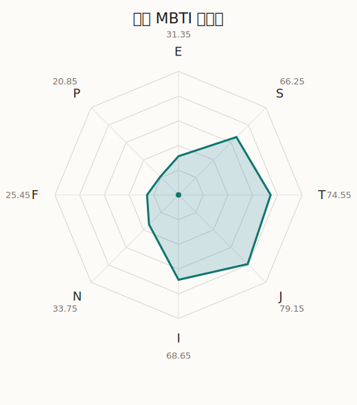

# 纱夜 MBTI 类型解释

- 角色名：冰川纱夜
- 最终类型：ISTJ
- 备选类型：INTJ
- 原始聚合类型：ISTJ
- 采样轮次：10
- 主类型稳定度：10/10（100.0%）
- 原始聚合稳定度：10/10（100.0%）
- 置信度：高（44.3）
- 置信度方差：58.7256
- 题库：Open Jungian Type Scales (OJTS v2.1)（48 题）

## 类型概述

ISTJ 的整体倾向是：更偏内在稳态、现实执行、逻辑标准和规则落实。

## 人物核心

从外部设定与已整理剧情综合来看，纱夜的角色框架可以先理解为：官方与外部角色资料里的纱夜通常被写成理性、认真、自我要求极高的吉他手。她对自己很严格，也曾长期活在与妹妹比较的压力里，因此她的成熟感里一直带着一层不肯服输的紧绷。

## PDB 校核

- 已应用 PDB 主参考：来源 `personality-database.com`。
- 权重分配：PDB 50% / 人设概要 25% / 卡牌剧情 15% / 剧情切片 10%。
- PDB 类型排序：`ISTJ`
- 最终类型先按 PDB 最高票定锚：`ISTJ`
- 指定锁定类型：`ISTJ`
## 为什么是这个类型

- `I > E`（68.65 : 31.35，平均轴差 49.56，方差 277.3665）：更常先在内部消化，再选择性地向外表达立场。
- `S > N`（66.25 : 33.75，平均轴差 17.53，方差 189.2168）：更常依赖现实条件、具体细节和当下经验来判断局面。
- `T > F`（74.55 : 25.45，平均轴差 46.17，方差 291.5427）：更常把逻辑、结构、效率和标准一致性放在判断前列。
- `J > P`（79.15 : 20.85，平均轴差 60.39，方差 211.8686）：更常用计划、收束、安排和责任结构去降低混乱。

## 为什么不是备选类型

最接近的备选类型是 `INTJ`。它与主类型 `ISTJ` 的差别主要落在 `SN` 这一轴上。
最终仍保留 `S`，因为该轴平均优势还有 `32.50`，虽然会波动，但整体没有被 `N` 反超。虽然也会谈到意义和理想，但资料里更常落到现实条件、细节和可执行层面。

## 四维结果

- `EI`：E 31.35 / I 68.65，轴差方差 277.3665
- `SN`：S 66.25 / N 33.75，轴差方差 189.2168
- `FT`：F 25.45 / T 74.55，轴差方差 291.5427
- `JP`：J 79.15 / P 20.85，轴差方差 211.8686

## 八维数据

- `E`：均值 31.35，方差 69.3416
- `S`：均值 66.25，方差 47.3042
- `T`：均值 74.55，方差 72.8857
- `J`：均值 79.15，方差 52.9672
- `I`：均值 68.65，方差 69.3416
- `N`：均值 33.75，方差 47.3042
- `F`：均值 25.45，方差 72.8857
- `P`：均值 20.85，方差 52.9672

## 类型稳定性

- `ISTJ`：10 次（100.0%）

## 图表

## 证据依据

- 人物概述：从外部设定与已整理剧情综合来看，纱夜的角色框架可以先理解为：官方与外部角色资料里的纱夜通常被写成理性、认真、自我要求极高的吉他手。她对自己很严格，也曾长期活在与妹妹比较的压力里，因此她的成熟感里一直带着一层不肯服输的紧绷。
- 卡牌剧情：在 114 条卡牌剧情里，纱夜 的个人篇章补完相对丰富；这部分更适合用来观察角色的私下状态、非主线场合下的关系重心，以及主线之外的稳定人格表现。
- 剧情切片：在已整理的 400 条主线/乐团剧情切片里，纱夜同时覆盖主线推进（66）和乐队内部关系（334）两条线。这说明这个角色在本地语料中的位置，不应该只从单句台词去读，而要放回到持续出现的关系链和章节位置里看。

## 模拟作答概览

| 题号 | 题目/两端描述 | 平均作答 | 作答方差 | 平均倾向值 | 倾向方差 |
| --- | --- | --- | --- | --- | --- |
| 1 | I don&lsquo;t like to draw attention to myself. | 3.10 | 0.0900 | 2.45 | 141.7728 |
| 2 | I hate situations where people expect me to be funny. | 3.10 | 0.2900 | 4.13 | 334.7542 |
| 3 | I hold back my opinions. | 2.90 | 0.2900 | -0.20 | 363.4311 |
| 4 | I want a huge social circle. | 1.40 | 0.2400 | -64.51 | 157.0948 |
| 5 | I am the life of the party. | 1.30 | 0.2100 | -65.07 | 67.6544 |
| 6 | I make lots of noise. | 1.80 | 0.1600 | -43.61 | 178.3226 |
| 7 | I avoid philosophical discussions. | 2.70 | 0.2100 | -13.04 | 176.4134 |
| 8 | I don&apos;t like to analyze literature. | 2.50 | 0.2500 | -13.28 | 252.4102 |
| 9 | I am attached to conventional ways. | 2.80 | 0.3600 | -8.66 | 414.3669 |
| 10 | I love to read challenging material. | 1.80 | 0.1600 | -49.65 | 127.2424 |
| 11 | I look for hidden meanings in things. | 1.90 | 0.0900 | -48.20 | 247.9666 |
| 12 | I am curious about everything. | 2.00 | 0.2000 | -42.62 | 138.6360 |
| 13 | I want to experience passion and romance. | 1.60 | 0.2400 | -55.75 | 240.4799 |
| 14 | I am deeply moved by others&lsquo; misfortunes. | 1.40 | 0.2400 | -63.29 | 183.9566 |
| 15 | I listen to my feelings when making important decisions. | 1.50 | 0.2500 | -58.13 | 246.2741 |
| 16 | I prize logic above all else. | 3.00 | 0.2000 | -2.68 | 309.2149 |
| 17 | I don&lsquo;t understand people who get emotional. | 3.00 | 0.2000 | 5.30 | 573.2462 |
| 18 | I&apos;d rather be feared than loved. | 3.20 | 0.1600 | 6.95 | 200.0642 |
| 19 | I like order. | 3.20 | 0.1600 | 11.83 | 233.5263 |
| 20 | I do things according to a plan. | 3.40 | 0.2400 | 16.18 | 150.6517 |
| 21 | I am always prepared. | 3.30 | 0.2100 | 10.34 | 284.9487 |
| 22 | I often make last-minute plans. | 1.10 | 0.0900 | -72.28 | 114.1307 |
| 23 | I do things for no apparent reason. | 1.00 | 0.0000 | -74.61 | 81.0674 |
| 24 | It takes me days to do things that should take hours because I keep getting distracted. | 1.10 | 0.0900 | -73.36 | 93.3922 |
| 25 | I work on improving myself. | 2.90 | 0.0900 | -6.30 | 163.3589 |
| 26 | I always feel like I need to be doing something important. | 2.70 | 0.2100 | -14.90 | 173.9792 |
| 27 | I have unusual beliefs about the world. | 1.60 | 0.2400 | -59.76 | 103.5396 |
| 28 | I dislike routine. | 1.60 | 0.2400 | -57.93 | 97.5297 |
| 29 | I try my best to follow the rules. | 3.30 | 0.2100 | 5.12 | 309.6636 |
| 30 | I respect authority. | 2.90 | 0.0900 | -2.96 | 136.1504 |
| 31 | I like to take it easy. | 2.10 | 0.2900 | -36.40 | 235.5677 |
| 32 | I choose the easy way. | 2.10 | 0.0900 | -44.61 | 179.8067 |
| 33 | I tell other people my secrets. | 1.50 | 0.2500 | -57.22 | 215.2438 |
| 34 | I make big gestures of friendship to people. | 1.50 | 0.2500 | -61.50 | 120.5800 |
| 35 | I enjoy challenges and competition. | 2.20 | 0.1600 | -35.60 | 113.7729 |
| 36 | I have very high self-esteem. | 2.00 | 0.0000 | -31.05 | 95.1564 |
| 37 | I get embarrassed easily. | 2.30 | 0.2100 | -28.55 | 289.4746 |
| 38 | I become overwhelmed by events. | 2.40 | 0.2400 | -28.71 | 84.2649 |
| 39 | I have difficulty expressing my feelings. | 3.10 | 0.0900 | 4.35 | 262.7189 |
| 40 | I don&apos;t trust others easily. | 3.10 | 0.0900 | 4.70 | 94.7626 |
| 41 | skeptical <-> wants to believe | 1.40 | 0.2400 | -62.50 | 193.1381 |
| 42 | chaotic <-> organized | 4.30 | 0.2100 | 56.34 | 170.7746 |
| 43 | wants the big picture <-> wants the details | 2.40 | 0.2400 | -21.56 | 403.2997 |
| 44 | energetic <-> mellow | 4.60 | 0.2400 | 63.16 | 146.6816 |
| 45 | follows the heart <-> follows the head | 3.60 | 0.2400 | 30.94 | 365.2843 |
| 46 | prepares <-> improvises | 1.90 | 0.2900 | -39.85 | 292.6081 |
| 47 | focused on the present <-> focused on the future | 2.00 | 0.0000 | -44.40 | 77.5181 |
| 48 | works best alone <-> works best in groups | 2.40 | 0.2400 | -26.94 | 135.7985 |

## 题库来源

- [OJTS 官方题目页](https://openpsychometrics.org/tests/OJTS/)
- 许可证：CC BY-NC-SA 4.0
- [本地题库文件](../ojts_question_bank_v2_1.json)
