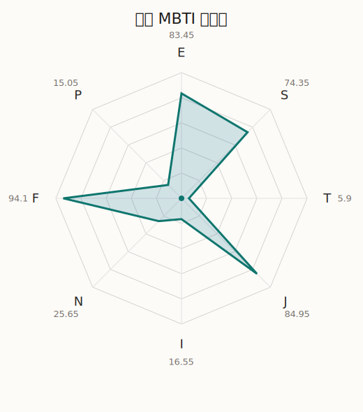

# 爽世 MBTI 类型解释

- 角色名：长崎爽世
- 最终类型：ESFJ
- 备选类型：ENFJ
- 原始聚合类型：ESFJ
- 采样轮次：10
- 主类型稳定度：10/10（100.0%）
- 原始聚合稳定度：10/10（100.0%）
- 置信度：高（68.43）
- 置信度方差：14.6195
- 题库：Open Jungian Type Scales (OJTS v2.1)（48 题）

## 类型概述

ESFJ 的整体倾向是：更偏外向关系、现实执行、情感照料和稳定组织。

## 人物核心

从外部设定与已整理剧情综合来看，爽世的角色框架可以先理解为：外部资料里的素世常被写成温柔、会照顾人、看起来最成熟稳妥的成员，但《It's MyGO!!!!!》也不断揭示她这层温柔里包着很重的执念与控制。她不是简单的反差角色，而是一个太想把失去过的关系重新抓回手里的人。

## PDB 校核

- 已应用 PDB 主参考：来源 `personality-database.com`。
- 权重分配：PDB 50% / 人设概要 25% / 卡牌剧情 15% / 剧情切片 10%。
- PDB 类型排序：`ESFJ`
- 最终类型先按 PDB 最高票定锚：`ESFJ`
- 指定锁定类型：`ESFJ`
## 为什么是这个类型

- `E > I`（83.45 : 16.55，平均轴差 73.45，方差 36.2576）：更常通过主动互动、公开表达或带动现场来处理问题。
- `S > N`（74.35 : 25.65，平均轴差 26.09，方差 154.6255）：更常依赖现实条件、具体细节和当下经验来判断局面。
- `F > T`（94.10 : 5.90，平均轴差 72.69，方差 36.2408）：更常把感受、关系、价值和对人的回应放在判断前列。
- `J > P`（84.95 : 15.05，平均轴差 77.74，方差 4.5199）：更常用计划、收束、安排和责任结构去降低混乱。

## 为什么不是备选类型

最接近的备选类型是 `ENFJ`。它与主类型 `ESFJ` 的差别主要落在 `SN` 这一轴上。
最终仍保留 `S`，因为该轴平均优势还有 `48.70`，虽然会波动，但整体没有被 `N` 反超。虽然也会谈到意义和理想，但资料里更常落到现实条件、细节和可执行层面。

## 四维结果

- `EI`：E 83.45 / I 16.55，轴差方差 36.2576
- `SN`：S 74.35 / N 25.65，轴差方差 154.6255
- `FT`：F 94.10 / T 5.90，轴差方差 36.2408
- `JP`：J 84.95 / P 15.05，轴差方差 4.5199

## 八维数据

- `E`：均值 83.45，方差 9.0644
- `S`：均值 74.35，方差 38.6564
- `T`：均值 5.90，方差 9.0602
- `J`：均值 84.95，方差 1.1300
- `I`：均值 16.55，方差 9.0644
- `N`：均值 25.65，方差 38.6564
- `F`：均值 94.10，方差 9.0602
- `P`：均值 15.05，方差 1.1300

## 类型稳定性

- `ESFJ`：10 次（100.0%）

## 图表

## 证据依据

- 人物概述：从外部设定与已整理剧情综合来看，爽世的角色框架可以先理解为：外部资料里的素世常被写成温柔、会照顾人、看起来最成熟稳妥的成员，但《It's MyGO!!!!!》也不断揭示她这层温柔里包着很重的执念与控制。她不是简单的反差角色，而是一个太想把失去过的关系重新抓回手里的人。
- 卡牌剧情：在 21 条卡牌剧情里，爽世 的个人篇章补完相对丰富；这部分更适合用来观察角色的私下状态、非主线场合下的关系重心，以及主线之外的稳定人格表现。
- 剧情切片：在已整理的 155 条主线/乐团剧情切片里，爽世目前更集中在乐队内部与团内关系剧情（155）。这说明这个角色在本地语料中的位置，不应该只从单句台词去读，而要放回到持续出现的关系链和章节位置里看。

## 模拟作答概览

| 题号 | 题目/两端描述 | 平均作答 | 作答方差 | 平均倾向值 | 倾向方差 |
| --- | --- | --- | --- | --- | --- |
| 1 | I don&lsquo;t like to draw attention to myself. | 1.00 | 0.0000 | -75.26 | 54.4251 |
| 2 | I hate situations where people expect me to be funny. | 1.00 | 0.0000 | -79.70 | 68.1839 |
| 3 | I hold back my opinions. | 1.00 | 0.0000 | -75.59 | 69.1052 |
| 4 | I want a huge social circle. | 3.70 | 0.2100 | 23.37 | 210.3903 |
| 5 | I am the life of the party. | 3.50 | 0.2500 | 17.24 | 255.5863 |
| 6 | I make lots of noise. | 4.30 | 0.2100 | 53.42 | 145.3088 |
| 7 | I avoid philosophical discussions. | 3.20 | 0.1600 | 7.14 | 244.7333 |
| 8 | I don&apos;t like to analyze literature. | 3.10 | 0.0900 | 6.51 | 326.9838 |
| 9 | I am attached to conventional ways. | 3.30 | 0.2100 | 9.00 | 367.1471 |
| 10 | I love to read challenging material. | 2.20 | 0.1600 | -32.53 | 449.1978 |
| 11 | I look for hidden meanings in things. | 2.40 | 0.2400 | -30.94 | 427.6921 |
| 12 | I am curious about everything. | 2.10 | 0.0900 | -39.76 | 203.8909 |
| 13 | I want to experience passion and romance. | 4.70 | 0.2100 | 59.14 | 144.5703 |
| 14 | I am deeply moved by others&lsquo; misfortunes. | 4.60 | 0.2400 | 61.80 | 60.2871 |
| 15 | I listen to my feelings when making important decisions. | 4.40 | 0.2400 | 55.59 | 157.3371 |
| 16 | I prize logic above all else. | 1.00 | 0.0000 | -87.40 | 29.4029 |
| 17 | I don&lsquo;t understand people who get emotional. | 1.00 | 0.0000 | -92.00 | 59.8784 |
| 18 | I&apos;d rather be feared than loved. | 1.00 | 0.0000 | -87.90 | 35.8675 |
| 19 | I like order. | 4.00 | 0.0000 | 46.65 | 111.9730 |
| 20 | I do things according to a plan. | 4.20 | 0.1600 | 47.84 | 157.0276 |
| 21 | I am always prepared. | 4.30 | 0.2100 | 52.35 | 60.5708 |
| 22 | I often make last-minute plans. | 1.00 | 0.0000 | -75.18 | 72.3178 |
| 23 | I do things for no apparent reason. | 1.00 | 0.0000 | -79.92 | 60.6819 |
| 24 | It takes me days to do things that should take hours because I keep getting distracted. | 1.10 | 0.0900 | -79.33 | 70.9972 |
| 25 | I work on improving myself. | 3.10 | 0.0900 | 6.49 | 345.1519 |
| 26 | I always feel like I need to be doing something important. | 3.60 | 0.2400 | 22.21 | 190.1966 |
| 27 | I have unusual beliefs about the world. | 1.10 | 0.0900 | -72.41 | 67.1954 |
| 28 | I dislike routine. | 1.00 | 0.0000 | -77.10 | 49.9295 |
| 29 | I try my best to follow the rules. | 3.10 | 0.0900 | 12.55 | 126.1175 |
| 30 | I respect authority. | 3.20 | 0.1600 | 10.05 | 233.7821 |
| 31 | I like to take it easy. | 2.00 | 0.0000 | -37.21 | 80.6902 |
| 32 | I choose the easy way. | 2.00 | 0.0000 | -41.38 | 102.1013 |
| 33 | I tell other people my secrets. | 3.30 | 0.2100 | 18.63 | 130.8520 |
| 34 | I make big gestures of friendship to people. | 3.50 | 0.2500 | 22.33 | 70.1023 |
| 35 | I enjoy challenges and competition. | 2.20 | 0.1600 | -32.89 | 103.7441 |
| 36 | I have very high self-esteem. | 2.20 | 0.1600 | -29.62 | 194.2655 |
| 37 | I get embarrassed easily. | 2.20 | 0.1600 | -27.97 | 61.2847 |
| 38 | I become overwhelmed by events. | 2.50 | 0.2500 | -24.44 | 196.1067 |
| 39 | I have difficulty expressing my feelings. | 1.00 | 0.0000 | -83.68 | 31.9344 |
| 40 | I don&apos;t trust others easily. | 1.00 | 0.0000 | -86.77 | 30.5255 |
| 41 | skeptical <-> wants to believe | 4.20 | 0.1600 | 56.35 | 22.4332 |
| 42 | chaotic <-> organized | 5.00 | 0.0000 | 79.85 | 46.6947 |
| 43 | wants the big picture <-> wants the details | 3.00 | 0.2000 | 1.10 | 286.5965 |
| 44 | energetic <-> mellow | 1.00 | 0.0000 | -83.28 | 32.7900 |
| 45 | follows the heart <-> follows the head | 1.70 | 0.2100 | -57.25 | 59.0910 |
| 46 | prepares <-> improvises | 2.00 | 0.0000 | -43.38 | 48.4108 |
| 47 | focused on the present <-> focused on the future | 1.40 | 0.2400 | -61.68 | 137.6871 |
| 48 | works best alone <-> works best in groups | 4.20 | 0.1600 | 49.45 | 103.2591 |

## 题库来源

- [OJTS 官方题目页](https://openpsychometrics.org/tests/OJTS/)
- 许可证：CC BY-NC-SA 4.0
- [本地题库文件](../ojts_question_bank_v2_1.json)
