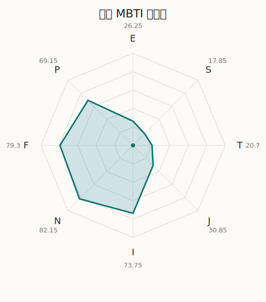

# 多惠 MBTI 类型解释

- 角色名：花园多惠
- 最终类型：INFP
- 备选类型：INFJ
- 原始聚合类型：INFP
- 采样轮次：10
- 主类型稳定度：10/10（100.0%）
- 原始聚合稳定度：10/10（100.0%）
- 置信度：高（52.17）
- 置信度方差：35.477
- 题库：Open Jungian Type Scales (OJTS v2.1)（48 题）

## 类型概述

INFP 的整体倾向是：更偏内在感受、抽象意义、价值驱动和开放探索。

## 人物核心

从外部设定与已整理剧情综合来看，多惠的角色框架可以先理解为：外部资料通常把多惠写成气质天然、步调我行我素、但一拿起吉他就非常可靠的人。她平时看似飘忽，真正重要的情感和判断却常常通过演奏来表达，而不是通过长篇解释来说明。

## PDB 校核

- 已应用 PDB 主参考：来源 `personality-database.com`。
- 权重分配：PDB 50% / 人设概要 25% / 卡牌剧情 15% / 剧情切片 10%。
- PDB 类型排序：`INFP`
- 最终类型先按 PDB 最高票定锚：`INFP`
- 指定锁定类型：`INFP`
## 为什么是这个类型

- `I > E`（73.75 : 26.25，平均轴差 54.43，方差 241.5363）：更常先在内部消化，再选择性地向外表达立场。
- `N > S`（82.15 : 17.85，平均轴差 60.69，方差 132.5442）：更常从意义、可能性、方向感和隐含主题去理解问题。
- `F > T`（79.30 : 20.70，平均轴差 63.33，方差 21.6458）：更常把感受、关系、价值和对人的回应放在判断前列。
- `P > J`（69.15 : 30.85，平均轴差 31.73，方差 200.3061）：更常保留空间，依靠灵活调整和临场变化推进事情。

## 为什么不是备选类型

最接近的备选类型是 `INFJ`。它与主类型 `INFP` 的差别主要落在 `JP` 这一轴上。
最终仍保留 `P`，因为该轴平均优势还有 `38.30`，虽然会波动，但整体没有被 `J` 反超。虽然并非完全无计划，但整体仍更偏向保留余地、即兴调整和开放推进。

## 四维结果

- `EI`：E 26.25 / I 73.75，轴差方差 241.5363
- `SN`：S 17.85 / N 82.15，轴差方差 132.5442
- `FT`：F 79.30 / T 20.70，轴差方差 21.6458
- `JP`：J 30.85 / P 69.15，轴差方差 200.3061

## 八维数据

- `E`：均值 26.25，方差 60.3841
- `S`：均值 17.85，方差 33.1360
- `T`：均值 20.70，方差 5.4115
- `J`：均值 30.85，方差 50.0765
- `I`：均值 73.75，方差 60.3841
- `N`：均值 82.15，方差 33.1360
- `F`：均值 79.30，方差 5.4115
- `P`：均值 69.15，方差 50.0765

## 类型稳定性

- `INFP`：10 次（100.0%）

## 图表

## 证据依据

- 人物概述：从外部设定与已整理剧情综合来看，多惠的角色框架可以先理解为：外部资料通常把多惠写成气质天然、步调我行我素、但一拿起吉他就非常可靠的人。她平时看似飘忽，真正重要的情感和判断却常常通过演奏来表达，而不是通过长篇解释来说明。
- 卡牌剧情：在 101 条卡牌剧情里，多惠 的个人篇章补完相对丰富；这部分更适合用来观察角色的私下状态、非主线场合下的关系重心，以及主线之外的稳定人格表现。
- 剧情切片：在已整理的 565 条主线/乐团剧情切片里，多惠同时覆盖主线推进（90）和乐队内部关系（475）两条线。这说明这个角色在本地语料中的位置，不应该只从单句台词去读，而要放回到持续出现的关系链和章节位置里看。

## 模拟作答概览

| 题号 | 题目/两端描述 | 平均作答 | 作答方差 | 平均倾向值 | 倾向方差 |
| --- | --- | --- | --- | --- | --- |
| 1 | I don&lsquo;t like to draw attention to myself. | 3.10 | 0.0900 | 9.92 | 205.9690 |
| 2 | I hate situations where people expect me to be funny. | 2.90 | 0.2900 | 0.32 | 485.3976 |
| 3 | I hold back my opinions. | 3.40 | 0.2400 | 17.66 | 195.5121 |
| 4 | I want a huge social circle. | 1.30 | 0.2100 | -68.02 | 196.7528 |
| 5 | I am the life of the party. | 1.30 | 0.2100 | -66.44 | 181.8533 |
| 6 | I make lots of noise. | 1.20 | 0.1600 | -69.22 | 139.5993 |
| 7 | I avoid philosophical discussions. | 1.00 | 0.0000 | -73.56 | 56.8760 |
| 8 | I don&apos;t like to analyze literature. | 1.10 | 0.0900 | -76.75 | 113.4896 |
| 9 | I am attached to conventional ways. | 1.00 | 0.0000 | -77.88 | 69.7801 |
| 10 | I love to read challenging material. | 3.20 | 0.3600 | 14.31 | 353.8654 |
| 11 | I look for hidden meanings in things. | 3.50 | 0.2500 | 16.54 | 366.8059 |
| 12 | I am curious about everything. | 3.20 | 0.1600 | 11.74 | 220.8410 |
| 13 | I want to experience passion and romance. | 4.00 | 0.0000 | 39.64 | 120.6146 |
| 14 | I am deeply moved by others&lsquo; misfortunes. | 4.10 | 0.0900 | 45.43 | 130.6622 |
| 15 | I listen to my feelings when making important decisions. | 4.10 | 0.0900 | 43.03 | 155.1903 |
| 16 | I prize logic above all else. | 1.00 | 0.0000 | -73.75 | 113.5936 |
| 17 | I don&lsquo;t understand people who get emotional. | 1.10 | 0.0900 | -71.92 | 44.8965 |
| 18 | I&apos;d rather be feared than loved. | 1.20 | 0.1600 | -71.94 | 103.8960 |
| 19 | I like order. | 1.60 | 0.2400 | -56.02 | 128.1623 |
| 20 | I do things according to a plan. | 1.50 | 0.2500 | -57.96 | 169.2094 |
| 21 | I am always prepared. | 1.60 | 0.2400 | -58.42 | 161.8637 |
| 22 | I often make last-minute plans. | 2.90 | 0.2900 | -4.85 | 283.0899 |
| 23 | I do things for no apparent reason. | 3.10 | 0.0900 | 4.95 | 181.5829 |
| 24 | It takes me days to do things that should take hours because I keep getting distracted. | 2.80 | 0.1600 | -9.87 | 302.4059 |
| 25 | I work on improving myself. | 2.50 | 0.2500 | -19.80 | 88.7824 |
| 26 | I always feel like I need to be doing something important. | 2.60 | 0.2400 | -18.90 | 152.6104 |
| 27 | I have unusual beliefs about the world. | 3.00 | 0.0000 | 8.55 | 110.8791 |
| 28 | I dislike routine. | 3.10 | 0.0900 | 7.85 | 79.3894 |
| 29 | I try my best to follow the rules. | 1.30 | 0.2100 | -66.96 | 156.9836 |
| 30 | I respect authority. | 1.10 | 0.0900 | -69.34 | 66.1671 |
| 31 | I like to take it easy. | 2.80 | 0.3600 | -10.37 | 358.7787 |
| 32 | I choose the easy way. | 2.00 | 0.0000 | -40.58 | 32.6285 |
| 33 | I tell other people my secrets. | 2.20 | 0.1600 | -29.87 | 139.1224 |
| 34 | I make big gestures of friendship to people. | 2.50 | 0.2500 | -24.84 | 185.7627 |
| 35 | I enjoy challenges and competition. | 1.30 | 0.2100 | -66.26 | 106.6565 |
| 36 | I have very high self-esteem. | 1.10 | 0.0900 | -69.91 | 60.4293 |
| 37 | I get embarrassed easily. | 3.20 | 0.1600 | 7.59 | 156.8922 |
| 38 | I become overwhelmed by events. | 3.10 | 0.0900 | 7.34 | 158.3538 |
| 39 | I have difficulty expressing my feelings. | 2.00 | 0.0000 | -36.14 | 86.1984 |
| 40 | I don&apos;t trust others easily. | 2.30 | 0.2100 | -29.77 | 221.9895 |
| 41 | skeptical <-> wants to believe | 4.00 | 0.0000 | 40.71 | 123.6546 |
| 42 | chaotic <-> organized | 3.10 | 0.0900 | 4.79 | 200.8644 |
| 43 | wants the big picture <-> wants the details | 1.10 | 0.0900 | -74.13 | 80.5006 |
| 44 | energetic <-> mellow | 4.50 | 0.2500 | 65.69 | 163.9505 |
| 45 | follows the heart <-> follows the head | 2.00 | 0.0000 | -38.62 | 117.6990 |
| 46 | prepares <-> improvises | 3.40 | 0.2400 | 23.58 | 63.5723 |
| 47 | focused on the present <-> focused on the future | 3.40 | 0.2400 | 16.94 | 104.8429 |
| 48 | works best alone <-> works best in groups | 2.30 | 0.2100 | -34.23 | 287.8103 |

## 题库来源

- [OJTS 官方题目页](https://openpsychometrics.org/tests/OJTS/)
- 许可证：CC BY-NC-SA 4.0
- [本地题库文件](../ojts_question_bank_v2_1.json)
