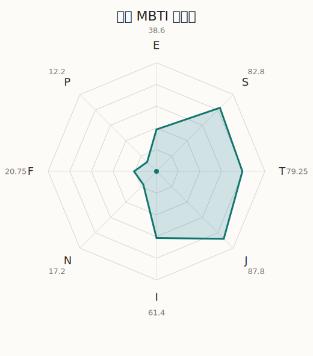

# 立希 MBTI 类型解释

- 角色名：椎名立希
- 最终类型：ISTJ
- 备选类型：ESTJ
- 原始聚合类型：ISTJ
- 采样轮次：10
- 主类型稳定度：8/10（80.0%）
- 原始聚合稳定度：8/10（80.0%）
- 置信度：高（55.62）
- 置信度方差：21.3204
- 题库：Open Jungian Type Scales (OJTS v2.1)（48 题）

## 类型概述

ISTJ 的整体倾向是：更偏内在稳态、现实执行、逻辑标准和规则落实。

## 人物核心

从外部设定与已整理剧情综合来看，立希的角色框架可以先理解为：官方和外部角色资料里的立希通常是脾气硬、说话冲、创作欲和责任感都很强的鼓手。她看起来最难相处，但实际上很多怒气都来自她太在乎结果、太在乎某些人，却又不擅长温和表达。

## PDB 校核

- 已应用 PDB 主参考：来源 `personality-database.com`。
- 权重分配：PDB 50% / 人设概要 25% / 卡牌剧情 15% / 剧情切片 10%。
- PDB 类型排序：`ISTJ`
- 最终类型先按 PDB 最高票定锚：`ISTJ`
- 指定锁定类型：`ISTJ`
## 为什么是这个类型

- `I > E`（61.40 : 38.60，平均轴差 28.65，方差 156.9062）：更常先在内部消化，再选择性地向外表达立场。
- `S > N`（82.80 : 17.20，平均轴差 77.76，方差 43.8105）：更常依赖现实条件、具体细节和当下经验来判断局面。
- `T > F`（79.25 : 20.75，平均轴差 58.50，方差 100.0847）：更常把逻辑、结构、效率和标准一致性放在判断前列。
- `J > P`（87.80 : 12.20，平均轴差 72.50，方差 29.8260）：更常用计划、收束、安排和责任结构去降低混乱。

## 为什么不是备选类型

最接近的备选类型是 `ESTJ`。它与主类型 `ISTJ` 的差别主要落在 `EI` 这一轴上。
最终仍保留 `I`，因为该轴平均优势还有 `22.80`，虽然会波动，但整体没有被 `E` 反超。虽然也会参与群体互动，但资料里更常表现为先内化、后表达的节奏。

## 四维结果

- `EI`：E 38.60 / I 61.40，轴差方差 156.9062
- `SN`：S 82.80 / N 17.20，轴差方差 43.8105
- `FT`：F 20.75 / T 79.25，轴差方差 100.0847
- `JP`：J 87.80 / P 12.20，轴差方差 29.8260

## 八维数据

- `E`：均值 38.60，方差 126.1368
- `S`：均值 82.80，方差 10.9526
- `T`：均值 79.25，方差 25.0212
- `J`：均值 87.80，方差 7.4565
- `I`：均值 61.40，方差 126.1368
- `N`：均值 17.20，方差 10.9526
- `F`：均值 20.75，方差 25.0212
- `P`：均值 12.20，方差 7.4565

## 类型稳定性

- `ISTJ`：8 次（80.0%）
- `ESTJ`：2 次（20.0%）

## 图表

## 证据依据

- 人物概述：从外部设定与已整理剧情综合来看，立希的角色框架可以先理解为：官方和外部角色资料里的立希通常是脾气硬、说话冲、创作欲和责任感都很强的鼓手。她看起来最难相处，但实际上很多怒气都来自她太在乎结果、太在乎某些人，却又不擅长温和表达。
- 卡牌剧情：在 19 条卡牌剧情里，立希 的个人篇章补完已经有一定覆盖；这部分更适合用来观察角色的私下状态、非主线场合下的关系重心，以及主线之外的稳定人格表现。
- 剧情切片：在已整理的 146 条主线/乐团剧情切片里，立希目前更集中在乐队内部与团内关系剧情（146）。这说明这个角色在本地语料中的位置，不应该只从单句台词去读，而要放回到持续出现的关系链和章节位置里看。

## 模拟作答概览

| 题号 | 题目/两端描述 | 平均作答 | 作答方差 | 平均倾向值 | 倾向方差 |
| --- | --- | --- | --- | --- | --- |
| 1 | I don&lsquo;t like to draw attention to myself. | 2.70 | 0.2100 | -18.20 | 333.8057 |
| 2 | I hate situations where people expect me to be funny. | 2.60 | 0.2400 | -15.88 | 651.8856 |
| 3 | I hold back my opinions. | 2.80 | 0.1600 | -13.13 | 520.9429 |
| 4 | I want a huge social circle. | 2.00 | 0.6000 | -42.97 | 412.8351 |
| 5 | I am the life of the party. | 2.00 | 0.4000 | -41.68 | 397.7391 |
| 6 | I make lots of noise. | 2.50 | 0.4500 | -17.53 | 417.1250 |
| 7 | I avoid philosophical discussions. | 3.80 | 0.1600 | 29.26 | 140.7332 |
| 8 | I don&apos;t like to analyze literature. | 3.60 | 0.2400 | 25.18 | 164.6161 |
| 9 | I am attached to conventional ways. | 3.60 | 0.2400 | 24.03 | 258.3222 |
| 10 | I love to read challenging material. | 1.10 | 0.0900 | -81.03 | 125.5550 |
| 11 | I look for hidden meanings in things. | 1.00 | 0.0000 | -83.77 | 26.9541 |
| 12 | I am curious about everything. | 1.10 | 0.0900 | -83.37 | 105.4474 |
| 13 | I want to experience passion and romance. | 1.20 | 0.1600 | -70.04 | 80.1026 |
| 14 | I am deeply moved by others&lsquo; misfortunes. | 1.10 | 0.0900 | -72.40 | 73.5732 |
| 15 | I listen to my feelings when making important decisions. | 1.10 | 0.0900 | -71.37 | 88.9934 |
| 16 | I prize logic above all else. | 3.30 | 0.2100 | 18.17 | 340.1170 |
| 17 | I don&lsquo;t understand people who get emotional. | 3.30 | 0.2100 | 11.01 | 158.8777 |
| 18 | I&apos;d rather be feared than loved. | 3.20 | 0.1600 | 5.66 | 197.7383 |
| 19 | I like order. | 3.40 | 0.2400 | 17.64 | 137.8649 |
| 20 | I do things according to a plan. | 3.40 | 0.2400 | 19.78 | 162.2594 |
| 21 | I am always prepared. | 3.50 | 0.2500 | 22.02 | 98.0482 |
| 22 | I often make last-minute plans. | 1.00 | 0.0000 | -82.95 | 30.7685 |
| 23 | I do things for no apparent reason. | 1.00 | 0.0000 | -80.12 | 119.4113 |
| 24 | It takes me days to do things that should take hours because I keep getting distracted. | 1.00 | 0.0000 | -82.01 | 131.1275 |
| 25 | I work on improving myself. | 2.20 | 0.1600 | -33.95 | 148.1332 |
| 26 | I always feel like I need to be doing something important. | 2.20 | 0.1600 | -30.54 | 65.3964 |
| 27 | I have unusual beliefs about the world. | 1.00 | 0.0000 | -81.24 | 92.8481 |
| 28 | I dislike routine. | 1.00 | 0.0000 | -80.88 | 86.1991 |
| 29 | I try my best to follow the rules. | 3.60 | 0.2400 | 21.28 | 197.6567 |
| 30 | I respect authority. | 3.40 | 0.2400 | 19.32 | 96.0046 |
| 31 | I like to take it easy. | 2.30 | 0.2100 | -32.18 | 200.0600 |
| 32 | I choose the easy way. | 2.30 | 0.2100 | -30.29 | 107.1548 |
| 33 | I tell other people my secrets. | 1.50 | 0.2500 | -60.86 | 167.2880 |
| 34 | I make big gestures of friendship to people. | 1.60 | 0.2400 | -56.95 | 188.4213 |
| 35 | I enjoy challenges and competition. | 3.00 | 0.4000 | -6.62 | 365.0908 |
| 36 | I have very high self-esteem. | 2.70 | 0.4100 | -10.83 | 370.2136 |
| 37 | I get embarrassed easily. | 2.00 | 0.0000 | -47.55 | 105.9592 |
| 38 | I become overwhelmed by events. | 1.90 | 0.0900 | -41.45 | 127.8097 |
| 39 | I have difficulty expressing my feelings. | 3.00 | 0.2000 | -3.84 | 173.1085 |
| 40 | I don&apos;t trust others easily. | 2.90 | 0.2900 | -2.81 | 331.1580 |
| 41 | skeptical <-> wants to believe | 1.90 | 0.0900 | -46.29 | 115.0843 |
| 42 | chaotic <-> organized | 5.00 | 0.0000 | 82.54 | 73.4076 |
| 43 | wants the big picture <-> wants the details | 4.70 | 0.2100 | 60.96 | 144.8941 |
| 44 | energetic <-> mellow | 4.20 | 0.3600 | 46.75 | 347.2564 |
| 45 | follows the heart <-> follows the head | 3.90 | 0.0900 | 39.60 | 178.0643 |
| 46 | prepares <-> improvises | 1.90 | 0.0900 | -49.79 | 83.1028 |
| 47 | focused on the present <-> focused on the future | 1.00 | 0.0000 | -77.88 | 54.7419 |
| 48 | works best alone <-> works best in groups | 2.70 | 0.2100 | -7.11 | 274.8904 |

## 题库来源

- [OJTS 官方题目页](https://openpsychometrics.org/tests/OJTS/)
- 许可证：CC BY-NC-SA 4.0
- [本地题库文件](../ojts_question_bank_v2_1.json)
