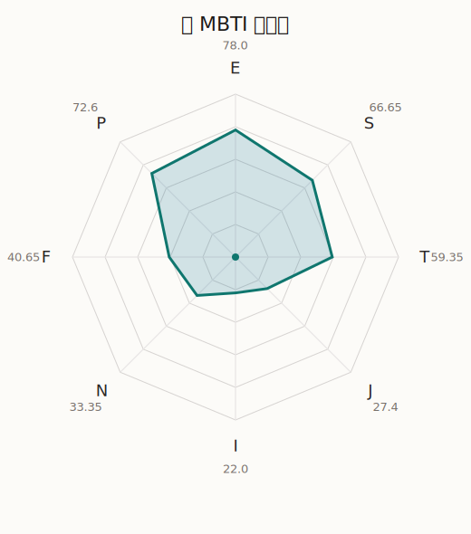

# 巴 MBTI 类型解释

- 角色名：宇田川巴
- 最终类型：ESTP
- 备选类型：ESFP
- 原始聚合类型：ESTP
- 采样轮次：10
- 主类型稳定度：5/10（50.0%）
- 原始聚合稳定度：5/10（50.0%）
- 置信度：高（38.3）
- 置信度方差：70.3686
- 题库：Open Jungian Type Scales (OJTS v2.1)（48 题）

## 类型概述

ESTP 的整体倾向是：更偏外向行动、现实反应、逻辑处理和即兴应对。

## 人物核心

从外部设定与已整理剧情综合来看，巴的角色框架可以先理解为：官方与外部资料里的巴通常被写成爽朗、仗义、有大姐头气质的鼓手。她既有很强的行动派属性，也比表面更擅长观察人心，因此常常能在大家情绪要顶起来时先把场子稳住。

## PDB 校核

- 已应用 PDB 主参考：来源 `personality-database.com`。
- 权重分配：PDB 50% / 人设概要 25% / 卡牌剧情 15% / 剧情切片 10%。
- PDB 类型排序：`ESTP`
- 最终类型先按 PDB 最高票定锚：`ESTP`
- 指定锁定类型：`ESTP`
## 为什么是这个类型

- `E > I`（78.00 : 22.00，平均轴差 53.13，方差 299.3531）：更常通过主动互动、公开表达或带动现场来处理问题。
- `S > N`（66.65 : 33.35，平均轴差 34.64，方差 274.9336）：更常依赖现实条件、具体细节和当下经验来判断局面。
- `T > F`（59.35 : 40.65，平均轴差 19.25，方差 333.8716）：更常把逻辑、结构、效率和标准一致性放在判断前列。
- `P > J`（72.60 : 27.40，平均轴差 23.64，方差 125.8552）：更常保留空间，依靠灵活调整和临场变化推进事情。

## 为什么不是备选类型

最接近的备选类型是 `ESFP`。它与主类型 `ESTP` 的差别主要落在 `FT` 这一轴上。
最终仍保留 `T`，因为该轴平均优势还有 `18.70`，虽然会波动，但整体没有被 `F` 反超。虽然也在意关系影响，但最终更常回到逻辑、标准和方法正确性来判断。

## 四维结果

- `EI`：E 78.00 / I 22.00，轴差方差 299.3531
- `SN`：S 66.65 / N 33.35，轴差方差 274.9336
- `FT`：F 40.65 / T 59.35，轴差方差 333.8716
- `JP`：J 27.40 / P 72.60，轴差方差 125.8552

## 八维数据

- `E`：均值 78.00，方差 74.8383
- `S`：均值 66.65，方差 82.4310
- `T`：均值 59.35，方差 169.6700
- `J`：均值 27.40，方差 31.4638
- `I`：均值 22.00，方差 74.8383
- `N`：均值 33.35，方差 82.4310
- `F`：均值 40.65，方差 169.6700
- `P`：均值 72.60，方差 31.4638

## 类型稳定性

- `ESTP`：5 次（50.0%）
- `ESFP`：4 次（40.0%）
- `ENFP`：1 次（10.0%）

## 图表

## 证据依据

- 人物概述：从外部设定与已整理剧情综合来看，巴的角色框架可以先理解为：官方与外部资料里的巴通常被写成爽朗、仗义、有大姐头气质的鼓手。她既有很强的行动派属性，也比表面更擅长观察人心，因此常常能在大家情绪要顶起来时先把场子稳住。
- 卡牌剧情：在 103 条卡牌剧情里，巴 的个人篇章补完相对丰富；这部分更适合用来观察角色的私下状态、非主线场合下的关系重心，以及主线之外的稳定人格表现。
- 剧情切片：在已整理的 374 条主线/乐团剧情切片里，巴同时覆盖主线推进（49）和乐队内部关系（325）两条线。这说明这个角色在本地语料中的位置，不应该只从单句台词去读，而要放回到持续出现的关系链和章节位置里看。

## 模拟作答概览

| 题号 | 题目/两端描述 | 平均作答 | 作答方差 | 平均倾向值 | 倾向方差 |
| --- | --- | --- | --- | --- | --- |
| 1 | I don&lsquo;t like to draw attention to myself. | 1.40 | 0.2400 | -67.00 | 243.1176 |
| 2 | I hate situations where people expect me to be funny. | 1.20 | 0.1600 | -68.54 | 259.7646 |
| 3 | I hold back my opinions. | 1.20 | 0.1600 | -69.40 | 287.6334 |
| 4 | I want a huge social circle. | 3.40 | 0.2400 | 11.75 | 314.5747 |
| 5 | I am the life of the party. | 3.30 | 0.2100 | 9.91 | 241.9307 |
| 6 | I make lots of noise. | 3.10 | 0.2900 | 5.55 | 292.0564 |
| 7 | I avoid philosophical discussions. | 2.70 | 0.2100 | -9.71 | 165.3307 |
| 8 | I don&apos;t like to analyze literature. | 2.80 | 0.3600 | -6.43 | 707.3783 |
| 9 | I am attached to conventional ways. | 2.70 | 0.2100 | -8.38 | 366.3766 |
| 10 | I love to read challenging material. | 1.50 | 0.4500 | -56.38 | 234.6130 |
| 11 | I look for hidden meanings in things. | 1.70 | 0.2100 | -49.86 | 251.2577 |
| 12 | I am curious about everything. | 1.70 | 0.4100 | -55.65 | 250.3829 |
| 13 | I want to experience passion and romance. | 2.20 | 0.3600 | -31.13 | 316.9831 |
| 14 | I am deeply moved by others&lsquo; misfortunes. | 2.30 | 0.4100 | -27.28 | 463.2532 |
| 15 | I listen to my feelings when making important decisions. | 2.10 | 0.2900 | -36.05 | 404.6336 |
| 16 | I prize logic above all else. | 2.30 | 0.4100 | -33.12 | 401.0332 |
| 17 | I don&lsquo;t understand people who get emotional. | 2.20 | 0.1600 | -27.91 | 224.8170 |
| 18 | I&apos;d rather be feared than loved. | 2.20 | 0.1600 | -32.49 | 283.8379 |
| 19 | I like order. | 2.30 | 0.2100 | -25.70 | 125.6759 |
| 20 | I do things according to a plan. | 2.30 | 0.4100 | -32.42 | 241.9327 |
| 21 | I am always prepared. | 2.30 | 0.2100 | -23.03 | 182.8458 |
| 22 | I often make last-minute plans. | 2.90 | 0.0900 | -2.07 | 173.2423 |
| 23 | I do things for no apparent reason. | 3.00 | 0.0000 | -3.16 | 26.0492 |
| 24 | It takes me days to do things that should take hours because I keep getting distracted. | 2.90 | 0.0900 | -2.47 | 199.3850 |
| 25 | I work on improving myself. | 1.50 | 0.2500 | -56.22 | 161.7938 |
| 26 | I always feel like I need to be doing something important. | 1.60 | 0.2400 | -57.08 | 36.4550 |
| 27 | I have unusual beliefs about the world. | 2.40 | 0.2400 | -27.29 | 167.3799 |
| 28 | I dislike routine. | 2.20 | 0.1600 | -28.12 | 95.9517 |
| 29 | I try my best to follow the rules. | 2.20 | 0.1600 | -35.35 | 203.9542 |
| 30 | I respect authority. | 2.30 | 0.2100 | -31.86 | 167.6717 |
| 31 | I like to take it easy. | 2.90 | 0.0900 | -6.50 | 146.1832 |
| 32 | I choose the easy way. | 2.80 | 0.1600 | -4.82 | 398.6040 |
| 33 | I tell other people my secrets. | 2.50 | 0.2500 | -17.82 | 250.8105 |
| 34 | I make big gestures of friendship to people. | 2.60 | 0.2400 | -13.99 | 101.0019 |
| 35 | I enjoy challenges and competition. | 2.60 | 0.2400 | -8.77 | 410.0811 |
| 36 | I have very high self-esteem. | 2.90 | 0.0900 | 0.82 | 187.8206 |
| 37 | I get embarrassed easily. | 1.70 | 0.2100 | -54.69 | 146.1951 |
| 38 | I become overwhelmed by events. | 1.80 | 0.1600 | -51.75 | 117.0174 |
| 39 | I have difficulty expressing my feelings. | 1.80 | 0.1600 | -49.96 | 146.6723 |
| 40 | I don&apos;t trust others easily. | 1.90 | 0.2900 | -45.84 | 194.9203 |
| 41 | skeptical <-> wants to believe | 2.90 | 0.2900 | -1.76 | 378.9758 |
| 42 | chaotic <-> organized | 2.50 | 0.2500 | -19.43 | 145.2556 |
| 43 | wants the big picture <-> wants the details | 3.20 | 0.1600 | 4.40 | 245.5142 |
| 44 | energetic <-> mellow | 1.90 | 0.2900 | -45.55 | 257.5306 |
| 45 | follows the heart <-> follows the head | 3.10 | 0.2900 | 4.88 | 465.2469 |
| 46 | prepares <-> improvises | 3.40 | 0.2400 | 18.31 | 132.3381 |
| 47 | focused on the present <-> focused on the future | 1.90 | 0.2900 | -46.72 | 206.2635 |
| 48 | works best alone <-> works best in groups | 3.90 | 0.0900 | 34.74 | 160.7453 |

## 题库来源

- [OJTS 官方题目页](https://openpsychometrics.org/tests/OJTS/)
- 许可证：CC BY-NC-SA 4.0
- [本地题库文件](../ojts_question_bank_v2_1.json)
