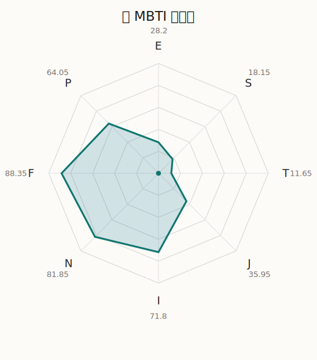

# 灯 MBTI 类型解释

- 角色名：高松灯
- 最终类型：INFP
- 备选类型：INFJ
- 原始聚合类型：INFP
- 采样轮次：10
- 主类型稳定度：5/10（50.0%）
- 原始聚合稳定度：5/10（50.0%）
- 置信度：高（53.02）
- 置信度方差：27.6529
- 题库：Open Jungian Type Scales (OJTS v2.1)（48 题）

## 类型概述

INFP 的整体倾向是：更偏内在感受、抽象意义、价值驱动和开放探索。

## 人物核心

从外部设定与已整理剧情综合来看，灯的角色框架可以先理解为：外部角色资料里的灯始终是非常独特的存在，她的感受方式、关注点和说话节奏都与普通校园角色明显不同。她会把羽毛、石头、词句和声音当作极其重要的事物，因此她的人设核心不是单纯内向，而是感知世界的方式本来就更细更深。

## PDB 校核

- 已应用 PDB 主参考：来源 `personality-database.com`。
- 权重分配：PDB 50% / 人设概要 25% / 卡牌剧情 15% / 剧情切片 10%。
- PDB 类型排序：`INFP`
- 最终类型先按 PDB 最高票定锚：`INFP`
- 指定锁定类型：`INFP`
## 为什么是这个类型

- `I > E`（71.80 : 28.20，平均轴差 41.07，方差 282.9923）：更常先在内部消化，再选择性地向外表达立场。
- `N > S`（81.85 : 18.15，平均轴差 43.72，方差 48.2395）：更常从意义、可能性、方向感和隐含主题去理解问题。
- `F > T`（88.35 : 11.65，平均轴差 69.70，方差 90.7904）：更常把感受、关系、价值和对人的回应放在判断前列。
- `P > J`（64.05 : 35.95，平均轴差 16.69，方差 93.3636）：更常保留空间，依靠灵活调整和临场变化推进事情。

## 为什么不是备选类型

最接近的备选类型是 `INFJ`。它与主类型 `INFP` 的差别主要落在 `JP` 这一轴上。
最终仍保留 `P`，因为该轴平均优势还有 `28.10`，虽然会波动，但整体没有被 `J` 反超。虽然并非完全无计划，但整体仍更偏向保留余地、即兴调整和开放推进。

## 四维结果

- `EI`：E 28.20 / I 71.80，轴差方差 282.9923
- `SN`：S 18.15 / N 81.85，轴差方差 48.2395
- `FT`：F 88.35 / T 11.65，轴差方差 90.7904
- `JP`：J 35.95 / P 64.05，轴差方差 93.3636

## 八维数据

- `E`：均值 28.20，方差 70.7481
- `S`：均值 18.15，方差 12.0599
- `T`：均值 11.65，方差 22.6976
- `J`：均值 35.95，方差 89.1713
- `I`：均值 71.80，方差 70.7481
- `N`：均值 81.85，方差 12.0599
- `F`：均值 88.35，方差 22.6976
- `P`：均值 64.05，方差 89.1713

## 类型稳定性

- `INFJ`：5 次（50.0%）
- `INFP`：5 次（50.0%）

## 图表

## 证据依据

- 人物概述：从外部设定与已整理剧情综合来看，灯的角色框架可以先理解为：外部角色资料里的灯始终是非常独特的存在，她的感受方式、关注点和说话节奏都与普通校园角色明显不同。她会把羽毛、石头、词句和声音当作极其重要的事物，因此她的人设核心不是单纯内向，而是感知世界的方式本来就更细更深。
- 卡牌剧情：在 23 条卡牌剧情里，灯 的个人篇章补完相对丰富；这部分更适合用来观察角色的私下状态、非主线场合下的关系重心，以及主线之外的稳定人格表现。
- 剧情切片：在已整理的 173 条主线/乐团剧情切片里，灯目前更集中在乐队内部与团内关系剧情（173）。这说明这个角色在本地语料中的位置，不应该只从单句台词去读，而要放回到持续出现的关系链和章节位置里看。

## 模拟作答概览

| 题号 | 题目/两端描述 | 平均作答 | 作答方差 | 平均倾向值 | 倾向方差 |
| --- | --- | --- | --- | --- | --- |
| 1 | I don&lsquo;t like to draw attention to myself. | 3.00 | 0.4000 | -0.48 | 360.6711 |
| 2 | I hate situations where people expect me to be funny. | 3.10 | 0.0900 | 3.69 | 137.4142 |
| 3 | I hold back my opinions. | 3.00 | 0.2000 | 1.41 | 267.9801 |
| 4 | I want a huge social circle. | 1.40 | 0.2400 | -63.07 | 57.9563 |
| 5 | I am the life of the party. | 1.40 | 0.2400 | -63.35 | 145.1636 |
| 6 | I make lots of noise. | 1.40 | 0.2400 | -62.28 | 112.9355 |
| 7 | I avoid philosophical discussions. | 1.90 | 0.2900 | -41.92 | 273.7821 |
| 8 | I don&apos;t like to analyze literature. | 2.00 | 0.2000 | -36.58 | 134.6056 |
| 9 | I am attached to conventional ways. | 2.00 | 0.0000 | -48.12 | 86.1338 |
| 10 | I love to read challenging material. | 4.00 | 0.0000 | 45.00 | 126.5373 |
| 11 | I look for hidden meanings in things. | 3.90 | 0.0900 | 40.66 | 155.6446 |
| 12 | I am curious about everything. | 3.90 | 0.0900 | 43.60 | 168.4593 |
| 13 | I want to experience passion and romance. | 3.60 | 0.2400 | 28.09 | 214.5715 |
| 14 | I am deeply moved by others&lsquo; misfortunes. | 3.50 | 0.2500 | 20.77 | 364.8245 |
| 15 | I listen to my feelings when making important decisions. | 3.50 | 0.2500 | 18.65 | 110.9876 |
| 16 | I prize logic above all else. | 1.00 | 0.0000 | -85.71 | 27.8416 |
| 17 | I don&lsquo;t understand people who get emotional. | 1.00 | 0.0000 | -86.29 | 28.8221 |
| 18 | I&apos;d rather be feared than loved. | 1.00 | 0.0000 | -82.47 | 37.6642 |
| 19 | I like order. | 2.40 | 0.4400 | -22.42 | 607.0969 |
| 20 | I do things according to a plan. | 2.60 | 0.4400 | -20.40 | 428.5419 |
| 21 | I am always prepared. | 2.40 | 0.2400 | -24.80 | 312.6921 |
| 22 | I often make last-minute plans. | 2.70 | 0.2100 | -12.87 | 316.4025 |
| 23 | I do things for no apparent reason. | 2.60 | 0.4400 | -15.99 | 566.5998 |
| 24 | It takes me days to do things that should take hours because I keep getting distracted. | 2.60 | 0.2400 | -10.62 | 239.3253 |
| 25 | I work on improving myself. | 3.20 | 0.1600 | 20.70 | 268.9919 |
| 26 | I always feel like I need to be doing something important. | 3.20 | 0.3600 | 7.76 | 342.7403 |
| 27 | I have unusual beliefs about the world. | 3.00 | 0.4000 | -3.11 | 333.4962 |
| 28 | I dislike routine. | 3.20 | 0.1600 | 6.19 | 217.9650 |
| 29 | I try my best to follow the rules. | 2.10 | 0.0900 | -36.61 | 148.6269 |
| 30 | I respect authority. | 2.10 | 0.0900 | -28.80 | 108.2941 |
| 31 | I like to take it easy. | 2.20 | 0.1600 | -40.90 | 198.0670 |
| 32 | I choose the easy way. | 2.00 | 0.0000 | -44.18 | 64.0654 |
| 33 | I tell other people my secrets. | 2.60 | 0.2400 | -14.40 | 293.0318 |
| 34 | I make big gestures of friendship to people. | 2.60 | 0.2400 | -21.14 | 274.9735 |
| 35 | I enjoy challenges and competition. | 1.10 | 0.0900 | -76.67 | 169.5003 |
| 36 | I have very high self-esteem. | 1.20 | 0.1600 | -72.70 | 93.5365 |
| 37 | I get embarrassed easily. | 3.10 | 0.0900 | 8.11 | 77.1651 |
| 38 | I become overwhelmed by events. | 3.10 | 0.0900 | 6.24 | 205.0836 |
| 39 | I have difficulty expressing my feelings. | 1.90 | 0.4900 | -44.70 | 307.8773 |
| 40 | I don&apos;t trust others easily. | 2.00 | 0.0000 | -40.80 | 109.3460 |
| 41 | skeptical <-> wants to believe | 4.30 | 0.2100 | 53.06 | 100.3158 |
| 42 | chaotic <-> organized | 3.10 | 0.0900 | 10.88 | 162.5516 |
| 43 | wants the big picture <-> wants the details | 1.00 | 0.0000 | -80.87 | 74.7509 |
| 44 | energetic <-> mellow | 3.60 | 0.2400 | 29.06 | 129.8169 |
| 45 | follows the heart <-> follows the head | 1.90 | 0.0900 | -46.15 | 93.9325 |
| 46 | prepares <-> improvises | 3.50 | 0.4500 | 21.32 | 476.6856 |
| 47 | focused on the present <-> focused on the future | 3.10 | 0.2900 | 9.09 | 271.1258 |
| 48 | works best alone <-> works best in groups | 2.30 | 0.4100 | -27.13 | 195.3300 |

## 题库来源

- [OJTS 官方题目页](https://openpsychometrics.org/tests/OJTS/)
- 许可证：CC BY-NC-SA 4.0
- [本地题库文件](../ojts_question_bank_v2_1.json)
