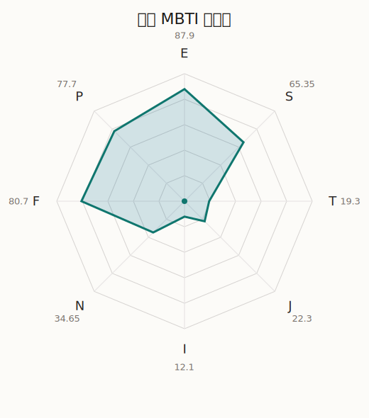

# 透子 MBTI 类型解释

- 角色名：桐谷透子
- 最终类型：ESFP
- 备选类型：ENFP
- 原始聚合类型：ESFP
- 采样轮次：10
- 主类型稳定度：10/10（100.0%）
- 原始聚合稳定度：10/10（100.0%）
- 置信度：高（55.83）
- 置信度方差：30.7245
- 题库：Open Jungian Type Scales (OJTS v2.1)（48 题）

## 类型概述

ESFP 的整体倾向是：更偏外向体验、现实感受、情感表达和即兴行动。

## 人物核心

从外部设定与已整理剧情综合来看，透子的角色框架可以先理解为：外部角色介绍里的透子通常给人很会来事、社交力强、对自己有自信的印象。她经常显得随性甚至有点任性，但其实很会观察场面，也很清楚怎样把自己放在会发光的位置上。

## PDB 校核

- 已应用 PDB 主参考：来源 `personality-database.com`。
- 权重分配：PDB 50% / 人设概要 25% / 卡牌剧情 15% / 剧情切片 10%。
- PDB 类型排序：`ESFP`
- 最终类型先按 PDB 最高票定锚：`ESFP`
- 指定锁定类型：`ESFP`
## 为什么是这个类型

- `E > I`（87.90 : 12.10，平均轴差 68.54，方差 73.1167）：更常通过主动互动、公开表达或带动现场来处理问题。
- `S > N`（65.35 : 34.65，平均轴差 27.05，方差 89.0649）：更常依赖现实条件、具体细节和当下经验来判断局面。
- `F > T`（80.70 : 19.30，平均轴差 63.85，方差 24.9853）：更常把感受、关系、价值和对人的回应放在判断前列。
- `P > J`（77.70 : 22.30，平均轴差 58.60，方差 417.4241）：更常保留空间，依靠灵活调整和临场变化推进事情。

## 为什么不是备选类型

最接近的备选类型是 `ENFP`。它与主类型 `ESFP` 的差别主要落在 `SN` 这一轴上。
最终仍保留 `S`，因为该轴平均优势还有 `30.70`，虽然会波动，但整体没有被 `N` 反超。虽然也会谈到意义和理想，但资料里更常落到现实条件、细节和可执行层面。

## 四维结果

- `EI`：E 87.90 / I 12.10，轴差方差 73.1167
- `SN`：S 65.35 / N 34.65，轴差方差 89.0649
- `FT`：F 80.70 / T 19.30，轴差方差 24.9853
- `JP`：J 22.30 / P 77.70，轴差方差 417.4241

## 八维数据

- `E`：均值 87.90，方差 18.2792
- `S`：均值 65.35，方差 22.2662
- `T`：均值 19.30，方差 6.2463
- `J`：均值 22.30，方差 104.3560
- `I`：均值 12.10，方差 18.2792
- `N`：均值 34.65，方差 22.2662
- `F`：均值 80.70，方差 6.2463
- `P`：均值 77.70，方差 104.3560

## 类型稳定性

- `ESFP`：10 次（100.0%）

## 图表

## 证据依据

- 人物概述：从外部设定与已整理剧情综合来看，透子的角色框架可以先理解为：外部角色介绍里的透子通常给人很会来事、社交力强、对自己有自信的印象。她经常显得随性甚至有点任性，但其实很会观察场面，也很清楚怎样把自己放在会发光的位置上。
- 卡牌剧情：在 56 条卡牌剧情里，透子 的个人篇章补完相对丰富；这部分更适合用来观察角色的私下状态、非主线场合下的关系重心，以及主线之外的稳定人格表现。
- 剧情切片：在已整理的 178 条主线/乐团剧情切片里，透子同时覆盖主线推进（19）和乐队内部关系（159）两条线。这说明这个角色在本地语料中的位置，不应该只从单句台词去读，而要放回到持续出现的关系链和章节位置里看。

## 模拟作答概览

| 题号 | 题目/两端描述 | 平均作答 | 作答方差 | 平均倾向值 | 倾向方差 |
| --- | --- | --- | --- | --- | --- |
| 1 | I don&lsquo;t like to draw attention to myself. | 1.00 | 0.0000 | -84.19 | 44.6378 |
| 2 | I hate situations where people expect me to be funny. | 1.00 | 0.0000 | -78.71 | 33.6458 |
| 3 | I hold back my opinions. | 1.00 | 0.0000 | -80.50 | 98.2142 |
| 4 | I want a huge social circle. | 3.10 | 0.2900 | 8.65 | 275.9620 |
| 5 | I am the life of the party. | 3.30 | 0.2100 | 15.55 | 220.5038 |
| 6 | I make lots of noise. | 3.80 | 0.1600 | 26.15 | 115.0810 |
| 7 | I avoid philosophical discussions. | 2.70 | 0.2100 | -14.83 | 176.5166 |
| 8 | I don&apos;t like to analyze literature. | 2.90 | 0.0900 | -8.45 | 180.8368 |
| 9 | I am attached to conventional ways. | 2.90 | 0.0900 | -7.78 | 69.6229 |
| 10 | I love to read challenging material. | 1.90 | 0.0900 | -50.18 | 54.6588 |
| 11 | I look for hidden meanings in things. | 1.90 | 0.0900 | -51.17 | 76.8372 |
| 12 | I am curious about everything. | 1.70 | 0.2100 | -57.23 | 106.1422 |
| 13 | I want to experience passion and romance. | 4.00 | 0.0000 | 41.41 | 87.1916 |
| 14 | I am deeply moved by others&lsquo; misfortunes. | 4.00 | 0.0000 | 42.72 | 126.9481 |
| 15 | I listen to my feelings when making important decisions. | 4.10 | 0.0900 | 45.03 | 98.8326 |
| 16 | I prize logic above all else. | 1.10 | 0.0900 | -75.58 | 87.5166 |
| 17 | I don&lsquo;t understand people who get emotional. | 1.10 | 0.0900 | -74.12 | 95.1490 |
| 18 | I&apos;d rather be feared than loved. | 1.00 | 0.0000 | -74.41 | 56.0593 |
| 19 | I like order. | 1.30 | 0.2100 | -67.61 | 300.7902 |
| 20 | I do things according to a plan. | 1.20 | 0.1600 | -70.01 | 348.4733 |
| 21 | I am always prepared. | 1.40 | 0.2400 | -66.93 | 396.1403 |
| 22 | I often make last-minute plans. | 3.20 | 0.1600 | 10.76 | 163.4018 |
| 23 | I do things for no apparent reason. | 3.40 | 0.2400 | 14.12 | 392.3530 |
| 24 | It takes me days to do things that should take hours because I keep getting distracted. | 3.40 | 0.4400 | 14.33 | 482.9046 |
| 25 | I work on improving myself. | 1.50 | 0.2500 | -57.34 | 69.6570 |
| 26 | I always feel like I need to be doing something important. | 1.30 | 0.2100 | -66.46 | 173.9504 |
| 27 | I have unusual beliefs about the world. | 2.70 | 0.2100 | -16.44 | 184.2170 |
| 28 | I dislike routine. | 2.40 | 0.2400 | -20.77 | 121.1536 |
| 29 | I try my best to follow the rules. | 2.00 | 0.0000 | -39.33 | 111.4405 |
| 30 | I respect authority. | 2.00 | 0.2000 | -42.30 | 166.8866 |
| 31 | I like to take it easy. | 3.10 | 0.2900 | 6.54 | 262.3576 |
| 32 | I choose the easy way. | 3.00 | 0.2000 | -4.98 | 249.6361 |
| 33 | I tell other people my secrets. | 3.50 | 0.2500 | 19.23 | 152.4341 |
| 34 | I make big gestures of friendship to people. | 3.30 | 0.2100 | 13.87 | 155.4706 |
| 35 | I enjoy challenges and competition. | 2.40 | 0.2400 | -24.68 | 164.0951 |
| 36 | I have very high self-esteem. | 2.20 | 0.1600 | -30.20 | 97.3987 |
| 37 | I get embarrassed easily. | 2.20 | 0.1600 | -29.88 | 193.5931 |
| 38 | I become overwhelmed by events. | 2.10 | 0.0900 | -33.94 | 85.9612 |
| 39 | I have difficulty expressing my feelings. | 1.00 | 0.0000 | -76.97 | 45.4895 |
| 40 | I don&apos;t trust others easily. | 1.00 | 0.0000 | -81.59 | 39.1566 |
| 41 | skeptical <-> wants to believe | 3.90 | 0.0900 | 37.81 | 87.6068 |
| 42 | chaotic <-> organized | 1.70 | 0.2100 | -52.73 | 249.1015 |
| 43 | wants the big picture <-> wants the details | 2.70 | 0.2100 | -19.72 | 109.3395 |
| 44 | energetic <-> mellow | 1.80 | 0.1600 | -47.17 | 171.1193 |
| 45 | follows the heart <-> follows the head | 2.00 | 0.0000 | -42.78 | 71.1946 |
| 46 | prepares <-> improvises | 4.00 | 0.4000 | 44.77 | 391.0466 |
| 47 | focused on the present <-> focused on the future | 1.80 | 0.3600 | -48.39 | 199.6842 |
| 48 | works best alone <-> works best in groups | 4.20 | 0.1600 | 50.91 | 239.4946 |

## 题库来源

- [OJTS 官方题目页](https://openpsychometrics.org/tests/OJTS/)
- 许可证：CC BY-NC-SA 4.0
- [本地题库文件](../ojts_question_bank_v2_1.json)
