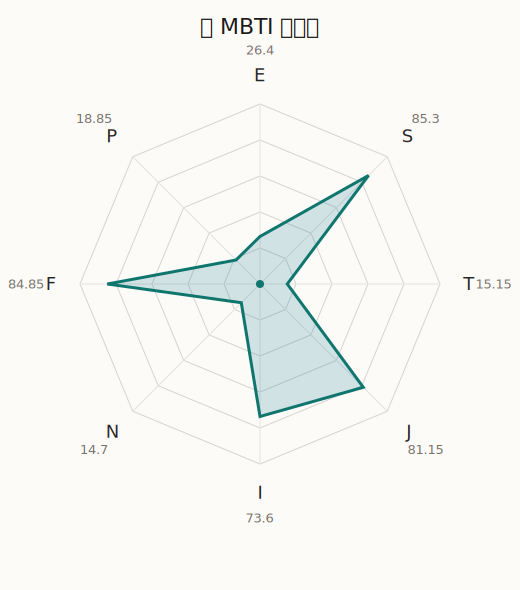

# 鸫 MBTI 类型解释

- 角色名：羽泽鸫
- 最终类型：ISFJ
- 备选类型：ESFJ
- 原始聚合类型：ISFJ
- 采样轮次：10
- 主类型稳定度：10/10（100.0%）
- 原始聚合稳定度：10/10（100.0%）
- 置信度：高（62.45）
- 置信度方差：19.3255
- 题库：Open Jungian Type Scales (OJTS v2.1)（48 题）

## 类型概述

ISFJ 的整体倾向是：更偏内在克制、现实关注、情感责任和秩序维持。

## 人物核心

从外部设定与已整理剧情综合来看，鸫的角色框架可以先理解为：外部角色介绍里的鸫通常被定义成认真、常识人、会做事也会操心的人。她经常被说是最“普通”的成员，但这个“普通”并不是缺乏特点，而是她特别擅长把别人忽略的细节扛起来。

## PDB 校核

- 已应用 PDB 主参考：来源 `personality-database.com`。
- 权重分配：PDB 50% / 人设概要 25% / 卡牌剧情 15% / 剧情切片 10%。
- PDB 类型排序：`ISFJ`
- 最终类型先按 PDB 最高票定锚：`ISFJ`
- 指定锁定类型：`ISFJ`
## 为什么是这个类型

- `I > E`（73.60 : 26.40，平均轴差 56.30，方差 204.6642）：更常先在内部消化，再选择性地向外表达立场。
- `S > N`（85.30 : 14.70，平均轴差 77.56，方差 20.0305）：更常依赖现实条件、具体细节和当下经验来判断局面。
- `F > T`（84.85 : 15.15，平均轴差 58.13，方差 32.4191）：更常把感受、关系、价值和对人的回应放在判断前列。
- `J > P`（81.15 : 18.85，平均轴差 62.88，方差 91.1000）：更常用计划、收束、安排和责任结构去降低混乱。

## 为什么不是备选类型

最接近的备选类型是 `ESFJ`。它与主类型 `ISFJ` 的差别主要落在 `EI` 这一轴上。
最终仍保留 `I`，因为该轴平均优势还有 `47.20`，虽然会波动，但整体没有被 `E` 反超。虽然也会参与群体互动，但资料里更常表现为先内化、后表达的节奏。

## 四维结果

- `EI`：E 26.40 / I 73.60，轴差方差 204.6642
- `SN`：S 85.30 / N 14.70，轴差方差 20.0305
- `FT`：F 84.85 / T 15.15，轴差方差 32.4191
- `JP`：J 81.15 / P 18.85，轴差方差 91.1000

## 八维数据

- `E`：均值 26.40，方差 51.1660
- `S`：均值 85.30，方差 5.0076
- `T`：均值 15.15，方差 8.1048
- `J`：均值 81.15，方差 22.7750
- `I`：均值 73.60，方差 51.1660
- `N`：均值 14.70，方差 5.0076
- `F`：均值 84.85，方差 8.1048
- `P`：均值 18.85，方差 22.7750

## 类型稳定性

- `ISFJ`：10 次（100.0%）

## 图表

## 证据依据

- 人物概述：从外部设定与已整理剧情综合来看，鸫的角色框架可以先理解为：外部角色介绍里的鸫通常被定义成认真、常识人、会做事也会操心的人。她经常被说是最“普通”的成员，但这个“普通”并不是缺乏特点，而是她特别擅长把别人忽略的细节扛起来。
- 卡牌剧情：在 113 条卡牌剧情里，鸫 的个人篇章补完相对丰富；这部分更适合用来观察角色的私下状态、非主线场合下的关系重心，以及主线之外的稳定人格表现。
- 剧情切片：在已整理的 301 条主线/乐团剧情切片里，鸫同时覆盖主线推进（37）和乐队内部关系（264）两条线。这说明这个角色在本地语料中的位置，不应该只从单句台词去读，而要放回到持续出现的关系链和章节位置里看。

## 模拟作答概览

| 题号 | 题目/两端描述 | 平均作答 | 作答方差 | 平均倾向值 | 倾向方差 |
| --- | --- | --- | --- | --- | --- |
| 1 | I don&lsquo;t like to draw attention to myself. | 3.10 | 0.0900 | 5.86 | 237.2196 |
| 2 | I hate situations where people expect me to be funny. | 2.90 | 0.0900 | -3.42 | 117.7026 |
| 3 | I hold back my opinions. | 2.80 | 0.1600 | -2.65 | 240.1314 |
| 4 | I want a huge social circle. | 1.30 | 0.2100 | -64.54 | 78.8286 |
| 5 | I am the life of the party. | 1.40 | 0.2400 | -65.93 | 207.5389 |
| 6 | I make lots of noise. | 1.40 | 0.2400 | -64.21 | 104.2248 |
| 7 | I avoid philosophical discussions. | 4.40 | 0.2400 | 52.17 | 181.9986 |
| 8 | I don&apos;t like to analyze literature. | 4.20 | 0.1600 | 51.05 | 55.4614 |
| 9 | I am attached to conventional ways. | 4.20 | 0.1600 | 48.26 | 153.3590 |
| 10 | I love to read challenging material. | 1.00 | 0.0000 | -81.29 | 33.9476 |
| 11 | I look for hidden meanings in things. | 1.00 | 0.0000 | -80.46 | 82.3885 |
| 12 | I am curious about everything. | 1.00 | 0.0000 | -81.26 | 95.1198 |
| 13 | I want to experience passion and romance. | 4.00 | 0.4000 | 38.43 | 294.6126 |
| 14 | I am deeply moved by others&lsquo; misfortunes. | 3.10 | 0.0900 | 12.53 | 135.6270 |
| 15 | I listen to my feelings when making important decisions. | 3.50 | 0.4500 | 18.84 | 413.1900 |
| 16 | I prize logic above all else. | 1.00 | 0.0000 | -78.42 | 69.4154 |
| 17 | I don&lsquo;t understand people who get emotional. | 1.00 | 0.0000 | -78.21 | 98.7225 |
| 18 | I&apos;d rather be feared than loved. | 1.00 | 0.0000 | -73.79 | 55.9654 |
| 19 | I like order. | 3.30 | 0.2100 | 13.83 | 204.4840 |
| 20 | I do things according to a plan. | 3.40 | 0.2400 | 15.53 | 177.5332 |
| 21 | I am always prepared. | 3.40 | 0.2400 | 15.81 | 189.0878 |
| 22 | I often make last-minute plans. | 1.00 | 0.0000 | -76.28 | 67.7725 |
| 23 | I do things for no apparent reason. | 1.00 | 0.0000 | -79.02 | 83.6444 |
| 24 | It takes me days to do things that should take hours because I keep getting distracted. | 1.00 | 0.0000 | -73.55 | 68.8357 |
| 25 | I work on improving myself. | 2.10 | 0.0900 | -36.16 | 132.8913 |
| 26 | I always feel like I need to be doing something important. | 2.40 | 0.2400 | -27.85 | 154.9464 |
| 27 | I have unusual beliefs about the world. | 1.00 | 0.0000 | -81.07 | 38.9575 |
| 28 | I dislike routine. | 1.00 | 0.0000 | -77.81 | 110.5726 |
| 29 | I try my best to follow the rules. | 3.10 | 0.0900 | 11.14 | 126.0001 |
| 30 | I respect authority. | 3.40 | 0.2400 | 17.38 | 349.4637 |
| 31 | I like to take it easy. | 2.20 | 0.1600 | -29.27 | 73.1998 |
| 32 | I choose the easy way. | 2.50 | 0.2500 | -27.48 | 215.0338 |
| 33 | I tell other people my secrets. | 2.30 | 0.2100 | -29.23 | 199.2292 |
| 34 | I make big gestures of friendship to people. | 2.50 | 0.2500 | -23.39 | 193.7670 |
| 35 | I enjoy challenges and competition. | 1.10 | 0.0900 | -72.30 | 80.0758 |
| 36 | I have very high self-esteem. | 1.00 | 0.0000 | -74.24 | 41.1317 |
| 37 | I get embarrassed easily. | 3.40 | 0.2400 | 20.84 | 128.7912 |
| 38 | I become overwhelmed by events. | 3.20 | 0.1600 | 9.79 | 106.3755 |
| 39 | I have difficulty expressing my feelings. | 2.10 | 0.2900 | -32.67 | 172.9710 |
| 40 | I don&apos;t trust others easily. | 2.10 | 0.2900 | -32.28 | 283.6874 |
| 41 | skeptical <-> wants to believe | 3.00 | 0.2000 | 3.76 | 307.4759 |
| 42 | chaotic <-> organized | 4.30 | 0.2100 | 52.22 | 104.2156 |
| 43 | wants the big picture <-> wants the details | 4.40 | 0.2400 | 57.91 | 86.0836 |
| 44 | energetic <-> mellow | 4.60 | 0.2400 | 67.20 | 159.2832 |
| 45 | follows the heart <-> follows the head | 2.00 | 0.2000 | -38.56 | 198.8938 |
| 46 | prepares <-> improvises | 2.20 | 0.1600 | -37.47 | 151.0718 |
| 47 | focused on the present <-> focused on the future | 1.00 | 0.0000 | -76.24 | 44.9583 |
| 48 | works best alone <-> works best in groups | 2.00 | 0.0000 | -34.81 | 58.2993 |

## 题库来源

- [OJTS 官方题目页](https://openpsychometrics.org/tests/OJTS/)
- 许可证：CC BY-NC-SA 4.0
- [本地题库文件](../ojts_question_bank_v2_1.json)
