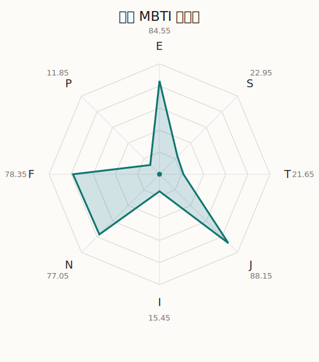

# 筑紫 MBTI 类型解释

- 角色名：二叶筑紫
- 最终类型：ENFJ
- 备选类型：ESFJ
- 原始聚合类型：ENFJ
- 采样轮次：10
- 主类型稳定度：10/10（100.0%）
- 原始聚合稳定度：10/10（100.0%）
- 置信度：高（64.05）
- 置信度方差：15.4271
- 题库：Open Jungian Type Scales (OJTS v2.1)（48 题）

## 类型概述

ENFJ 的整体倾向是：更偏外向连接、抽象理解、价值驱动和结构推进。

## 人物核心

从外部设定与已整理剧情综合来看，筑紫的角色框架可以先理解为：外部角色页里的筑紫通常被写成有点冒失、很认真、喜欢主持局面和承担责任的班长型人物。她有明显的自尊心，也会因为自己不够高大、不够厉害而暗暗着急，所以她的努力里总带着一点逞强味道。

## PDB 校核

- 已应用 PDB 主参考：来源 `personality-database.com`。
- 权重分配：PDB 50% / 人设概要 25% / 卡牌剧情 15% / 剧情切片 10%。
- PDB 类型排序：`ENFJ`
- 最终类型先按 PDB 最高票定锚：`ENFJ`
- 指定锁定类型：`ENFJ`
## 为什么是这个类型

- `E > I`（84.55 : 15.45，平均轴差 74.47，方差 55.6790）：更常通过主动互动、公开表达或带动现场来处理问题。
- `N > S`（77.05 : 22.95，平均轴差 51.95，方差 87.6736）：更常从意义、可能性、方向感和隐含主题去理解问题。
- `F > T`（78.35 : 21.65，平均轴差 55.13，方差 60.6781）：更常把感受、关系、价值和对人的回应放在判断前列。
- `J > P`（88.15 : 11.85，平均轴差 74.58，方差 5.6221）：更常用计划、收束、安排和责任结构去降低混乱。

## 为什么不是备选类型

最接近的备选类型是 `ESFJ`。它与主类型 `ENFJ` 的差别主要落在 `SN` 这一轴上。
最终仍保留 `N`，因为该轴平均优势还有 `54.10`，虽然会波动，但整体没有被 `S` 反超。虽然也会处理具体事务，但资料里更常从主题、方向和抽象意义去组织理解。

## 四维结果

- `EI`：E 84.55 / I 15.45，轴差方差 55.6790
- `SN`：S 22.95 / N 77.05，轴差方差 87.6736
- `FT`：F 78.35 / T 21.65，轴差方差 60.6781
- `JP`：J 88.15 / P 11.85，轴差方差 5.6221

## 八维数据

- `E`：均值 84.55，方差 13.9197
- `S`：均值 22.95，方差 21.9184
- `T`：均值 21.65，方差 15.1695
- `J`：均值 88.15，方差 1.4055
- `I`：均值 15.45，方差 13.9197
- `N`：均值 77.05，方差 21.9184
- `F`：均值 78.35，方差 15.1695
- `P`：均值 11.85，方差 1.4055

## 类型稳定性

- `ENFJ`：10 次（100.0%）

## 图表

## 证据依据

- 人物概述：从外部设定与已整理剧情综合来看，筑紫的角色框架可以先理解为：外部角色页里的筑紫通常被写成有点冒失、很认真、喜欢主持局面和承担责任的班长型人物。她有明显的自尊心，也会因为自己不够高大、不够厉害而暗暗着急，所以她的努力里总带着一点逞强味道。
- 卡牌剧情：在 58 条卡牌剧情里，筑紫 的个人篇章补完相对丰富；这部分更适合用来观察角色的私下状态、非主线场合下的关系重心，以及主线之外的稳定人格表现。
- 剧情切片：在已整理的 206 条主线/乐团剧情切片里，筑紫同时覆盖主线推进（23）和乐队内部关系（183）两条线。这说明这个角色在本地语料中的位置，不应该只从单句台词去读，而要放回到持续出现的关系链和章节位置里看。

## 模拟作答概览

| 题号 | 题目/两端描述 | 平均作答 | 作答方差 | 平均倾向值 | 倾向方差 |
| --- | --- | --- | --- | --- | --- |
| 1 | I don&lsquo;t like to draw attention to myself. | 1.00 | 0.0000 | -76.79 | 117.0340 |
| 2 | I hate situations where people expect me to be funny. | 1.00 | 0.0000 | -82.79 | 135.3962 |
| 3 | I hold back my opinions. | 1.10 | 0.0900 | -79.15 | 168.4744 |
| 4 | I want a huge social circle. | 3.50 | 0.4500 | 19.16 | 436.1998 |
| 5 | I am the life of the party. | 3.60 | 0.2400 | 31.49 | 241.2854 |
| 6 | I make lots of noise. | 4.40 | 0.2400 | 56.58 | 102.4342 |
| 7 | I avoid philosophical discussions. | 1.10 | 0.0900 | -72.81 | 59.0749 |
| 8 | I don&apos;t like to analyze literature. | 1.20 | 0.1600 | -69.23 | 118.7073 |
| 9 | I am attached to conventional ways. | 1.10 | 0.0900 | -68.97 | 63.6989 |
| 10 | I love to read challenging material. | 3.20 | 0.1600 | 9.34 | 322.7769 |
| 11 | I look for hidden meanings in things. | 3.30 | 0.2100 | 8.89 | 293.2493 |
| 12 | I am curious about everything. | 3.50 | 0.2500 | 20.06 | 153.7811 |
| 13 | I want to experience passion and romance. | 3.20 | 0.1600 | 9.49 | 282.4344 |
| 14 | I am deeply moved by others&lsquo; misfortunes. | 3.10 | 0.0900 | 10.81 | 79.0558 |
| 15 | I listen to my feelings when making important decisions. | 3.10 | 0.0900 | 10.77 | 214.2277 |
| 16 | I prize logic above all else. | 1.20 | 0.1600 | -70.73 | 82.6889 |
| 17 | I don&lsquo;t understand people who get emotional. | 1.00 | 0.0000 | -69.52 | 52.3237 |
| 18 | I&apos;d rather be feared than loved. | 1.30 | 0.2100 | -66.76 | 117.1940 |
| 19 | I like order. | 3.30 | 0.2100 | 20.57 | 214.8303 |
| 20 | I do things according to a plan. | 3.50 | 0.2500 | 19.57 | 171.1293 |
| 21 | I am always prepared. | 3.10 | 0.0900 | 10.93 | 83.8095 |
| 22 | I often make last-minute plans. | 1.00 | 0.0000 | -78.85 | 44.1111 |
| 23 | I do things for no apparent reason. | 1.00 | 0.0000 | -80.37 | 86.8645 |
| 24 | It takes me days to do things that should take hours because I keep getting distracted. | 1.00 | 0.0000 | -79.85 | 88.6837 |
| 25 | I work on improving myself. | 3.40 | 0.2400 | 17.90 | 164.6851 |
| 26 | I always feel like I need to be doing something important. | 3.50 | 0.2500 | 18.63 | 145.3351 |
| 27 | I have unusual beliefs about the world. | 1.90 | 0.0900 | -44.50 | 149.0298 |
| 28 | I dislike routine. | 2.20 | 0.1600 | -31.46 | 210.4380 |
| 29 | I try my best to follow the rules. | 2.40 | 0.2400 | -25.20 | 151.8911 |
| 30 | I respect authority. | 2.10 | 0.0900 | -33.11 | 77.7906 |
| 31 | I like to take it easy. | 1.00 | 0.0000 | -77.77 | 37.3546 |
| 32 | I choose the easy way. | 1.00 | 0.0000 | -76.45 | 77.8005 |
| 33 | I tell other people my secrets. | 3.10 | 0.0900 | 7.81 | 155.8573 |
| 34 | I make big gestures of friendship to people. | 3.40 | 0.2400 | 15.23 | 144.6703 |
| 35 | I enjoy challenges and competition. | 2.40 | 0.2400 | -24.73 | 79.2731 |
| 36 | I have very high self-esteem. | 2.40 | 0.2400 | -24.79 | 86.0645 |
| 37 | I get embarrassed easily. | 2.00 | 0.0000 | -41.02 | 67.3276 |
| 38 | I become overwhelmed by events. | 2.00 | 0.2000 | -34.17 | 140.2786 |
| 39 | I have difficulty expressing my feelings. | 1.00 | 0.0000 | -78.37 | 39.8501 |
| 40 | I don&apos;t trust others easily. | 1.20 | 0.1600 | -72.25 | 144.3656 |
| 41 | skeptical <-> wants to believe | 4.10 | 0.0900 | 46.31 | 111.0419 |
| 42 | chaotic <-> organized | 5.00 | 0.0000 | 80.76 | 88.7127 |
| 43 | wants the big picture <-> wants the details | 2.00 | 0.0000 | -42.97 | 91.3183 |
| 44 | energetic <-> mellow | 1.00 | 0.0000 | -85.98 | 126.7853 |
| 45 | follows the heart <-> follows the head | 2.10 | 0.0900 | -34.20 | 134.4947 |
| 46 | prepares <-> improvises | 2.00 | 0.0000 | -43.76 | 77.3191 |
| 47 | focused on the present <-> focused on the future | 2.90 | 0.0900 | -5.71 | 245.8414 |
| 48 | works best alone <-> works best in groups | 4.00 | 0.2000 | 45.12 | 94.7732 |

## 题库来源

- [OJTS 官方题目页](https://openpsychometrics.org/tests/OJTS/)
- 许可证：CC BY-NC-SA 4.0
- [本地题库文件](../ojts_question_bank_v2_1.json)
