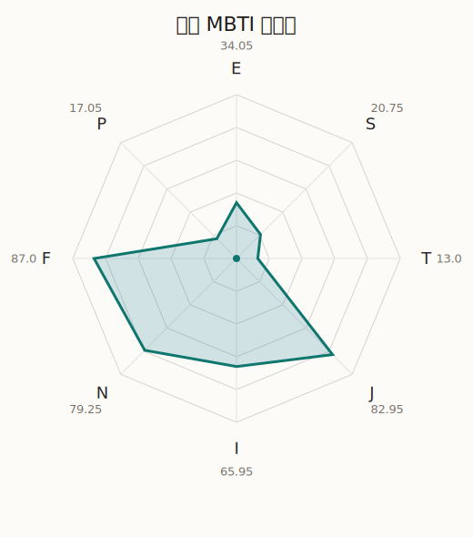

# 初华 MBTI 类型解释

- 角色名：三角初华
- 最终类型：INFJ
- 备选类型：ENFJ
- 原始聚合类型：INFJ
- 采样轮次：10
- 主类型稳定度：10/10（100.0%）
- 原始聚合稳定度：10/10（100.0%）
- 置信度：高（57.58）
- 置信度方差：25.1666
- 题库：Open Jungian Type Scales (OJTS v2.1)（48 题）

## 类型概述

INFJ 的整体倾向是：更偏内在思考、抽象理解、价值判断和稳定收束。

## 人物核心

从外部设定与已整理剧情综合来看，初华的角色框架可以先理解为：官方资料把初华写成花咲川女子学园高一生、Ave Mujica 的吉他主唱，同时也是偶像组合 `sumimi` 的活动成员，并明确写到她喜欢看星星、与祥子自幼相识，而且对祥子的邀约几乎没有犹豫就答应。这让她在设定上天然同时属于“偶像舞台”与“秘密乐队舞台”两种身份。

## PDB 校核

- 已应用 PDB 主参考：来源 `personality-database.com`。
- 权重分配：PDB 50% / 人设概要 25% / 卡牌剧情 15% / 剧情切片 10%。
- PDB 类型排序：`INFJ`
- 最终类型先按 PDB 最高票定锚：`INFJ`
- 指定锁定类型：`INFJ`
## 为什么是这个类型

- `I > E`（65.95 : 34.05，平均轴差 34.27，方差 459.5443）：更常先在内部消化，再选择性地向外表达立场。
- `N > S`（79.25 : 20.75，平均轴差 51.11，方差 40.2387）：更常从意义、可能性、方向感和隐含主题去理解问题。
- `F > T`（87.00 : 13.00，平均轴差 71.29，方差 19.7039）：更常把感受、关系、价值和对人的回应放在判断前列。
- `J > P`（82.95 : 17.05，平均轴差 74.53，方差 18.4836）：更常用计划、收束、安排和责任结构去降低混乱。

## 为什么不是备选类型

最接近的备选类型是 `ENFJ`。它与主类型 `INFJ` 的差别主要落在 `EI` 这一轴上。
最终仍保留 `I`，因为该轴平均优势还有 `31.90`，虽然会波动，但整体没有被 `E` 反超。虽然也会参与群体互动，但资料里更常表现为先内化、后表达的节奏。

## 四维结果

- `EI`：E 34.05 / I 65.95，轴差方差 459.5443
- `SN`：S 20.75 / N 79.25，轴差方差 40.2387
- `FT`：F 87.00 / T 13.00，轴差方差 19.7039
- `JP`：J 82.95 / P 17.05，轴差方差 18.4836

## 八维数据

- `E`：均值 34.05，方差 114.8861
- `S`：均值 20.75，方差 10.0597
- `T`：均值 13.00，方差 4.9260
- `J`：均值 82.95，方差 4.6209
- `I`：均值 65.95，方差 114.8861
- `N`：均值 79.25，方差 10.0597
- `F`：均值 87.00，方差 4.9260
- `P`：均值 17.05，方差 4.6209

## 类型稳定性

- `INFJ`：10 次（100.0%）

## 图表

## 证据依据

- 人物概述：从外部设定与已整理剧情综合来看，初华的角色框架可以先理解为：官方资料把初华写成花咲川女子学园高一生、Ave Mujica 的吉他主唱，同时也是偶像组合 `sumimi` 的活动成员，并明确写到她喜欢看星星、与祥子自幼相识，而且对祥子的邀约几乎没有犹豫就答应。这让她在设定上天然同时属于“偶像舞台”与“秘密乐队舞台”两种身份。
- 卡牌剧情：当前没有归到该角色名下的卡牌剧情，因此暂时无法从私人篇章、节庆篇章或回忆篇章里继续补正人物侧面。
- 剧情切片：在已整理的 4 条主线/乐团剧情切片里，初华目前更集中在乐队内部与团内关系剧情（4）。这说明这个角色在本地语料中的位置，不应该只从单句台词去读，而要放回到持续出现的关系链和章节位置里看。

## 模拟作答概览

| 题号 | 题目/两端描述 | 平均作答 | 作答方差 | 平均倾向值 | 倾向方差 |
| --- | --- | --- | --- | --- | --- |
| 1 | I don&lsquo;t like to draw attention to myself. | 2.70 | 0.2100 | -8.92 | 338.2877 |
| 2 | I hate situations where people expect me to be funny. | 2.90 | 0.2900 | -9.08 | 343.4759 |
| 3 | I hold back my opinions. | 2.70 | 0.2100 | -14.00 | 351.3312 |
| 4 | I want a huge social circle. | 1.40 | 0.2400 | -58.61 | 193.8382 |
| 5 | I am the life of the party. | 1.70 | 0.2100 | -47.14 | 221.8300 |
| 6 | I make lots of noise. | 1.80 | 0.3600 | -51.01 | 326.1541 |
| 7 | I avoid philosophical discussions. | 1.80 | 0.1600 | -48.35 | 129.3985 |
| 8 | I don&apos;t like to analyze literature. | 2.00 | 0.0000 | -41.10 | 85.4637 |
| 9 | I am attached to conventional ways. | 2.10 | 0.2900 | -37.31 | 240.5714 |
| 10 | I love to read challenging material. | 4.00 | 0.2000 | 45.73 | 188.8672 |
| 11 | I look for hidden meanings in things. | 4.00 | 0.2000 | 46.33 | 257.7951 |
| 12 | I am curious about everything. | 4.10 | 0.0900 | 45.19 | 134.9691 |
| 13 | I want to experience passion and romance. | 4.20 | 0.1600 | 49.19 | 122.9784 |
| 14 | I am deeply moved by others&lsquo; misfortunes. | 4.20 | 0.1600 | 55.19 | 89.3898 |
| 15 | I listen to my feelings when making important decisions. | 4.20 | 0.1600 | 54.93 | 57.5295 |
| 16 | I prize logic above all else. | 1.00 | 0.0000 | -84.36 | 10.7678 |
| 17 | I don&lsquo;t understand people who get emotional. | 1.00 | 0.0000 | -82.96 | 10.3484 |
| 18 | I&apos;d rather be feared than loved. | 1.00 | 0.0000 | -81.72 | 66.1776 |
| 19 | I like order. | 4.00 | 0.0000 | 46.04 | 67.7888 |
| 20 | I do things according to a plan. | 3.90 | 0.0900 | 38.47 | 80.0724 |
| 21 | I am always prepared. | 4.00 | 0.0000 | 39.01 | 66.9220 |
| 22 | I often make last-minute plans. | 1.00 | 0.0000 | -73.20 | 36.2626 |
| 23 | I do things for no apparent reason. | 1.00 | 0.0000 | -76.17 | 48.0996 |
| 24 | It takes me days to do things that should take hours because I keep getting distracted. | 1.10 | 0.0900 | -69.95 | 36.3020 |
| 25 | I work on improving myself. | 4.00 | 0.0000 | 46.74 | 46.6316 |
| 26 | I always feel like I need to be doing something important. | 4.00 | 0.0000 | 42.35 | 85.9077 |
| 27 | I have unusual beliefs about the world. | 2.40 | 0.2400 | -23.55 | 285.7544 |
| 28 | I dislike routine. | 2.20 | 0.1600 | -29.55 | 48.8582 |
| 29 | I try my best to follow the rules. | 3.00 | 0.2000 | -0.49 | 358.9417 |
| 30 | I respect authority. | 3.00 | 0.0000 | -3.88 | 121.0691 |
| 31 | I like to take it easy. | 1.00 | 0.0000 | -72.95 | 67.5465 |
| 32 | I choose the easy way. | 1.10 | 0.0900 | -77.01 | 95.4832 |
| 33 | I tell other people my secrets. | 2.80 | 0.1600 | -10.92 | 117.1870 |
| 34 | I make big gestures of friendship to people. | 2.90 | 0.2900 | -7.39 | 278.8079 |
| 35 | I enjoy challenges and competition. | 1.10 | 0.0900 | -66.00 | 28.0686 |
| 36 | I have very high self-esteem. | 1.30 | 0.2100 | -65.10 | 82.9168 |
| 37 | I get embarrassed easily. | 2.90 | 0.0900 | 2.50 | 167.6613 |
| 38 | I become overwhelmed by events. | 3.10 | 0.0900 | 2.58 | 169.4829 |
| 39 | I have difficulty expressing my feelings. | 1.70 | 0.2100 | -50.01 | 113.9684 |
| 40 | I don&apos;t trust others easily. | 1.90 | 0.0900 | -45.65 | 94.0191 |
| 41 | skeptical <-> wants to believe | 4.00 | 0.0000 | 46.84 | 85.5844 |
| 42 | chaotic <-> organized | 5.00 | 0.0000 | 75.62 | 57.1139 |
| 43 | wants the big picture <-> wants the details | 1.00 | 0.0000 | -78.34 | 65.8613 |
| 44 | energetic <-> mellow | 4.30 | 0.2100 | 54.93 | 176.0758 |
| 45 | follows the heart <-> follows the head | 1.90 | 0.0900 | -48.58 | 87.5128 |
| 46 | prepares <-> improvises | 2.00 | 0.0000 | -36.35 | 53.2042 |
| 47 | focused on the present <-> focused on the future | 4.00 | 0.2000 | 48.72 | 157.8463 |
| 48 | works best alone <-> works best in groups | 2.60 | 0.2400 | -18.29 | 403.3557 |

## 题库来源

- [OJTS 官方题目页](https://openpsychometrics.org/tests/OJTS/)
- 许可证：CC BY-NC-SA 4.0
- [本地题库文件](../ojts_question_bank_v2_1.json)
