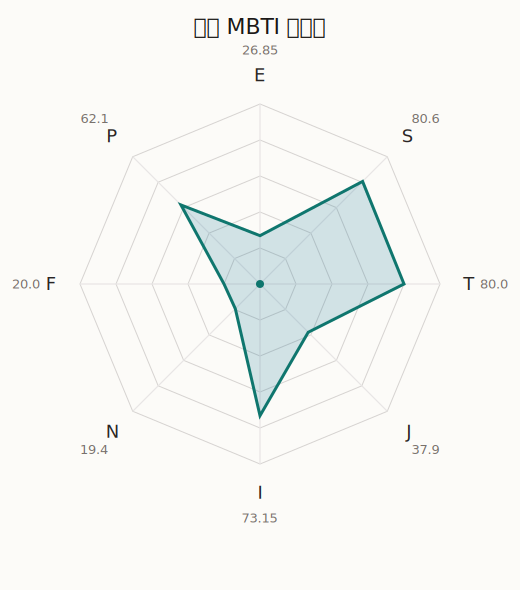

# 海铃 MBTI 类型解释

- 角色名：八幡海铃
- 最终类型：ISTP
- 备选类型：ISTJ
- 原始聚合类型：ISTP
- 采样轮次：10
- 主类型稳定度：6/10（60.0%）
- 原始聚合稳定度：6/10（60.0%）
- 置信度：高（47.92）
- 置信度方差：58.0635
- 题库：Open Jungian Type Scales (OJTS v2.1)（48 题）

## 类型概述

ISTP 的整体倾向是：更偏内在观察、现实处理、逻辑反应和灵活应变。

## 人物核心

从外部设定与已整理剧情综合来看，海铃的角色框架可以先理解为：官方资料把海铃写成花咲川女子学园高一生，和初华、立希同班；她的贝斯水准接近职业级，会同时支援大量乐队，在 Ave Mujica 里还承担行程协调等幕后工作。这个设定说明她并不是单纯“话少的贝斯手”，而是一个把效率、安排和执行力都做得很强的人。

## PDB 校核

- 已应用 PDB 主参考：来源 `personality-database.com`。
- 权重分配：PDB 50% / 人设概要 25% / 卡牌剧情 15% / 剧情切片 10%。
- PDB 类型排序：`ISTP`
- 最终类型先按 PDB 最高票定锚：`ISTP`
- 指定锁定类型：`ISTP`
## 为什么是这个类型

- `I > E`（73.15 : 26.85，平均轴差 47.88，方差 321.2667）：更常先在内部消化，再选择性地向外表达立场。
- `S > N`（80.60 : 19.40，平均轴差 57.38，方差 190.1813）：更常依赖现实条件、具体细节和当下经验来判断局面。
- `T > F`（80.00 : 20.00，平均轴差 50.83，方差 71.8957）：更常把逻辑、结构、效率和标准一致性放在判断前列。
- `P > J`（62.10 : 37.90，平均轴差 10.49，方差 78.6041）：更常保留空间，依靠灵活调整和临场变化推进事情。

## 为什么不是备选类型

最接近的备选类型是 `ISTJ`。它与主类型 `ISTP` 的差别主要落在 `JP` 这一轴上。
最终仍保留 `P`，因为该轴平均优势还有 `24.20`，虽然会波动，但整体没有被 `J` 反超。虽然并非完全无计划，但整体仍更偏向保留余地、即兴调整和开放推进。

## 四维结果

- `EI`：E 26.85 / I 73.15，轴差方差 321.2667
- `SN`：S 80.60 / N 19.40，轴差方差 190.1813
- `FT`：F 20.00 / T 80.00，轴差方差 71.8957
- `JP`：J 37.90 / P 62.10，轴差方差 78.6041

## 八维数据

- `E`：均值 26.85，方差 80.3167
- `S`：均值 80.60，方差 47.5453
- `T`：均值 80.00，方差 17.9739
- `J`：均值 37.90，方差 45.2649
- `I`：均值 73.15，方差 80.3167
- `N`：均值 19.40，方差 47.5453
- `F`：均值 20.00，方差 17.9739
- `P`：均值 62.10，方差 45.2649

## 类型稳定性

- `ISTP`：6 次（60.0%）
- `ISTJ`：4 次（40.0%）

## 图表

## 证据依据

- 人物概述：从外部设定与已整理剧情综合来看，海铃的角色框架可以先理解为：官方资料把海铃写成花咲川女子学园高一生，和初华、立希同班；她的贝斯水准接近职业级，会同时支援大量乐队，在 Ave Mujica 里还承担行程协调等幕后工作。这个设定说明她并不是单纯“话少的贝斯手”，而是一个把效率、安排和执行力都做得很强的人。
- 卡牌剧情：当前没有归到该角色名下的卡牌剧情，因此暂时无法从私人篇章、节庆篇章或回忆篇章里继续补正人物侧面。
- 剧情切片：在已整理的 8 条主线/乐团剧情切片里，海铃目前更集中在乐队内部与团内关系剧情（8）。这说明这个角色在本地语料中的位置，不应该只从单句台词去读，而要放回到持续出现的关系链和章节位置里看。

## 模拟作答概览

| 题号 | 题目/两端描述 | 平均作答 | 作答方差 | 平均倾向值 | 倾向方差 |
| --- | --- | --- | --- | --- | --- |
| 1 | I don&lsquo;t like to draw attention to myself. | 3.30 | 0.2100 | 6.85 | 360.8346 |
| 2 | I hate situations where people expect me to be funny. | 3.00 | 0.4000 | 1.59 | 489.3065 |
| 3 | I hold back my opinions. | 2.80 | 0.1600 | -2.69 | 193.0895 |
| 4 | I want a huge social circle. | 1.30 | 0.2100 | -66.28 | 76.5581 |
| 5 | I am the life of the party. | 1.60 | 0.2400 | -59.42 | 224.7997 |
| 6 | I make lots of noise. | 1.50 | 0.2500 | -63.20 | 130.8991 |
| 7 | I avoid philosophical discussions. | 3.90 | 0.2900 | 38.78 | 248.9311 |
| 8 | I don&apos;t like to analyze literature. | 3.80 | 0.3600 | 34.78 | 491.1751 |
| 9 | I am attached to conventional ways. | 4.00 | 0.0000 | 36.81 | 57.8728 |
| 10 | I love to read challenging material. | 1.40 | 0.2400 | -67.85 | 166.0791 |
| 11 | I look for hidden meanings in things. | 1.20 | 0.1600 | -69.93 | 202.2258 |
| 12 | I am curious about everything. | 1.30 | 0.2100 | -71.80 | 227.7605 |
| 13 | I want to experience passion and romance. | 1.10 | 0.0900 | -75.62 | 124.1784 |
| 14 | I am deeply moved by others&lsquo; misfortunes. | 1.20 | 0.1600 | -67.32 | 139.1037 |
| 15 | I listen to my feelings when making important decisions. | 1.10 | 0.0900 | -70.60 | 50.0633 |
| 16 | I prize logic above all else. | 3.50 | 0.2500 | 21.82 | 130.2317 |
| 17 | I don&lsquo;t understand people who get emotional. | 3.00 | 0.2000 | 9.10 | 265.2702 |
| 18 | I&apos;d rather be feared than loved. | 3.30 | 0.2100 | 11.46 | 289.4484 |
| 19 | I like order. | 2.70 | 0.2100 | -12.93 | 350.2521 |
| 20 | I do things according to a plan. | 2.80 | 0.1600 | -12.48 | 283.4192 |
| 21 | I am always prepared. | 2.50 | 0.2500 | -18.73 | 297.6984 |
| 22 | I often make last-minute plans. | 2.60 | 0.2400 | -21.55 | 283.5758 |
| 23 | I do things for no apparent reason. | 2.70 | 0.2100 | -14.35 | 289.3114 |
| 24 | It takes me days to do things that should take hours because I keep getting distracted. | 2.60 | 0.2400 | -18.79 | 310.3652 |
| 25 | I work on improving myself. | 1.60 | 0.2400 | -58.83 | 154.9840 |
| 26 | I always feel like I need to be doing something important. | 1.70 | 0.2100 | -57.80 | 70.5096 |
| 27 | I have unusual beliefs about the world. | 2.00 | 0.2000 | -39.88 | 263.1548 |
| 28 | I dislike routine. | 2.00 | 0.4000 | -38.40 | 427.6151 |
| 29 | I try my best to follow the rules. | 3.40 | 0.2400 | 17.70 | 275.3265 |
| 30 | I respect authority. | 3.40 | 0.2400 | 14.98 | 164.2133 |
| 31 | I like to take it easy. | 2.80 | 0.1600 | -5.28 | 122.7077 |
| 32 | I choose the easy way. | 2.90 | 0.2900 | -12.48 | 363.7367 |
| 33 | I tell other people my secrets. | 1.10 | 0.0900 | -66.04 | 65.6515 |
| 34 | I make big gestures of friendship to people. | 1.40 | 0.2400 | -65.59 | 109.0388 |
| 35 | I enjoy challenges and competition. | 2.20 | 0.1600 | -29.65 | 96.5523 |
| 36 | I have very high self-esteem. | 2.50 | 0.2500 | -25.36 | 219.4801 |
| 37 | I get embarrassed easily. | 2.10 | 0.0900 | -35.06 | 120.6594 |
| 38 | I become overwhelmed by events. | 2.10 | 0.0900 | -38.16 | 98.8563 |
| 39 | I have difficulty expressing my feelings. | 3.00 | 0.2000 | -1.14 | 282.6058 |
| 40 | I don&apos;t trust others easily. | 3.20 | 0.1600 | 3.90 | 243.1953 |
| 41 | skeptical <-> wants to believe | 3.10 | 0.0900 | -1.31 | 277.0336 |
| 42 | chaotic <-> organized | 2.90 | 0.0900 | -10.48 | 187.1832 |
| 43 | wants the big picture <-> wants the details | 3.00 | 0.2000 | -4.45 | 341.3392 |
| 44 | energetic <-> mellow | 4.30 | 0.2100 | 61.36 | 104.9773 |
| 45 | follows the heart <-> follows the head | 4.10 | 0.0900 | 42.64 | 120.6910 |
| 46 | prepares <-> improvises | 3.60 | 0.2400 | 16.23 | 475.4357 |
| 47 | focused on the present <-> focused on the future | 1.10 | 0.0900 | -70.77 | 113.2389 |
| 48 | works best alone <-> works best in groups | 2.30 | 0.2100 | -37.75 | 180.2979 |

## 题库来源

- [OJTS 官方题目页](https://openpsychometrics.org/tests/OJTS/)
- 许可证：CC BY-NC-SA 4.0
- [本地题库文件](../ojts_question_bank_v2_1.json)
