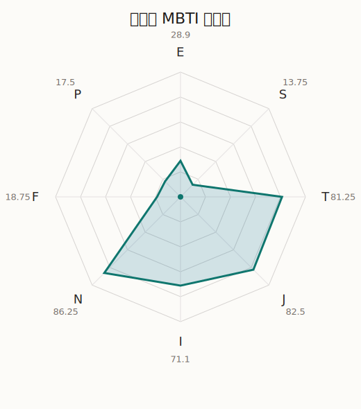

# 友希那 MBTI 类型解释

- 角色名：凑友希那
- 最终类型：INTJ
- 备选类型：ENTJ
- 原始聚合类型：INTJ
- 采样轮次：10
- 主类型稳定度：10/10（100.0%）
- 原始聚合稳定度：10/10（100.0%）
- 置信度：高（60.55）
- 置信度方差：23.6638
- 题库：Open Jungian Type Scales (OJTS v2.1)（48 题）

## 类型概述

INTJ 的整体倾向是：更偏内在规划、抽象结构、逻辑判断和长期控制。

## 人物核心

从外部设定与已整理剧情综合来看，友希那的角色框架可以先理解为：外部资料里的友希那始终是 Roselia 最鲜明的旗帜型人物，冷静、强硬、以高标准要求自己和身边人。她对音乐的认真不是单纯好胜，而是一种近乎信仰式的纯度，因此会自然把周围人也拉进更严苛的世界。

## PDB 校核

- 已应用 PDB 主参考：来源 `personality-database.com`。
- 权重分配：PDB 50% / 人设概要 25% / 卡牌剧情 15% / 剧情切片 10%。
- PDB 类型排序：`INTJ`
- 最终类型先按 PDB 最高票定锚：`INTJ`
- 指定锁定类型：`INTJ`
## 为什么是这个类型

- `I > E`（71.10 : 28.90，平均轴差 52.77，方差 332.3798）：更常先在内部消化，再选择性地向外表达立场。
- `N > S`（86.25 : 13.75，平均轴差 69.08，方差 65.4300）：更常从意义、可能性、方向感和隐含主题去理解问题。
- `T > F`（81.25 : 18.75，平均轴差 61.34，方差 197.9843）：更常把逻辑、结构、效率和标准一致性放在判断前列。
- `J > P`（82.50 : 17.50，平均轴差 73.35，方差 34.2286）：更常用计划、收束、安排和责任结构去降低混乱。

## 为什么不是备选类型

最接近的备选类型是 `ENTJ`。它与主类型 `INTJ` 的差别主要落在 `EI` 这一轴上。
最终仍保留 `I`，因为该轴平均优势还有 `42.20`，虽然会波动，但整体没有被 `E` 反超。虽然也会参与群体互动，但资料里更常表现为先内化、后表达的节奏。

## 四维结果

- `EI`：E 28.90 / I 71.10，轴差方差 332.3798
- `SN`：S 13.75 / N 86.25，轴差方差 65.4300
- `FT`：F 18.75 / T 81.25，轴差方差 197.9843
- `JP`：J 82.50 / P 17.50，轴差方差 34.2286

## 八维数据

- `E`：均值 28.90，方差 83.0949
- `S`：均值 13.75，方差 16.3575
- `T`：均值 81.25，方差 49.4961
- `J`：均值 82.50，方差 8.5571
- `I`：均值 71.10，方差 83.0949
- `N`：均值 86.25，方差 16.3575
- `F`：均值 18.75，方差 49.4961
- `P`：均值 17.50，方差 8.5571

## 类型稳定性

- `INTJ`：10 次（100.0%）

## 图表

## 证据依据

- 人物概述：从外部设定与已整理剧情综合来看，友希那的角色框架可以先理解为：外部资料里的友希那始终是 Roselia 最鲜明的旗帜型人物，冷静、强硬、以高标准要求自己和身边人。她对音乐的认真不是单纯好胜，而是一种近乎信仰式的纯度，因此会自然把周围人也拉进更严苛的世界。
- 卡牌剧情：在 103 条卡牌剧情里，友希那 的个人篇章补完相对丰富；这部分更适合用来观察角色的私下状态、非主线场合下的关系重心，以及主线之外的稳定人格表现。
- 剧情切片：在已整理的 569 条主线/乐团剧情切片里，友希那同时覆盖主线推进（89）和乐队内部关系（480）两条线。这说明这个角色在本地语料中的位置，不应该只从单句台词去读，而要放回到持续出现的关系链和章节位置里看。

## 模拟作答概览

| 题号 | 题目/两端描述 | 平均作答 | 作答方差 | 平均倾向值 | 倾向方差 |
| --- | --- | --- | --- | --- | --- |
| 1 | I don&lsquo;t like to draw attention to myself. | 4.00 | 0.0000 | 41.06 | 103.1986 |
| 2 | I hate situations where people expect me to be funny. | 3.10 | 0.0900 | 4.82 | 221.8169 |
| 3 | I hold back my opinions. | 3.00 | 0.0000 | 6.14 | 63.9619 |
| 4 | I want a huge social circle. | 1.40 | 0.2400 | -66.45 | 244.4278 |
| 5 | I am the life of the party. | 1.20 | 0.1600 | -65.04 | 43.4882 |
| 6 | I make lots of noise. | 1.30 | 0.2100 | -68.83 | 107.7910 |
| 7 | I avoid philosophical discussions. | 1.00 | 0.0000 | -85.73 | 56.3486 |
| 8 | I don&apos;t like to analyze literature. | 1.00 | 0.0000 | -86.24 | 72.3143 |
| 9 | I am attached to conventional ways. | 1.00 | 0.0000 | -87.53 | 77.9727 |
| 10 | I love to read challenging material. | 3.60 | 0.2400 | 21.04 | 206.1054 |
| 11 | I look for hidden meanings in things. | 3.70 | 0.2100 | 27.63 | 198.1702 |
| 12 | I am curious about everything. | 3.60 | 0.2400 | 20.71 | 338.1887 |
| 13 | I want to experience passion and romance. | 1.10 | 0.0900 | -73.26 | 51.5306 |
| 14 | I am deeply moved by others&lsquo; misfortunes. | 1.20 | 0.1600 | -72.91 | 145.5144 |
| 15 | I listen to my feelings when making important decisions. | 1.10 | 0.0900 | -73.39 | 105.2229 |
| 16 | I prize logic above all else. | 3.40 | 0.2400 | 17.08 | 262.9912 |
| 17 | I don&lsquo;t understand people who get emotional. | 3.20 | 0.1600 | 12.13 | 216.8159 |
| 18 | I&apos;d rather be feared than loved. | 3.30 | 0.2100 | 15.92 | 247.0660 |
| 19 | I like order. | 3.30 | 0.2100 | 21.90 | 220.1562 |
| 20 | I do things according to a plan. | 3.70 | 0.2100 | 23.27 | 151.3714 |
| 21 | I am always prepared. | 3.50 | 0.2500 | 17.79 | 184.8270 |
| 22 | I often make last-minute plans. | 1.00 | 0.0000 | -83.76 | 56.7477 |
| 23 | I do things for no apparent reason. | 1.00 | 0.0000 | -80.22 | 32.5211 |
| 24 | It takes me days to do things that should take hours because I keep getting distracted. | 1.00 | 0.0000 | -82.82 | 91.2533 |
| 25 | I work on improving myself. | 3.30 | 0.2100 | 14.24 | 175.9578 |
| 26 | I always feel like I need to be doing something important. | 3.40 | 0.2400 | 15.88 | 170.7356 |
| 27 | I have unusual beliefs about the world. | 2.20 | 0.1600 | -29.31 | 127.0294 |
| 28 | I dislike routine. | 2.10 | 0.0900 | -27.39 | 84.3553 |
| 29 | I try my best to follow the rules. | 2.30 | 0.2100 | -27.61 | 112.1889 |
| 30 | I respect authority. | 2.20 | 0.1600 | -31.43 | 94.9114 |
| 31 | I like to take it easy. | 1.00 | 0.0000 | -80.89 | 47.6638 |
| 32 | I choose the easy way. | 1.00 | 0.0000 | -85.01 | 26.8810 |
| 33 | I tell other people my secrets. | 1.10 | 0.0900 | -66.80 | 26.9973 |
| 34 | I make big gestures of friendship to people. | 1.10 | 0.0900 | -69.87 | 108.2977 |
| 35 | I enjoy challenges and competition. | 3.30 | 0.2100 | 8.80 | 376.3800 |
| 36 | I have very high self-esteem. | 2.50 | 0.2500 | -27.74 | 353.4444 |
| 37 | I get embarrassed easily. | 2.20 | 0.3600 | -40.15 | 312.7212 |
| 38 | I become overwhelmed by events. | 2.00 | 0.2000 | -39.84 | 148.4134 |
| 39 | I have difficulty expressing my feelings. | 3.10 | 0.0900 | 8.94 | 157.5295 |
| 40 | I don&apos;t trust others easily. | 3.30 | 0.2100 | 12.15 | 240.3450 |
| 41 | skeptical <-> wants to believe | 2.00 | 0.2000 | -41.35 | 235.9733 |
| 42 | chaotic <-> organized | 5.00 | 0.0000 | 86.28 | 90.3523 |
| 43 | wants the big picture <-> wants the details | 1.00 | 0.0000 | -82.84 | 84.4777 |
| 44 | energetic <-> mellow | 4.70 | 0.2100 | 68.11 | 257.6343 |
| 45 | follows the heart <-> follows the head | 3.80 | 0.1600 | 39.38 | 124.5242 |
| 46 | prepares <-> improvises | 2.00 | 0.2000 | -44.36 | 137.9247 |
| 47 | focused on the present <-> focused on the future | 3.60 | 0.2400 | 20.61 | 182.5060 |
| 48 | works best alone <-> works best in groups | 2.20 | 0.1600 | -32.81 | 186.5789 |

## 题库来源

- [OJTS 官方题目页](https://openpsychometrics.org/tests/OJTS/)
- 许可证：CC BY-NC-SA 4.0
- [本地题库文件](../ojts_question_bank_v2_1.json)
